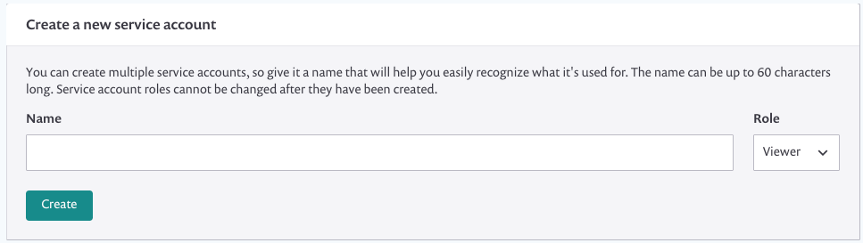
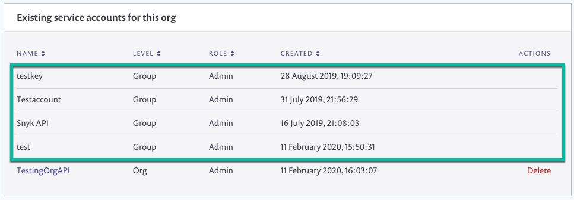
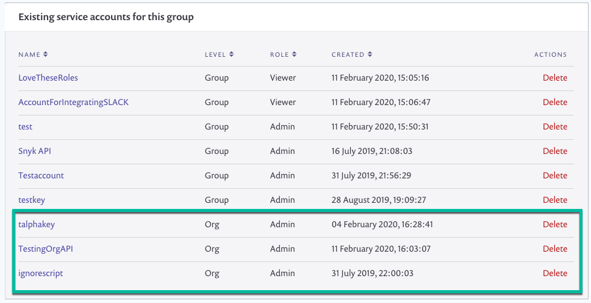
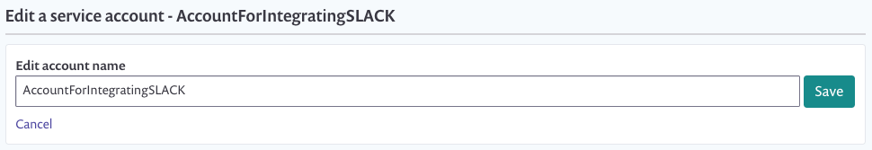
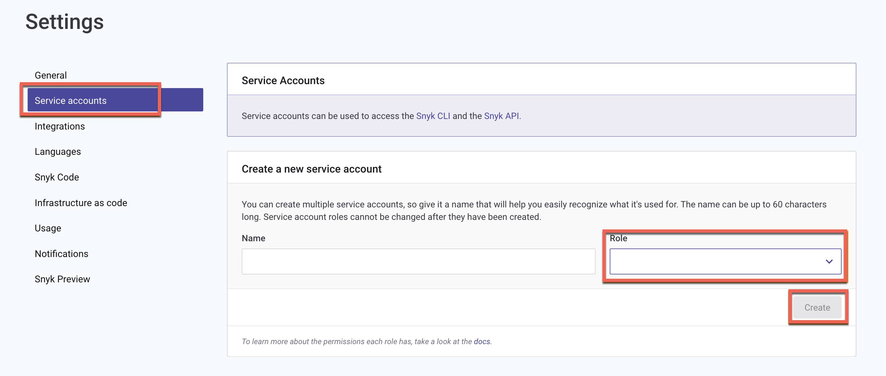

# 서비스 계정


**기능 가용성**\
서비스 계정은 엔터프라이즈 요금제에만 제공됩니다. 자세한 정보는 [요금제 및 가격 측정](https://snyk.io/plans/)을 참조하세요.

무료 및 팀 요금제 사용자 및 체험 사용자는 자신의 프로필 하위에 Snyk 사용자 토큰에 액세스할 수 있으며, 이 토큰을 사용하여 CI/CD에서 인증하고 CLI를 로컬 또는 빌드 기계에서 실행하고 IDE와 수동으로 인증하는 데 사용할 수 있습니다.


서비스 계정은 특수한 유형의 시스템 사용자입니다. 서비스 계정을 생성하면 해당 서비스 계정과 연결된 유일한 API 토큰이 생성되며 이는 일반 사용자 자격 증명을 대체합니다. Snyk는 Snyk 프로세스를 시작하기 위해 인증이 필요합니다.

**자동화에 사용되는 서비스 계정**을 설정하여 Snyk 사용자의 토큰을 사용하는 대신 통합을 관리하는 데 도움을 줄 수 있습니다.

조직 또는 그룹 수준에서 단일 또는 여러 토큰을 생성하여 통합을 관리할 수 있습니다. 각 서비스 계정에는 쉽게 인식하기 위해 고유한 이름이 지정되어 있습니다. 이 이름은 재사용할 수 없습니다.

## 서비스 계정 사용 시기

엔터프라이즈 사용자인 경우 자신의 프로필에 Snyk 사용자 토큰이 있습니다. 또한 서비스 계정 토큰에 액세스할 수 있습니다.

### 서비스 계정을 사용하여 모든 종류의 자동화 생성

이에는, CI/CD나 빌드 시스템 플러그인을 사용하여 스캔하는 것, 그리고 [Snyk API](manage-service-accounts-using-the-snyk-api.md)를 사용하여 자동화하는 것 등이 포함됩니다.

### GitHub Enterprise 통합에 서비스 계정 사용

팀에서 GitHub에 서비스 계정을 설정해야 하는 경우, 반드시 [GitHub Enterprise](../../scm-ide-and-ci-cd-integrations/snyk-scm-integrations/github-enterprise.md)를 사용해야 합니다. 이는 Snyk 엔터프라이즈 계정에서만 사용할 수 있습니다.

Snyk 사용자의 토큰보다 통합과 인증을 위해 서비스 계정을 사용하면 사용자가 역할을 변경하거나 개인 Snyk 계정을 닫을 때 연속성이 유지됩니다.

### 그룹 수준 토큰을 사용하여 통합 관리

그룹 수준 토큰을 사용하여 그룹 API 엔드포인트 및 조직 API 엔드포인트를 호출하고 그룹 내 모든 조직에 대해 CLI를 실행할 수 있습니다.

그룹 역할은 그룹 수준의 서비스 계정에만 적용되며 엔터프라이즈 계정에서만 사용할 수 있습니다.

### 로컬 스캔 및 API 호출 테스트를 위해 Snyk 사용자의 토큰 사용

엔터프라이즈 사용자인 경우 로컬 머신에서 CLI를 실행하거나 수동으로 IDE에 인증하고 엔드포인트 사용을 테스트하는 경우 Snyk 사용자의 토큰을 사용하세요.


Snyk는 IDE와 인증하는 데 서비스 계정 토큰을 사용하는 것을 권장하지 않습니다.


## 그룹 또는 조직 수준의 서비스 계정 설정

통합을 관리하기 위해 그룹 또는 조직 수준에서 단일 또는 여러 토큰을 생성할 수 있습니다.

### 서비스 계정을 설정하기 위한 전제 조건


조회 권한을 갖는 그룹 구성원은 서비스 계정을 생성할 수 없습니다. 이는 해당 조직 역할과는 상관없이 동일합니다.


**그룹 서비스 계정**을 생성하려면 그룹 관리자여야 합니다. **조직 서비스 계정**을 생성하려면 그룹 구성원 및 조직 관리자이거나 그룹 관리자여야 합니다.

이 프로세스는 모든 옵션을 설명합니다. 동일한 그룹 또는 다른 그룹 또는 조직을 위해 여러 토큰을 생성하려면 단계를 반복하세요.

### 그룹 또는 조직 서비스 계정 설정 방법

* 계정에 로그인하고 관리하려는 관련 그룹 및 조직으로 이동합니다.
* **설정** > **서비스 계정**을 클릭하여 기존 서비스 계정과 해당 세부정보를 확인하세요.
* 새로운 서비스 계정을 만들려면 **서비스 계정 생성**을 클릭하세요.\
  로드되는 화면은 **그룹** 또는 **조직**을 선택한 옵션에 따라 다를 수 있습니다.

**그룹 서비스 계정**을 생성하는 동안 **그룹 수준 역할**을 선택할 수 있습니다.

<figure><figcaption>
그룹 설정
</figcaption></figure>

**조직 서비스 계정**을 생성하는 동안, 조직에서 설정한 [사용자 정의 역할](../../snyk-admin/user-roles/user-role-management.md#create-a-custom-role)을 포함하여 조직 수준 역할을 선택할 수 있습니다.

<figure><figcaption>
조직 설정
</figcaption></figure>

#### 서비스 계정 이름 입력

**서비스 계정** 이름 필드에 이 토큰을 위한 고유한 이름을 입력하세요. 이 이름은 동일한 **조직** 또는 **그룹**의 토큰에 대해 한 번만 사용할 수 있습니다.

<figure><figcaption>
서비스 계정 이름 및 역할
</figcaption></figure>

#### 역할 선택

**역할** 드롭다운 목록에서 적절한 역할을 선택하세요.

<figure><figcaption>
역할
</figcaption></figure>

**그룹 서비스 계정**의 경우, 토큰의 범위를 구성하기 위해 다음 역할 목록 중에서 선택하십시오: Viewer 또는 Admin 선택을 권장합니다.

* **그룹 Viewer**는 읽기 전용 액세스를 허용합니다. 사용자가 플랫폼에 쓸 수 없게 API 토큰을 읽기 전용으로 설정하려면 서비스 계정을 사용하고 그룹 Viewer로 설정해야 합니다. [Snyk 사용자가 제어할 수 있는 API 토큰 권한 사용](../../snyk-api/rest-api/authentication-for-api/snyk-api-token-permissions-users-can-control.md)을 참조하세요.
* **그룹 Admin**은 완전한 관리자 액세스를 허용합니다.
* **그룹 Member**는 그룹과 서비스 계정을 연결하지만 특정 액세스를 부여하지 않습니다.

**조직 서비스 계정**의 경우, 표준 역할인 **Org Admin** 또는 **Org Collaborator** 또는 사용자 정의 역할을 선택하세요. 사용자 정의 역할을 설정했다면 [사전 정의된](../../snyk-admin/user-roles/pre-defined-roles.md) 역할에서 Org Admin 및 Org Collaborator 역할의 범위를 확인하세요.

### 서비스 계정 생성

**생성**을 클릭합니다.

토큰이 생성되고 표시됩니다.

이 토큰을 반드시 복사하여 보관하십시오. 토큰을 복사했으면 **닫기 및 숨기기**를 클릭할 수 있습니다. 페이지를 떠날 때 토큰은 더 이상 표시되지 않을 것입니다. 이것은 토큰을 안전하게 유지하기 위한 표준 보안 관행입니다.

#### 토큰이 그룹 및 조직과 연결되는 방법

새 토큰은 다음과 같이 **기존 서비스 계정** 목록에 추가되며, 이 예시에서와 같은 목록에 표시됩니다:

<figure><figcaption>
그룹의 기존 서비스 계정
</figcaption></figure>

또한, **그룹 관리자**가 전체 그룹에 대해 토큰을 생성한 경우, 토큰은 각 조직의 **기존 서비스 계정** 목록에 나타납니다. 그러나 토큰은 **그룹** 수준에서만 편집할 수 있습니다.

<figure><figcaption>
조직의 기존 계정
</figcaption></figure>

조직 중 하나에서 토큰을 생성한 경우, 해당 토큰은 이제 **기존 서비스 계정** 목록에서 **그룹** 수준에도 표시됩니다. 이 목록에서 그룹 관리자는 토큰 이름을 수정하거나 삭제할 수도 있습니다.

<figure><figcaption>
그룹 서비스 계정에 목록된 조직 계정
</figcaption></figure>

## 서비스 계정 토큰의 이름 업데이트

서비스 계정 토큰의 이름을 업데이트하려면 다음 링크 중 하나를 클릭합니다:

* **그룹 수준 토큰**의 경우, **그룹** 수준에서만
* **조직 수준 토큰**의 경우, 관련 **조직** 및 **그룹** 수준 모두에서:

<figure><figcaption>
서비스 계정 이름 업데이트
</figcaption></figure>

## 서비스 계정 편집 및 삭제

관리자는 토큰 이름을 변경하거나 토큰을 삭제할 수 있습니다.

### 삭제된 계정의 서비스 계정 토큰은 어떻게 처리되나요?

서비스 계정을 삭제하면 연결된 API 토큰이 즉시 무효화됩니다.

계정이 그룹으로 관리되는 경우 조직 및 그룹 관리자는 조직에 대한 토큰을 삭제할 수 있습니다. 또한 그룹 관리자는 그룹 수준에서 토큰을 볼 수 있고 관리할 수 있습니다.

서비스 계정 삭제는 API 토큰을 취소하는 것과 같습니다.

### 서비스 계정을 편집하거나 삭제하는 방법

*   계정에 로그인하고 관리하려는 그룹 및 조직으로 이동하세요.

    **그룹 토큰**의 경우, **그룹** 수준으로 이동합니다.\
    **조직 토큰**의 경우, 그룹 관리자는 그룹 또는 관련 조직에서 삭제할 수 있으며, 조직 관리자는 해당 조직으로 이동합니다.
* **설정** > **서비스 계정**을 클릭합니다.
* 기존 서비스 계정 목록을 찾아 스크롤하세요:

<figure><figcaption>
그룹의 기존 서비스 계정
</figcaption></figure>

* 기존 토큰 목록에서:
  * **토큰 이름**을 클릭하여 **토큰 이름을 변경**하고 **저장**을 클릭합니다.
  * **삭제**를 클릭하여 **토큰을 삭제하고 즉시 무효화**합니다. 프롬프트가 표시되면 **확인**을 클릭하세요. 같은 토큰은 다시 생성할 수 없음을 기억하세요.

## 서비스 계정에 역할과 권한 할당하기

**그룹 수준**에서 보기(View), 생성(Create), 편집(Edit) 서비스 계정 권한을 가진 사용자는 조직 내 새로운 서비스 계정을 설정하고 역할(Role)을 할당할 수 있습니다.

조직을 선택하고 **Settings(설정)** > \*\*Service Accounts(서비스 계정)\*\*으로 이동합니다. 계정 이름을 입력하고 드롭다운에서 역할을 선택한 후 **Create(생성)** 버튼을 클릭합니다.

<figure><figcaption>
조직 서비스 계정 생성 시 역할 선택
</figcaption></figure>

서비스 계정에 할당된 역할을 열면 시스템에서 경고 메시지가 표시됩니다. 역할에 연결된 권한을 업데이트하거나 삭제하여 서비스 계정과 사용자를 새 역할로 재할당해야 하는 상황이 발생할 수 있으므로, 이러한 변경의 영향을 신중히 고려해야 합니다.

<figure><figcaption>
서비스 계정에 할당된 역할 변경에 대한 경고
</figcaption></figure>


Sny은 사용자가 본인의 권한보다 높은 권한을 가진 역할로 조직 서비스 계정을 생성하지 못하도록 방지합니다. 만약 본인의 권한보다 높은 권한을 가진 역할로 서비스 계정을 생성하려고 하면, **Cannot create a service account with a higher privilege role than yours(본인의 권한보다 높은 권한 역할로 서비스 계정을 생성할 수 없습니다)** 오류가 표시됩니다.


<figure><figcaption>
사용자가 더 높은 권한 역할을 서비스 계정에 할당할 수 없음
</figcaption></figure>
