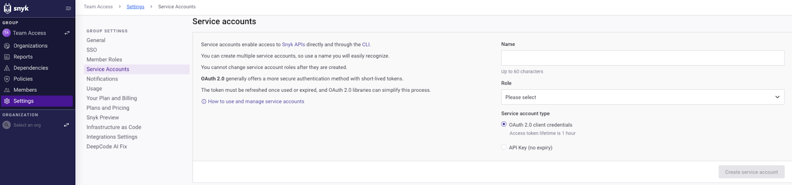
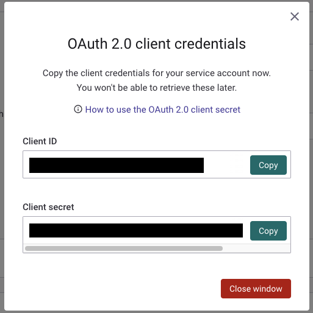
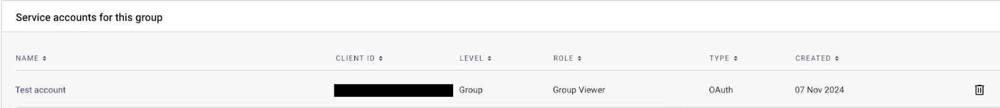
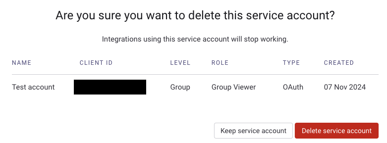

# OAuth 2.0을 사용하는 서비스 계정


**기능 가용성**\
OAuth 2.0을 사용한 서비스 계정은 엔터프라이즈 플랜을 통해서만 Snyk API를 통해 이용할 수 있습니다. 자세한 정보는 [Manage service accounts using the Snyk API](manage-service-accounts-using-the-snyk-api.md)를 참조하십시오.


Snyk API 키 대신 [Auth 2.0 `client_credentials` 그랜트 플로](https://datatracker.ietf.org/doc/html/rfc6749#section-4.4)로 인증하는 서비스 계정을 생성할 수 있습니다. OAuth 2.0 액세스 토큰은 Snyk API 키와 동일한 방식으로 사용할 수 있지만, 수명이 짧은 보안이 강화된 특성이 있으며 자동으로 새로 고칠 수 있습니다.

## 클라이언트 비밀번호를 사용한 OAuth 2.0

그룹 또는 조직 수준에서 [조직을 위한 서비스 계정 생성](../../snyk-api/reference/serviceaccounts.md#orgs-org_id-service_accounts) 또는 [그룹을 위한 서비스 계정 생성](../../snyk-api/reference/serviceaccounts.md#groups-group_id-service_accounts) API 엔드포인트를 호출하거나, Snyk 웹 UI를 통해 `oauth_client_secret` 서비스 계정을 생성할 수 있습니다. 응답은 `client_secret` 및 `client_id`를 반환합니다. 서비스 계정을 만든 후에는 `client_secret`을 다시 볼 수 없습니다. 분실한 경우 [클라이언트 비밀번호를 교체](manage-service-accounts-using-the-snyk-api.md#manage-a-service-account-client-secret-for-your-group)하여 새로운 비밀번호를 받을 수 있습니다.


`client_secret`을 공개적으로 공유하지 마십시오. 이것은 서비스 계정을 인증하는 데 사용됩니다. 안전하고 개인적으로 보관하십시오.


### OAuth 2.0 액세스 토큰 검색

서비스 계정을 생성한 후, `client_secret`을 사용하여 OAuth 2.0 엔드포인트 [액세스 토큰 요청](../../snyk-api/oauth2-api.md#token)을 통해 `access_token`을 검색할 수 있습니다. 본문 형식과 `Content-Type` 헤더는 form-urlencoded이어야 합니다.

`access_token`을 사용할 때는 `Authorization: bearer $access_token` 헤더 또는 Snyk CLI에서 `SNYK_OAUTH_TOKEN` 환경 변수와 함께 사용할 수 있습니다.

`access_token`은 수명이 짧으며 만료되면 새로 고쳐져야 합니다. 이 과정을 상당히 간소화하는 많은 OAuth 2.0 라이브러리가 있습니다.

### Snyk CLI로 인증

Snyk CLI를 사용하여 `client_secret` 및 `client_id`로도 인증할 수 있습니다. 자세한 내용은 [`snyk auth`](../../snyk-cli/commands/auth.md) 명령어 도움말을 참조하십시오.

## UI를 통한 OAuth 서비스 계정 생성

API를 통해 OAuth 서비스 계정을 만들고 관리하는 것 외에도 웹 UI를 통해 OAuth 기반 서비스 계정을 생성할 수 있습니다. 아래 단계를 따르세요.


참고: UI를 통해 OAuth 서비스 계정의 수명을 수정할 수는 없지만, API를 통해 이 작업을 수행할 수 있습니다.


1. 그룹 설정 섹션에서 **서비스 계정**을 선택합니다.

<figure><figcaption>
서비스 계정 설정
</figcaption></figure>

2. **서비스 계정** 설정에서 **이름** 필드에 서비스 계정의 이름을 입력하고, **Role** 드롭다운에서 서비스 계정에 할당할 **Role**을 선택합니다.
3.  **OAuth 2.0 클라이언트 자격 증명** 라디오 버튼을 선택하고 **서비스 계정 생성** 버튼을 클릭합니다.

    <figure><figcaption>
OAuth 2.0 클라이언트 자격 증명
</figcaption></figure>
4. **Client ID**와 **Client Secret**이 표시되는 창이 열립니다. 이 자격 증명을 기록하고, 나중에 검색할 수 없으므로 안전한 위치에 복사한 후 **창 닫기**를 클릭합니다.
5.  서비스 계정이 그룹의 서비스 계정 목록에 표시됩니다.

    <figure><figcaption>
그룹의 서비스 계정이 나열됨
</figcaption></figure>

## UI를 통한 OAuth 기반 서비스 계정 삭제

1. 그룹에서 활성화된 서비스 계정 목록에서 삭제하려는 서비스 계정을 식별합니다.
2. 서비스 계정 옆에 있는 **Delete** 버튼을 클릭합니다.

<figure><figcaption>
서비스 계정 삭제 버튼
</figcaption></figure>

3.  **이 서비스 계정을 삭제하시겠습니까?** 를 나타내는 창이 열립니다. 서비스 계정을 삭제하려면 **서비스 계정 삭제** 버튼을 클릭합니다.

    <figure><figcaption>
서비스 계정 유지 또는 삭제를 위한 확인 화면
</figcaption></figure>

서비스 계정이 삭제되었습니다.

## Private Key JWT를 사용한 OAuth 2.0

서비스 계정은 보다 전통적인 `client_secret` 대신 [OIDC Core 1.0 스펙](https://openid.net/specs/openid-connect-core-1_0.html#ClientAuthentication)에 정의된 `client_assertion`의 `private_key_jwt` 형식을 사용하여 인증할 수 있습니다.

이것은 고객이 공개적으로 액세스 가능한 [JWKS](https://datatracker.ietf.org/doc/html/rfc7517) 엔드포인트를 호스팅하고 공개 및 개인 서명 키를 관리할 인프라를 갖춘 고급 기능입니다. 요청 본문에서 단순한 `client_id` 및 `client_secret` 쌍 대신 서명된 JWT 형태로 액세스 토큰 요청을 보내야 하므로 OAuth 서비스 계정에 추가적인 보안 층이 생성됩니다.

### Private Key JWT 서비스 계정 설정 전 요구 사항

서비스 계정을 만들기 전에 다음을 수행해야 합니다:

* 공개 및 개인 서명 키 생성
* 공개 키에 액세스하기 위해 공개적으로 액세스 가능한 JWKS 엔드포인트 호스팅; 이는 `https`여야 함

고객이 관리하는 서명 키는 필요할 때마다 교체할 수 있습니다.

### Private Key JWT 서비스 계정 작성

Snyk API를 사용하여 그룹 또는 조직 수준에서 `oauth_private_key_jwt` 서비스 계정을 만들 수 있습니다. 서비스 계정을 생성하려면 공개적으로 액세스 가능한 JWKS 엔드포인트 URL 및 서비스 계정에 할당할 역할을 제공해야 합니다. 자세한 내용은 [Snyk API를 사용하여 서비스 계정 관리하기](manage-service-accounts-using-the-snyk-api.md)를 참조하십시오.

응답에는 다음 단계에서 필요한 `client_id`가 포함됩니다.

### 개인 키로 서명된 JWT 준비

Snyk는 적절한 클레임으로 `private_key_jwt`를 작성하고 생성한 개인 서명 키로 서명하는 도구나 스크립트를 준비하라고 권장합니다.

JWT는 `client_assertion` 속성을 위해 [클레임](https://datatracker.ietf.org/doc/html/rfc7519#section-4)이 포함되어 있어야 합니다. `aud` 클레임은 Snyk 인스턴스에 따라 다를 수 있으며, 예를 들어 `api.snyk.io` 또는 `api.eu.snyk.io` 등이 있습니다. 자세한 정보는 [지역 호스팅 및 데이터 보관](../../working-with-snyk/regional-hosting-and-data-residency.md) 을참조하십시오.

### Private Key JWT 액세스 토큰 검색

서비스 계정이 작성되고 서명된 JWT가 준비되면 [Snyk OAuth 2.0 액세스 토큰 엔드포인트](../../snyk-api/oauth2-api.md#token)을 사용하여 `access_token`을 검색할 수 있습니다. 이 액세스 토큰은 Snyk API 키와 동일한 방식으로 사용할 수 있습니다. 요청 본문에는 다음과 같은 항목이 포함되어야 합니다:

* `grant_type: client_credentials`
* `client_assertion_type: private_key_jwt`
* `client_assertion:` `<서명된 JWT>`

`access_token`은 일정 기간 동안 유효하며 만료되면 새로 고쳐져야 합니다. 많은 OAuth 2.0 라이브러리가 이 프로세스를 상당히 간소화하는 데 사용될 수 있습니다.
