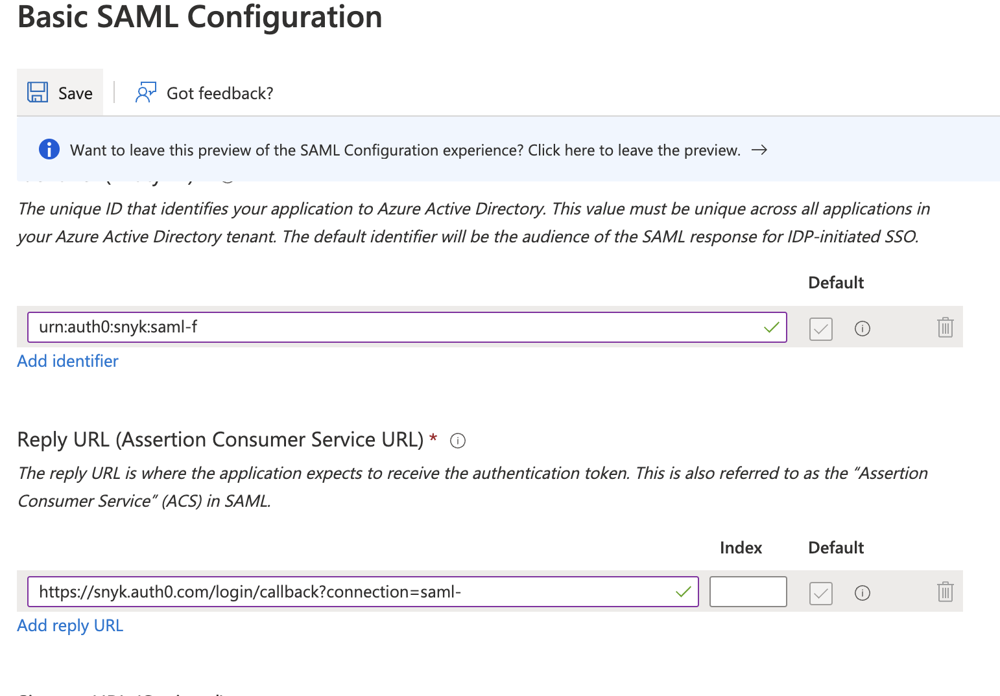
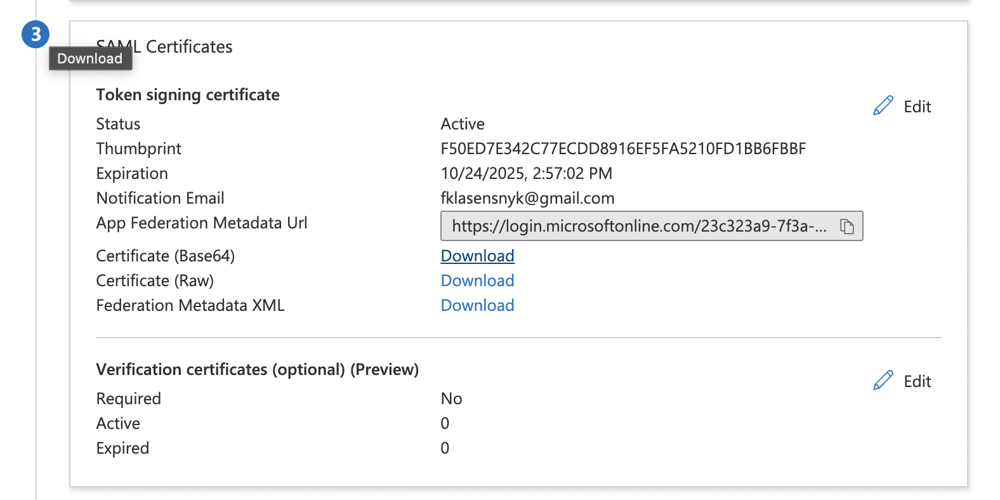
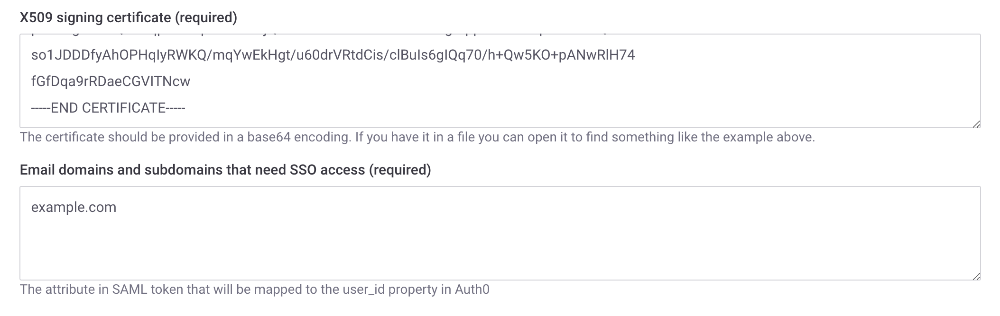
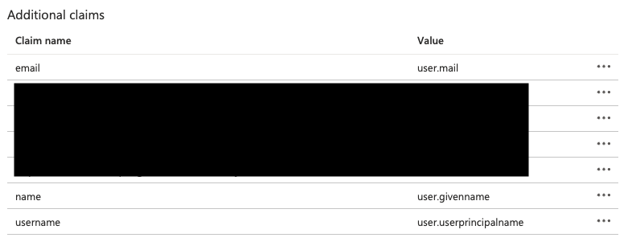

# Entra ID Enterprise Application setup

이 예제에서는 Entra ID (이전 Azure AD) Enterprise Application을 설정하고 이를 SSO를 용이하게 하기 위해 Snyk와 연결하는 방법을 보여줍니다. Azure Enterprise Application을 SSO로 구성하려면 먼저 Snyk로부터 Entity ID 및 응답 URL (Assertion Consumer Service URL)을 얻어야 합니다.

1.  왼쪽 상단의 드롭다운에서 **GROUP OVERVIEW**를 선택한 다음 그룹 설정에 들어가려면 **cog** 아이콘(오른쪽 상단)을 클릭하세요.

    <figure><figcaption>
그룹 개요 선택
</figcaption></figure>
2.  **SSO**를 클릭하고 **Entity ID** 및 **ACS URL** 아래의 값을 복사하거나 브라우저 탭을 열어둡니다.

    <figure><figcaption>
그룹 설정: SSO
</figcaption></figure>
3.  Azure로 이동하여 Entra ID를 열어주세요.

    <figure><figcaption>
Entra ID 기본 디렉터리
</figcaption></figure>
4.  **추가**를 클릭한 다음 **Enterprise application**을 선택하세요.

    <figure><figcaption>
Enterprise application 추가
</figcaption></figure>
5.  **만들기**를 선택하세요.

    <figure><figcaption>
자신의 어플리케이션 만들기
</figcaption></figure>
6.  응용프로그램의 이름을 적절히 지어주십시오. 예를 들어, **Snyk-SSO**와 같이 이름을 지어주고 \*\*갤러리에서 찾지 못한 다른 어플리케이션 통합 (비-갤러리)\*\*이 선택되어 있는지 확인한 후 **만들기**를 클릭합니다.

    <figure><figcaption>
어플리케이션 이름 및 통합
</figcaption></figure>
7.  새 응용프로그램에서 **단일 로그인 설정**을 선택하고 **시작**을 클릭합니다.

    <figure><figcaption>
단일 로그인 설정, 시작
</figcaption></figure>
8.  SSO 방법으로 **SAML**을 선택하세요.

    <figure><figcaption>
SAML 선택
</figcaption></figure>
9.  **기본 SAML 구성** 아래의 **편집**을 클릭하세요.

    <figure><figcaption>
기본 SAML 구성 편집
</figcaption></figure>
10. Snyk로부터 얻은 Identity (Entity ID) 및 응답 URL (Assertion Consumer Service URL)을 추가하고 **저장**을 클릭한 후 편집 창을 닫습니다.

    <figure><figcaption>
Entity ID 및 Assertion Consumer Service URL
</figcaption></figure>
11. Snyk에서 구성을 완료하기 위해 필요한 로그인 URL을 찾아내어 복사하고 Snyk 포털의 SSO 설정에 붙여넣으세요.

    <figure><figcaption>
로그인 URL
</figcaption></figure>

    <figure><figcaption>
Snyk 포털의 로그인 URL
</figcaption></figure>
12. Entra ID로 돌아가서 **Certificate (Base64)** 옆의 **다운로드**를 클릭하세요.

    <figure><figcaption>
SAML 인증서 다운로드 (Base 64)
</figcaption></figure>
13. 선호하는 텍스트 편집기에서 다운로드한 인증서를 열고 해당 텍스트를 복사하여 Snyk의 **X509 서명 인증서** 필드에 붙여넣고 이 SSO 연결에서 지원하는 관련 도메인을 추가하십시오. 네가 "IdP-initiated workflow"를 활성화해야하는지 확인하고, 새로운 연결을 생성하면 **Create Auth0 connection**을 클릭하거나 기존 연결을 편집하면 **Save changes**를 클릭하세요.

    <figure><figcaption>
인증서 및 지원되는 도메인 입력, 연결 설정
</figcaption></figure>
14. 새로운 사용자가 로그인할 때 어떻게 처리해야 할지 결정하고 사용하려는 옵션을 선택하세요: **그룹 구성원**, **조직 협력자** 또는 **조직 관리자**. 최종적으로 **프로필 속성**을 수정하십시오. 설정이 기본값과 다른 경우를 위해 Azure에서 **추가 클레임**으로 이메일, 이름 및 사용자 이름을 추가해야 할 수 있으며, 이를 Snyk SSO **프로필 속성** 섹션에서 해당되게 매핑해야합니다. 마지막으로 **Save changes**를 클릭하여 로그인 할 수 있는지 확인하고, 단계 3의 상단에 있는 직접 URL로 이동하거나 [일반 SSO 로그인](https://app.snyk.io/login/sso)으로 이동하세요.\
    \
    예상대로 프로필 값이 수신되지 않는다면, **Azure SSO 설정**에서 이메일, 이름 및 사용자 이름을 **추가 클레임**으로 추가하고, 이를 Snyk SSO **프로필 속성** 섹션에서 해당되게 매핑해야합니다.

    <figure><figcaption>
Azure 클레임 설정
</figcaption></figure>

    <figure><figcaption>
프로필 속성 섹션
</figcaption></figure>

만약 Snyk 요청의 서명 확인을 추가하고 싶다면:

1. Snyk SSO 설정의 1단계에서 **서명 인증서**를 다운로드하세요.
2. 다음 openssl 명령을 사용하여 이를 .cer 형식으로 변환하십시오. `openssl x509 -outform DER -in snyk.pem -out snyk.cer`
3. Active Directory의 SSO 앱의 **SAML 인증서** 설정 하단에서 \*\*검증 인증서 옆의 **편집**을 클릭하세요.
4. **검증 인증서 필요**를 선택하고 위 openssl 명령의 출력에서 인증서를 업로드하고 **저장**을 클릭하세요.
