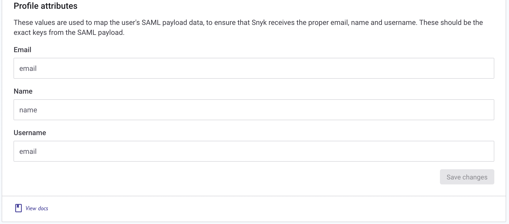

# Google Workspace 설정

이 예시는 Google Workspace SAML 애플리케이션을 설정하고 Snyk에 연결하여 SSO를 용이하게 하는 방법을 보여줍니다.

이 페이지에서 제공된 정보 외에도 자세한 내용은 [자체 사용자 정의 SAML 앱 설정](https://support.google.com/a/answer/6087519)을 참조하십시오.

먼저 Google Workspace [관리자 영역](https://admin.google.com)에 로그인합니다.

1. **앱**으로 이동한 다음 **웹 및 모바일 앱**을 클릭합니다.

    <figure><figcaption>
웹 및 모바일 앱 열기
</figcaption></figure>
2. **앱 추가**를 클릭하고 **사용자 지정 SAML 앱 추가**를 선택합니다.

    <figure><figcaption>
새로운 사용자 정의 SAML 앱 추가
</figcaption></figure>
3. 애플리케이션의 이름을 적절히 설정하고 **계속**을 클릭합니다.

    <figure><figcaption>
SAML 앱 이름
</figcaption></figure>
4. 인증서를 다운로드하여 선호하는 텍스트 편집기에서 엽니다.

    <figure><figcaption>
서명 인증서 다운로드
</figcaption></figure>
5. Snyk 포털로 이동하여, 로그인하고 상단 좌측의 드롭다운에서 **GROUP OVERVIEW**를 선택한 후, 그룹 설정에 도달하기 위해 오른쪽 상단의 톱니바퀴를 클릭합니다.

    <figure><figcaption>
Snyk에서 그룹 보기 열기
</figcaption></figure>
6. **SSO**를 클릭하고 단계 2로 스크롤하여, 단계 4에서 받은 Google SSO URL을 **로그인 URL**로, 텍스트 편집기에서 열어 둔 인증서를 **X509 서명 인증서**로 붙여넣습니다.\
    이 연결을 구성 중인 도메인 이름을 **SSO 액세스가 필요한 이메일 도메인 및 서브도메인**에 추가합니다.\
    **IdP-initiated workflow**가 활성화되어 있는지 확인한 후 수정 사항을 저장합니다.

    <figure><figcaption>
Google Workspace에서 세부 정보 입력
</figcaption></figure>
7. 단계 1로 스크롤하여 **Entity ID**와 **ACS URL**을 복사합니다.

    <figure><figcaption>
Snyk로부터 세부 정보 복사
</figcaption></figure>
8. Google 관리 포털로 돌아가 **계속**을 클릭하고 해당 값들을 각각의 필드에 붙여넣습니다. 그런 다음 **Signed response**를 선택합니다.

    <figure><figcaption>
Snyk에서 Google로 세부 정보 입력
</figcaption></figure>
9. **계속**을 클릭하여 **email**이라는 앱 속성을 추가하고 **기본 이메일**에 연결하여 구성을 저장합니다.

    <figure><figcaption>
이메일 속성 추가
</figcaption></figure>
10. 사용자에게 앱 액세스를 허용하려면 **사용자 액세스**를 클릭하여 **모두에 대해 켜기**를 선택하고 **저장**을 클릭합니다. 필요에 따라 조직 액세스를 수정할 수 있습니다.

    <figure><figcaption>
조직을 위한 SSO 앱 활성화
</figcaption></figure>
11. Snyk 포탈로 돌아가 새로 가입한 사용자가 로그인할 때 어떻게 처리할지 결정합니다. 사용할 옵션을 선택하십시오: **그룹 멤버**, **조직 공동 작업자** 또는 **조직 관리자**.
12. 이제 이전에 생성한 **email** 앱 속성을 **이메일**과 **사용자 이름**에 모두 추가하고 구성을 저장합니다. 전체 이름을 채우고 싶다면 Google Workspace에서 사용자 정의 속성을 구성할 수 있습니다.

    <figure><figcaption>
Snyk로부터 Google로의 속성 연결
</figcaption></figure>