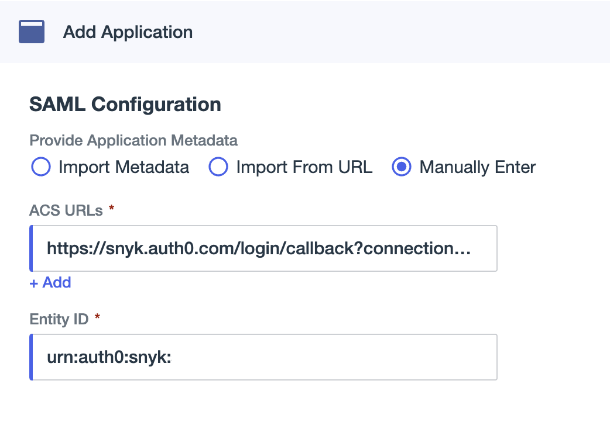
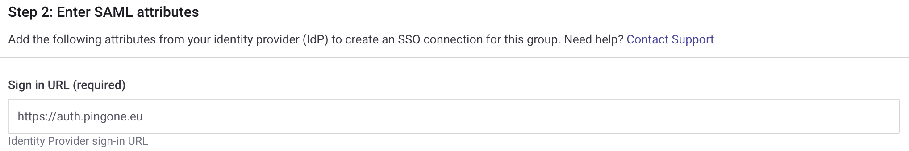

# Ping Identity 설정

이 페이지에서는 Ping Identity 애플리케이션을 설정하고 Snyk에 연결하여 SSO를 쉽게 구현하는 방법에 대해 설명합니다.

Ping Identity 애플리케이션을 SSO와 함께 Snyk을 사용하도록 구성하기 전에, Snyk로부터 엔터티 ID 및 응답 URL (Assertion Consumer Service URL)을 가져와야 합니다. 그런 다음 다음 단계를 따르세요:

1.  왼쪽 메뉴에서 **그룹**을 선택한 다음 **설정**을 선택합니다.

    <figure><figcaption></figcaption></figure>
2.  **SSO**를 선택하고 **Entity ID** 및 **ACS URL** 아래의 값을 복사하거나 브라우저 탭을 열어두세요.

    <figure><figcaption>
그룹 설정: SSO
</figcaption></figure>
3.  Ping Identity로 이동하고 **Connections** 메뉴에서 **Applications**을 선택합니다. 새 애플리케이션을 만들기 위해 **더하기** 아이콘을 클릭하세요.

    <figure><figcaption>
새 애플리케이션 만들기
</figcaption></figure>
4.  애플리케이션에 적절한 이름을 지정하고 **SAML 애플리케이션**을 선택하고 **구성**을 클릭합니다.

    <figure><figcaption>
SAML 애플리케이션으로 구성
</figcaption></figure>
5.  Snyk에서 복사한 세부 정보, **ACS URL** 및 **Entity ID**를 입력하고 **저장**을 선택합니다.

    <figure><figcaption>
Snyk 구성 세부 정보 추가
</figcaption></figure>
6.  **구성**을 선택하고 PEM 형식으로 서명 인증서를 다운로드합니다.

    <figure><figcaption>
서명 인증서 다운로드
</figcaption></figure>
7.  더 아래로 스크롤하여 **Single Signon Service** 세부 정보를 복사합니다.

    <figure><figcaption>
Single Signon Service 세부 정보 복사
</figcaption></figure>
8.  Snyk 포털로 돌아가서 2단계에서 복사한 단일 사인인 URL을 **로그인 URL** 필드에 붙여넣습니다.&#x20;

    <figure><figcaption>
로그인 URL 붙여넣기
</figcaption></figure>
9.  다운로드한 인증서를 선호하는 텍스트 편집기에서 열어 텍스트를 복사하여 Snyk **X509 서명 인증서** 필드에 붙여넣고 이 SSO 연결에서 지원되는 관련 도메인을 추가하세요.\
    마지막으로 **IdP-initiated workflow**가 활성화되어 있는지 확인하고, 새 연결을 만드는 경우 **Create Auth0 connection**을 클릭하거나 기존 연결을 편집하는 경우 **Save changes**를 클릭하세요.

    <figure><figcaption>
Ping Identity 세부 정보 입력
</figcaption></figure>
10. Ping Identity에서 **속성 매핑**을 선택하고 연필 아이콘을 클릭하여 편집합니다.

    <figure><figcaption>
속성 매핑 편집
</figcaption></figure>
11. 톱니바퀴 아이콘을 클릭하여 다음 속성을 추가합니다:

    **email**: 이메일 주소\
    **username**: 사용자 이름\
    **name**: 표현식 `user.name.given + ' ' + user.name.family`; 고급 설명을 입력하려면 톱니바퀴 아이콘을 클릭하세요.

    <figure><figcaption>
속성 매핑 추가
</figcaption></figure>

    <figure><figcaption>
이름 속성에 대한 고급 표현식 추가
</figcaption></figure>
12. Snyk 포털에서 새로운 사용자를 처리하는 방법을 결정하고 선택하는 옵션을 선택하세요: **그룹 멤버**, **조직 협력자**, 또는 **조직 관리자**.
13. **프로필 속성**을 Ping Identity에 입력한 속성 이름으로 변경한 다음 **Save changes**를 클릭하세요. \\

    <figure><figcaption>
3단계 Snyk SSO 설정
</figcaption></figure>
14. **Step 3 Snyk SSO 설정** 맨 위에 있는 직접 URL 또는 [일반 SSO 로그인](https://app.snyk.io/login/sso)으로 로그인할 수 있는지 확인하세요.
15. 마지막 단계로, 애플리케이션을 활성화하고 사용자에게 할당하세요.

    <figure><figcaption>
애플리케이션을 사용자에게 부여하고 할당
</figcaption></figure>
