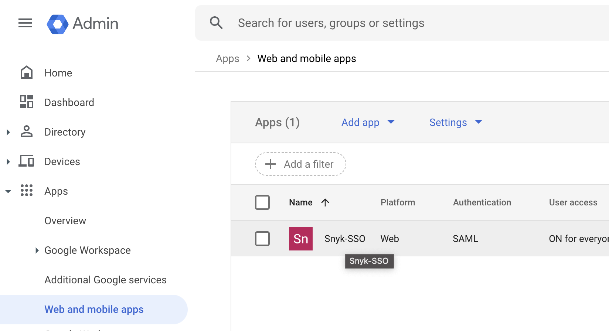

# 예제: Google Workspace용 사용자 정의 매핑 설정

다음은 Google Workspace 사용자 지정 SAML 연결을 위한 역할을 매핑하는 방법을 보여줍니다.

추가 세부 정보 및 안내는 [Google 문서, 사용자 정의 사용자 필드 관리](https://developers.google.com/admin-sdk/directory/v1/guides/manage-schemas)를 참조하십시오.

API를 사용하려면 Google Workspace 관리자 영역에 로그인한 다음 이후에 오는 명령을 실행하거나 유연성과 자동화를 위해 선호하는 API 클라이언트나 스크립트와 함께 API를 사용하십시오. API 자격 증명을 생성하려면 Google 문서 [액세스 자격 증명 생성](https://developers.google.com/workspace/guides/create-credentials)을 참조하십시오.

## 사용자 스키마 추가

[스키마 엔드포인트](https://developers.google.com/admin-sdk/directory/reference/rest/v1/schemas/insert)를 사용하여 사용자에 연결할 수 있는 스키마를 추가하십시오. 다음은 예제 스키마입니다. 이 스키마를 사용하면 사용자의 SAML 페이로드에서 원하는 사용자 정의 역할 매핑을 노출할 수 있습니다.

```json
{
   "fields":
   [
     {
       "fieldName": "roles",
       "fieldType": "STRING",
       "readAccessType": "ADMINS_AND_SELF",
       "multiValued": true,
       "displayName": "roles"
     }
   ],
   "schemaName": "Snyk-SSO"
 }
```

## 사용자 프로필 수정

사용자 프로필에 원하는 역할을 연결하려면 사용자 [API 엔드포인트](https://developers.google.com/admin-sdk/directory/reference/rest/v1/users/patch)를 사용하십시오. 참조용 예제 페이로드는 다음과 같습니다.

```json
{
 "customSchemas": {
   "Snyk-SSO": {
     "roles": [
       {
         "value": "snyk:org:org1:org_admin"
       },
       {
         "value": "snyk:org:org2:org_admin"
       }
     ]
   }
 }
}
```

## SAML 속성 수정

이러한 역할을 SAML 페이로드에 노출하려면 SAML 속성 매핑에서 속성을 수정해야 합니다:

1. Google Workspace 관리자 영역에 로그인하고 **앱**으로 이동한 다음 **웹 및 모바일 앱**을 선택하고 앱을 엽니다.

    <figure><figcaption><p>Google SAML 앱 열기</p></figcaption></figure>
2. **SAML 속성 매핑**을 클릭한 다음 **매핑 추가**를 클릭합니다.
3. **필드 선택**을 클릭하고 **Snyk-SSO - roles**을 찾을 때까지 아래로 스크롤하여 선택합니다.
4. **앱 속성** 값 필드에 **roles**를 입력하고 **저장**을 클릭합니다.

    <figure><figcaption><p>사용자 정의 매핑 앱 속성 추가</p></figcaption></figure>

이후 사용자로 로그인하고 Snyk 연락처가 SAML 페이로드를 확인하고 Snyk 배포 시설 설정을 완료하도록합니다.