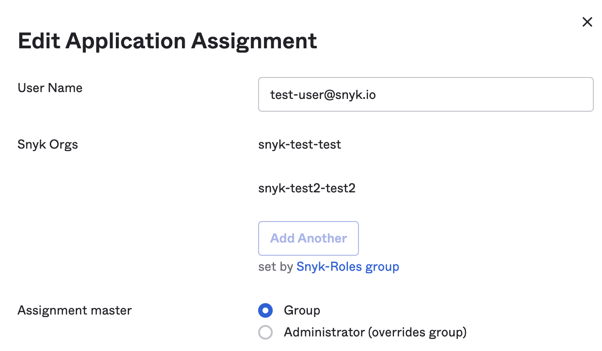

# 예시: Okta를 위한 사용자 맞춤 매핑 설정하기

다음은 [기존 맞춤 맵핑](../legacy-custom-mapping.md)을 사용하여 Okta 역할의 사용자 정의 매핑을 위한 두 가지 다른 옵션을 보여줍니다.


이러한 두 가지 옵션이 모두 작동하려면 Snyk SSO 애플리케이션이 사용자 단계가 아니라 그룹 단계에 할당되어 있어야 합니다.


## 옵션 1: 그룹을 사용한 사용자 정의 매핑 지정

이 구성에서는:

- Okta 그룹이 Snyk 조직에 매핑됩니다.
- Okta 그룹이 Snyk 조직 멤버십 역할에 매핑됩니다.
- Snyk의 사용자 역할은 해당 그룹의 모든 구성원에 대해 각 Okta 그룹의 모든 구성원에게 미리 설정되어 있습니다.

다음 단계를 따릅니다.


참고: Snyk SSO 애플리케이션은 사용자 수준이 아닌 그룹 수준에서 할당되어야 합니다.

사용자의 애플리케이션 할당을 확인하면 아래 그림과 유사하게 보여야 합니다. **Snyk-Roles group**를 **추가** 옆에 **회색으로 동그라미가 그려져 있습니다.


<figure><figcaption>
그룹 수준에서 설정된 역할
</figcaption></figure>

### Snyk 조직 이름과 역할을 포함하는 단일 앱 속성 생성

1. Okta의 주 페이지에서 **Directory -> Profile Editor -> Snyk SSO 앱**을 선택합니다.
2. **+속성 추가**를 선택합니다.
3. 이 속성에 대한 다음 세부 사항을 추가하십시오.\
   **데이터 유형**: 문자열 배열\
   **표시 이름**: Snyk Orgs\
   **변수 이름**: snyk\_orgs\
   **그룹 우선순위**: 그룹 간 값 결합
4. 완료되면 **저장**을 선택합니다.

### 관련 Okta 그룹에 속성 할당

1. Okta의 주 페이지에서 **Directory -> Groups**을 선택합니다.
2. **그룹**을 선택하고 **응용프로그램** 탭으로 이동한 후, **응용프로그램 할당**이 아직 되어 있지 않다면 클릭하고 Snyk SSO 애플리케이션을 선택한 후, 표시된 Snyk SSO 앱 옆의 **연필 아이콘**을 클릭합니다.
3. **Edit App Assignment** 대화 상자에서 Okta 그룹과 연관된 {{(Snyk}} 조직 슬러그 및 조직 역할 이름을 추가하세요(공백이나 대문자 없이), [사용자 정의 매핑](../)에 설명된 구문을 따르거나 (사용 중인 경우) [기존 사용자 정의 매핑](../legacy-custom-mapping.md)을 참조하세요.)
4. 모든 적용 가능한 Okta 그룹에 대해 이전 단계를 반복하여 각 구성된 그룹 내의 각 사용자에게 org 이름과 역할 조합을 할당합니다.

### Snyk로 전송될 역할 배열을 생성하는 값을 표현하는 역할 배열 구성.

1. **응용프로그램 -> 응용프로그램**으로 이동하고 구성한 **Snyk 앱**을 선택합니다.
2. **일반 탭 -> SAML 설정 편집**을 선택하고 **다음**을 클릭하여 **SAML 구성** 단계로 이동합니다.
3. 명시되지 않은 유형의 **Attribute 문**인 "roles"를 추가합니다.
4. **Attribute 문**을 선택하고 **Name** 필드로 **roles**를 설정하고 **이름 형식**은 **명시되지 않음**이며 **값**에는 다음 표현식을 사용합니다:

    `Arrays.flatten(appuser.snyk_orgs)`
5. 구성을 마친 후 Snyk 담당자에게 연락하여 구성을 완료할 수 있도록 합니다.

## 옵션 2: 사용자 역할을 사용한 사용자 정의 매핑 할당하기

다음은 사용자 역할을 사용한 사용자 정의 맵핑을 설명합니다.


이 지침은 [기존 맞춤 맵핑](../legacy-custom-mapping.md) 옵션을 사용하여 역할을 매핑하는 방법을 보여줍니다. 사용자 정의 매핑을 사용하려면 [옵션 1](example-setting-up-custom-mapping-for-okta.md#option-1-assign-custom-mapping-with-groups)을 권장합니다. \
질문이 있으면 Snyk 담당자에게 문의하세요.


- Okta 그룹이 Snyk 조직에 매핑됩니다.
- 사용자 프로필은 각 사용자에게 속하며, Okta 그룹에 속하지 않습니다.


참고: Snyk SSO 애플리케이션은 사용자 수준이 아닌 그룹 수준에서 할당되어야 합니다.

사용자의 애플리케이션 할당을 확인하면 아래 그림과 유사하게 보여야 합니다. **Snyk-Roles group**를 **추가** 옆에 **회색으로 동그라미가 그려져 있습니다.


<figure><figcaption></figcaption></figure>

### 관련 Snyk 조직 이름들을 포함하는 앱 속성 생성

Snyk 그룹 및 사용자가 설정된 후, 다음 단계를 따르세요.

1. Okta의 주 페이지에서 **Directory -> Profile Editor -> Snyk SSO 앱**을 선택하세요.
2. **+속성 추가**를 선택합니다.
3. 첫 번째 속성에 대한 다음 세부 사항을 추가하십시오.\
   **데이터 유형**: 문자열 배열\
   **표시 이름**: Snyk Orgs\
   **변수 이름**: snyk\_orgs\
   **그룹 우선순위**: 그룹 간 값 결합
4. 완료되면 **저장하고 다른 내용 추가하기**를 선택합니다.

### 역할을 포함하는 두 번째 앱 속성 생성

1. 두 번째 속성에 대한 다음 세부 사항을 추가하십시오.\
   **데이터 유형**: 문자열\
   **표시 이름**: Snyk 사용자 롤\
   **변수 이름**: user\_role\
   **열거형**: **값의 목록 열거형 정의**\
   **속성 멤버 협력자**: 협력자 또는 협력\
   **속성 멤버 관리자**: 관리자 또는 admin\
   **속성 멤버 그룹관리자**: groupadmin\
   **필수 속성**: 예\
   **범위**: 사용자 개인
2. 완료되면 **저장**을 선택합니다.

### 첫 번째 속성을 Okta 그룹에 할당

1. Okta의 주 페이지에서 **Directory -> Groups**을 선택합니다.
2. **그룹**을 선택하고 **응용프로그램** 탭으로 이동한 후, **응용프로그램 할당**이 아직 되어 있지 않다면 클릭하고 Snyk SSO 애플리케이션을 선택한 후, 표시된 Snyk 앱 옆의 **연필 아이콘**을 클릭합니다.
3. **Edit App Assignment** 대화 상자에서 Okta 그룹 및 연결된 {{(Snyk}} 조직 이름을 추가합니다(공백이나 대문자 없이)).
4. 필요한 경우 Snyk 앱을 모든 적용 가능한 Okta 그룹에 할당하고 Snyk 조직 이름을 필요에 따라 수정하면서 이전 단계를 반복합니다.

### 두 번째 속성을 사용자에게 할당

1. Okta의 주 페이지에서 **Directory -> People**을 선택합니다.
2. **사용자** 하나를 선택하고 **응용프로그램** 탭으로 이동하여 앱 옆의 **연필 아이콘**을 클릭합니다.
3. **그룹(사용자 역할)에서 올바른 사용자 유형을 선택합니다: **협력자(collaborator)**, **관리자(admin)** 또는 **그룹 관리자(group admin)**.

### 두 속성을 연결하여 Snyk로 전달할 역할 배열을 문자열 값으로 만드는 값을 구성

1. **응용프로그램 -> 응용프로그램**으로 이동하고 구성한 **Snyk 앱**을 선택합니다.
2. **일반 탭 -> SAML 설정 -> 편집**을 선택하고 **다음**을 클릭하여 **구성 SAML** 단계로 이동합니다.
3. **Attribute 문**을 선택하고 **이름 형식**은 **명시되지 않음**으로 **roles**라는 속성을 추가하고 **값**에 다음 표현식을 사용합니다:\
   `appuser.user_role == "groupadmin" ? "snyk-groupadmin" : Arrays.flatten(String.replace(String.replace(String.append("snyk-",String.append(Arrays.toCsvString(appuser.snyk_orgs),"-"+appuser.user_role)),",",",snyk-"),",","-"+appuser.user_role+","))`
4. **다음 -> 완료**를 클릭합니다.
5. Snyk 담당자에게 연락하여 구성을 완료할 수 있도록 합니다. 이 과정은 4~5일이 소요될 수 있습니다.

다음은 역할 표현의 설명입니다:

- 역할이 `groupadmin`인 경우, 표현식은 그 외를 무시하고 `snyk-groupadmin`을 전달합니다.
- 역할이 `groupadmin`이 아닌 경우, 모든 그룹에서 나열한 각 Snyk Org 이름에 대해 표현식은 Snyk Org 이름에 prefix “`snyk-`”을 자동으로 연결하고 각 조직 이름의 끝에 `user_role`를 추가합니다. 예시 결과는 다음과 같습니다.

예시 역할: `[ "snyk-groupadmin", "snyk-org1-admin", "snyk-org2-admin" ]`