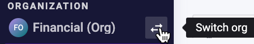
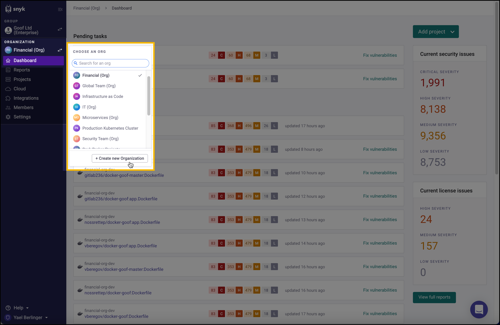
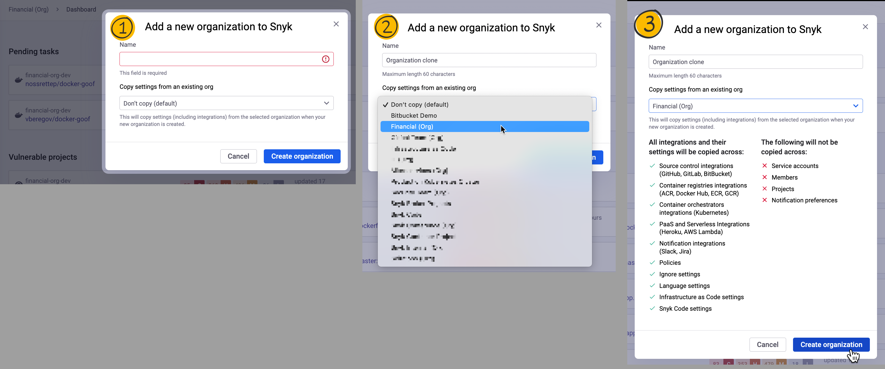

# Snyk 조직 간 통합 복제하기


Snyk Code와 함께 Broker를 사용 중이라면 [브로커를 통한 Git 복제](git-clone-through-broker.md)를 참조하십시오. Snyk Code에 브로커를 구현하는 데 도움이 필요한 경우 Snyk 팀에 문의하십시오.


Snyk에서 이미 구성한 Organization을 복제하고 중복하여 사용하여 여러 조직 간에 동일한 브로커 Git 통합을 선택할 수 있습니다.

예를 들어, Snyk 조직 X, Y 및 Z를 하나의 Git 리포지토리 X와 통합할 수 있습니다.

**필수 조건**: 조직 구성을 복제하려면 팀 및 그룹이 활성화되어 있어야 합니다.

1. **Organization** 목록에서 작업 중인 그룹 내의 Organization을 선택하십시오.\
   
2. 동일한 **Organization** 드롭다운에서 **+새 Organization 만들기**를 클릭하십시오.

    <figure><figcaption>
+새 Organization 만들기 선택
</figcaption></figure>
3. 다음 창에서 새 Organization의 이름을 입력하십시오.
4. **기존 org에서 설정 복사** 섹션에서 이미 브로커 토큰에 대해 구성한 Organization을 선택하십시오.
5. 새 Organization으로 복사될 요약을 검토하고 확인을 위해 **Organization 생성**을 클릭하십시오.

    <figure><figcaption>
새 Organization으로 복사될 내용 요약 및 생성
</figcaption></figure>

변형한 Organization의 **대시보드**가 열립니다. 브로커 통합이 복제되어 설정되고, 브로커 토큰은 원래 Organization의 토큰과 동일합니다.