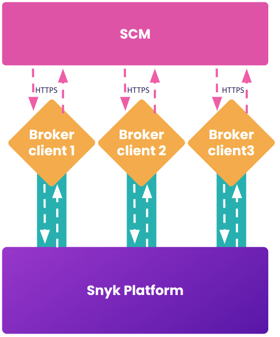

# 고가용성 모드

Snyk 브로커는 서버 및 클라이언트 모두에 고가용성 기능을 제공하여 현재 브로커의 확장성을 향상시키고, 처음에는 {{Snyk Code}}에 대한 "브로커를 통한 git-clone" 흐름 추가를 지원합니다.

고가용성 모드를 사용하면 여러 브로커 클라이언트가 다른 클라이언트와 독립적인 연결을 가질 수 있습니다. Snyk 플랫폼은 각 클라이언트에 균일하게 요청을 분산하여 각 클라이언트에 부하를 덜어주고, 한 클라이언트가 오프라인인 경우 진정한 중복성을 제공합니다. 고가용성 모드는 또한 Snyk가 브로커 서버 구성요소를 업그레이드할 때 비교적 드문 경우에 다운타임을 피할 수 있습니다.

<figure><figcaption><p>고가용성 모드에서 여러 브로커 클라이언트의 작동</p></figcaption></figure>

고가용성 모드를 사용하려면 하나 이상의 복제본을 배포해야 합니다. 이는 더 많은 컨테이너를 실행하거나 Kubernetes 배포에서 복제본 수를 증가시킴으로써 가능합니다. 각 컨테이너는 정확히 동일한 매개변수를 가져야 합니다.

고가용성 모드에서 동시에 실행 중인 최대 네 개의 브로커 클라이언트가 허용됩니다. 다섯 번째 터널은 무한히 연결을 시도합니다.

## 고가용성 (HA) 모드를 활성화하는 설정

고가용성 모드는 기본적으로 비활성화되어 있습니다. 활성화하려면 다음과 같이 환경 변수를 설정합니다.

```
BROKER_HA_MODE_ENABLED=true
```

Helm 차트 배포는 set 인수를 사용하여 모드를 활성화하여 이러한 값들을 설정할 수 있습니다. Helm 차트 버전 1.7.0 이상이 필요합니다.

```
--set highAvailabilityMode.enabled=true
```

차트 값 파일을 검토하여 복제본 수를 증가시키거나 브로커 디스패처 기본 URL을 업데이트하는 등의 추가 구성을 조정할 수 있습니다.

## **설정에 대한 중요 사항**

브로커 디스패처 기본 URL은 regional Snyk 플랫폼을 사용하는 경우에 국가별로 구체적으로 설정되어야 합니다. 예를 들어 api.eu.snyk.io와 같습니다. 자세한 내용은 [Regional hosting and data residency](../../working-with-snyk/regional-hosting-and-data-residency.md)를 참조하십시오.

app.snyk.io를 사용하는 경우에는 다음이 필요하지 않습니다. 이는 regional Snyk 플랫폼에만 적용됩니다.

```
BROKER_DISPATCHER_BASE_URL=https://api.snyk.io
```

api.snyk.io 또는 해당 api 호스트명으로의 외부 연결이 허용되어 있어야 합니다. 그렇지 않으면 브로커 클라이언트 시작 시 사전체크에서 실패가 나타납니다.

고가용성 집합 내의 모든 브로커 클라이언트마다 `BROKER_CLIENT_URL` 값은 동일해야 합니다. 또한 동일한 BROKER\_TOKEN을 사용해야 합니다. 이 URL이 특정 클라이언트로 해석되는 것은 허용됩니다.

여러 터널은 주로 Snyk=>You 흐름을 지원합니다. You=>Snyk로 가는 웹훅도 임의의 터널을 통해 가능합니다.

가능하면 로드 밸런서도 도입할 수 있습니다. 각 브로커 클라이언트 앞에 서비스가 있는 Kubernetes 배포는 이를 자동으로 분배합니다.&#x20;

다음 클라이언트 로그 라인은 고가용성 모드가 활성화되어 있는 것을 보여줍니다.

> ```shell
> ...
> checking for HA mode (enabled=true)
> received server id (serverId=0)
> broker client is connecting to broker server (url=https://broker.snyk.io, serverId=0)
> ...
> ```

고가용성 모드를 사용하면 각 클라이언트에 할당된 터널 개념이 도입되어 해당 터널을 Broker 서버의 예측 가능한 집합으로 스케줄링하여 고유 클라이언트가 올바른 pod에 연결될 수 있습니다.