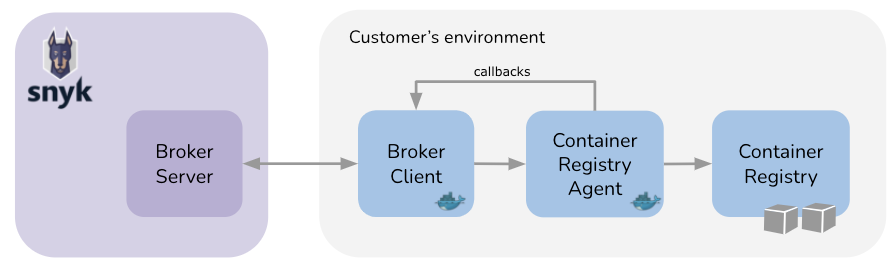

# Snyk Broker - 컨테이너 레지스트리 에이전트


**기능 사용 가능 여부**

Snyk 브로커 컨테이너 레지스트리 에이전트는 엔터프라이즈 플랜에서만 사용할 수 있습니다. 자세한 정보는 [요금제 및 가격](https://snyk.io/plans/)을 참조하십시오.


Snyk 브로커 컨테이너 레지스트리 에이전트를 사용하면 네트워크 제한이 있는 컨테이너 레지스트리와 연결을 설정하여 해당 레지스트리를 Snyk 서비스를 사용하여 스캔할 수 있습니다.

컨테이너 레지스트리 에이전트를 사용하면 Snyk이 호스팅하는 개인 컨테이너 레지스트리를 통합할 수 있으며 이를 통해 해당 레지스트리 내의 컨테이너 이미지를 보다 안전하게 보호할 수 있습니다. 개인 컨테이너 레지스트리와의 통합을 통해 다음을 수행할 수 있습니다:

* 액세스 토큰과 같은 중요한 데이터를 개인 네트워크 내부에 보관하여 해당 정보를 Snyk와 공유하지 않습니다.
* 네트워크에 대한 Snyk 액세스를 제한하고, Snyk이수행할 수 있는 작업을 제한하기 위해 Snyk에 대한 제어된 액세스를 제공합니다.

이 페이지에서는 지원되는 오픈 소스 컨테이너 레지스트리에 대해 [목록화된](./#supported-container-registries)대로 브로커를 통해 컨테이너 레지스트리 에이전트를 사용하는 방법을 설명합니다. 이 통합 방법은 사용자들을 대상으로 설계되었으며, 이미지를 Snyk 서비스 안이 아닌 자신의 환경에서 스캔해야 하는 경우에 사용됩니다.

자신의 환경에서 이미지를 스캔할 필요가 없는 경우, 계정의 통합 페이지에서 지원되는 컨테이너 레지스트리와 통합할 수 있습니다. 자세한 내용은 [Snyk Container](../../../scan-with-snyk/snyk-container/container-registry-integrations/) 보안 통합을 참조하십시오.

## 네트워크 제한이 있는 컨테이너 레지스트리 솔루션의 구성요소

다음 구성요소들은 네트워크 제한이 있는 컨테이너 레지스트리와 함께 필요합니다:

* 브로커 서버: Snyk SaaS 백엔드에서 실행됩니다.
* 브로커 클라이언트 및 컨테이너 레지스트리 에이전트: 두 가지 도커 이미지가 귀하의 인프라에 배포되어 서로 다른 두 개의 서비스를 생성하며, 컨테이너 레지스트리를 안전하게 샘플링하고 이를 Snyk로 전송하는 역할을 담당합니다.

브로커 클라이언트는 컨테이너 레지스트리 에이전트에 연결 세부 정보를 제공합니다. 에이전트는 이 정보를 사용하여 컨테이너 레지스트리에 연결하고 이미지를 스캔한 후 스캔 결과를 브로커통신을 이용한 콜백으로 전송합니다. 브로커 통신은 브로커 클라이언트가 브로커 ID를 사용하여 Snyk 환경에서 실행되는 브로커 서버에 연결할 때 발생합니다. 자세한 내용은 [Snyk Broker](../) 소개 정보를 참조하십시오.

<figure><figcaption></figcaption></figure>

## 지원되는 컨테이너 레지스트리들

Snyk 브로커 컨테이너 레지스트리 에이전트를 사용하여 Snyk을을 다음 오픈 소스 컨테이너 레지스트리와 통합할 수 있습니다:

* JFrog 컨테이너 레지스트리 (아티팩토리) (유형: artifactory-cr)
* Harbor 레지스트리 (유형: harbor-cr)
* Azure 컨테이너 레지스트리 (유형: acr)
* Google Cloud 컨테이너 레지스트리 (GCR) (유형: gcr)
* Amazon Elastic 컨테이너 레지스트리 (ECR) (유형: ecr)
* Google Artifact 레지스트리 (유형: google-artifact-cr)
* Docker Hub 레지스트리 (유형: docker-hub). 참고: Snyk 브로커는 [`docker.io/registry`](http://docker.io/registry) 셀프 호스팅 인스턴스에 연결할 수 없습니다.
* RedHat Quay 컨테이너 레지스트리 (유형: quay-cr)
* Nexus 레지스트리 (유형: nexus-cr)
* GitHub 컨테이너 레지스트리 (유형: github-cr)
* DigitalOcean 컨테이너 레지스트리 (유형: digitalocean-cr)
* GitLab 컨테이너 레지스트리 (유형: gitlab-cr)

Artifactory와 Nexus는 브로커 옵션이 있는 개인 패키지 리포지토리로도 사용할 수 있습니다. 컨테이너 레지스트리에 필요한 브로커는 이 페이지의 [컨테이너 레지스트리 에이전트를 위한 전제 조건](./#prerequisites-for-container-registry-agent)에 명시된 것과 일치해야 합니다. `snyk/broker:artifactory` 또는 `snyk/broker:nexus` 브로커가 아닌 것을 유의하십시오.

GitHub 컨테이너 레지스트리와 GitLab 컨테이너 레지스트리는 Docker v2 API를 준수하지 않습니다. `/v2/_catalog` 엔드포인트가 없습니다. 따라서 레포지토리에서 이미지 목록을 나열할 수 없으며, 스캔하려는 이미지를 수동으로 지정해야 합니다.

## 컨테이너 레지스트리 에이전트를 위한 전제 조건

Snyk 브로커 및 컨테이너 레지스트리 에이전트를 설정하고 실행하는 데 필요한 시스템 및 소프트웨어 요구 사항은 다음과 같습니다;

* 브로커 클라이언트 머신 시스템 요구 사항: 1 CPU, 256MB의 RAM
* 컨테이너 레지스트리 에이전트 머신 시스템 요구 사항 (MAX\_ACTIVE\_OPERATIONS=1 지정):
  * CPU: 1 vCPU
  * 메모리: 2GB (노드 메모리 설정에 반영되어야 함)
  * 저장 공간: 5GB
* 이미지 목록을 볼 수 있고 끌어올 수 있는 컨테이너 레지스트리 자격 증명
* 브로커 및 에이전트 사이의 연결
* 에이전트와 레지스트리 간의 HTTPS 연결. HTTP 전용 레지스트리의 경우, 에이전트와 컨테이너 레지스트리 사이에 역방향 프록시를 배포하십시오.
* [Docker의 브로커 클라이언트 이미지 다운로드](https://hub.docker.com/r/snyk/broker/tags?page=1\&ordering=last_updated\&name=container-registry-agent): snyk/broker:container-registry-agent (Docker 사용시)
* [Docker의 컨테이너 레지스트리 에이전트 이미지 다운로드](https://hub.docker.com/r/snyk/container-registry-agent/tags?page=1\&ordering=last_updated): snyk/container-registry-agent:latest (Docker 사용시)


**스캔 용량 조정을 위한 확장**

1 vCPU 및 2GB RAM의 구성으로 스캔 용량은 한 번 실행당 약 160개의 약 350MB 이미지일 것입니다. 이미지 크기에 따라 확장할 수 있습니다. 확장이 불가능하고 제한 사항에 맞지 않는 특정 사용 사례가 있는 경우 [Snyk 지원팀](https://support.snyk.io)에 문의하십시오.


## Docker를 사용하여 컨테이너 레지스트리 에이전트용 원격 연결 설정

### 컨테이너 레지스트리 에이전트용 브로커 클라이언트 구성 및 실행

컨테이너 레지스트리 에이전트 배포에서 브로커 클라이언트를 사용하려면 [전제 조건 부분](./#prerequisites-for-container-registry-agent)에서 이미 수행한 경우 `docker pull snyk/broker:container-registry-agent`를 실행합니다.

다음 환경 변수들은 브로커 클라이언트를 구성하는 데 필요합니다.


DigitalOcean 컨테이너 레지스트리, Google Cloud 컨테이너 레지스트리, Google Artifact 레지스트리 및 아티팩토리의 경우 몇 가지 값을 주목해야 합니다; [컨테이너 레지스트리별 구성](./#container-registry-specific-configurations)을 참조하십시오. Elastic Container Registry의 경우 추가 설정이 필요합니다. [구체적인 구성](./#container-registry-specific-configurations)도 제공됩니다.


* `BROKER_TOKEN` - Snyk 지원에서 제공하는 컨테이너 레지스트리 통합을 위해 얻은 Snyk 브로커 토큰.
* `BROKER_CLIENT_URL` - 브로커 클라이언트의 URL로, 컨테이너 레지스트리 에이전트가 Snyk에 대해 브로커통신을 통해 다시 호출하는 데 사용되는 스킴 및 포트가 포함된 URL, 예: "[http://my.broker.client:8000](http://my.broker.client:8000)".
  * `http://://`와 포트 번호가 포함되어야 합니다.
  * HTTPS로 클라이언트를 구성하려면 [HTTPS 사용에 대한 추가 설정](../install-and-configure-snyk-broker/advanced-configuration-for-snyk-broker-docker-installation/https-for-broker-client-with-docker.md)이 필요합니다.
* `CR_AGENT_URL` - 브로커 클라이언트가 요청을 라우팅할 컨테이너 레지스트리 에이전트의 URL (스킴 및 포트 포함), 예: ["http://my.container-registry-agent](http://my.container-registry-agent):8081".
* `CR_TYPE` - 이 페이지의 [지원되는 컨테이너 레지스트리](./#supported-container-registries)에 나열된 컨테이너 레지스트리 유형, 예: "docker-hub", "gcr," "artifactory-cr".
* `CR_BASE` - 연결할 컨테이너 레지스트리 API의 호스트 이름, 예: "cr.host.com".
* `CR_USERNAME` - 컨테이너 레지스트리 API에 인증하기 위한 사용자 이름.
* `CR_PASSWORD` - 컨테이너 레지스트리 API에 인증하기 위한 암호.
* `CR_TOKEN` - DigitalOcean 컨테이너 레지스트리의 인증 토큰.
* `PORT` - 브로커 클라이언트가 연결을 수락하는 로컬 포트 (기본값: 7341).
* 옵션 - `BROKER_CLIENT_VALIDATION_URL` - 컨테이너 레지스트리 에이전트를 위해 `/systemcheck`을 구성하기 위한 URL 설정. 자세한 내용은 이 페이지의 [구성 및 사용 시스템 체크](./#configuring-and-using-systemcheck)를 참조하십시오.

해당 구성을 사용하여 브로커 클라이언트 컨테이너를 실행합니다:

```
docker run --restart=always \
       -p 8000:8000 \
       -e BROKER_TOKEN="<secret-broker-token>" \
       -e BROKER_CLIENT_URL="<broker-client-url>" \
       -e CR_AGENT_URL="<container-registry-agent-url>" \
       -e CR_TYPE="<container-registry-type>" \
       -e CR_BASE="<container-registry-hostname>" \
       -e CR_USERNAME="<username>" \
       -e CR_PASSWORD="<password>" \
       -e PORT=8000 \
       snyk/broker:container-registry-agent
```

이 명령 대신, 컨테이너 레지스트리 에이전트를 설정하기 위해 파생된 Docker 이미지를 사용할 수 있습니다. 컨테이너 레지스트리 에이전트에 대해 환경 변수를 재지정하는 데 사용되는 [파생된 Docker 이미지](../install-and-configure-snyk-broker/derived-docker-images-for-broker-client-integrations-and-container-registry-agent.md)를 참조하십시오.

### **컨테이너 레지스트리 에이전트 구성 및 실행**

컨테이너 레지스트리 에이전트 이미지는 [사전 요구 사항](./#prerequisites-for-container-registry-agent)에서 제공된 링크를 사용하여 Docker Hub에서 가져올 수 있습니다.

컨테이너 레지스트리 에이전트를 구성하려면 다음 환경 변수가 필요합니다:

* `SNYK_PORT` - 컨테이너 레지스트리 에이전트가 연결을 수락하는 로컬 포트 (기본값: 17500).
* `SNYK_MAX_IMAGE_SIZE_IN_BYTES` - Snyk이 스캔할 수 있는 이미지의 최대 크기 (기본값: 2147483648).

다음 구성으로 컨테이너 레지스트리 에이전트 컨테이너를 실행하십시오:

```
docker run --restart=always \
       -p 8081:8081 \
       -e SNYK_PORT=8081 \
       snyk/container-registry-agent:latest
```

## **컨테이너 레지스트리별 구성**

다음 컨테이너 레지스트리는 특정 환경 변수 또는 설정(또는 둘 다)을 요구합니다.

### **DigitalOcean Container Registry**

DigitalOcean Container Registry의 Broker 클라이언트를 설정할 때 `CR_USERNAME` 및 `CR_PASSWORD`는 필요하지 않습니다. 대신 `CR_TOKEN`, 즉 DigitalOcean 인증 토큰을 지정해야 합니다.

### **GCR 및 Google Artifact Registry**

이전에 설명한 모든 정보는 이러한 컨테이너 레지스트리의 Broker 클라이언트를 설정하는 데 적용됩니다. 참고로, `CR_USERNAME` 값은 `_json_key`로, `CR_PASSWORD` 값은 인증에 사용되는 JSON 키여야 합니다.

### **JFrog Container Registry (Artifactory)**

Docker 액세스 방법으로 `Repository path`를 사용하는 경우, 다음 구조로 `CR_BASE` 변수에 컨테이너 레지스트리 호스트 이름을 설정하십시오: `<your artifactory host>/artifactory/api/docker/<artifactory-repo-name>`

Artifactory에서 프로젝트를 가져오기 위해 카탈로그 엔드포인트 `/artifactory/api/docker/<artifactory-repository>/v2/_catalog`는 필요하지 않습니다. 이는 이미지 리포지토리 나열에 사용됩니다.

자세한 내용은 [JFrog Artifactory 컨테이너 레지스트리 통합 구성](../../../scan-with-snyk/snyk-container/container-registry-integrations/integrate-with-jfrog-artifactory/configuring-your-jfrog-artifactory-container-registry-integration.md)을 참조하십시오.

### **Elastic Container Registry (ECR)**

Elastic Container Registries 및 기타 컨테이너 레지스트리에서 통신 방식은 동일합니다. 에이전트는 컨테이너 레지스트리에 동기 호출을 하여 이미지를 나열하고 가져옵니다. 그런 다음 에이전트는 이미지를 스캔하고 결과를 콜백을 사용하여 Broker 클라이언트에 전송합니다. ECR은 IAM Role 또는 User를 설정해야 하는 특별한 인증 메커니즘이 필요합니다.

<figure><figcaption><p>Brokered ECR 통합의 고급 아키텍처</p></figcaption></figure>

#### **ECR에 필요한 AWS 리소스**

ECR 설정에는 다음과 같은 유형의 IAM 리소스를 생성해야 합니다:

* 컨테이너 레지스트리 에이전트 IAM Role 또는 IAM User: 에이전트가 ECR에 액세스하기 위해 교차 계정 역할을 수락하는 데 사용하는 IAM Role 또는 IAM User입니다. 다음 권한을 가져야 합니다: "`sts:AssumeRole`".
*   Snyk ECR 서비스 역할: ECR에 읽기 전용 액세스를 얻기 위해 컨테이너 레지스트리 에이전트 IAM Role 또는 IAM User가 수락하는 ECR에 액세스할 수 있는 IAM Role입니다.\
    ECR 서비스 역할은 다음 권한을 가져야 합니다:

    ```
    [
      "ecr:GetLifecyclePolicyPreview",
      "ecr:GetDownloadUrlForLayer",
      "ecr:BatchGetImage",
      "ecr:DescribeImages",
      "ecr:GetAuthorizationToken",
      "ecr:DescribeRepositories",
      "ecr:ListTagsForResource",
      "ecr:ListImages",
      "ecr:BatchCheckLayerAvailability",
      "ecr:GetRepositoryPolicy",
      "ecr:GetLifecyclePolicy"
    ]
    ```

#### **ECR 설정 단계**

설명된 리소스를 사용하여 단일 컨테이너 레지스트리 에이전트 인스턴스가 서로 다른 계정에 위치한 ECR 리포지토리에 액세스할 수 있습니다.

**이 단계를 한 번만 실행하십시오.** 컨테이너 레지스트리 에이전트 IAM Role 또는 IAM User를 생성하고 이를 사용하여 컨테이너 레지스트리 에이전트를 실행하십시오. IAM Role 또는 IAM User는 [AWS 문서](https://docs.aws.amazon.com/sdk-for-javascript/v2/developer-guide/setting-credentials-node.html)에 설명된 방법 중 하나를 사용하여 컨테이너 레지스트리 에이전트에 제공될 수 있습니다.

**각 ECR 계정에 대해 별도의 Broker 인스턴스를 사용하여 다음 단계를 실행하십시오:**

1. ECR이 있는 AWS 계정에서, ECR에 읽기 액세스가 있는 Snyk ECR 서비스 역할을 생성하고, 이 역할이 한 번만 생성된 컨테이너 레지스트리 에이전트 IAM Role 또는 IAM User에 의해 수락될 수 있도록 신뢰 관계를 편집하십시오.
2. 컨테이너 레지스트리 에이전트 IAM Role 또는 IAM User가 Snyk ECR 서비스 역할만 수락할 수 있도록 제한하십시오.
3. Broker 클라이언트에 Snyk ECR 서비스 역할의 Role ARN(Amazon 서비스 이름)과 ECR의 리전을 제공합니다. Broker 클라이언트는 이 Role ARN을 컨테이너 레지스트리 에이전트에 전달하며, 컨테이너 레지스트리 에이전트는 이를 수락하여 ECR에 액세스합니다. 다음 환경 변수가 필요합니다:
   * CR\_ROLE\_ARN=\<SnykEcrServiceRole의 역할 ARN>
   * CR\_REGION=\<ECR의 AWS 리전>
   * CR\_EXTERNAL\_ID=<선택 사항. 신뢰 관계 조건에서 찾을 수 있는 외부 ID>

## **systemcheck 구성 및 사용**

Broker 클라이언트의 `/systemcheck` 엔드포인트를 사용하여 Broker 클라이언트, 컨테이너 레지스트리 에이전트, 컨테이너 레지스트리 간의 연결을 확인할 수 있습니다.

엔드포인트를 사용하려면 다음 환경 변수를 Broker 클라이언트에 제공합니다:\
`BROKER_CLIENT_VALIDATION_URL=<agent-url>/systemcheck`

Broker 클라이언트의 `/systemcheck` 엔드포인트를 호출하면, 제공된 자격 증명을 사용하여 컨테이너 레지스트리 에이전트의 `/systemcheck` 엔드포인트로 요청을 보냅니다. 컨테이너 레지스트리 에이전트는 컨테이너 레지스트리에 요청을 보내 연결을 검증합니다.


`/systemcheck` 엔드포인트는 Brokered 통합이 작동하는 데 필수는 아닙니다. 자세한 내용은 [Systemcheck 문서](../troubleshooting-broker.md#monitoring-systemcheck)를 참조하십시오.


## **컨테이너 레지스트리 에이전트의 디버깅 방법**

`LOG_LEVEL` 환경 변수를 설정하여 컨테이너 레지스트리 에이전트와 Broker 클라이언트의 로그 레벨을 제어할 수 있습니다. 기본값은 `info`입니다. 허용되는 값은 `debug`, `info`, `warn`, `error`입니다.


서드파티 라이브러리의 디버깅을 프로덕션 환경에서 활성화하는 것은 권장되지 않습니다. 이는 Snyk에서 유지 관리하지 않는 로그에 민감한 정보를 노출할 수 있습니다. 예를 들어, HTTP 요청 헤더가 포함될 수 있습니다.


서드파티 HTTP 요청 라이브러리 [Needle](https://www.npmjs.com/package/needle)의 디버그 로그를 활성화하려면 환경 변수 `NODE_DEBUG=needle`을 설정하십시오.

모든 서드파티 라이브러리의 디버그 로그를 활성화하려면 환경 변수 `DEBUG=*` 및 `NODE_DEBUG=*`를 설정하십시오.

`DEBUG` 환경 변수는 [Debug](https://www.npmjs.com/package/debug) 패키지 출력을 제어합니다. `NODE_DEBUG` 환경 변수는 Node.js [util.debuglog](https://nodejs.org/api/util.html#utildebuglogsection-callback) 출력을 제어합니다.
