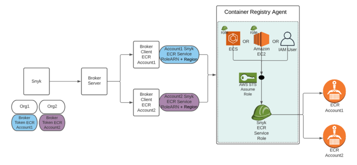

# 브로커링된 ECR 통합을 위한 컨테이너 레지스트리 에이전트 설정

## 브로커링된 ECR 통합을 위한 용어 및 다이어그램

탄성 컨테이너 레지스트리에서 브로커링된 통신은 다른 컨테이너 레지스트리와 동일합니다. 그러나 ECR은 특별한 인증 메커니즘을 갖고 있어 에이전트에서 Identity and Access Management (IAM) 역할 또는 사용자를 설정해야 합니다.

컨테이너 레지스트리 에이전트 IAM 역할 또는 IAM 사용자는 ECR에 액세스할 수 있는 역할을 가정하기 위해 컨테이너 레지스트리 에이전트에 의해 사용됩니다.

Snyk ECR 서비스 역할은 ECR에 액세스할 수 있는 IAM 역할로, 브로커된 컨테이너 레지스트리 에이전트 IAM 역할 또는 IAM 사용자가 가정하기 위해 사용됩니다. Snyk ECR 서비스 역할 ARN은 ECR이 실행 중인 지역과 함께 브로커 클라이언트에 제공되고, 이는 컨테이너 레지스트리 에이전트에 전달됩니다.

컨테이너 레지스트리 에이전트와 통신해야 하는 여러 개의 계정에 걸쳐 여러 ECR이 있는 경우, 각 ECR마다 브로커 클라이언트를 설정해야 합니다.

다음은 브로커링된 ECR 통합을 위한 아키텍처를 설명한 것입니다. 다이어그램에 있는 구성요소를 설정하는 방법에 대한 정보는 이어지는 단계를 참조하십시오.

<figure><figcaption><p>브로커링된 ECR 통합의 아키텍처</p></figcaption></figure>

## 브로커링된 ECR 통합 단계 요약

다른 계정에 위치한 ECR 리포지토리에 액세스할 수 있는 단일 컨테이너 레지스트리 에이전트 인스턴스를 설정하는 데 이러한 단계를 따르십시오.

1. **이 단계는 단 한 번 실행합니다.** IAM 역할 혹은 IAM 사용자를 생성하여 역할을 가정할 수 있는 권한을 부여하십시오. 이 IAM 역할 또는 IAM 사용자를 사용하여 컨테이너 레지스트리 에이전트를 실행합니다. 각 ECR 계정에 대해 다음 단계를 따르되, 각 ECR 계정에 대해 별도의 브로커 인스턴스를 사용하십시오.
2. ECR이 위치한 AWS 계정에서, ECR에 대한 읽기 액세스 권한이 있는 Snyk ECR 서비스 역할을 생성하고, 이 역할이 이전 단계에서 생성된 특정 컨테이너 레지스트리 에이전트 IAM 역할 또는 IAM 사용자만 가정하도록 제한하십시오.
3. 컨테이너 레지스트리 에이전트 IAM 역할 또는 IAM 사용자가 Snyk ECR 서비스 역할만 가정할 수 있도록 제한하십시오.
4. 브로커 클라이언트에게 Snyk ECR 서비스 역할의 역할 Amazon Resource Name (ARN)을 제공하십시오. 브로커 클라이언트는 이 역할 ARN을 컨테이너 레지스트리 에이전트에게 전달하고, 컨테이너 레지스트리 에이전트는 이를 가정하여 ECR에 액세스합니다.

## 1단계: IAM 사용자 또는 IAM 역할을 가진 컨테이너 레지스트리 에이전트 실행

이 단계에서, 컨테이너 레지스트리 에이전트에서 사용할 IAM 역할 또는 IAM 사용자를 생성합니다. IAM 역할 또는 IAM 사용자는 [AWS 문서](https://docs.aws.amazon.com/sdk-for-javascript/v2/developer-guide/setting-credentials-node.html)에 나와 있는 메서드를 통해 컨테이너 레지스트리 에이전트에 제공될 수 있습니다.

다음 예제에서는 다음 중 하나의 방법을 사용하여 IAM 역할 또는 IAM 사용자를 제공하는 방법을 설명합니다.

* **예제 a:** 전용 EC2 역할을 생성하고 EC2 인스턴스에서 실행 중인 컨테이너 레지스트리 에이전트 이미지로부터 AWS Identity and Access Management (IAM) 역할의 자격 증명을 로드합니다.
* **예제 b:** 전용 사용자를 생성하고 환경 변수를 통해 자격 증명을 제공합니다.

Amazon ECS 작업에서도 전용 역할을 제공할 수 있습니다. 자세한 내용은 [AWS 문서](https://docs.aws.amazon.com/AmazonECS/latest/developerguide/task-iam-roles.html)를 참조하십시오.

### **예제 a: 전용 EC2 서비스 역할 생성 및 AWS Identity and Access Management (IAM) 역할로부터 자격 증명 로드**

#### 단계 1: 역할 생성

1. [AWS](https://console.aws.amazon.com/iam/home?#/policies)로 이동하여 IAM 서비스로 AWS 관리 콘솔에 로그인하고 **Roles** 페이지로 이동합니다.
2. **Role** 생성을 선택합니다.
3. **Type of trusted entity**로 **AWS service**를 선택합니다.
4. **Use case**로 **EC2**를 선택합니다.
5. 다음 단계를 진행하고 권한 및 태그를 설정합니다.
6. 역할 이름을 설정하고 Review를 선택합니다: **SnykCraEc2Role**.
7. 역할을 생성합니다.
8. 역할의 **Summary** 페이지에서 나중에 사용할 **Instance Profile ARN**을 복사합니다.\
    예: `arn:aws:iam::aws-account:instance-profile` 또는 `SnykCraEc2Role`\
    또한 **Role ARN**을 복사합니다.

    예: `arn:aws:iam::aws-account:role` 또는 `SnykCraEc2Role`

#### 단계 2: EC2 역할이 다른 역할을 가정할 수 있도록 정책 생성

1. 새로 생성된 역할 페이지에서 **Permissions** 탭에서 **Inline policy**를 생성합니다.
2. **Service**에서 **STS**를 선택합니다.
3. **Actions**에서 **Write → AssumeRole**을 선택합니다.
4. **Resources**에서 **All resources**를 선택합니다 (나중에 리소스를 강화할 것입니다).
5. **JSON** 탭에서 다음 내용이 포함된 정책인지 확인합니다:

    ```
    {
      Version: 2012-10-17,
      Statement: [
        {
          Sid: SnykCraAssumeRolePolicy,
          Effect: Allow,
          Action: sts:AssumeRole,
          Resource: *
        }
      ]
    }
    ```
6. 정책을 검토하고 정책 이름을 지정합니다: **SnykCraAssumeRolePolicy**.
7. 정책을 생성합니다.

#### 단계 3: 컨테이너 레지스트리 에이전트를 실행하는 EC2 인스턴스에 역할 추가

1. **EC2 Management Console**로 이동하여 컨테이너 레지스트리 에이전트 컨테이너가 실행 중인 인스턴스를 선택합니다.
2. **Actions → Security → Modify IAM Role**을 선택합니다.
3. **IAM role** 드롭다운 목록에서 첫 번째 단계에서 생성된 IAM 역할의 인스턴스 프로필을 선택합니다.\
   예: `arn:aws:iam::aws-accoun:instance-profile` 또는 `SnykCraEc2Role`
4. 그런 다음 **Save**합니다.

EC2 인스턴스에서 컨테이너 레지스트리 에이전트 이미지를 실행할 때, 연결된 역할의 자격 증명은 실행 중인 컨테이너 레지스트리 에이전트에 자동으로 선택됩니다. 자세한 내용은 [Amazon 문서](https://docs.aws.amazon.com/AWSEC2/latest/UserGuide/iam-roles-for-amazon-ec2.html#instance-metadata-security-credentials)를 참조하십시오.

### 예제 b: 전용 사용자 생성 및 환경 변수를 통해 자격 증명 제공

#### 1단계: 사용자 생성

1. [AWS](https://console.aws.amazon.com/iam/home?#/policies)로 이동하여 IAM 서비스로 AWS 관리 콘솔에 로그인하고 **Users** 페이지로 이동합니다.
2. **Add users**를 선택합니다.
3. 사용자 이름을 입력합니다: **SnykCraUser**.
4. **Access type**으로 **Programmatic access**를 선택합니다.
5. 다음 단계를 진행하고 권한과 태그를 설정합니다.
6. 사용자를 검토하고 생성합니다.
7. 사용자가 생성되면 자격 증명(액세스 키 ID 및 비밀 액세스 키)를 나중에 사용할 수 있도록 저장합니다.
8. 사용자의 **Summary** 페이지에서 나중에 사용할 **User ARN**을 복사합니다.\
   예: `arn:aws:iam::aws-account:user` 또는 `SnykCraUser`

#### 2단계: 사용자가 역할을 가정할 수 있도록 정책 생성

1. 새로 생성된 사용자 페이지에서 **Permissions** 탭에서 **Inline policy**를 생성합니다.
2. **Service**에서 **STS**를 선택합니다.
3. **Actions**에서 **Write→AssumeRole**을 선택합니다.
4. **Resources**에서 **All resources**를 선택합니다 (나중에 리소스를 강화할 것입니다).
5. **JSON** 탭에서 다음 문을 포함하는 정책이 있는지 확인합니다:

    ```
    {
      Version: 2012-10-17,
      Statement: [
        {
          Sid: SnykCraAssumeRolePolicy,
          Effect: Allow,
          Action: sts:AssumeRole,
          Resource: *
        }
      ]
    }
    ```
6. 정책을 검토하고 정책 이름을 지정합니다: **SnykCraAssumeRolePolicy**.
7. 정책을 생성합니다.

#### 3단계: 컨테이너 레지스트리 에이전트 실행 시 자격 증명 제공

컨테이너 레지스트리 에이전트 이미지를 실행할 때, 자격 증명을 다음 환경 변수를 설정하여 제공할 수 있습니다:

* `AWS_ACCESS_KEY_ID=사용자 액세스 키 ID`
* `AWS_SECRET_ACCESS_KEY=사용자 비밀 액세스 키`

## 2단계: Snyk ECR 서비스 역할 생성 및 ECR에 대한 계정 간 액세스 활성화

이 단계에서는 ECR 리포지토리가 위치한 계정에서 역할을 생성합니다. 이 역할은 귀하의 리포지토리에 대한 읽기 전용 액세스를 허용하며, 이전 단계에서 생성된 역할에 의해 가정될 수 있습니다.

### **1. Snyk ECR 서비스 역할에 사용될 읽기 전용 ECR 정책 생성**

1. [AWS](https://console.aws.amazon.com/iam/home?#/policies)로 이동하여 IAM 서비스로 AWS 관리 콘솔에 로그인하고 **Policies** 페이지로 이동합니다.
2. 새 정책을 생성합니다.
3. JSON 데이터를 편집하려면 선택합니다.
4. 기본 데이터를 삭제하고 다음 내용을 복사하여 붙여 넣습니다:

    ```
    {
      Version:2012-10-17,
      Statement: [
        {
          Sid:SnykAllowPull,
          Effect:Allow,
          Action: [
            ecr:GetLifecyclePolicyPreview,
            ecr:GetDownloadUrlForLayer,
            ecr:BatchGetImage,
            ecr:DescribeImages,
            ecr:GetAuthorizationToken,
            ecr:DescribeRepositories,
            ecr:ListTagsForResource,
            ecr:ListImages,
            ecr:BatchCheckLayerAvailability,
            ecr:GetRepositoryPolicy,
            ecr:GetLifecyclePolicy
          ],
          Resource:*
        }
      ]
    }
    ```
5. 정책을 검토하십시오.
6. **Name**을 **AmazonEC2ContainerRegistryReadOnlyForSnyk**로 설정합니다.
7. **Provides Container Registry Agent with read-only access to Amazon EC2 Container Registry repositories**을 **Description**으로 설정합니다.
8. 정책을 생성합니다.

### 2. 정책을 구현하는 데 사용할 Snyk ECR 서비스 역할 생성

1. 다시 AWS 관리 콘솔에서 **Roles** 페이지로 이동합니다. 필요하다면 [로그인](https://console.aws.amazon.com/iam/home?#/roles)하여 AWS 관리 콘솔로 이동합니다.
2. 새 역할을 생성합니다.
3. 신뢰할 수 있는 엔티티로서 **AWS service**를 선택하고 이 역할의 서비스로 **EC2**를 선택합니다.
4. 권한 선택합니다.
5. 목록에서 **AmazonEC2ContainerRegistryReadOnlyForSnyk** 정책을 확인합니다.
6. 태그 및 검토를 선택합니다.
7. **SnykEcrServiceRole**을 **Name**으로 설정합니다.
8. **Allows EC2 instances to call ECR AWS services on your behalf**을 **Description**으로 설정합니다.

### 3. Snyk ECR 서비스 역할의 사용 범위 강화

이 단계에서는 Snyk ECR 서비스 역할의 사용 가능성을 강화하여 컨테이너 레지스트리 에이전트 IAM 역할 또는 IAM 사용자가 해당 역할만을 수임할 수 있도록 합니다.

1. **Roles** 페이지에서 [SnykEcrServiceRole](https://console.aws.amazon.com/iam/home?#/roles/SnykEcrServiceRole)을 찾아 선택하여 역할 구성을 엽니다.
2. **Trust relationships** 탭을 선택합니다.
3. 신뢰 관계를 편집합니다.
4. 기존 데이터를 삭제하고 아래 JSON으로 교체합니다:

    ```json
    {
      "Version": "2012-10-17",
      "Statement": [
        {
          "Effect": "Allow",
          "Principal": {
            "AWS": "컨테이너 레지스트리 에이전트 IAM 사용자 또는 역할의 ARN"
          },
          "Action": "sts:AssumeRole",
          "Condition": {
            "StringEquals": {
              "sts:ExternalId": "선택적 외부 ID"
            }
          }
        }
      ]
    }
    ```

    * **Statement.Principal.AWS**에 1단계에서 생성한 IAM 역할 또는 사용자 ARN을 입력합니다.  
      예: `arn:aws:iam::aws-account:user` 또는 `SnykCraEc2Role`,  
      또는 `arn:aws:iam::aws-account:role` 또는 `SnykCraUser`
    * **Condition.StringEquals.sts:ExternalId**에 선택적 외부 ID를 입력합니다. 이 값은 Broker Client에 자격 증명 객체를 제공할 때 사용됩니다.
    * 여러 외부 ID를 지원하려면 대괄호 안에 ID 목록을 입력합니다.  
      예: `sts:ExternalId: [ "11111111-1111-1111-1111-111111111111", "22222222-2222-2222-2222-222222222222" ]`
5. 신뢰 정책을 업데이트합니다.

---

### **3단계: 컨테이너 레지스트리 에이전트에 사용되는 IAM 역할 또는 사용자의 사용 범위 강화**

이 단계에서는 컨테이너 레지스트리 에이전트에 사용되는 IAM 역할 또는 사용자의 사용 가능성을 강화하여 [SnykEcrServiceRole](https://console.aws.amazon.com/iam/home?#/roles/SnykEcrServiceRole)만 수임할 수 있도록 합니다.

1. **Summary** 섹션 상단에 표시되는 [SnykEcrServiceRole](https://console.aws.amazon.com/iam/home?#/roles/SnykEcrServiceRole)의 역할 ARN 키를 복사합니다.
2. 컨테이너 레지스트리 에이전트를 실행하기 위해 IAM 역할 또는 사용자가 생성된 AWS 계정에서 **SnykCraAssumeRolePolicy**를 편집합니다:
   1. IAM 역할이 생성된 경우:
      * **Roles**로 이동하여 **SnykCraEc2Role** 역할을 선택합니다.
      * **SnykCraAssumeRolePolicy**에서 JSON을 편집합니다.
      * **SnykEcrServiceRole**의 역할 ARN을 `Resource`에 추가합니다.  
        예: `Resource: Role ARN of SnykEcrServiceRole`
   2. IAM 사용자가 생성된 경우:
      * **Users**로 이동하여 **SnykCraUser** 사용자를 선택합니다.
      * **SnykCraAssumeRolePolicy**에서 JSON을 편집합니다.
      * **SnykEcrServiceRole**의 역할 ARN을 `Resource`에 추가합니다.  
        예: `Resource: Role ARN of SnykEcrServiceRole`

컨테이너 레지스트리 에이전트가 다른 계정의 여러 ECR 레지스트리에 액세스해야 하는 경우, 각 ECR 계정에 대해 Statement 목록에 별도의 항목을 추가해야 합니다. 예를 들어:

```json
{
  "Version": "2012-10-17",
  "Statement": [
    {
      "Sid": "SnykCraAssumeRolePolicyAccountA",
      "Effect": "Allow",
      "Action": "sts:AssumeRole",
      "Resource": "Role ARN of SnykEcrServiceRole of account A"
    },
    {
      "Sid": "SnykCraAssumeRolePolicyAccountB",
      "Effect": "Allow",
      "Action": "sts:AssumeRole",
      "Resource": "Role ARN of SnykEcrServiceRole of account B"
    }
  ]
}
```

---

### **4단계: Snyk ECR 서비스 역할의 ARN 및 외부 ID를 Broker Client에 제공**

이 단계에서는 SnykEcrServiceRole의 Role ARN을 Broker Client에 제공하여, Broker Client가 이를 컨테이너 레지스트리 에이전트로 전달하고 에이전트가 이를 수임하여 ECR에 연결하도록 합니다.

1. **Summary** 섹션 상단에 표시되는 [SnykEcrServiceRole](https://console.aws.amazon.com/iam/home?#/roles/SnykEcrServiceRole)의 Role ARN을 복사합니다.
2. Broker Client를 실행할 때 아래 환경 변수를 제공하여 컨테이너 레지스트리 에이전트가 ECR 계정에 액세스할 수 있도록 합니다. 사용자 이름과 비밀번호는 필요하지 않습니다.
   * `CR_TYPE=ecr`
   * `CR_ROLE_ARN=Role ARN of SnykEcrServiceRole`
   * `CR_REGION=AWS Region of ECR`
   * `CR_EXTERNAL_ID=선택적 외부 ID (신뢰 관계 조건에 지정된 값)`