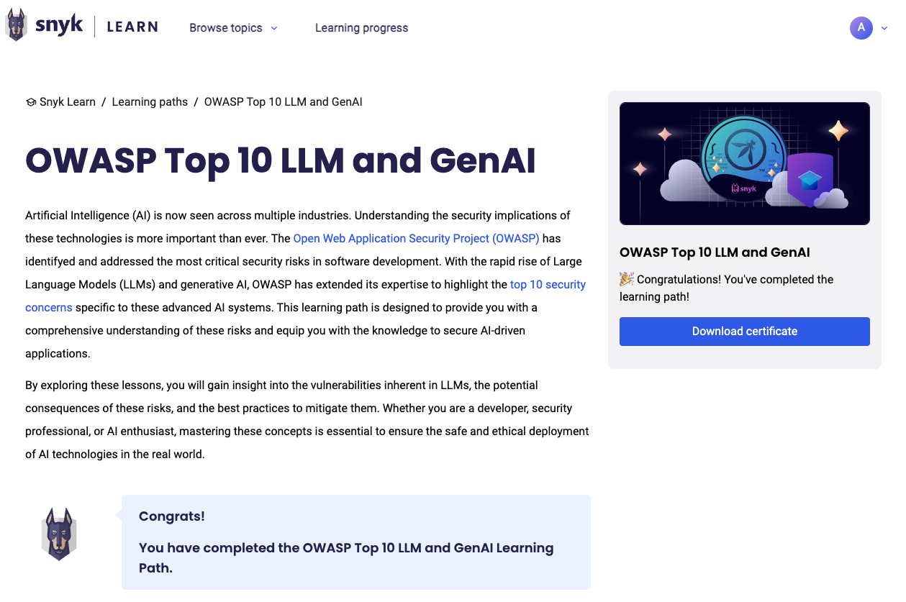

# Snyk Learn에서 CPE 학점 청구하기

Snyk Learn은 애플리케이션 보안 기술을 향상시키기 위해 설계된 다양한 보안 교육 레슨과 학습 경로를 제공합니다. 이러한 레슨들은 가치 있는 지식을 제공하지만, 자동으로 지속 교육(CPE) 학점을 부여하지는 않습니다. Snyk Learn 레슨 및 학습 경로에 참여한 것을 바탕으로 CPE 학점을 청구하려면 다음 단계를 따르세요.&#x20;


CPE 학점 청구 과정은 인증 기관에 따라 다를 수 있습니다.


1. Snyk Learn 모듈 완료하기.
   1. Snyk Learn 계정에 로그인하고 레슨이나 학습 경로를 완료합니다.
   2. 퀴즈 통과 및 인터랙티브 콘텐츠 활용 등 완료 기준을 충족하는지 확인합니다.
2. 학습 활동 기록하기. 완료한 모듈의 중요한 세부 정보를 기록합니다. 이에는 다음이 포함됩니다:
   * 코스 제목
   * 제공자 이름: Snyk
   * 완료 날짜
   * 기간: 모듈에 소요된 시간
3. 인증 기관에 제출하기.
   1. ISC2나 ISACA와 같은 인증 기관의 CPE 제출 포털에 액세스합니다.
   2. 기록된 세부 정보를 입력하고 완료증(학습 경로에 대해서는 제공 가능) 또는 학습 진행 대시보드 또는 레슨 페이지에서 완료된 레슨의 스크린샷과 같은 필수 문서를 제공합니다. 아래 예시 참조.
4. 요청 시 추가 정보 제공하기. CPE 청구를 확인하기 위해 인증 기관에서 추가 세부 정보를 요청할 수 있습니다.

### 예시

#### 학습 경로 완료증

완료한 학습 경로 페이지로 이동하고 **인증서 다운로드** 버튼을 클릭합니다.

<figure><figcaption>
인증서가 포함된 완료한 학습 경로
</figcaption></figure>

#### 레슨 완료 예시

<figure><figcaption></figcaption></figure>

### 도움이 필요한가요?

완료 인증서나 CPE 학점 청구에 관한 질문이 있으면 도움을 받기 위해 Snyk 지원팀에 문의하세요.