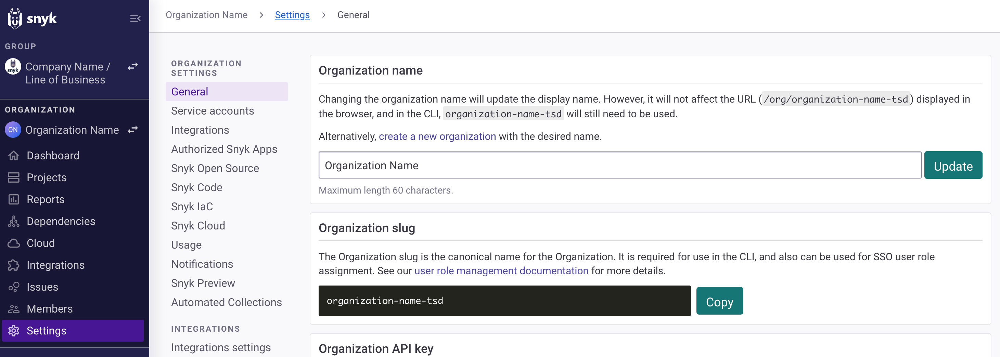

# Snyk 웹 UI 살펴보기

Snyk 웹 UI에서는 프로젝트를 관리하고 보안 취약점을 확인하고 해결하며 의존성을 모니터링하고 코드의 상태를 검토할 수 있습니다. 또한 계정 설정을 구성하고 API 및 인증 토큰을 관리하고 응용 프로그램을 허가하고 조직 환경 설정을 구성하며 이메일 알림을 사용자화할 수도 있습니다.

그룹 또는 조직 수준에서 정보를 시각화할 수 있습니다. 그룹 또는 조직의 이름을 클릭하여 보실 수 있습니다. 모든 수준 유형에 대한 보고서, 문제, 의존성, 구성원, 설정, 도움말 및 설정과 같은 일반 정보를 확인할 수 있습니다. 더 많은 정보는 [그룹 및 조직](../snyk-admin/groups-and-organizations/)을 참조하십시오.

## 그룹 수준

다음 Snyk 기능을 웹 UI에서 그룹 수준에서 사용할 수 있습니다:

* [선택한 그룹에 대한 이용 가능한 조직](snyk-web-ui.md#organizations-available-for-the-selected-group)
* [자산 대시보드 보기](snyk-web-ui.md#view-the-assets-dashboard)
* [자산 목록 보기 및 관리](snyk-web-ui.md#view-and-manage-your-assets-inventory)
* [정책 관리 및 사용자 정의](snyk-web-ui.md#manage-and-customize-your-policies)
* [자산 발견, 자산 보호 및 제3자 공급 업체에서의 문제 관리를 위한 통합 관리](snyk-web-ui.md#manage-integrations-for-asset-discovery-asset-coverage-and-issues-from-third-party-vendors)

다음 비디오는 Snyk 웹 UI에서 Snyk AppRisk 필수 기능을 개요로 제공합니다.


비디오가 마음에 드셨다면, [Snyk Learn](https://learn.snyk.io/lesson/snyk-apprisk-essentials/)에서 나머지 코스를 확인해보세요!


### 선택한 그룹에 대한 이용 가능한 조직

그룹 수준으로 이동하고 조직 페이지를 선택하면 해당 그룹에서 액세스할 수 있는 모든 조직과 각 사용 가능한 조직의 조직 역할을 볼 수 있습니다.

### 자산 대시보드 보기


자산 대시보드는 Snyk AppRisk 필수 사용자만 이용할 수 있습니다. Snyk AppRisk Pro를 사용하는 경우 [애플리케이션 분석](../manage-risk/enterprise-analytics/application-analytics.md)을 확인하세요.


Snyk AppRisk 자산 대시보드 보고 페이지는 귀하의 애플리케이션과 관련된 보안 제어물에 대한 포괄적인 개요를 제공합니다. 이 페이지에는 스캔 커버리지와 자산 클래스, 소스 등과 관련된 자세한 인벤토리 세분화를 포함한 귀하의 자산에 대한 중요한 지표와 데이터가 표시됩니다. 또한 이 대시보드에는 특정 애플리케이션 및 소유자에 기반한 결과를 필터링하기 위한 광범위한 글로벌 필터링 옵션이 포함되어 있습니다.

자세한 내용은 [자산 대시보드](../manage-issues/reporting/available-snyk-reports.md#asset-dashboard) 문서 섹션을 참조하십시오.

### 자산 목록 보기 및 관리


인벤토리는 Snyk AppRisk 사용자만 이용할 수 있습니다.


[인벤토리](../manage-assets/)는 Snyk AppRisk를 사용하는 경우에만 사용할 수 있습니다. **인벤토리** 페이지를 사용하여 저장소 자산을 구성하고 SCM 도구에서 모든 저장소 자산을 시각화하고 Snyk 제품 제어 커버리지를 추적하고 업무 영향에 따라 커버리지 완화를 우선순위를 지정할 수 있습니다.

인벤토리의 각 행은 저장소 자산이거나 식별 정보가 부족한 것으로 파악된 Snyk 스캔 아티팩트를 나타냅니다. 스캔된 아티팩트는 정책을 통해서는 지원되지 않습니다.

### 정책 관리 및 사용자 정의


정책은 Snyk AppRisk 사용자만 이용할 수 있습니다.


비즈니스 컨텍스트를 자동화하고 알림을 받는 프로세스에 대한 자세한 내용은 [정책](../manage-risk/policies/assets-policies/)을 참조하십시오.

### 자산 발견, 자산 보호 및 제3자 공급 업체에서의 문제 관리를 위한 통합 관리


그룹 수준의 통합은 Snyk AppRisk 사용자만 사용할 수 있습니다.


**통합** 페이지에는 활성 통합, [SCM](../scm-ide-and-ci-cd-integrations/snyk-scm-integrations/#group-level-snyk-apprisk-scm-integrations) 또는 [제3자](../integrate-with-snyk/#integrations-for-snyk-apprisk)를 포함하여 기존 Snyk 조직에서 자동으로 동기화된 데이터를 표시하고 통합 허브에 액세스를 제공합니다. **통합 허브** 버튼을 사용하여 SCM 통합을 추가하거나 제3자 통합을 연결하거나 SCM 통합에 앱 컨텍스트를 추가하거나 Snyk 런타임 센서를 사용할 수 있습니다.

Snyk 웹 UI **통합** 페이지에서 모든 통합의 개요를 찾을 수 있습니다. 통합을 활성화하거나 비활성화하거나 수정하거나 구성에서 제거할 수 있습니다.

자세한 통합에 대한 내용은 [Snyk AppRisk SCM 통합](../scm-ide-and-ci-cd-integrations/snyk-scm-integrations/#group-level-snyk-apprisk-scm-integrations) 및 [Snyk와 통합](../integrate-with-snyk/#integrations-for-snyk-apprisk)을 참조하십시오.

### 통합 활성화 또는 비활성화

통합을 연결하거나 일시 중지할 수 있습니다. 통합을 활성화하거나 비활성화하려면 재생 또는 일시 중지를 클릭하십시오.

### 새 프로필 추가

각 통합에는 하나 이상의 프로필에서 실행할 수 있도록 구성할 수 있습니다. 동일 소스 내에서 여러 인스턴스에서 데이터를 가져올 때 유용합니다.

새 프로필을 추가하려면:

1. 기존 통합 프로필에서 **설정** 아이콘을 클릭하십시오.
2. **프로필 추가**를 클릭하십시오.
3. 구성 필드를 작성하고 **완료**를 클릭하십시오.

### 통합 편집

기존 통합을 편집하려면 통합 카드에서 **설정**을 클릭한 다음 해당 통합을 추가한 조직에서 다시 **설정**을 클릭하십시오.

<figure><figcaption>
통합 허브에서 기존 통합 편집
</figcaption></figure>


보안상의 이유로 기존 통합의 설정을 열 때 모든 자격 증명은 익명화됩니다.


### 통합 제거

환경에서 기존 통합을 제거하려면 통합을 선택하고 **삭제**를 클릭하십시오.


이미 삭제된 통합을 복원할 수 없습니다. 다시 활성화해야 합니다.


## 조직 수준

다음 Snyk 기능은 웹 UI에서 조직 수준에서 사용할 수 있습니다:

* [대시보드 탐색](snyk-web-ui.md#explore-the-dashboard)
* [프로젝트 관리](snyk-web-ui.md#manage-your-projects)
* [보고서 보기](snyk-web-ui.md#view-reports)
* [의존성 및 라이선스 보기](snyk-web-ui.md#view-dependencies-and-licenses)
* [통합 관리](snyk-web-ui.md#manage-your-integrations)
* [문제 보기 및 우선순위 지정](snyk-web-ui.md#view-and-prioritize-issues)
* [조직 또는 그룹 구성원 관리](snyk-web-ui.md#manage-organization-or-group-members)
* [Snyk 조직 및 그룹 설정 구성](snyk-web-ui.md#snyk-organization-or-group-settings)
* [도움이 되는 자료 보기](snyk-web-ui.md#view-helpful-resources)
* [계정 환경 설정 및 관리](snyk-web-ui.md#manage-account-preferences-and-settings)


[Snyk CLI](../snyk-cli/), [IDE](../scm-ide-and-ci-cd-integrations/snyk-ide-plugins-and-extensions/) 및 [API](../snyk-api/)를 통해도 Snyk 기능을 사용할 수 있습니다.


### 대시보드 탐색

기존 계정에 로그인하고 조직을 선택하면 웹 UI에서 해당 조직에 대한 대시보드가 열립니다. 아래 작업을 확인할 수 있고, 보류 중인 상위 작업 및 취약한 프로젝트를 볼 수 있으며 새 프로젝트를 추가할 수 있습니다.

### 상위 작업

**보류 중인 작업** 섹션은 Snyk 조직의 프로젝트에 대한 다음 작업을 보여줍니다.

### 프로젝트 보기

대시보드의 프로젝트 링크를 사용하여 대시보드에서 대상 파일에 대한 메타데이터, 재테스트 및 수정 옵션을 탐색하고 관리할 수 있습니다. 각 링크는 프로젝트 개요를 열며 **히스토리** 및 **설정** 탭으로 전환할 수 있는 프로젝트 상세 페이지를 엽니다.

자세한 내용은 [Snyk 프로젝트](../snyk-admin/snyk-projects/)를 참조하십시오.

### 취약점 수정

Snyk은 가장 취약한 프로젝트에서 Pull Requests(PR)를 추적하고 플래그를 지정합니다. 다음을 포함합니다:

* 가장 취약한 프로젝트의 취약점을 수정하기 위한 PR.
* 이미 생성된 PR 또는 Snyk을 통해 생성된 오픈 및 검토 대기 중인 PR.

**취약점 수정** 링크가 있는 프로젝트에 대해서는 링크를 사용하여 프로젝트 세부 정보를 확인하고 수정 PR을 열 수 있습니다. 자세한 내용은 [Snyk Pull 또는 Merge Requests 고치기](../scan-with-snyk/pull-requests/snyk-pull-or-merge-requests/)를 참조하십시오.


Snyk은 GitHub, GitHub Enterprise 및 Bitbucket Cloud에서만 PR을 추적하고 플래그를 지정하며, 가장 취약한 프로젝트에 대해만 이 작업을 수행합니다. 다른 SCM을 사용하는 경우 **보류 중인 작업** 섹션에는 제기될 수 있는 PR이 표시되지만 이미 제기된 PR은 표시되지 않습니다.


### 가장 취약한 프로젝트

**가장 취약한 프로젝트** 섹션은 가장 취약한 Snyk 프로젝트를 표시하며 **보류 중인 작업** 섹션과 유사한 기능을 제공합니다.

### 프로젝트 추가

Snyk 프로젝트를 추가하려면 대시보드의 **프로젝트 추가** 링크를 사용하십시오. 드롭다운에서 프로젝트를 추가하는 방법을 선택합니다. 자세한 내용은 [프로젝트 추가](./#import-a-project-to-scan-and-identify-issues)를 참조하십시오.

### **프로젝트 관리**

사이드 메뉴에서 **프로젝트** 링크를 선택하여 **프로젝트** 목록 페이지를 열 수 있습니다. 이 페이지에서 여러 작업을 수행할 수 있습니다:

* 프로젝트 추가. **프로젝트 추가** 드롭다운에서 프로젝트를 추가하는 방법을 선택합니다.
* 프로젝트를 필터링하고 그룹화하고 정렬합니다.
* 프로젝트에 대한 팁 및 최신 가져오기 로그를 확인합니다.
* 각 프로젝트에 대한 링크를 선택하여 프로젝트 세부 정보 페이지를 열고 요약 및 문제 정보를 볼 수 있습니다.
* 대상이 그룹화된 경우 사용자 정의 위치에서 대상 추가 아이콘을 사용합니다. 이를 통해 목록의 다른 대상에 대한 프로젝트를 그룹화할 수 있습니다.
* 그룹화되지 않은 **프로젝트** 목록의 설정 아이콘 또는 프로젝트 세부 정보 페이지의 **설정** 탭을 사용하여 알림, 프로젝트 테스트 및 풀 리퀘스트(PR) 빈도에 대한 일반 및 GitHub 통합 설정을 구성합니다. 설정 탭에서 프로젝트ID를 찾거나 프로젝트를 비활성화하거나 삭제할 수 있습니다.
* **이력** 탭에서 프로젝트 이력을 확인할 수 있습니다.

### **통합 관리**

다음의 Snyk 기능은 모든 수준 유형에 대해 웹 UI에서 사용할 수 있습니다:

* [보고서 보기](snyk-web-ui.md#view-reports)
* [문제 보기 및 우선순위 지정](snyk-web-ui.md#view-and-prioritize-issues)
* [종속성 및 라이센스 보기](snyk-web-ui.md#view-dependencies-and-licenses)
* [조직 또는 그룹 구성원 관리](snyk-web-ui.md#manage-organization-or-group-members)
* [Snyk 조직 또는 그룹 설정 보기 및 관리](snyk-web-ui.md#snyk-organization-or-group-settings)
* [유용한 리소스 보기](snyk-web-ui.md#view-helpful-resources)
* [계정 설정 및 기본 설정 관리](snyk-web-ui.md#manage-account-preferences-and-settings)

### **보고서 보기**


**기능 사용 가능 여부**\
보고서는 엔터프라이즈 플랜에서만 사용할 수 있습니다. 자세한 내용은 [플랜 및 가격](https://snyk.io/plans/)을 참조하세요.


[보고서](../manage-issues/reporting/)를 통해 모든 프로젝트의 상태, 취약점 및 라이센스 문제에 대한 가시성과 통찰력을 얻을 수 있습니다. 도구 설명 인터페이스에서 보고서에 대한 정보는 툴팁을 통해 자세히 정의되어 있습니다.

보고서 페이지에는 그룹 및 조직 수준에서 사용 가능한 모든 보고서 유형이 포함되어 있습니다. 규칙의 예외는 자산 대시보드 보고서로, 이 보고서는 그룹 수준에서만 사용할 수 있습니다.

### 문제 보기 및 우선순위 지정


문제는 Snyk AppRisk Pro 사용자만 사용할 수 있습니다.


[문제 페이지](../manage-risk/prioritize-issues-for-fixing/prioritization-for-snyk-apprisk.md)는 Snyk에서 식별한 모든 문제에 대한 중앙 집중식 보기와 추가 자산 컨텍스트를 제공합니다. 이는 귀하와 귀하의 팀이 문제를 더 잘 분류하고 해결할 수 있도록 돕습니다.

보고서 페이지는 그룹 및 조직 수준에서 모두 사용할 수 있습니다.

### 종속성 및 라이센스 보기

귀하는 **종속성** 옵션을 사용하여 조직 또는 그룹 내 모든 프로젝트에 대한 [종속성](https://docs.snyk.io/manage-risk/reporting/dependencies-and-licenses/view-dependencies) 및 [라이센스 정보](https://docs.snyk.io/manage-risk/reporting/dependencies-and-licenses/view-licenses)를 볼 수 있습니다.

### 조직 또는 그룹 구성원 관리

대시보드의 내비게이션에서 **구성원**을 선택하여 Snyk [조직](../snyk-admin/groups-and-organizations/organizations/manage-users-in-organizations.md) 또는 [그룹](../snyk-admin/groups-and-organizations/groups/manage-users-in-a-group.md) 내에서 사용자, 역할 및 사용자 인증 방법을 보고 관리합니다.

구성원 페이지는 그룹 및 조직 수준에서 모두 사용할 수 있습니다.


**구성원** 탭에서 변경을 하려면 [필수 관리자 역할 및 권한](../snyk-admin/user-roles/pre-defined-roles.md)을 할당받아야 합니다.


### Snyk 조직 또는 그룹 설정

**설정** 옵션을 사용하여 조직 또는 그룹 설정을 보고 관리합니다. 자세한 내용은 [그룹 및 조직 설정](../snyk-admin/groups-and-organizations/group-and-organization-settings.md)을 참조하세요.

<figure><figcaption>
그룹 및 조직 설정
</figcaption></figure>

### 유용한 리소스 보기

대시보드 내비게이션에서 **도움말**을 선택한 후, Snyk에 관한 정보를 제공하는 리소스를 보기 위해 옵션을 선택합니다.

**도움말** > **제품 업데이트** 메뉴 옵션을 선택하여 [snyk.io 업데이트](https://updates.snyk.io/)를 방문합니다.

### 계정 기본 설정 및 관리

대시보드 내비게이션에서 **이름**을 선택하고 **계정 설정**을 선택하여 [계정 설정](https://app.snyk.io/account) 페이지를 열어 사용자 계정 설정을 보고 구성합니다. 여기에서 다음을 관리할 수 있습니다:

* API 토큰 또는 무료 계정의 인증 토큰 보기 및 관리. 자세한 내용은 [Snyk API 토큰 얻기 및 인증](./#obtain-and-use-your-snyk-api-token)을 참조하세요.
* **인증된 애플리케이션** 목록 보기.
* 선호하는 조직 설정. [조직 관리: 선호하는 조직 설정](../snyk-admin/groups-and-organizations/organizations/create-and-delete-organizations.md#set-your-preferred-organization) 참조.
* 계정 삭제.
* 이메일 **알림**을 위한 계정 설정 관리 (왼쪽 내비게이션의 링크 포함). 여기에는 문제 이메일 알림, 주간 보고서 이메일, 사용 알림, 보고서가 사용 가능할 때의 이메일 알림, 세일즈 및 마케팅 커뮤니케이션을 위한 이메일 알림 선호도가 포함됩니다. 자세한 내용은 [알림 관리](../snyk-admin/manage-notifications.md)를 참조하세요.
* **친구와 공유**를 위한 추천 링크 얻기. 링크는 계정 설정의 왼쪽 내비게이션에 있습니다.
