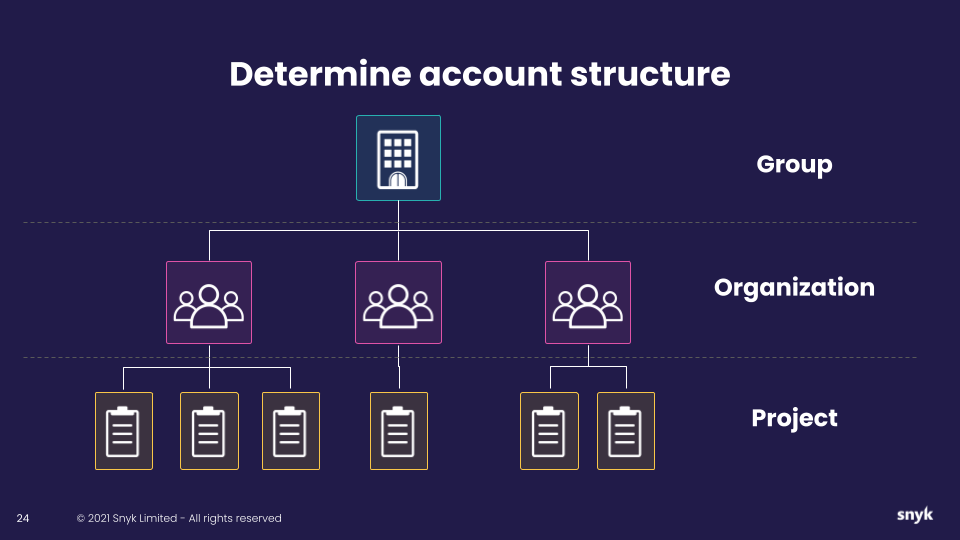

# 조직 이름 지정

조직은 스캔, 설정 통합 및 결과 확인을 포함합니다.

* 그룹은 기업 플랜에서만 사용 가능하며 일반적으로 회사 또는 사업 라인 이름으로 명명됩니다.
* 팀 플랜의 조직은 최상위 레벨이며 일반적으로 회사 이름 또는 해당 회사의 조직에 지정된 이름으로 명명됩니다.


팀 플랜에는 사용할 수 있는 라이선스가 있는 조직이 하나 포함되어 있습니다.


첫 번째 단계는 Snyk 및 다른 사용자가 참조할 때 사용할 조직 이름을 설정하는 것입니다.

## 구조 소개

<figure><figcaption>
회사 계정 구조 결정
</figcaption></figure>

Snyk는 자산, 액세스 및 롤업 보고를 관리하기 위해 계층적 접근 방식을 사용합니다.

* **Snyk 그룹 -** Snyk 엔터프라이즈 고객 전용. 이는 조직을 그룹화하는 데 사용되는 최상위 엔티티입니다.
*   **Snyk 조직**: 그룹 레벨 아래에 있으며 일반적으로 다음을 나타냅니다:

    * 사업 라인
    * Git 조직 또는 팀 구조
    * 응용 프로그램 유형
    * 개발팀.

    Snyk 팀 또는 무료 플랜의 경우, 하나의 조직을 사용할 수 있습니다. 일반적으로 회사 이름을 사용하거나, 회사에서 팀 플랜을 사용하는 여러 다른 팀이 있는 경우 회사 이름과 팀 이름 또는 사업 라인을 사용합니다. 예를 들어 "회사 - 팀 이름"
* **Snyk 프로젝트:** Snyk에서 테스트/모니터링한 대상, 즉 CLI 스캔, 레지스트리에서 모니터링 중인 컨테이너 또는 식별된 오픈 소스 파일과 같은 것입니다.

더 자세한 내용은 [그룹 및 조직 관리](../../../snyk-admin/groups-and-organizations/)를 참조하십시오.


수백 개 또는 수천 개의 리포지토리가 있다면 액세스 제한, 별도 보고서 및 상호 작용할 관리 가능한 목록을 위해 다중 조직에 액세스할 수 있는 Snyk 엔터프라이즈 플랜을 고려하십시오.

