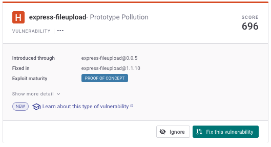
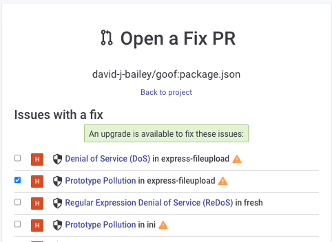

# 첫 번째 취약점 해결하기


**요약**\
당신은 [Snyk 프로젝트를 확인](view-your-first-snyk-projects.md)하고 [그들의 취약점을 이해](understand-your-vulnerabilities.md)했습니다.


이제 이러한 취약점을 해결할 수 있습니다.

## 어떻게 문제를 해결할 수 있나요?

Snyk 프로젝트 파일을 열면, 이 프로젝트에서 Snyk가 발견한 문제 목록을 볼 수 있으며, 각 문제를 Snyk 및 다른 정보원을 사용하여 조사할 수 있습니다.

다음과 같은 각 취약점에 대해 다양한 조치가 가능합니다:

- 즉시 취약점 해결을 위해 Fix PR을 제기하여 취약점을 수정하십시오. ["Fix this vulnerability" 기능](fix-your-first-vulnerability.md#fix-this-vulnerability-function)을 참조하십시오.
- 취약점을 무시하거나 일시적으로 무시하십시오. [취약점 무시](fix-your-first-vulnerability.md#ignore-the-vulnerability)를 참조하십시오.
- 취약점을 조사하고 수정할 수 있도록 할당하십시오 ([수정 작업 할당](assign-fix-work.md) 및 [첫 번째 취약점 해결 - 심층 탐구](fix-your-first-vulnerability-deeper-dive.md)를 참조하십시오)


Snyk 수정 기능의 사용 가능 여부는 취약점과 스캔 유형에 따라 달라집니다.


### 이 취약점 수정 함수


**알림**\
이 예제에서 GitHub를 사용합니다. 대부분의 다른 지원되는 Git 코드 저장소 통합은 유사한 방식으로 작동합니다. 세부 사항은 [Git 저장소 통합 (SCM)](../../scm-ide-and-ci-cd-integrations/snyk-scm-integrations/)을 참조하십시오.


오픈 소스 라이브러리의 취약점에 대해, Snyk는 의존 라이브러리를 최신 버전으로 업그레이드하는 Pull Request (PR)를 생성할 수 있는 옵션을 제공합니다. 이 **업그레이드 PR**은 취약점을 수정하여 코드에서 제거합니다.

문제 카드에서 **취약점 수정** 버튼을 사용하여 이 기능에 액세스할 수 있습니다:

<figure><figcaption>
Fix this vulnerability를 클릭하여 PR 생성
</figcaption></figure>

그런 다음, Snyk은 취약점 선택을 확인하도록 안내합니다:

<figure><figcaption>
취약점에 대한 Fix PR 열기
</figcaption></figure>

기본적으로 PR이 선택되어 있지만, 원하는 경우 기타 라이브러리를 업그레이드하기 위해 PR을 제기할 수 있습니다.


이 모든 수정 목록은 혼란스러울 수 있습니다. 조사를 수행하고 이해한 취약점만 수정하기 원할 수 있습니다.


마지막으로, 그 화면 하단의 **Fix PR 열기**를 클릭하여 수정 PR을 생성하십시오:

<figure><figcaption>
취약점에 대한 수정 PR 생성
</figcaption></figure>

그런 다음, 이 변경 사항을 개발 프로세스에서 표준 코드 PR과 동일한 방식으로 관리할 수 있습니다.

### 추가 정보

- **Docs**: 자세한 내용은 [취약점 해결](https://docs.snyk.io/snyk-open-source/open-source-basics/fixing-vulnerabilities) 및 [문제 해결 및 우선 순위 지정](https://docs.snyk.io/fixing-and-prioritizing-issues)을 참조하십시오.
- **학습**: [Fix PRs](https://learn.snyk.io/lesson/fixing-issues)를 참조하십시오.

## 취약점 무시하기

Snyk는 코드에 영향을 미칠 수 없다고 생각하거나 오검출일 수 있다고 생각하는 경우와 같이 취약점을 일시적으로 또는 영구적으로 무시할 수 있는 옵션을 제공합니다. 취약점을 무시하면 해당 Snyk 프로젝트의 후속 스캔에 나타나지 않습니다.

취약점을 무시하려면, 문제 카드에서 **무시** 버튼을 클릭하십시오:

<figure><figcaption>
취약점을 무시하려면 무시를 클릭하세요
</figcaption></figure>

## 다른 유형의 스캔 문제 해결

이 예제에서는 오픈 소스 취약점을 수정하는 방법을 보여주었습니다. 스캔하는 항목에 따라, 다른 Snyk 제품을 사용하여 문제를 해결할 수 있습니다:

- Docker 파일과 같이 컨테이너에 내장된 스캔 항목의 경우, Snyk 웹 UI로부터 이미지를 분석하고 수정하는 방법은 [Snyk Web UI에서 컨테이너 이미지 분석 및 수정](../../scan-with-snyk/snyk-container/use-snyk-container/analyze-and-fix-container-images.md)을 참조하십시오.
- Kubernetes 배포 파일, terraform 및 기타 IaC 파일의 경우, [현재 IaC 시작하기](../../scan-with-snyk/snyk-iac/getting-started-with-current-iac.md)를 참조하십시오.
- 팀의 자체 코드를 스캔하려면 [수정 분석](../../scan-with-snyk/snyk-code/manage-code-vulnerabilities/breakdown-of-code-analysis.md#fix-analysis)을 참조하십시오.

## 추가 정보 및 다음 단계

수정할 문제를 결정하는 방법에 대한 정보는 문서의 [문제 무시](https://docs.snyk.io/features/fixing-and-prioritizing-issues/issue-management/ignore-issues) 및 [무시 전략](https://learn.snyk.io/lesson/ignoring-issues/) 교육 비디오를 참조하십시오.

이 페이지의 예제는 Snyk의 조언을 기반으로 의존성을 간단히 업그레이드하는 방법을 보여줍니다. 수정은 종종 이것보다 더 복잡할 수 있습니다.

계속하여 당신의 코드에서 취약점을 수정하는 것에 대해 [심층적으로 탐구](fix-your-first-vulnerability-deeper-dive.md)하십시오.