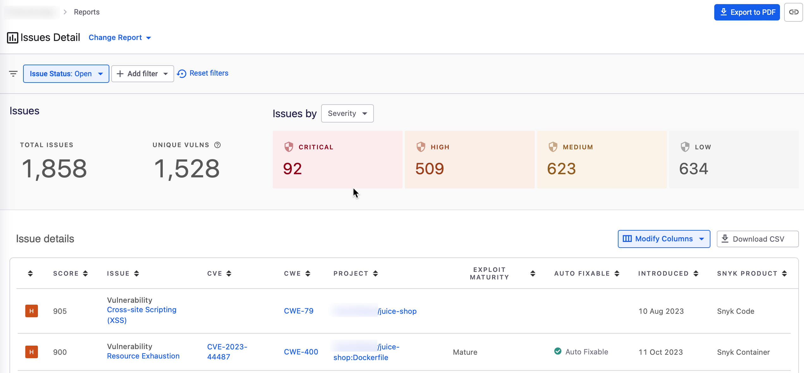

# 리스크 관리에 리포트 사용하기


**릴리스 상태**&#x20;

리포트는 엔터프라이즈 요금제에서만 사용 가능합니다.

[Snyk 요금제](https://snyk.io/plans)를 확인하세요.



**요약**\
Snyk 프로젝트 보기, Snyk 스캔 결과 이해, 취약점 해결 및 해결 작업을 개발 워크플로에 통합하는 방법을 확인했습니다.


Snyk 리포트는 개발 및 보안 간에 데이터 기반 대화를 이끌어내기 위해 필요한 가시성과 분석을 제공합니다.

사이드바 메뉴에서 **리포트**를 선택하여 리포트를 열 수 있습니다. 인터페이스 사용 및 결과 해석에 대한 지침은 [리포팅](../../manage-issues/reporting/)을 참조하세요. 데모를 보려면 Snyk Learn에서 제공하는 [리포팅 비디오](https://learn.snyk.io/lesson/snyk-reports/)를 확인하세요.

<figure><figcaption>
Snyk 프로젝트 취약점 개요 보고서
</figcaption></figure>

이로써 워크스루를 마칩니다.

더 많은 정보를 원하시면 [Snyk 문서](../../)를 참조하세요.