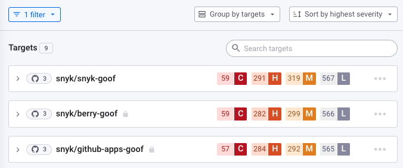

# 첫 번째 Snyk 프로젝트 보기

하나 이상의 프로젝트를 가져온 후에는 스캔 결과를 확인할 수 있습니다.


Snyk 웹 UI에서는 팀과 같은 조직에 특정한 정보를 볼 수 있습니다. 이는 회사와 같은 그룹 아래에 있다. 이로써 회사는 팀이 하는 작업에 대한 데이터를 조직화하고 수집할 수 있습니다. 자세한 내용은 [조직에서 사용자 관리](../../snyk-admin/groups-and-organizations/organizations/manage-users-in-organizations.md)를 참조하세요.


## 임포트 보기

Snyk 웹 UI에서 **프로젝트** 페이지로 이동하여 가져온 리포지토리나 비코드 정보를 가져오는 경우에 대한 대상(Targets)을 조사합니다. 아래는 예시입니다.

<figure><figcaption>
임포트된 대상 목록
</figcaption></figure>

각 항목마다 아이콘은 해당 항목 안의 Snyk 프로젝트 수와 프로젝트가 가져온 Git 기반 리포지토리를 보여줍니다.

## 비공개 대 공개 리포지토리: 잠금 기호

[GitHub 통합 설정을 할 때](../../scm-ide-and-ci-cd-integrations/snyk-scm-integrations/github.md), Snyk가 공용 및 비공개 리포지토리에 액세스할지 또는 공용 리포지토리에만 액세스할지 선택할 수 있습니다:

<figure><figcaption>
Snyk가 비공개 리포지토리에 액세스할지 설정
</figcaption></figure>

프로젝트를 가져올 때, 비공개 리포지토리는 가져온 스캔 세부 정보에서 잠금 기호로 식별됩니다:

<figure><figcaption>
잠금 기호가 있는 비공개 리포지토리
</figcaption></figure>

무료 플랜의 고객은 비공개 리포지토리 스캔이 테스트 횟수 한도에 포함됩니다.


일반적으로 팀 리더가 초기 통합 설정 및 프로젝트 임포트를 수행하며 개발자 개인이 그렇게 하는 것보다 자주입니다.


## 프로젝트 리스트 보기

항목을 열면 해당 항목에서 스캔된 다른 Snyk 프로젝트를 볼 수 있습니다.


**알림: 프로젝트란 무엇인가요?**\
Snyk 프로젝트는 Snyk가 스캔하는 항목을 말합니다. 예를 들어, 모든 오픈 소스 라이브러리를 종속성으로 나열하는 매니페스트 파일 등이 있습니다. [Snyk 프로젝트](../../snyk-admin/snyk-projects/)를 참조하세요.


아래는 예시입니다:

<figure><figcaption>
스캔된 프로젝트 목록
</figcaption></figure>

## 프로젝트 정보 이해하기

### 여기에 여러 항목이 있는 이유는 무엇인가요? 이게 무슨 의미이며 어떤 것을 사용해야 하나요?

처음 Snyk 프로젝트를 가져올 때 많은 정보가 표시됩니다. 정보를 살펴보면 어떻게 사용해야 하는지 알 수 있습니다.

응용 프로그램을 작성할 때 자체 코드를 작성하고 의존하는 오픈 소스 라이브러리를 가져와 모든 것을 배포를 위한 컨테이너로 빌드할 수 있습니다.

Snyk는 이 라이프사이클의 다른 부분을 스캔하며 해당 작업 부분에 대한 결과를 나타내는 다른 아이콘과 항목을 보여줍니다. 이 중요한 작업 부분에 대한 결과는 다음과 같습니다:

| 예시                                                                                                 | 설명                                                                                                                                                                     |
| ---------------------------------------------------------------------------------------------------- | -------------------------------------------------------------------------------------------------------------------------------------------------------------------------- |
|                            | [{Snyk Code}](../../scan-with-snyk/snyk-code/)에 의해 스캔된 자체 코드 분석 결과입니다.                                                                              |
|          | [Snyk Open Source}](../../scan-with-snyk/snyk-open-source/)에 의해 스캔된 오픈 소스 라이브러리, 각각의 manifest(**pom.xml**, **package.json**, 기타 라이브러리를 위한 기타 manifest 등)가 표시됩니다. |
|                            | [Snyk Container}](../../scan-with-snyk/snyk-container/)에 의해 스캔된 컨테이너 결과입니다. 도커 파일과 같이 컨테이너에 포함된 항목이 포함됩니다.               |
|                  | [Snyk Infrastructure as Code (IaC)](../../scan-with-snyk/snyk-iac/scan-your-iac-source-code/)에 의해 스캔된 쿠버네티스 배포 파일, 테라폼 및 기타 IaC 파일입니다.             |


다른 파일과 유형도 표시될 수 있습니다. 자세한 내용은 [프로젝트 정보 보기](../../snyk-admin/snyk-projects/project-information.md)를 참조하세요.


### 프로젝트 설정 보기

Snyk는 이 목록의 각 항목을 별도의 **프로젝트**로 다룹니다.

프로젝트의 설정을 제어할 수 있도록 프로젝트를 클릭하여 해당 프로젝트가 스캔되는 방식을 정의하는 톱니바퀴 아이콘을 클릭합니다:

<figure><figcaption>
프로젝트 설정 편집을 위해 톱니바퀴 아이콘 클릭
</figcaption></figure>

예를 들어, scan 주기를 변경하거나 기본적으로 얼마나 자주 스캔을 실행할지 설정할 수 있습니다. 자세한 내용은 [프로젝트 설정 보기](https://docs.snyk.io/introducing-snyk/introduction-to-snyk-projects/view-project-settings)를 참조하세요.

### 스캔 결과

스캔 결과를 다시 확인하세요:

<figure><figcaption>
프로젝트 스캔 결과
</figcaption></figure>

스캔은 응용 프로그램의 모든 측면에서 발견된 취약점을 보여줍니다. 물론, 이 목록의 각 항목에 대해 책임이 있는 것은 아니지만 전체 그림을 알고있는 것이 중요합니다.

Snyk 오픈 소스 스캔에서 오픈 소스 라이브러리에 취약점이 없는 것이 좋지만, 컨테이너 등 다른 스캔에서 식별된 문제가 여전히 많을 수 있습니다. 팀의 개발자가 이러한 문제를 생성하거나 관리하지 않았더라도, 그것들을 알아야 합니다.

## 더 많은 정보와 다음 단계

오픈 소스, 코드, 컨테이너, 인프라 파일 스캔 결과를 검토하는 데 대한 자세한 내용은 [Snyk UI 소개]https://learn.snyk.io/lesson/intro-to-snyk-ui/) 과정을 참조하세요.

이제 본인이 본 결과를 이해했으니 [취약점 이해](understand-your-vulnerabilities.md)해야합니다.