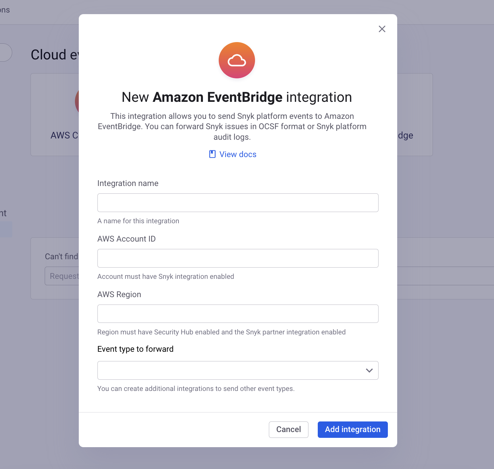
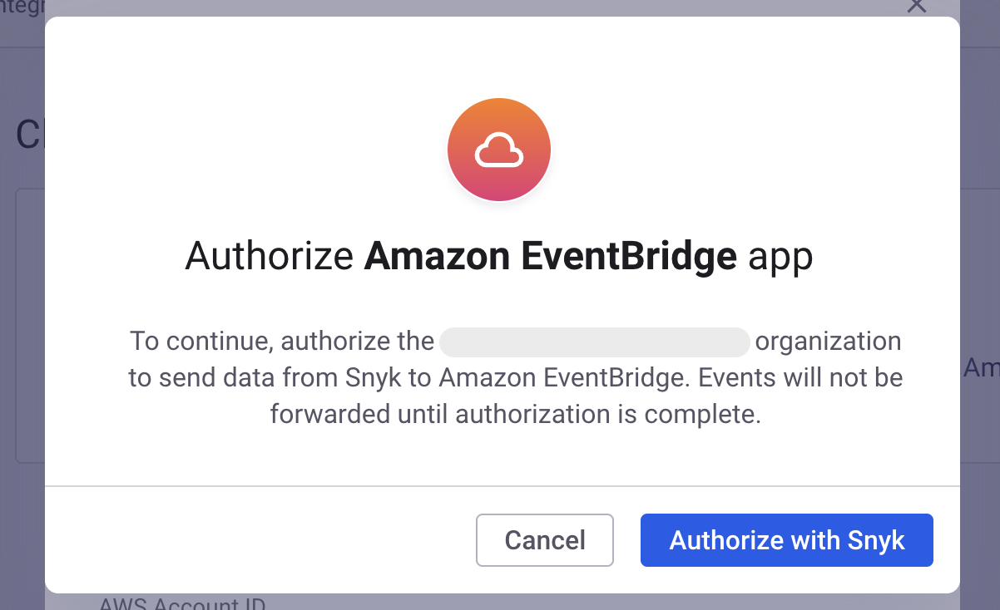
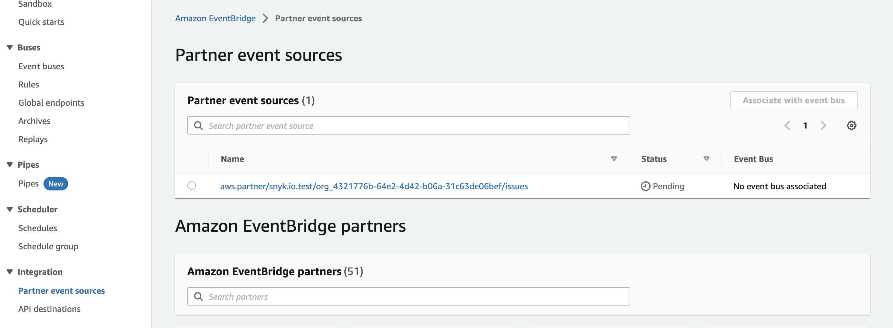
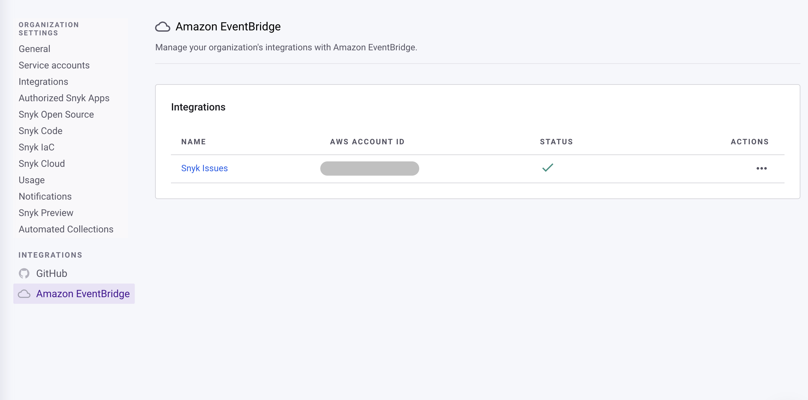
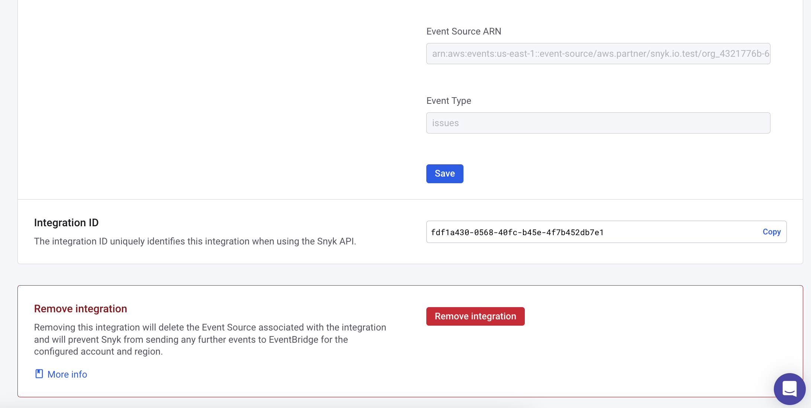

# 아마존 이벤트 브리지


**Snyk 앱으로 전환**

Snyk은 이벤트 포워딩 통합을 Snyk 앱 플랫폼을 사용하도록 전환하고 있습니다. 이 변경으로 현재 및 미래의 클라우드 이벤트 통합에 대한 새로운 기능과 향상된 보안이 가능해집니다.

전환 중에 기존 통합은 정상적으로 작동하며 고객들은 통합을 승인하여 Snyk 앱이 되면 계속 작동하도록 할 수 있습니다. 기존 통합을 승인하려면 다음 단계를 따라야 합니다:

1. 귀하의 조직의 **설정** 페이지로 이동합니다.
2. 승인하려는 통합의 설정 섹션으로 이동합니다 (예: Amazon EventBridge, AWS CloudTrail Lake, AWS Security Hub).
3. **앱 승인** 버튼을 클릭하고 앱 승인 흐름을 완료합니다.

전환 기간 종료 시 **승인되지 않은 통합은 더 이상 이벤트를 전달할 수 없게 되어 작동하지 않게 됩니다.**


[Amazon EventBridge](https://aws.amazon.com/eventbridge/) 통합은 Snyk 플랫폼 이벤트를 EventBridge로 보내어 Snyk 이벤트를 기존 AWS 환경에 통합할 수 있도록 합니다. 이 통합은 두 가지 유형의 이벤트를 보낼 수 있도록 구성될 수 있습니다:

* **Snyk 이슈 이벤트:** 이 이벤트는 Snyk 프로젝트에서 새로운 문제가 발견되거나 문제가 업데이트될 때 보내집니다. 각 이벤트에는 발견된 취약성이나 다른 문제에 대한 정보가 포함되며, 문제 해결이 가능한지 여부 등을 포함합니다.
* **Snyk 플랫폼 감사 이벤트:** 이 이벤트는 Snyk 사용자가 Snyk 플랫폼에서 작업을 수행할 때마다 보내집니다. 자세한 정보는 [감사 로그](https://docs.snyk.io/snyk-admin/manage-users-and-permissions/audit-logs)를 참조하십시오. 이 이벤트 유형은 Snyk 엔터프라이즈 플랜에서 사용할 수 있습니다. 상세 내용은 [가격 요금제](../../implement-snyk/enterprise-implementation-guide/trial-limitations.md)를 참조하십시오.

통합 설정을 위해 두 단계가 필요합니다:

1. Snyk 대시보드에서 EventBridge 통합을 구성합니다. 이렇게 하면 AWS 계정에 Snyk **파트너 이벤트 소스**가 생성되며, EventBridge 대시보드에서 확인할 수 있습니다.
2. Amazon EventBridge에서 Snyk 통합을 구성합니다. 이 단계는 첫 번째 단계에서 생성된 Snyk 이벤트 소스를 EventBridge **이벤트 버스**에 연결하는 것을 포함합니다.

이러한 단계를 완료하면 Snyk이 구성된 이벤트 버스로 즉시 이벤트를 보내기 시작합니다.

## Snyk 대시보드에서 EventBridge 구성

[Snyk 통합 페이지](https://app.snyk.io/integrations)로 이동하여 **EventBridge**를 검색하거나 **Cloud events** 섹션으로 이동합니다. **EventBridge** 타일을 클릭하여 새 통합을 생성할 수 있습니다.

<figure><figcaption>
새 EventBridge 통합 만들기
</figcaption></figure>

이 통합에 대한 **이름**을 입력하고 이벤트를 받을 **AWS 계정 ID** 및 **AWS 리전**을 선택하세요. 그런 다음 이 통합으로 전달하려는 **이벤트 유형**을 선택하세요. 동일한 계정/리전으로 둘 이상의 이벤트 유형을 보내려면 각 이벤트 유형에 대해 별도의 통합을 생성하세요.

<figure><figcaption>
통합 세부 정보 입력
</figcaption></figure>

양식 작성이 완료되면 **통합 추가**를 클릭하세요. 이 단계가 완료되면 Amazon EventBridge 콘솔에서 통합 설정을 완료해야 합니다.

## Snyk 앱 승인

조직에 대해 처음으로 Amazon EventBridge 통합을 설정하는 경우, Snyk 앱 승인 흐름을 완료하라는 안내가 표시됩니다.

<figure><figcaption></figcaption></figure>

승인 흐름을 완료한 후에는 해당 통합의 설정 페이지로 리디렉션됩니다.

## Amazon EventBridge에서 통합 구성

Snyk 측 EventBridge 통합을 구성한 후, EventBridge 콘솔에 새 **파트너 이벤트 소스**가 표시됩니다. EventBridge 콘솔로 이동하여 **파트너 이벤트 소스** 페이지로 이동합니다.

<figure><figcaption>
파트너 이벤트 소스
</figcaption></figure>

Snyk에서 생성된 이벤트 소스는 다음과 같은 패턴을 가집니다: `aws.partner/snyk.io/org_<SNYK_ORG_ID>/<EVENT_TYPE>`

이벤트 소스 이름을 클릭한 후 **이벤트 버스와 연결**을 클릭하고 이벤트 소스를 이벤트 버스에 연결하기 위해 안내에 따릅니다. 이벤트 소스가 이벤트 버스에 연결되면 Snyk이 즉시 이벤트를 전송하며 EventBridge에서 지원하는 모든 작업에 사용할 수 있습니다.

## EventBridge 통합 관리 및 삭제

Snyk 대시보드의 [EventBridge 통합 설정 페이지](https://app.snyk.io/manage/integrations/aws-eventbridge)로 이동하여 관리하려는 통합의 이름을 클릭하세요.

<figure><figcaption>
Amazon EventBridge 통합 선택
</figcaption></figure>

통합의 이름을 클릭하면 통합 설정 페이지가 열리며, 통합에 대한 구성 정보가 표시됩니다.


EventBridge 통합은 구성된 AWS 계정 ID, 리전 및 이벤트 유형에 따라 외부 리소스를 생성하므로 이러한 구성 필드를 편집할 수 없습니다. 이러한 필드 중 하나를 변경해야 하는 경우 통합을 삭제하고 새 통합을 생성해야 합니다. 이렇게 하면 AWS에서 기존 **파트너 이벤트 소스**가 삭제되고 새로운 소스가 생성되며, 앞에서 설명한대로 **이벤트 버스**와 연결해야 합니다.


통합을 삭제하려면 페이지 맨 아래로 스크롤하여 **통합 제거** 버튼을 클릭하고 삭제를 확인하세요.

<figure><figcaption>
통합 제거
</figcaption></figure>

이로써 Snyk 측의 통합 구성 및 AWS에서 이 통합과 관련된 **파트너 이벤트 소스**가 삭제됩니다. 이벤트 소스가 삭제되었는지 EventBridge 콘솔에서 확인할 수 있습니다.

## 이벤트 데이터 이해

### Snyk 이슈 이벤트

이 이벤트 유형에는 Snyk 이슈에 대한 핵심 데이터가 포함되며 다음을 포함합니다:

* 취약성 유형 및 CVE 식별자
* 문제 심각도
* 문제 해결이 가능한지 여부

이벤트는 [Open Cybersecurity Schema Framework _finding_](https://schema.ocsf.io/1.0.0-rc.2/classes/security_finding?extensions=) 스키마를 사용하여 JSON 형식으로 작성됩니다.


모든 Snyk 이슈 데이터가 이러한 이벤트에 포함되는 것은 아니지만, Snyk는 계속해서 더 완전한 이벤트 데이터를 제공하기 위해 노력하고 있습니다.


### Snyk 감사 이벤트

이 이벤트 유형은 Snyk 엔터프라이즈 플랜에서 사용할 수 있습니다. 자세한 내용은 [요금제 및 가격](https://snyk.io/plans/)을 참조하세요.
