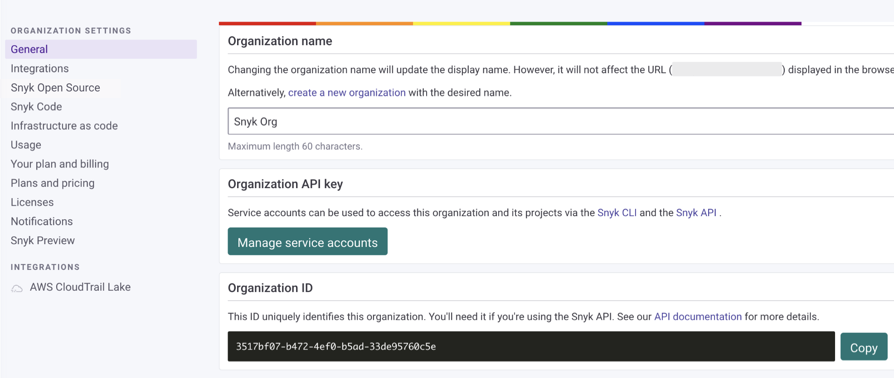
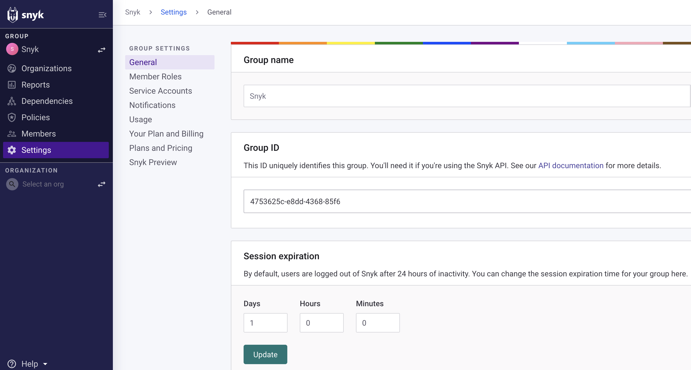
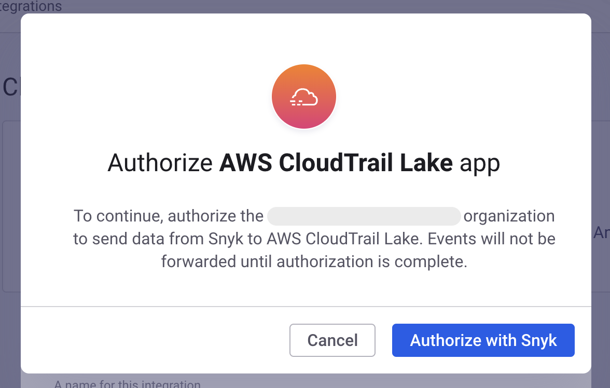

# AWS CloudTrail Lake


**Snyk 앱으로의 전환**

Snyk는 이벤트 전송 통합을 Snyk 앱 플랫폼을 사용하도록 전환하고 있습니다. 이 변경은 현재 및 미래의 클라우드 이벤트 통합에 대한 새로운 기능과 강화된 보안을 제공할 것입니다.

전환 중에 기존 통합은 정상적으로 계속 작동하며 고객은 통합을 승인하여 Snyk 앱이 되면 계속 작동하도록 할 수 있습니다. 기존 통합을 인증하려면 다음 단계를 따르십시오:

1. 귀하의 조직의 **설정** 페이지로 이동
2. 승인하려는 통합의 설정 섹션으로 이동 (예: Amazon EventBridge, AWS CloudTrail Lake, AWS Security Hub)
3. **앱 승인** 버튼을 클릭하고 앱 승인 흐름을 완료하십시오

전환 기간이 종료되면 **승인되지 않은 통합은 더 이상 이벤트를 전달할 수 없으며 작동이 중지될 것입니다.**



**기능 가용성**\
AWS CloudTrail Lake 통합은 Snyk 엔터프라이즈 요금제에서만 이용 가능합니다. 자세한 정보는[요금제 및 가격](https://snyk.io/plans/)을 참조하십시오.


AWS CloudTrail Lake 통합을 통해 [Snyk 감사 로그](../../snyk-admin/user-management-with-the-api/retrieve-audit-logs-of-user-initiated-activity-by-api-for-an-org-or-group.md)를 AWS CloudTrail Lake로 전달하여 로그에서 SQL 기반 쿼리를 실행하고 최대 일곱(7) 년간 보관할 수 있습니다.

이 통합은 **단일 Snyk 조직** 또는 **Snyk 그룹 및 해당 모든 하위 조직**에 대한 감사 로그를 전달할 수 있습니다. 양쪽 모두 설정하려면 두 단계가 필요합니다:

1. AWS CloudTrail Lake에서 Snyk 통합 추가
2. Snyk에서 통합 구성


이 통합은 활성화하면 로그를 전송하기 시작합니다. 통합을 활성화하기 전에 생성된 로그는 전송되지 않지만, [조직 감사 로그 검색](../../snyk-api/reference/audit-logs.md#orgs-org_id-audit_logs-search) API 엔드포인트에서 확인할 수 있습니다.


## 그룹 수준 대 조직 수준 감사 로그

Snyk 사용자가 Snyk 플랫폼에서 작업을 수행할 때(예: 설정 변경, 사용자 추가, 보호된 API에 액세스), 감사 로그가 기록됩니다. 이 통합을 설정할 때, 고객의 Snyk 계정 설정에 따라 어떻게 감사 로그가 캡처되는지 이해하는 것이 중요합니다.

* 단일 Snyk 조직(또는 여러 연결되지 않은 조직을 사용하는 고객)을 사용하는 고객의 경우 모든 감사 로그가 단일 조직의 범위 내에서 캡처됩니다.
* Snyk 그룹과 하위 조직을 가진 고객의 경우, 그룹에 새로운 조직을 추가하거나 그룹에 사용자를 추가하는 작업은 보통 조직과 관련이 없으며 그룹 수준에서 감사됩니다.

이 통합은 두 가지 사용 사례를 지원합니다:

1. CloudTrail Lake를 **단일 Snyk 조직**에 통합
   1. 해당 조직과 직접 관련된 모든 감사 로그가 CloudTrail Lake로 전송됩니다.
   2. 조직에 상위 그룹이 있는 경우 해당 그룹에서 수행하는 작업은 **CloudTrail Lake로 전송되지 않습니다**.
   3. 다른 조직과 그룹의 멤버인 조직 멤버가 수행한 작업은 조직과 직접 관련되어 있을 때에만 CloudTrail Lake로 전송됩니다.
2. CloudTrail Lake를 **Snyk 그룹 및 해당 모든 하위 조직**과 통합
   1. 그룹 또는 해당 모든 하위 조직과 관련된 모든 감사 로그가 CloudTrail Lake로 전송됩니다.
   2. 그룹에 새 조직이 추가되면 해당 조직의 감사 로그가 자동으로 CloudTrail Lake로 전송됩니다.

## AWS CloudTrail Lake에서 Snyk 통합 추가

그룹 또는 단일 조직을 위해 CloudTrail Lake 통합 설정을 시작하려면 AWS CloudTrail Lake 설명서의 [설정 지침](https://docs.aws.amazon.com/awscloudtrail/latest/userguide/query-event-data-store-integration.html)을 따르고 통합 유형으로 Snyk을 선택하십시오.

<div align="left"><figure><figcaption><p>Snyk을 선택하고 Snyk을 위한 통합 추가</p></figcaption></figure></div>

설정 중에 통합을 위한 **외부 ID**를 제공해주어야 합니다. 이 ID 값을 제공하는 방법은 Snyk 조직을 위해 통합을 설정하거나 모든 하위 조직을 포함하는 Snyk 그룹을 위해 통합을 설정하는 것에 따라 다릅니다.

### 단일 Snyk 조직을 위한 외부 ID

이 통합을 단일 Snyk 조직을 위해 만드는 경우, Snyk **조직 ID**를 **외부 ID**로 사용합니다. Snyk **조직 설정**에서 조직 ID를 찾을 수 있습니다.

<div align="left"><figure><figcaption><p>Snyk 조직 설정 페이지의 조직 ID</p></figcaption></figure></div>

AWS CloudTrail Lake 통합 설정의 **외부 ID** 필드에 조직 설정 페이지의 **조직 ID** 필드의 값을 복사하고 AWS CloudTrail Lake 설명서의 지침을 계속 따르면 됩니다.

### Snyk 그룹을 위한 외부 ID

Snyk 그룹을 위해 이 조직을 설정하는 경우, 모든 하위 조직을 자동으로 포함하는 Snyk 그룹의 **Snyk 그룹 ID**를 **외부 ID**로 사용합니다. Snyk 대시보드에서 Snyk 그룹 이름을 클릭한 다음 **설정** 페이지로 이동하여 그룹 ID를 찾을 수 있습니다.

<figure><figcaption><p>그룹 설정 페이지</p></figcaption></figure>

그룹 설정 페이지에서 **그룹 ID** 필드의 값을 AWS CloudTrail Lake 통합 설정의 **외부 ID** 필드에 복사한 후 AWS CloudTrail Lake 설명서의 지침을 계속 따르면 됩니다.

### CloudTrail Lake 채널 ARN

Snyk 통합을 AWS CloudTrail Lake에서 만드는 것이 완료되면, 통합 페이지에 표시된 **채널 ARN**을 복사해야 합니다. 이것은 다음 단계에서 필요합니다.

## Snyk에서 통합 설정 (단일 조직)

**AWS CloudTrail Lake**에서 통합을 생성한 후, Snyk 대시보드에서 설정을 완료할 수 있습니다.

이를 위해 [Snyk 통합 페이지](https://app.snyk.io/integrations)로 이동하여 **클라우드 이벤트**로 이동한 후 **AWS CloudTrail Lake** 타일을 클릭하십시오:

<div align="left"><figure><figcaption><p>Snyk 통합 페이지의 CloudTrail Lake 타일</p></figcaption></figure></div>

이 통합에 대한 **이름**, 귀하의 **AWS 계정 ID**, 이전 단계에서의 **채널 ARN**을 입력하십시오.

<div align="left"><figure><figcaption><p>통합 이름, AWS 계정 ID, 채널 ARN</p></figcaption></figure></div>

이 단계를 완료하면 Snyk은 즉시 감사 로그를 AWS CloudTrail Lake로 전송합니다. 통합을 관리 및 확인하려면 **설정 보기**를 클릭하거나 [AWS CloudTrail Lake 설정](https://app.snyk.io/manage/integrations/aws-cloudtrail) 페이지로 이동하여 관리할 수 있습니다.

## Snyk 앱 승인

조직을 위해 처음으로 AWS CloudTrail Lake 통합을 설정하는 경우, Snyk 앱 승인 흐름을 완료하라는 메시지가 나타납니다.

<figure><figcaption><p>Snyk 앱 승인</p></figcaption></figure>

승인 흐름을 완료하면 통합의 설정 페이지로 리디렉션됩니다.

## Snyk에서 통합 설정 (Snyk 그룹 및 하위 조직)


그룹을 위한 통합 설정 및 관리는 Snyk REST API에서만 지원됩니다.


Snyk 그룹을 위한 통합 설정을 완료하려면 [그룹 등록 생성](https://apidocs.snyk.io/experimental?version=2023-05-29%7Eexperimental#post-/groups/-group_id-/cloud_events/group_registrations) API 엔드포인트를 사용해야 합니다.

시작 지점으로 이 샘플 요청을 사용할 수 있습니다:

```sh
curl --location --request POST 'https://api.snyk.io/rest/groups/<그룹 ID>/cloud_events/group_registrations?version=2023-01-25~experimental' \
--header 'Content-Type: application/vnd.api+json' \
--header 'Authorization: token <당신의 SNYK API 토큰>' \
--data-raw '{
    "data": {
        "type": "group_registration",
        "attributes": {
            "type": "aws-cloudtrail",
            "name": "<통합 이름을 지정하세요>",
            "config": {
                "account_id": "<당신의 AWS 계정 ID>",
                "channel_arn": "<이전 단계에서의 채널 ARN>"
            }
        }
    }
}'
```

예시 문으로 제공된 각 플레이스홀더 값을 적절하게 교체해주셔야 합니다:

* `<그룹 ID>` - 전 단계에서 **외부 ID**로 사용한 Snyk **그룹 ID**
* `<당신의 SNYK API 토큰>` - Snyk 대시보드의 **계정 설정**에서 찾을 수 있는 개인 Snyk API 토큰
* `<통합 이름을 지정하세요>` - 이 통합에 대한 이름
* `<당신의 AWS 계정 ID>` - 이전 단계에서 사용한 AWS 계정 ID
* `<이전 단계에서의 채널 ARN>` - AWS CloudTrail Lake 콘솔에서 Snyk 통합을 추가할 때 생성된 **채널 ARN**

호출이 성공하면 API 응답에 등록을 위한 `id`가 포함됩니다. 이 ID를 나중에 통합을 관리하고 삭제하는 데 사용할 수 있습니다.

## AWS CloudTrail Lake 통합 제거 (단일 조직)

[**AWS CloudTrail Lake 설정**](https://app.snyk.io/manage/integrations/aws-cloudtrail) 페이지로 이동한 후 제거하려는 통합의 이름을 선택합니다.

<figure><figcaption><p>제거할 AWL CloudTrail Lake 통합 선택</p></figcaption></figure>

**통합 제거**를 선택하고 통합을 삭제하려고 확인하십시오.

<figure><figcaption><p>통합 제거 버튼</p></figcaption></figure>

이 작업은 Snyk이 이 통합에 대한 구성을 제거하여 더 이상 감사 로그가 AWS CloudTrail Lake로 전송되지 않도록 합니다. 이는 AWS CloudTrail Lake에서 Snyk 통합을 제거하는 것이 아닙니다. 이를 위해서는 AWS CloudTrail Lake로 이동하여 **통합 목록**에서 Snyk 통합을 삭제해야 합니다.

## AWS CloudTrail Lake 통합 제거 (Snyk 그룹 및 하위 조직)

그룹을 위한 통합 설정 및 관리는 Snyk REST API에서만 지원됩니다. 엔드포인트 [그룹 등록 삭제](https://apidocs.snyk.io/experimental?version=2023-05-29%7Eexperimental#delete-/groups/-group_id-/cloud_events/group_registrations/-group_registration_id-)를 사용하여 통합을 제거할 수 있습니다. API 사용에 대한 팁은 [그룹 수준 통합을 구성하는 방법](aws-cloudtrail-lake.md#configure-the-integration-in-snyk-snyk-group-and-child-organizations) 섹션에서 확인하십시오.


그룹 수준 통합을 삭제하려면 통합 ID를 검색하십시오. 이는 그룹 수준 통합을 생성할 때 API에서 반환되는 ID와 동일합니다. 또한 [모든 그룹 통합을 표시](https://apidocs.snyk.io/experimental?version=202