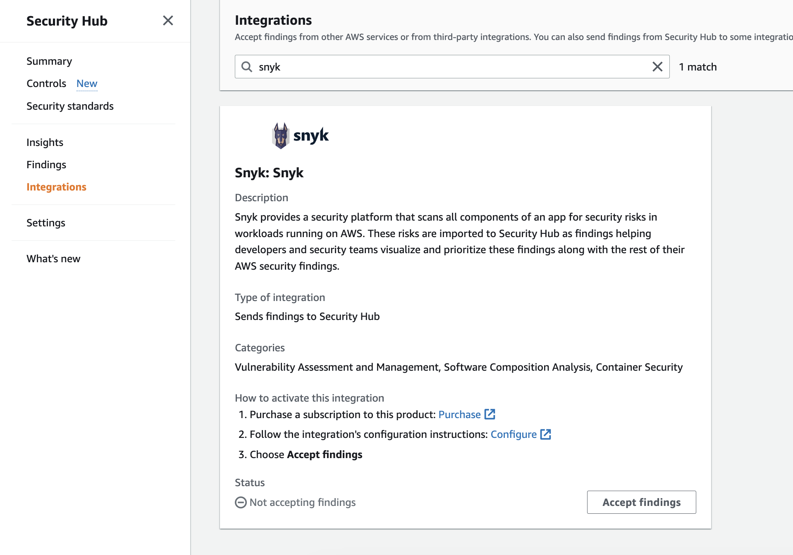
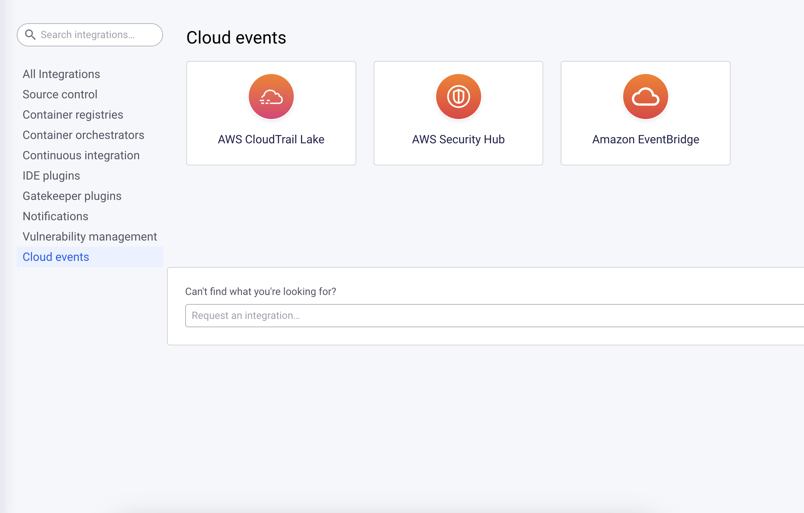
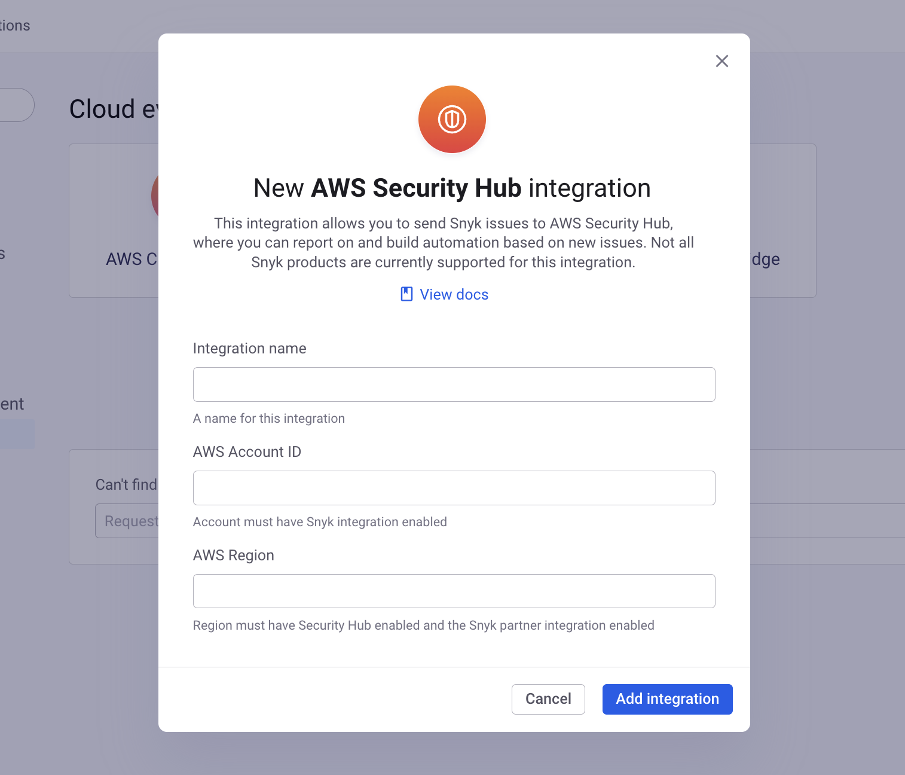
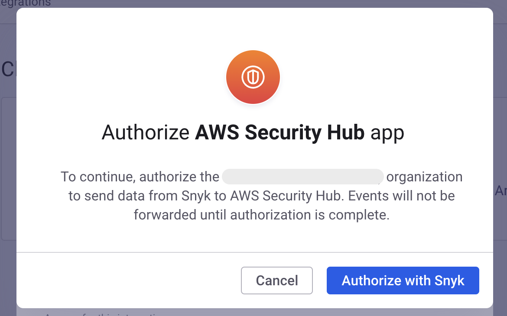
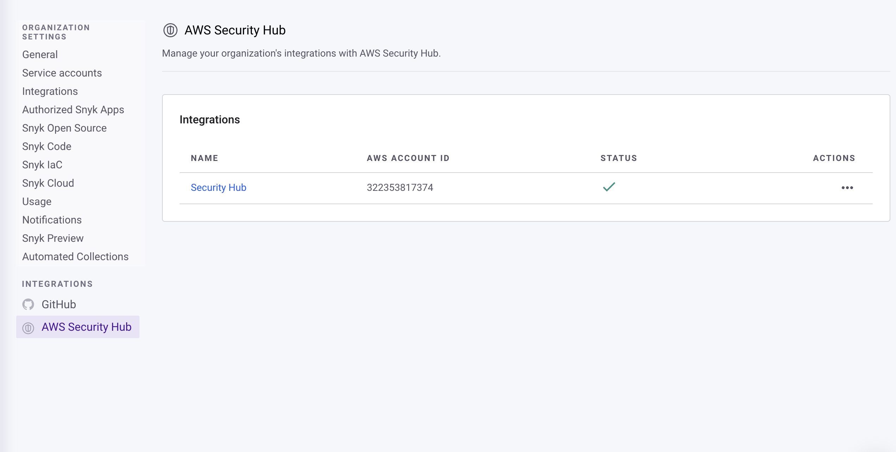
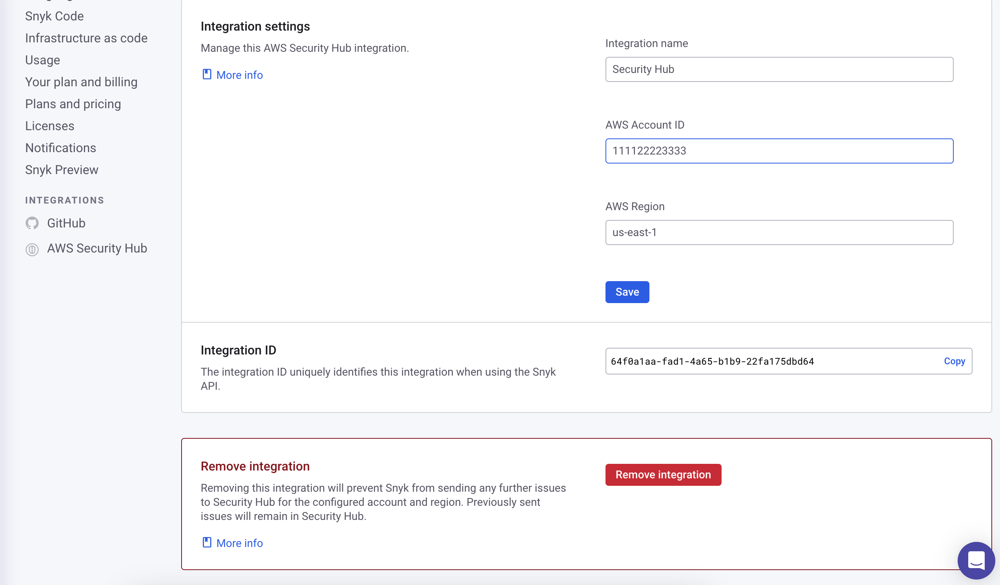

# AWS Security Hub


**Snyk 앱으로의 전환**

Snyk는 이벤트 전달 통합을 Snyk 앱 플랫폼을 사용하도록 전환하고 있습니다. 이 변경으로 인해 현재 및 미래의 클라우드 이벤트 통합에 새로운 기능과 향상된 보안이 제공될 것입니다.

전환 과정에서 기존 통합은 계속해서 정상적으로 작동하며 고객들은 Snyk 앱으로 전환될 시 계속 작동하기 위해 통합을 승인할 기회를 얻을 수 있습니다. 기존 통합의 승인을 완료하려면 다음 단계를 따르세요:

1. 조직의 **설정** 페이지로 이동
2. 승인하려는 통합의 설정 섹션으로 이동 (예: Amazon EventBridge, AWS CloudTrail Lake, AWS Security Hub)
3. **앱 승인** 버튼을 클릭하고 앱 승인 프로세스를 완료하세요

전환 창이 닫히면 **승인되지 않은 통합은 더 이상 이벤트를 전달할 수 없으며 작동이 중지될 것입니다.**


[**AWS Security Hub**](https://aws.amazon.com/security-hub/) 통합은 Snyk 문제를 Security Hub로 전송하여 보안 보고를 중앙 집중화하고 사용자 정의 경보를 작성하고 자동화를 트리거할 수 있도록 합니다. 구성된 후에는 통합이 자동으로 Snyk 문제를 Security Hub로 보안 결과물로 업로드합니다. 문제가 업데이트되거나 새로운 복구가 가능해지면 해당 Security Hub 결과물이 자동으로 업데이트됩니다.

통합을 구성하려면 두 가지 단계가 필요합니다:

1. Security Hub를 구성하여 Security Hub 콘솔에서 Snyk의 결과물을 수락합니다.
2. Snyk를 구성하여 Snyk 대시보드에서 Security Hub로 결과물을 보냅니다.

## Snyk 결과물 수락을 위한 Security Hub 구성

Snyk 결과물을 수신하려는 AWS 계정 및 지역의 Security Hub 콘솔로 이동하십시오. **Integrations** 섹션으로 이동하고 **Snyk**를 검색하세요. **Snyk** 통합 타일에서 **결과물 수락**을 클릭하고 안내에 따릅니다.

<figure><figcaption>
Snyk 통합 검색
</figcaption></figure>

이 단계를 마치면 Snyk 대시보드에서 통합 설정을 계속 진행할 수 있습니다.

## Snyk에서 Security Hub로 결과물을 보내는 방법 구성

[Snyk 통합 페이지](https://app.snyk.io/integrations)로 이동하고 **Security Hub**를 검색하거나 **Cloud 이벤트** 섹션으로 이동하세요. **Security Hub** 타일을 클릭하여 새 통합을 만드십시오.

<figure><figcaption>
새 Security Hub 통합 생성
</figcaption></figure>

통합에 **이름**을 입력하고 1단계에서 Snyk 파트너 통합을 활성화한 **AWS 계정 ID** 및 **AWS 지역**을 입력하세요.

<figure><figcaption>
통합 세부 정보 입력
</figcaption></figure>

이 단계를 마치면 Snyk는 Security Hub로 새로운 문제 이벤트를 보내기 시작합니다.


기존 프로젝트에서의 문제는 업데이트된 경우에만 Security Hub로 전송됩니다. 기존 프로젝트에서 문제를 채우려면 삭제하고 다시 가져와야 합니다.


## Snyk 앱 승인

조직에서 처음으로 AWS Security Hub 통합을 설정하면 Snyk 앱 승인 프로세스를 완료하라는 메시지가 표시됩니다.

<figure><figcaption>
Snyk 앱 승인
</figcaption></figure>

승인 프로세스를 완료하면 통합의 설정 페이지로 리디렉션이 됩니다.

## Security Hub 통합 관리 및 삭제

Snyk 대시보드에서 [Security Hub 통합 설정 페이지](https://app.snyk.io/manage/integrations/aws-securityhub)로 이동하고 관리하려는 통합의 이름을 클릭합니다.

<figure><figcaption>
관리할 통합 선택
</figcaption></figure>

통합 이름을 클릭하면 해당 통합의 설정 페이지가 열립니다. 여기서 통합의 구성 정보를 확인하고 업데이트할 수 있습니다.

통합을 삭제하려면 통합 설정 페이지 맨 아래로 스크롤하여 **통합 제거** 버튼을 클릭합니다.

<figure><figcaption>
통합 제거
</figcaption></figure>

통합이 삭제되면 Snyk는 Security Hub로 더 이상 문제를 보내지 않습니다. 이미 Security Hub로 전송된 문제는 아카이브되기 전까지 그대로 남아 있습니다.