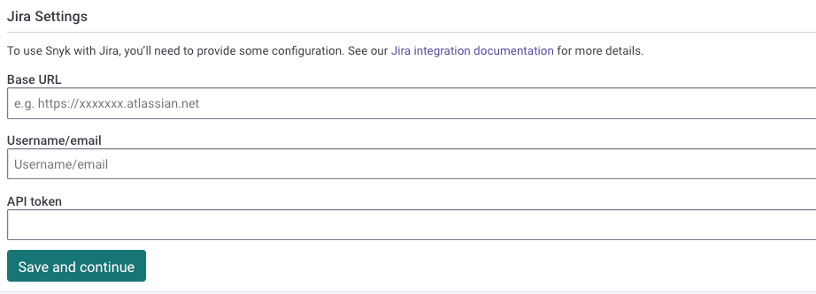
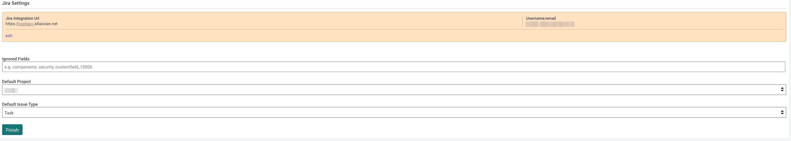
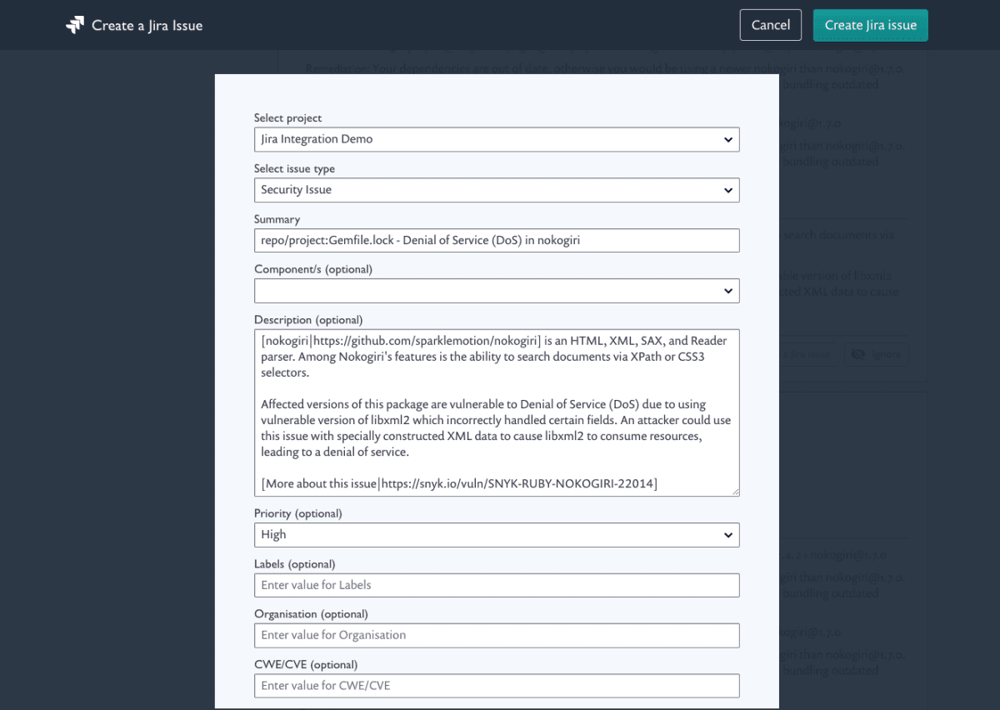

# Jira 통합


Snyk Infrastructure as Code의 경우, [IaC용 Jira 통합](../../scan-with-snyk/snyk-iac/snyk-iac-integrations/jira-integration-for-iac.md)을 참조하십시오.


## **Jira 통합 설정**

Snyk Jira 통합을 통해 취약점이나 라이선스 문제에 대한 Jira 문제를 수동으로 Snyk UI에서 생성할 수 있습니다. Jira 통합에는 또한 [Jira 이슈 생성](../../snyk-api/reference/jira-v1.md#org-orgid-project-projectid-issue-issueid-jira-issue) 및 [모든 Jira 이슈 나열](../../snyk-api/reference/jira-v1.md#org-orgid-project-projectid-jira-issues)을 위한 API 엔드포인트가 포함되어 있습니다.


Jira 인스턴스가 비공개인 경우, [Snyk 브로커 배포 방법](../../enterprise-setup/snyk-broker/install-and-configure-snyk-broker/jira-prerequisites-and-steps-to-install-and-configure-broker/setup-broker-with-jira.md)을 사용하십시오.


## **Snyk와 Jira 통합을 위한 선행 조건**

* Snyk는 Jira 버전 5 이상을 지원합니다.
* 다음의 [Jira 권한](https://confluence.atlassian.com/adminjiraserver073/managing-project-permissions-861253293.html)이 필요합니다: **프로젝트 참조** 및 **이슈 생성**.

## **Jira 통합 설정 방법**

기존 계정 자격 증명을 사용하는 대신 이 통합을 위해 Jira에 새 사용자를 설정하는 것이 좋은 방법입니다.

클라우드 호스팅된 Jira 구현은 사용자 이름 및 API 토큰 인증이 필요합니다. Jira API 토큰은 [아틀라시안 API 토큰](https://id.atlassian.com/manage/api-tokens)에서 생성됩니다. 자체 호스팅된 구현은 사용자 이름과 비밀번호로도 인증할 수 있습니다.

Snyk Web UI의 **Organization Settings > Integrations** 페이지에 Jira 계정 자격 증명을 입력하십시오: 기본 URL, 사용자 이름/이메일 및 API 토큰.

<figure><figcaption>
Jira 설정
</figcaption></figure>

통합에 세부 정보를 입력한 후 **저장하고 계속**을 누르십시오.&#x20;


연결이 성공하지 않으면 기본 URL이 정확히 `https://`로 시작하는지 확인하십시오. 대문자가 없어야하며 http일 수 없습니다.


연결이 성공하면 페이지 상단에 연결 세부 정보가 주황색으로 표시되며 기본 프로젝트 및 이슈 유형을 구성할 수 있는 옵션이 제공됩니다.

<figure><figcaption>
성공적인 연결
</figcaption></figure>

## **Jira 이슈 생성**

Jira 통합 연결을 설정한 후, Snyk Web UI에서 Snyk 프로젝트 중 하나를 엽니다. 각 취약점 및 라이선스 이슈 카드 하단에 새 버튼인 **이슈 생성**이 나타납니다. 이 버튼을 사용하여 Jira 이슈를 생성할 수 있습니다.

<figure><figcaption>
이슈 생성 버튼
</figcaption></figure>

**이슈 생성**을 선택하면 Jira 이슈 생성 양식이 표시됩니다. 이 양식에는 Snyk 이슈 세부 정보가 포함되어 있으며 해당 필드에 복사됩니다. 이 양식을 생성하기 전에 검토 및 편집할 수 있습니다.

이슈를 보내려는 Jira 프로젝트를 선택하십시오. 다음 예에서 필드는 특정 프로젝트에 있는 필드를 기반으로 하므로 프로젝트 간 전환 시 다른 옵션이 표시될 수 있습니다.

<figure><figcaption>
Jira 이슈 생성
</figcaption></figure>

Jira 이슈를 생성한 후, 이슈 카드에 Jira 키와 링크가 표시됩니다. Jira API를 사용하는 경우, Snyk에서 동일한 이슈에 대해 여러 Jira 이슈를 생성할 수 있습니다.

<figure><figcaption>
이슈 카드의 Jira 키
</figcaption></figure>

## Snyk 브로커를 사용하여 Jira와 통합하기

[Snyk 브로커를 Jira와 설정](../../enterprise-setup/snyk-broker/install-and-configure-snyk-broker/jira-prerequisites-and-steps-to-install-and-configure-broker/setup-broker-with-jira.md)하려면 확인하십시오.

## 참고

[Jira Cloud에서 Snyk 보안](snyk-security-in-jira-cloud-integration.md)