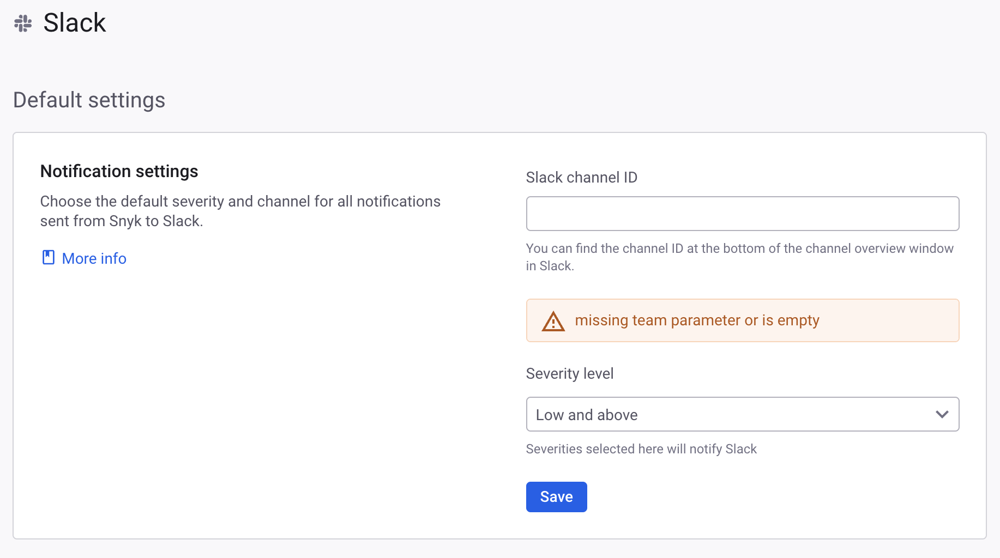
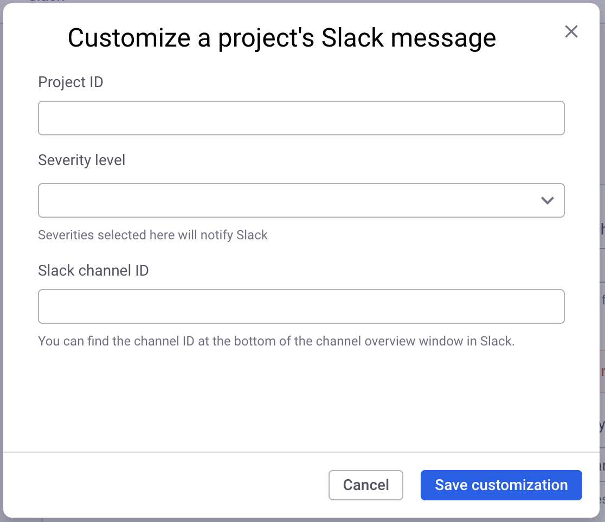
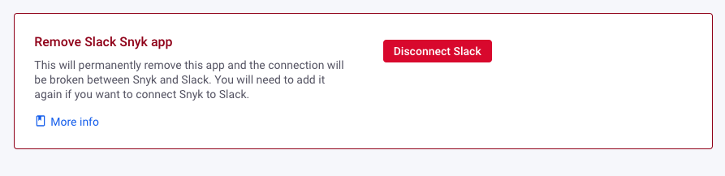

# Slack 앱


Snyk은 [Slack 통합](slack-integration.md)이 오래되었으므로 모든 고객이 Snyk Slack 앱을 사용하도록 권장합니다.


Slack을 위한 Snyk 앱은 공식 [Slack 앱](https://api.slack.com/start/overview#apps)으로 개발되었습니다.

Slack 앱은 다음 혜택 외에도 다음을 제공합니다:

* Snyk 제품(오픈 소스, 코드, 컨테이너 및 IaC) 지원이 향상됩니다.
* 심각도 수준에 대한 필터링 지원
* 프로젝트 수준에서 알림 재지정 지원

## Slack을 위한 Snyk 앱 개요

Slack을 위한 Snyk 앱은 가져온 프로젝트에서 소프트웨어 전체에서 새로 발표된 취약점 정보를 강조하고 슬랙 워크스페이스 채널 내에서 조치 가능한 컨텍스트를 제공합니다. 팀원들은 떠나지 않고 중요한 이슈 알림을 받을 수 있으며 이에 대해 조치를 취할 수 있습니다.

다음 이점이 있습니다:

* 취약점을 신속히 토론하고 해결하는 협업 강화
* 관련성과 신흥 취약점 인식 유지
* 이슈 알림 임계값으로 인한 중단 최소화

Slack을 위한 Snyk 앱은 [Snyk 앱](../../snyk-api/how-to-use-snyk-apps-apis/)에 기반하며 조직 및 프로젝트 수준에서 이슈 알림을 더 세밀하게 구성할 수 있는 혜택을 제공합니다.


프로젝트 초기 가져오기에서 감지된 취약점은 Slack으로 전송되지 않습니다. Slack으로 전송되는 것은 가져온 프로젝트에서 새로 발표된 취약점임.


## Slack을 위한 Snyk 앱 활성화

Slack을 위한 Snyk 앱을 활성화하려면 다음을 수행해야 합니다:

1. Snyk에서 새로운 이슈 데이터를 받아 Slack 워크스페이스로 전달할 수 있도록 앱을 허가합니다.
2. Slack 워크스페이스에서 앱을 허가하여 Snyk이 채널로 알림을 보낼 수 있도록 허용합니다.
3. 조직 내 모든 프로젝트의 기본 알림 설정을 Snyk에서 구성하고 [프로젝트 수준 알림 재지정](slack-app.md#manage-project-level-notification-overrides)을 추가하려면 구성합니다.

## Slack을 위한 Snyk 앱 구성

이 설치를 수행하는 사용자는 계속하기 전에 **Snyk 앱 관리 - 앱 설치** 권한을 가져야 합니다. [회원 역할 문서](../../snyk-admin/user-roles/user-role-management.md)를 참조하십시오.

1. [Snyk 통합 페이지](https://app.snyk.io/integrations)를 열고 **알림**으로 이동한 다음 **Slack 앱** 타일을 클릭합니다.
2. Snyk이 Slack에서 데이터에 액세스하도록 허용하기 위해 **Snyk로 허가**를 선택합니다.
3. Snyk이 Snyk Slack 워크스페이스에 액세스하도록 추가 허가가 요청됩니다. 콘텐츠 및 채널 및 대화에 대한 정보가 포함되며 또한 Snyk에 해당 채널 및 대화에서 작업을 수행하도록 허용합니다. 계속하려면 **허용**을 선택합니다.


여러 Slack 워크스페이스를 사용할 수 있는 경우 페이지 상단 오른쪽에 드롭다운이 표시됩니다. 원하는 Slack 워크스페이스를 선택합니다.


통합을 구성하여 조직에 대한 이슈 알림이 전송되는 Slack 채널 ID를 제공하고 심각도 수준에 따라 필터링할 수도 있습니다.

<figure><figcaption>
조직에 대한 알림을 위한 Slack 채널 및 심각도 수준 선택
</figcaption></figure>

Slack 채널의 채널 ID를 찾으려면 Slack을 열고 채널 이름을 마우스 오른쪽 버튼으로 클릭한 다음 **채널 세부 정보 보기**를 선택하고 창 아래로 스크롤하여 채널 ID를 확인할 수 있습니다. 예를 들어 C2TB2222N을 볼 수 있습니다.

Snyk Slack 앱을 비공개 채널에 추가하려면 먼저 Slack 내에서 앱을 수동으로 추가하고 나중에 Snyk 통합에서 채널을 선택해야 합니다. 비공개 채널에는 **채널 설정 - 통합**을 선택한 후 **앱 추가**를 선택합니다. **Snyk for Slack**을 검색한 다음 **추가**를 선택합니다. 이를 수행한 후 채널이 통합 **설정** 페이지에 표시됩니다.

Slack 관리자인 경우 Snyk Slack 앱을 비공개 채널에 수동으로 추가할 수 있습니다. 이를 위해 선택한 채널에서 **@Snyk for Slack**을 입력하여 설정 봇을 호출합니다.

## 이슈 알림

Slack 앱이 구성되면 새 이슈 알림이 원하는 심각도 수준 임계값에 따라 선택된 Slack 채널로 전달됩니다.\
새 이슈 알림은 설정한 후 최대 1시간이 소요될 수 있습니다.

<figure><figcaption>
Slack에서 받은 새로운 심각한 취약점 알림 예시
</figcaption></figure>

## 프로젝트 수준 알림 재지정 관리

프로젝트에 대한 Slack 알림 설정을 재정의하려면 **프로젝트별로 사용자화** 테이블을 사용하십시오.

사용자화 옵션에는 다음이 포함됩니다:

* 프로젝트 ID
* 심각도 수준
* Slack 채널 ID

<figure><figcaption>
빈 프로젝트 알림 사용자화 테이블
</figcaption></figure>

### 알림 사용자화 추가

1. `Add customization`를 선택하여 Slack 앱 통합 페이지에서 만들기 대화 상자를 엽니다.
2. 이전에 복사한 **프로젝트 ID** 값을 붙여 넣습니다.
3. 원하는 이슈 **심각도 수준** 및 대상 **Slack 채널**을 선택합니다.
4. **사용자화를 저장**합니다.

<figure><figcaption>
프로젝트 알림 사용자화 작성 대화 상자
</figcaption></figure>

### 프로젝트 ID 찾기

알림을 보낼 원하는 프로젝트 ID를 찾으려면 해당 URL에서 `project/` 경로 뒤에 따라오는 UUID 값을 찾으십시오.

1. 애플리케이션 사이드바를 사용하여 프로젝트 페이지로 이동합니다.
2. 원하는 프로젝트를 선택합니다.
3. URL 표시줄에 있는 `project/` 경로 뒤에 따라오는 UUID 값을 복사합니다.

<figure><figcaption>
프로젝트 페이지 URL에서 프로젝트 ID 위치
</figcaption></figure>

### 알림 사용자화 편집 또는 삭제

알림 사용자화가 만들어진 후에는 언제든지 구성을 편집하거나 삭제할 수 있습니다. 이를 위해 사용자화 테이블 항목의 탐점 메뉴에서 조치를 취합니다.

<figure><figcaption>
알림 사용자화에 대한 편집 및 삭제 옵션
</figcaption></figure>

## REST API를 사용하여 알림 사용자화 관리

프로젝트별로 Slack 알림 설정을 재지정하려면 API [Slack 설정](../../snyk-api/reference/slacksettings.md) 엔드포인트를 사용할 수 있습니다.

이러한 엔드포인트를 사용하기 전에 [Snyk REST API 시작하기 가이드](../../snyk-api/rest-api/getting-started-with-the-rest-api.md)의 단계를 따라 인증 토큰과 조직 ID(`org_id`)를 검색했는지 확인하십시오.

### 프로젝트 수준 알림 재지정 관리를 위한 전제조건

#### Slack 앱 봇 ID 찾기

프로젝트 수준 알림 사용자화 엔드포인트와 상호 작용하려면 `bot_id`가 필요합니다. 이를 얻기 위해 [조직에서 허가된 봇 목록을 가져오는 요청](../../snyk-api/reference/apps.md#orgs-org_id-app_bots)을 보냅니다.

`GET /orgs/{org_id}/app_bots`


요청시 `expand=app` 쿼리 문자열을 적용해야 합니다. 이것은 관련 Snyk 앱인 **Slack 앱**을 찾을 수 있습니다.


#### 프로젝트 ID 찾기

원하는 프로젝트를 지정하려면 해당 `project_id`가 필요합니다. 이를 얻기 위해 [주어진 조직 ID에 대한 모든 프로젝트 목록을 가져오는 요청](../../snyk-api/reference/projects.md#orgs-org_id-projects)을 보냅니다:

GET [/orgs/{org\_id}/projects](https://apidocs.snyk.io/?version=2023-08-04#get-/orgs/-org_id-/projects)

### 관련 REST API

`org_id`, `bot_id`, `project_id` 값을 검색한 후 다음 생성, 읽기, 업데이트 및 삭제 API 작업을 사용할 수 있습니다:

#### [프로젝트별 모든 Slack 알림 사용자화 목록](../../snyk-api/reference/slacksettings.md#orgs-org_id-slack_app-bot_id-projects)

`GET /orgs/{org_id}/slack_app/{bot_id}/projects`

#### [프로젝트를 위한 Slack 알림 사용자화 생성](../../snyk-api/reference/slacksettings.md#orgs-org_id-slack_app-bot_id-projects-project_id)

`POST /orgs/{org_id}/slack_app/{bot_id}/projects/{project_id}`

#### [프로젝트를 위한 Slack 알림 사용자화 업데이트](../../snyk-api/reference/slacksettings.md#orgs-org_id-slack_app-bot_id-projects-project_id-1)

`PATCH /orgs/{org_id}/slack_app/{bot_id}/projects/{project_id}`

#### [프로젝트를 위한 Slack 알림 사용자화 삭제](../../snyk-api/reference/slacksettings.md#orgs-org_id-slack_app-bot_id-projects-project_id-2)

`DELETE /orgs/{org_id}/slack_app/{bot_id}/projects/{project_id}`

## Snyk Slack 앱 제거

Snyk Slack 앱을 제거하려면 설정 페이지로 이동하고 페이지 하단에 있는 **Slack Snyk 앱 제거**를 찾아 **Slack 연결 끊기** 버튼을 클릭하십시오:

<figure><figcaption>
Slack 앱 통합 제거
</figcaption></figure>
