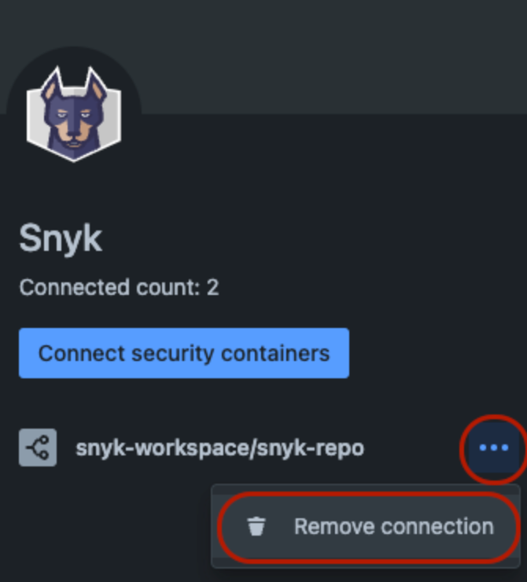
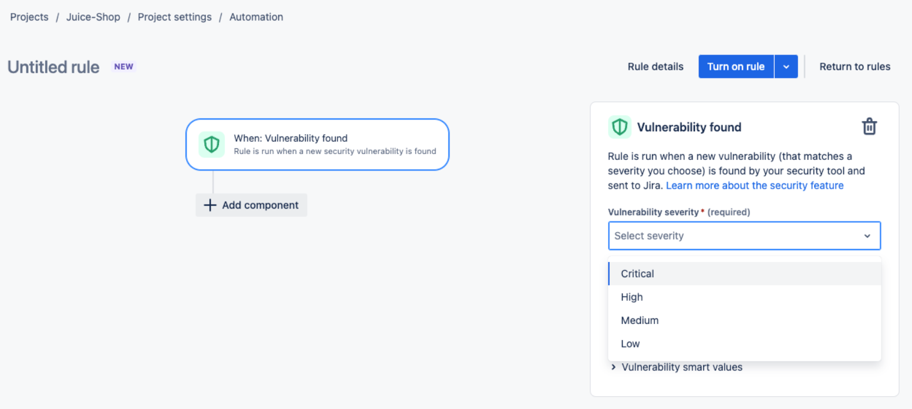
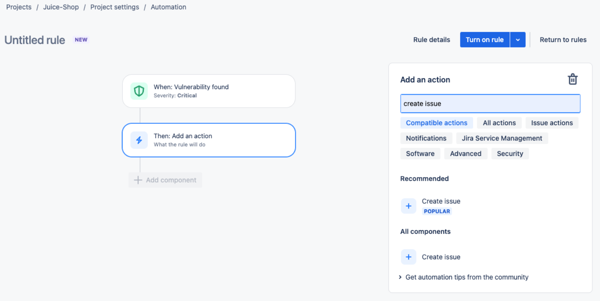
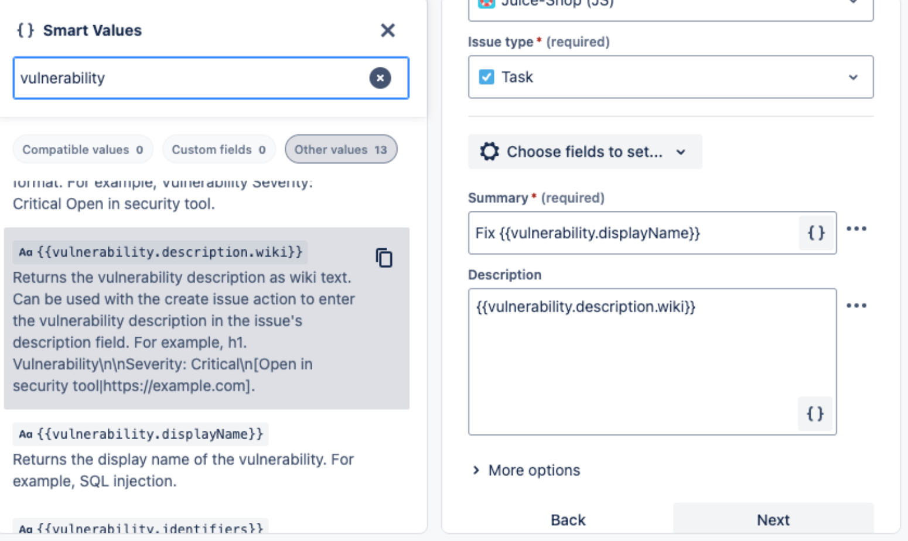
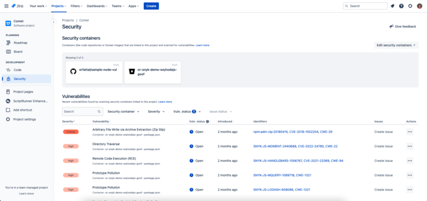
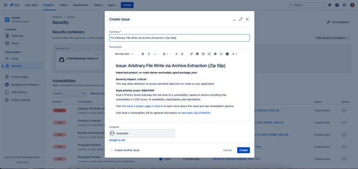
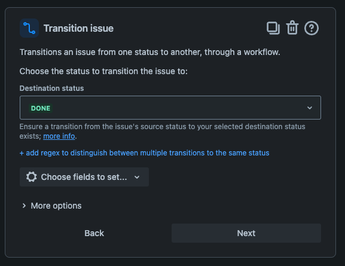

# Jira Cloud 통합의 Snyk Security


Jira Server 및 Jira Data Center는 지원되지 않습니다.


Snyk Jira Cloud의 Security는 개발자가 Jira 인터페이스에서 코드 저장소와 관련된 보안 취약점을 식별하고 우선순위를 결정하며 대응할 수 있도록 돕습니다.

Snyk Jira Cloud의 Security 통합은 Snyk 플랫폼에서의 Snyk 스캔 결과를 Jira로 미러링합니다. 원하는 경우 Jira 환경에서 Snyk 결과를 보고 필요에 따라 Jira 이슈를 생성할 수 있습니다. 연결된 Snyk 조직과 Jira 프로젝트에 관련된 Snyk 대상을 확인할 수 있습니다.

## Snyk Jira Cloud의 Security를 설치하기 위한 전제 조건

Snyk Jira Cloud의 Security는 Jira 앱입니다.

Jira 앱을 설치하고 구성하려면 사이트 관리자, 관리자 또는 jira-관리자 그룹의 Jira Cloud 관리자이어야 합니다. Snyk Jira Cloud의 Security 앱 설치를 지원하기 위해 IT 팀에 문의하십시오.

Jira 앱을 Snyk에 연결하려면 [Snyk 조직 관리자](../../snyk-admin/user-roles/pre-defined-roles.md)여야 합니다.

Jira에서 Security in Jira Cloud를 활성화하려면 **프로젝트 설정 > 기능 > 개발 > 보안**으로 이동하고 **보안 활성화**를 누르세요.

통합이 작동하려면 Jira에서 다음과 같은 권한 스코프가 필요합니다.

<table><thead><tr><th width="344.5">Jira에서 필요한 스코프</th><th>목적</th></tr></thead><tbody><tr><td>호스트 애플리케이션으로 데이터 쓰기</td><td>Snyk의 취약점을 Jira에 동기화하여 Jira의 보안 탭에 나타나도록 함</td></tr><tr><td>호스트 애플리케이션에서 데이터 읽기</td><td>Jira로부터 취약점을 읽어 이슈 동기화 프로세스 최적화</td></tr><tr><td>호스트 애플리케이션에서 데이터 삭제</td><td>Snyk 조직이 Jira에서 삭제될 때 Jira에서 취약점 제거</td></tr></tbody></table>

## Snyk Jira Cloud의 Security 설치

다음 단계를 따라 [**Snyk Jira Cloud의 Security**](https://marketplace.atlassian.com/apps/1230482/snyk-security-in-jira-cloud)를 Atlassian Marketplace에서 설치하세요.

1. Jira에서 **앱** > **새 앱 찾기**로 이동합니다.
2. **Snyk Jira Cloud의 Security**를 검색합니다.\
   [EU](https://marketplace.atlassian.com/apps/1232502/snyk-security-in-jira-cloud-eu?hosting=cloud\&tab=overview) 또는 [AU](https://marketplace.atlassian.com/apps/1232503/snyk-security-in-jira-cloud-au?hosting=cloud\&tab=overview)에 설치해야 하는 경우 Atlassian 앱 마켓플레이스에서 해당 EU 또는 AU 앱을 설치해야 합니다.
3. 해당 앱을 클릭하고 **지금 가져오기**를 선택합니다.
4. 앱 정보를 검토하고 **지금 가져오기**를 선택합니다.
5. 설치 안내를 따릅니다.

## Snyk Jira Cloud 앱의 구성

1. **앱** > **앱 관리**로 이동합니다.
2. 왼쪽 메뉴에서 **Snyk Jira의 Security**를 선택합니다.
3. Snyk 계정에 로그인하거나 새 Snyk 계정을 만듭니다.
4. Snyk에서 **액세스 권한 부여**를 선택하여 Snyk이 Jira 소프트웨어 계정 정보를 읽을 수 있도록 허용합니다.
5. Jira 사이트에 연결할 특정 Snyk 조직을 선택하고 **앱 액세스 부여**를 선택합니다.

## 코드 저장소를 Jira 프로젝트에 연결

Snyk을 Jira에 연결하려면 다음 단계를 완료한 후 Jira에서 보안 문제를 대응할 수 있습니다.


일반적으로 연구 및 개발 엔지니어링 매니저가 이 작업을 수행합니다. 그들은 Jira 프로젝트를 소유하고 팀의 코드 저장소를 알고 있기 때문입니다.


1. Jira에서 **프로젝트 설정** > **도구 체인**으로 이동하여 도구 목록에서 Snyk을 찾습니다.\
   [Jira Software에서 프로젝트 도구 체인이란?](https://support.atlassian.com/jira-software-cloud/docs/what-is-the-project-toolchain-in-jira/)
2. Snyk을 위한 **연결 추가** 플러스(+ ) 버튼을 클릭합니다.
3. 목록에서 컨테이너 코드 저장소를 선택하고 **컨테이너 추가**를 선택합니다. 이것이 Snyk 대상입니다.\
   여러 코드 저장소를 Jira에 연결할 수 있습니다.

이제 개발자들은 보안 기능을 사용하여 연결된 코드 저장소에서 발견된 최근 취약점을 볼 수 있으며 해당 취약성에서 [Jira 이슈를 작성](snyk-security-in-jira-cloud-integration.md#create-a-jira-issue-from-a-vulnerability)하거나 [기존 Jira 이슈에 연결](snyk-security-in-jira-cloud-integration.md#link-an-existing-jira-issue-to-a-vulnerability)할 수 있습니다.


Jira 보안 탭에는 보안 취약점만 표시됩니다.


### 대상 또는 저장소 삭제

Jira에 연결한 Snyk 대상 또는 저장소를 삭제하려면 해당 Jira 프로젝트의 **보안** 패널에서 먼저 컨테이너 코드 저장소를 삭제한 후 Snyk에서 대상이나 저장소를 삭제해야 합니다.

<figure><figcaption>
Jira Security 패널에서 연결된 보안 컨테이너 삭제
</figcaption></figure>

## Jira에서 티켓 생성 자동화

다음 단계는 Jira 자동화를 사용하여 Snyk 취약점에 대한 티켓을 자동으로 생성하는 방법을 설명합니다.

1. Jira에서 프로젝트로 이동한 다음 **프로젝트 설정** 및 **자동화**로 이동합니다.
2. **규칙 생성**을 클릭합니다.
3. **Vulnerability Found**를 트리거로 설정하고 최소 티켓 심각성을 선택합니다.

<figure><figcaption>
새로운 규칙에 대한 취약점 심각성 선택
</figcaption></figure>

4. **구성 요소 추가**를 클릭하고 **다음**, 그리고 **이슈 생성**을 선택합니다. 프로젝트 및 이슈 유형을 선택합니다.

<figure><figcaption>
동작 추가 및 새로운 규칙에 대한 이슈 생성
</figcaption></figure>

5. **요약** 필드에 "\{{취약점.표시 이름\}} Fix "를 추가합니다. **설명**에는 \{{vulnerability.description.wiki\}}를 입력합니다.

<figure><figcaption>
요약 필드와 설명을 새로운 룰에 추가
</figcaption></figure>

6. **구성 요소 추가**를 클릭하고 **다음**을 선택한 다음 **보안** 아래에서 **Vulnerability to issue 연결**을 선택합니다.
7. **규칙 사용**을 선택합니다.

## Jira에서 보안 취약점 관리

Snyk Jira Cloud 앱의 Security를 설치하고 구성한 후 Jira 프로젝트 페이지의 보안 탭에서 취약점을 볼 수 있습니다.

<figure><figcaption>
Snyk Jira Cloud 탭의 Security
</figcaption></figure>

취약점을 찾으려면 **취약점** 섹션으로 이동하십시오. Snyk은 심각성, 상태 및 식별자를 표시합니다. Snyk 웹 UI에서 자세한 내용을 보려면 제목을 클릭하십시오.

### 취약점 검색, 필터링, 정렬

**취약점** 섹션의 검색 창과 필터를 사용하여 조직에 관련된 취약점을 표시하는 목록을 사용자 정의할 수 있습니다.

무시된 취약점 및 닫힌 취약점은 기본적으로 **취약점** 섹션에 표시되지 않지만 **취약점 상태 필터**를 사용하여 이들을 볼 수 있습니다.

표의 열 제목을 클릭하여 모든 취약점을 해당 특성별로 정렬할 수 있습니다.

### 취약점에서 Jira 이슈 생성하기

이슈를 우선순위에 따라 계획하고 추적하여 취약점을 해결하기 위해 티켓을 Jira 이슈에 추가할 수 있습니다.

Snyk은 취약성 정보를 Jira로 제공하여 사용자가 문제를 해결하는 데 필요한 종합 데이터를 얻을 수 있습니다.

Jira 이슈를 추가하려면 **Snyk 보안** 탭으로 이동하여 취약점을 찾은 후 **이슈 생성**을 클릭합니다.

<figure><figcaption>
Snyk가 발견한 취약점에서 생성된 Jira 이슈
</figcaption></figure>

### 기존 Jira 이슈와 취약점 연결

취약점에 이미 Jira 이슈가 있는 경우 작업 열람기에서 해당 취약점을 기존 Jira 이슈에 연결할 수 있습니다. 이를 위해 작업 열의 세 점을 클릭하고 **이슈 연결**을 선택하면 됩니다.

### Jira에서 보안 취약점 해결 자동화

다음 단계는 Jira 자동화와 JQL을 사용하여 이제 닫힌 상태인 취약점에 대한 티켓을 자동으로 닫거나 상태를 변경하는 방법을 설명합니다.

1. 프로젝트에서 Jira로 이동한 후 **프로젝트 설정**과 **자동화**를 클릭합니다.
2. **규칙 생성** 버튼을 클릭합니다.
3. **Scheduled**을 선택한 후 **Scheduled**을 선택합니다.

<figure><figcaption>
Scheduled 트리거 추가
</figcaption></figure>

4. **JQL 검색 실행**을 선택하고 `status != Done AND vulnerability[status] = CLOSED`를 입력한 후 **다음**을 클릭합니다.

<figure><figcaption>
Scheduled JQL 검색 설정
</figcaption></figure>

5. 새 구성 요소를 추가하고 **다음: 작업 추가**를 선택합니다. **이슈 작업**을 선택하고 **이슈 전환**을 선택합니다.

<figure><figcaption>
이슈 전환 작업
</figcaption></figure>

6. **대상 상태**를 닫음 또는 워크플로에 따른 다른 상태로 설정합니다.

<figure><figcaption>
닫은 상태로 전환 설정
</figcaption></figure>

7. 설정을 완료하고 이름을 지정한 다음 **규칙 활성화**를 클릭합니다.

이제 일정에 따라 Jira가 취약점이 닫힌 상태이지만 이슈가 닫히지 않은 모든 이슈를 찾아 각 Jira 이슈를 닫습니다.

## Snyk Jira Cloud의 Security 제거


Snyk Jira Cloud의 Security를 제거하면 Snyk 취약점이 연결된 Jira 이슈에서 분리됩니다.\
\
Jira 앱을 제거하려면 사이트 관리자, 관리자 또는 jira-관리자 그룹의 관리자여야 합니다.


1. Jira에서 메인 메뉴의 **앱**으로 이동하고 **앱 관리**를 선택합니다.
2. **Snyk Jira의 Security**를 선택합니다.
3. **설치 해제** 버튼을 클릭합니다.
