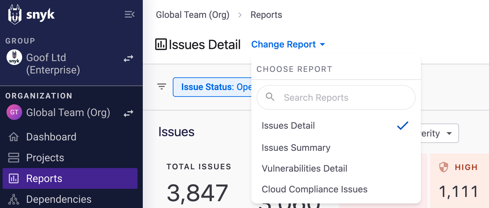

# 사용 가능한 Snyk 보고서

다음 보고서를 이용할 수 있습니다:

* [문제 상세 보고서](available-snyk-reports.md#issues-detail-report)
* [문제 요약 보고서](available-snyk-reports.md#issues-summary-report)
* [취약점 상세 보고서](available-snyk-reports.md#vulnerabilities-detail-report)
* [주요 제로데이 보고서](available-snyk-reports.md#featured-zero-day-report)
* [SLA 관리 보고서](available-snyk-reports.md#sla-management-report)
* [OWASP TOP 10 보고서](available-snyk-reports.md#owasp-top-10-report)
* [CWE TOP 25 보고서](available-snyk-reports.md#cwe-top-25-report)
* [CWE TOP 10 KEV 보고서](available-snyk-reports.md#cwe-top-10-kev-report)
* [클라우드 적합성 문제 보고서](available-snyk-reports.md#cloud-compliance-issues-report)
* [개발자 IDE 및 CLI 사용 보고서](available-snyk-reports.md#developer-ide-and-cli-usage)
* [자산 대시보드](available-snyk-reports.md#asset-dashboard)

**보고서 변경**을 선택하여 표시되는 보고서를 변경할 수 있습니다:

<figure><figcaption>
다른 보고서 표시를 위한 보고서 변경 선택
</figcaption></figure>

## 문제 상세 보고서

문제 상세 보고서는 Snyk에서 모니터링되는 모든 프로젝트에서 알려진 모든 문제를 표시합니다. 보고서는 각 문제에 대한 세부 정보, 영향을 받는 프로젝트 및 수정 정보에 대한 링크를 제공합니다.

문제 상세 보고서에는 문제 수와 문제를 구성하는 고유 취약점 수가 표시됩니다.

**심각도**, **제품 이름**, **문제 유형**을 포함한 카테고리별로 빠른 집계가 가능합니다.

선택한 카테고리에 따라 개별 문제가 테이블에 표시됩니다. 필요한 대로 열을 수정할 수 있습니다.

고유 취약점만 있는 테이블이 필요한 경우 취약점 상세 보고서로 전환하려면 보고서 변경을 사용하십시오.

## 문제 요약 보고서

문제 요약 보고서는 Snyk이 문제 식별과 해결을 가능하게 함으로써 제공하는 가치를 강조합니다.

이 보고서는 팀이 Snyk 플랫폼을 워크플로에 최적화하는 방법과 보안을 측정하고 향상하기 위한 수단을 제공합니다.

이 보고서를 사용하면 가장 높은 보안 위험 항목의 현재 상태 및 트렌드를 쉽게 이해할 수 있습니다. 이 보고서는 위험이 발생하는 곳 및 보상 노력이 가장 효과적인 곳과 가장 효과적이지 않은 곳을 빠르게 확인할 수 있는 빠른 뷰를 제공합니다.

Issues Summary 보고서 우측 상단의 날짜 필터를 사용하여 지정된 기간 동안 주요 지표 및 차트를 보려면 이용하십시오.

이 보고서는 해당 기간의 문제와 관련된 주요 지표를 이전 기간과 비교하여 빠르게 트렌드를 이해할 수 있도록 여러 중요 지표를 표시합니다. 메트릭의 정의에 대한 툴팁은 앱 내에서 확인할 수 있습니다.

자세한 트렌드 정보를 보여주는 추가 차트를 보려면 아래로 스크롤하십시오.

중요 지표는 조직이나 프로젝트 수준에서 정보를 구분하여 제공합니다. 선택된 기간 동안 도입된 새로운 문제 및 해결된 문제를 확인하려면 계층적으로 주의해서 살펴볼 수 있습니다.

## 취약점 상세 보고서

취약점 상세 보고서는 문제 상세 보고서와 유사하지만 취약점이 Snyk 문제 ID로 그룹화되어 표시됩니다 ([Snyk 취약점 DB 참조](https://security.snyk.io/vuln)).

어떤 취약점이 얼마나 많이 존재하며 몇 개의 프로젝트가 영향을 받는지 쉽게 확인할 수 있습니다. 이 보고서를 사용하여 해결 및 예방 사용 사례에 가장 많이 적용되는 취약점을 이해할 수 있습니다.

총 문제에 대한 테이블을 보려면 문제 상세 보고서로 전환하려면 보고서 변경을 사용하십시오.


**의존성 및 라이선스 정보**

의존성 및 라이선스 정보를 보려면 **의존성** 메뉴 옵션을 선택하십시오. 자세한 내용은 [의존성 및 라이선스](../../manage-risk/reporting/dependencies-and-licenses/)를 참조하십시오.


## 주요 제로데이 보고서

이 보고서는 주요 시나리오에 대한 관리 및 해결용 신흥 제로데이 취약점을 다룹니다. 이러한 취약점은 글로벌 AppSec 커뮤니티에서 상당한 주목을 받고 중요한 결과를 초래합니다.

다양한 대상과 프로젝트에서 강조된 문제에 노출도를 발견하고 우선 순위를 매겨 남아 있는 발생에 대한 개선 작업의 진행 상황을 모니터링하는 데 이 보고서를 사용할 수 있습니다.

[Snyk 보안팀](https://snyk.io/platform/security-intelligence/)은 매일 새 취약점을 [취약점 데이터베이스](https://security.snyk.io/)에 계속 업데이트합니다. 팀이 많은 고객에 영향을 주는 높은 심각성을 가진 널리 사용되는 패키지에서 주요한 새 제로데이 취약성을 발견하면 제로데이 이벤트로 발표 및 처리됩니다.

새 제로데이 이벤트 발표 시 **영향받는 대상** 테이블을 살펴보면 노출도에 대해 깊이 이해할 수 있습니다. 프로젝트 라이프사이클, 환경 또는 프로젝트 중요도와 같은 필터를 사용하여 제품화된 프로젝트에서 외부 노출된 프로젝트나 고 중요도에 해당하는 타깃에만 초점을 맞출 수 있습니다. 이러한 통찰력을 얻기 위해서는 [프로젝트 속성의 가용성](../../snyk-admin/snyk-projects/project-attributes.md#available-attributes-and-their-values)에 달려 있습니다.

다음으로 **모든 문제** 테이블로 이동하고 수정이 필요한 문제 목록을 우선 순위별로 정리합니다. 일반적으로 위험 점수나 NVD CVSS 점수에 따라 우선순위를 결정하며 주의를 많이 기울여 민감한 타깃 내의 취약성을 해결합니다. 프로젝트 라이프사이클, 환경 또는 프로젝트 중요도를 기준으로 필터를 적용하여 이러한 타깃을 신속하게 식별 및 해결할 수 있습니다.

계속해서 수정 진행 및 효능을 모니터링하기 위해 트렌드 다이어그램을 참조하십시오.\
**누적된 문제 미해결 트렌드** 다이어그램은 신규 확인 및 해결 된 문제 간 주간 차이를 누적하여 제로데이 백로그의 주간 변경 사항을 보여줍니다. 이 다이어그램을 사용하여 연구 및 개발 팀이 지속적으로 제로데이 백로그를 줄이는지 확인하십시오. 이는 음의 트렌드 라인으로 표시됩니다.

동시에 **시간 경과에 따른 확인된 문제 대비 처리된 문제** 다이어그램을 검토하여 새 문제 도입 방지에 중점을 두는 것이나 처리 노력을 가속하는 데 추가 강조가 필요한지 결론을 내리십시오.

## SLA 관리 보고서

SLA(서비스 수준 계약) 관리 보고서는 Snyk 그룹, 조직 및 대상 간의 SLA 거버넌스와 컴플라이언스에 대한 새로운 수준의 가시성을 제공합니다. 원하는 결과를 달성하기 위한 다음 단계의 우선 순위를 정하고 SLA 대상에 대한 보정 시간을 평가하는 수단을 제공합니다.

이 보고서는 일반적인 보안 표준을 기반으로 기본 값이 있는 SLA 대상을 제시합니다. 예를 들어 FedRAMP와 같은 보안 표준을 기반으로 SLA 대상을 수정할 수 있습니다.

사용자는 보안 요구 사항에 따라 각 SLA 목표를 수정할 수 있습니다.

사용자는 보고서 URL을 공유하여 미리 정의된 SLA 대상을 공유할 수 있습니다. 사용자는 브라우저에서 웹 페이지를 즐겨찾기하여 사전에 정의된 SLA 보고서로 돌아갈 수도 있습니다.

미해결 문제 섹션에서 SLA 심각도 분할은 보는 그룹이나 조직의 SLA 컴플라이언스 상태에 따른 심각도 수준의 분포를 보여줍니다. SLA 트렌드는 보는 그룹이나 조직이 SLA 컴플라이언스에 대한 예상 진전을 만족시키는지 여부를 나타냅니다.

SLA 분할 테이블을 사용하여 그룹 보기에서 조직의 SLA 컴플라이언스 결과를 비교할 수 있습니다. 테이블은 기본적으로 위반된 문제의 양에 따라 정렬됩니다. 특정 심각도에 대한 카운터를 보기 위해 필터를 사용할 수 있습니다.

위험에 노출되거나 SLA 컴플라이언스 상태에 따라 문제를 우선 순위별로 정렬하는 위방향 및 위험한 미해결 문제 테이블을 사용할 수 있습니다.

해결된 문제에 대한 SLA 결과를 검토하고 회고를 실시할 수도 있습니다.

## OWASP TOP 10 보고서

[OWASP TOP 10](https://owasp.org/www-project-top-ten/)은 개발자와 웹 애플리케이션 보안에 대한 표준 인식 문서입니다. 이는 웹 애플리케이션에 대한 가장 중요한 보안 위험에 대한 광범위한 합의를 나타내며 보안 코딩으로 나아가는 첫 번째 단계로 개발자에 의해 전 세계적으로 인식되고 있습니다.

목록의 각 제어(A1, A2 등)은 공통 취약성 열거 목록(CWE)에 기반합니다. 예를 들어 [A01:2021 – 액세스 제어 무시](https://owasp.org/Top10/A01_2021-Broken_Access_Control/)는 34개의 CWE 목록에 기반합니다.

CWE는 Snyk-ID에 매핑되며, 문제에 매핑됩니다.

예를 들어, 중요한 취약점 [SNYK-JAVA-ORGAPACHELOGGINGLOG4J-2314720](https://security.snyk.io/vuln/SNYK-JAVA-ORGAPACHELOGGINGLOG4J-2314720)은 [CWE-94](https://cwe.mitre.org/data/definitions/94.html)로 분류되며, OWASP TOP 10 [A03:2021 - 인젝션](https://owasp.org/Top10/A03_2021-Injection/)의 일부입니다. 이러한 취약점과 관련된 모든 문제는 A03 범주 하에 있을 것입니다.

Snyk Learn의 [OWASP TOP 10 학습 경로](https://learn.snyk.io/learning-paths/owasp-top-10/)를 활용하여 자세히 알아보세요.

이 보고서는 2021년에 발표된 최신 매핑을 기반으로 합니다. 지원되는 제품은 Snyk Open Source, Snyk Container 및 Snyk Code입니다.

## CWE TOP 25 보고서

[CWE Top 25](https://cwe.mitre.org/top25/) 가장 위험한 소프트웨어 취약점은 현재 가장 일반적이고 영향력 있는 소프트웨어 취약점을 보여주는 목록입니다. 이는 공통 취약점 및 노출 잠재성에 기반합니다.

이 보고서는 MITRE가 2023년에 발표한 최신 버전을 기반으로 합니다. 지원되는 제품은 Snyk Open Source, Snyk Container 및 Snyk Code입니다.

## CWE TOP 10 KEV 보고서

[CWE Top 10 KEV 취약성](https://cwe.mitre.org/top25/archive/2023/2023_kev_list.html) 목록은 사이버보안 및 인프라 보안국(CISA)의 [알려진 이용 취약점](https://www.cisa.gov/known-exploited-vulnerabilities-catalog) (KEV) 카탈로그에서 상위 10개 CWE를 식별합니다. 이는 소프트웨어 응용 프로그램과 취약점에 공격자가 노출시키고 활용한 결# 어플리케이션 컨텍스트 카탈로그

| 필드        | 설명                                                                                                                                                                                                                                                                     |
| --------- | ---------------------------------------------------------------------------------------------------------------------------------------------------------------------------------------------------------------------------------------------------------------------- |
| 발견됨       | 자산이 발견된 시기입니다.                                                                                                                                                                                                                                                         |
| 최종 확인     | 자산이 통합에서 마지막으로 가져온 시기입니다.                                                                                                                                                                                                                                              |
| \*라이프사이클  | 응용 프로그램 컨텍스트 카탈로그 구성 요소의 라이프사이클 상태입니다. 예를 들어 `production`, `experimental`, `deprecated` 등이 있습니다.                                                                                                                                                                       |
| \*소유자     | 응용 프로그램 컨텍스트 카탈로그가 구성된 리포지토리의 소유 팀입니다.                                                                                                                                                                                                                                 |
| 리포지토리 신선도 | 
리포지토리의 최근 커밋 날짜입니다:
<ul><li><strong>Active</strong>: 지난 3개월 안에 커밋이 있었습니다.</li><li><strong>Inactive</strong>: 지난 3~6개월 사이에 커밋이 있었습니다.</li><li><strong>Dormant</strong>: 지난 6개월 동안 커밋이 없었습니다.</li><li><strong>N/A</strong>: Snyk AppRisk에서 감지된 커밋이 없습니다.</li></ul> |
| 출처        | 자산을 가져온 통합입니다.                                                                                                                                                                                                                                                         |
| 태그        | 자산의 태그입니다. 정책을 사용하여 자산에 태그를 지정하는 방법에 대한 자세한 내용은 [태깅 정책](../../manage-risk/policies/assets-policies/use-cases-for-policies/tagging-policy-use-case.md) 페이지를 참조하십시오.                                                                                                     |
| \*제목      | 응용 프로그램 컨텍스트 카탈로그가 구성된 구성 요소의 이름입니다.                                                                                                                                                                                                                                   |

**\***&#x41;ll `*`로 표시된 필터는 [SCM 통합용 응용 프로그램 컨텍스트](../../scm-ide-and-ci-cd-integrations/snyk-scm-integrations/application-context-for-scm-integrations/) 카탈로그를 구성한 경우에만 표시됩니다.

### 리포지토리 커버리지 위젯

리포지토리 커버리지 위젯은 통합된 Snyk 또는 제3자 보안 제품을 사용하여 조사된 리포지토리의 백분율을 제공합니다.

커버리지 백분율이 어떻게 계산되는지 확인하려면 어떤 열 위로 마우스를 가져가 보십시오.

<figure><figcaption>
리포지토리 커버리지
</figcaption></figure>

### 자산 클래스 분류

자산 클래스 분류 위젯은 [자산 클래스](../../manage-assets/assets-inventory-components.md#class)별로 리포지토리 및 컨테이너 이미지의 분포를 보여줍니다. 이 위젯을 검토하여 재고에서 비즈니스 중요 자산의 백분율을 결정하고 실제 자산을 보여줍니다.


**팁**

* 자산 클래스의 컨텍스트를 보유하는 것은 자산 우선 순위를 정하는 데 중요합니다. 기존 및 새롭게 도입된 자산을 미리 분류하는 [분류 정책](../../manage-risk/policies/assets-policies/use-cases-for-policies/classification-policy-use-case.md)을 구현하여 재고를 분류하는 것이 권장됩니다.
* 필터를 사용하여 특정 응용 프로그램 또는 코드 소유자 내에서 자산 클래스 분포를 좁히거나 자산 태그를 기준으로 한 액티브 리포지토리 또는 자산 그룹에 집중할 수 있습니다.


<figure><figcaption>
자산 클래스 분류
</figcaption></figure>

### 상위 10 기술 분류

상위 10 기술 위젯은 리포지토리에서 사용되는 주요 프로그래밍 언어 및 프레임워크를 식별합니다. 사용 가능한 필터를 사용하여 액티브 또는 비즈니스 중요 리포지토리에서 가장 일반적으로 사용되는 기술을 결정할 수 있습니다. 또한 특정 애플리케이션 또는 코드 소유자를 조사할 수 있습니다.


**팁**

* 기술 데이터는 [자산 태그](../../manage-assets/assets-inventory-components.md#tags)에서 이용할 수 있습니다.
* 제시된 기술을 클릭하면 새 브라우저 탭에서 인벤토리 페이지가 열립니다. 이렇게 하면 관련 리포지토리를 자세히 살펴볼 수 있습니다.


### 상위 10 패키지 관리자 분류

상위 10 패키지 관리자 위젯을 사용하면 인벤토리에서 주요 패키지 관리자를 식별할 수 있습니다. 수량은 패키지 유형의 자산을 나타냅니다. [패키지 자산](../../manage-assets/assets-inventory-layouts.md#packages)은 패키지 관리 시스템에 의해 관리되는 소프트웨어나 라이브러리로 정의됩니다.

### 리포지토리 신선도

리포지토리 신선도 위젯은 다음과 같은 방법으로 리포지토리를 분배하여 표시합니다:

* **Active**: 지난 3개월 안에 커밋이 있었습니다.
* **Inactive**: 지난 3\~6개월 사이에 커밋이 있었습니다.
* **Dormant**: 지난 6개월 동안 커밋이 없었습니다.
* **N/A**: 커밋 데이터를 사용할 수 없습니다.

이 위젯을 사용하여 액티브하게 개발 중인 리포지토리와 같은 여러 컨텍스트에서 더 많이 또는 더 적게 유지되는 리포지토리의 양을 나타낼 수 있습니다.


**팁**

자산 클래스 필터를 사용하여 유지되지 않는 비즈니스 중요 자산을 식별할 수 있습니다. 특정 패턴을 클릭하여 인벤토리 페이지를 새 브라우저 탭에서 열 수 있어 해당 자산에 대해 자세히 알아볼 수 있습니다.


<figure><figcaption>
리포지토리 신선도
</figcaption></figure>

### 어플리케이션 컨텍스트 가용성

어플리케이션 컨텍스트 가용성 위젯을 사용하면 자산의 컨텍스트에 대한 격차를 발견할 수 있습니다. 가용한 열에는 다음이 포함됩니다:

* **어플리케이션 컨텍스트** - 분석된 컨텍스트 속성을 표시합니다.
* **고유 값** - 속성에 대한 고유 인스턴스 수를 보여줍니다. 예를 들어, 나열된 속성 중 하나에 대해 고유한 응용 프로그램이나 코드 소유자가 얼마나 있는지 확인할 수 있습니다.
* **저장소의 가용성** - 리포지토리에서 특정 속성의 완전성을 나타냅니다.


**팁**

* 이 위젯을 검토하기 전에 결과가 "unknown", "-", 등의 "더미" 속성값을 필터링하여 정리된 결과인지 확인하십시오.\
  필요한 값만 선택하여 값을 정리할 수 있습니다.
* 자산 클래스로 필터링하여 알려진 코드 소유자나 관련 어플리케이션이 없는 비즈니스 중요 리포지토리를 식별할 수 있습니다.
* 리포지토리 신선도 필터의 "active" 값으로 필터링하여 활발히 개발 중인 리포지토리에서의 컨텍스트 격차를 발견할 수 있습니다.
* 고유 값 검토를 통해 컨텍스트의 격차를 식별할 수 있습니다. 예를 들어, 고유 코드 소유자의 수가 팀 수와 일치하지 않는 것을 발견할 수 있습니다.


<figure><figcaption>
어플리케이션 컨텍스트 가용성
</figcaption></figure>

### 자산 출처 분석

자산 출처 분석 위젯은 다양한 출처에서 감지된 자산의 수량을 시각화합니다. 출처는 자산이 직접 관리되는 플랫폼(예: SCM, 컨테이너 레지스트리 등) 또는 자산을 향상시키는 플랫폼(보안 제품 및 AST와 같은)일 수 있습니다.


**팁**

* 위젯은 각 출처별로 감지된 자산의 순수 수량을 표시합니다. 자산이 둘 이상의 출처에서 감지되면 각 탐지된 출처별로 한 번씩만 세어집니다.
* 자산 인벤토리 수량이 불완전하거나 예상을 초과할 때 이 위젯은 어떤 통합이 검토되어야 하는지 및 재구성 해야 하는지 알려줍니다.


<figure><figcaption>
자산 출처 분석
</figcaption></figure>
