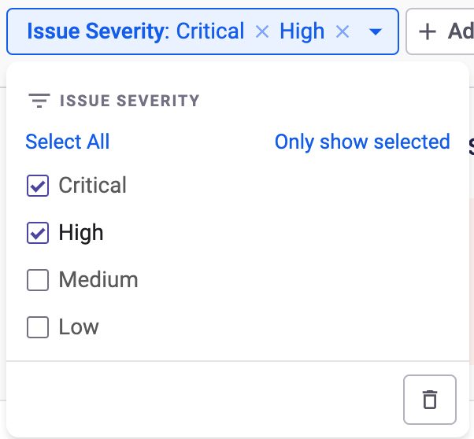

# Snyk 보고서 소개

보고서는 Snyk 탐색에서 **보고서** 탭에서 확인할 수 있습니다.

상단 왼쪽의 드롭다운에서 다른 보고서로 이동할 수 있습니다. 현재 선택된 보고서가 표시됩니다.

## Snyk 보고 필터

모든 보고서는 여러 속성별로 필터링할 수 있어 사용 사례에 맞는 수평 또는 수직으로 비즈니스 슬라이스를 만들 수 있습니다. 사용 가능한 필터는 상단 가장 우측의 드롭다운에서 확인할 수 있습니다.

특정 키에 대해 값을 선택하거나 입력하지 않으면 필터가 적용되지 않습니다.

### 필터링된 뷰를 위한 상태가 있는 URL

필터 값을 적용할 때마다 app.snyk.io URL이 업데이트되어 페이지의 상태가 유지됩니다. URL을 즐겨찾기에 추가하고 복사하여 적절한 Snyk 조직 또는 그룹 액세스를 가진 사람과 공유할 수 있습니다. 쉬운 공유를 위해 보고서 목록 오른쪽 상단의 URL 복사 버튼을 사용합니다.

### Snyk 보고 필터 로직

각 필터 내에서 모든 선택된 값은 OR 연산자로 구분됩니다. 예를 들어, `이슈 심각도` 필터에서 `Critical` 및 `High` 값을 선택하면 Snyk는 `critical` 또는 `high` 심각도를 가진 이슈를 표시합니다.

<figure><figcaption>
이슈 심각도 선택됨
</figcaption></figure>

필터는 AND 연산자로 구분됩니다. 예를 들어, `이슈 심각도` 필터에서 `Critical` 값을 선택하고 `이슈 상태` 필터에서 `해결됨` 값을 선택하면 Snyk는 `critical` 심각도이자 `해결된` 이슈를 표시합니다.

## Snyk 보고서 내보내기

보고서를 PDF로 내보내거나 보고서 내에서 테이블 데이터를 CSV로 다운로드할 수 있습니다.

### Snyk 보고서를 PDF로 내보내기

**PDF로 내보내기** 버튼을 사용하여 보고서의 내용 뿐만 아니라 누가 보고서를 실행했는지, 언제 내보냈는지, 보고 중인 범위 (Snyk 조직 또는 그룹) 및 적용된 필터 등을 포함한 PDF를 다운로드할 수 있습니다.

PDF로 내보내면 Snyk 앱에 인증하지 않아도 되거나 해서는 안 되는 사용자(경영진 또는 외부 감사인 등)와 보고서를 공유할 수 있습니다. **PDF로 내보내기**는 필요한 컨텍스트와 함께 시점 맞춤 서약을 제공합니다.

보고서의 테이블 데이터에서 PDF 내보내기 시 처음 50개 결과만 표시됩니다. PDF 내보내기에서 보고서를 브라우저에서 보는 데 사용되는 링크가 제공됩니다.

다음은 PDF 내보내기의 예시입니다.



### Snyk 보고서를 CSV 파일로 다운로드

보고서에서 우측에 있는 **CSV 다운로드** 버튼을 사용하여 테이블에서 제시된 데이터를 CSV로 다운로드할 수 있습니다. 이 정보는 예를 들어 우선 순위 지정을 위해 또는 엑셀 또는 유사한 도구에서 데이터의 일회성 분석에 사용될 수 있습니다.

UI에 표시된 모든 열이 CSV 출력에 포함됩니다. 또한 UI에서 하이퍼링크가 포함된 열은 텍스트를 포함하는 하나의 열과 링크된 URL을 포함하는 다른 열로 분할됩니다.

행 제한은 없지만 파일 크기 제한은 5GB입니다.

**CSV 다운로드** 버튼은 보고서에 취약점이 없는 경우 비활성화됩니다. 이는 조직에 취약한 프로젝트가 없거나 적용된 필터로 모든 취약점이 제거된 경우입니다. 이 경우에도 증명을 위해 PDF로 보고서를 내보낼 수 있습니다.&#x20;

## 열 정렬

테이블 내 열을 정렬하려면 열 머리글 옆의 화살표를 클릭합니다. 한 번 클릭하면 오름차순으로 정렬되고, 두 번 클릭하면 내림차순으로 정렬됩니다. 세 번 클릭하면 해당 열의 정렬이 제거됩니다. 다중 열 정렬이 지원됩니다.

열이 정렬될 때, app.snyk.io URL이 업데이트되어 페이지의 상태가 유지되어 즐겨찾기에 추가하고 복사하여 공유할 수 있습니다.

## Snyk 보고서 열 수정

일부 보고서에서 테이블에 열 수정 옵션이 포함될 수 있습니다. 해당 옵션이 제공될 경우, UI에 표시할 열을 선택하는 데 사용할 수 있으며, 내보내기 기능(PDF 및 CSV)은 선택된 열을 존준합니다.

열이 수정될 때, app.snyk.io URL이 업데이트되어 페이지의 상태가 유지되어 즐겨찾기에 추가하고 복사하여 공유할 수 있습니다.