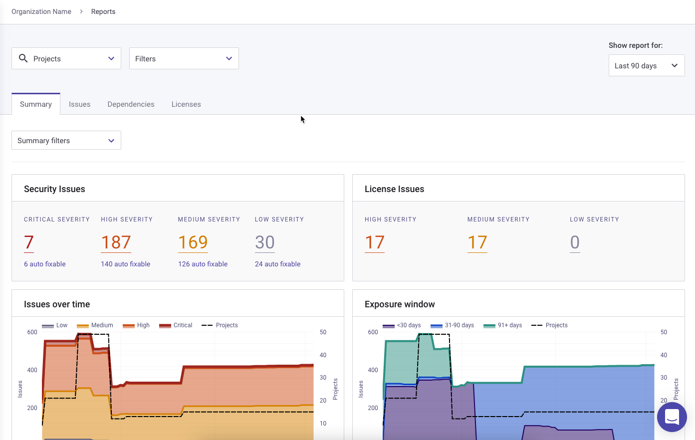

# 레거시 보고서


**기능 가용성**\
Snyk 보고는 엔터프라이즈 플랜에서만 사용 가능합니다. 자세한 정보는 [요금제 및 가격 책정](https://snyk.io/plans/)을 참조하십시오.


Snyk 보고서는 조직 또는 그룹의 모든 프로젝트, 이슈, 의존성 및 라이선스의 상태를 보여줍니다.

Snyk 보고서는 보안 및 개발 팀이 함께 작업할 수 있게 합니다. 코딩 작업이 진행됨에 따라 Snyk 보고 대시보드를 통해 보안 전문가들은 활동을 모니터링하고 개발 부서를 살펴보지 않고도 보안 통찰력을 유지할 수 있습니다.

추가 정보 및 레거시 보고서를 구성하고 사용자화하는 방법은 [보고서 개요](legacy-reports-overview.md) 페이지를 참조하십시오.


Snyk 코드 프로젝트는 보고를 지원하지 않습니다.


보고서를 보려면 **보고서** 메뉴 옵션을 선택하십시오:

