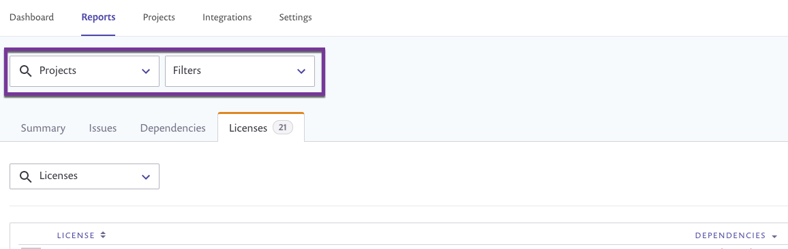
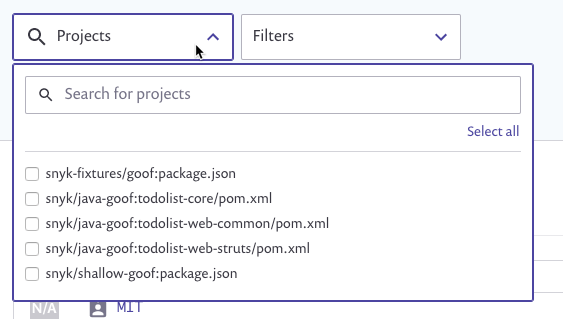
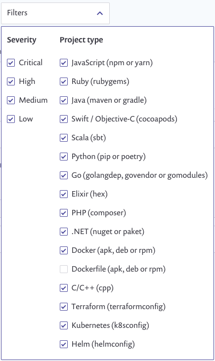

# 레거시 보고서 일반 작업

이 섹션은 모든 보고서 탭에서 수행할 수 있는 작업에 대해 설명합니다.

## 필터 적용

조직 수준에서 Reports 영역 상단부터, 특정 Snyk 프로젝트를 검색하고 필터링할 수 있으며 심각도와 유형별로 프로젝트를 필터링할 수 있습니다. 필터를 적용한 후에는 탭 간에 이동하면서 설정이 유지됩니다.


필터링에 대한 최대 지원 프로젝트 수는 1,000개입니다.


<figure><figcaption>
보고서 필터
</figcaption></figure>

특정 프로젝트를 검색하고 필터링하려면 **프로젝트** 검색 필드에서 드롭다운을 열어야 합니다. 또는 프로젝트 이름의 일부를 입력할 수 있습니다.

<figure><figcaption>
보고서 필터 - 프로젝트
</figcaption></figure>

취약점 심각도 및 프로젝트 유형으로 필터링하려면 **필터** 드롭다운을 엽니다.

<figure><figcaption>
보고서 필터 - 취약점 및 프로젝트 유형별
</figcaption></figure>

## 그룹 및 조직의 데이터로 이동하여 보기

단일 조직의 데이터를 보려면 해당 조직의 관리자여야 합니다. 다음 단계를 따르세요:

1. 상단 패널의 드롭다운 목록에서 조직을 선택합니다.
2. **보고서** 로 이동합니다.

선택한 조직에 대한 데이터만 표시됩니다.

## 여러 조직의 데이터 보기

그룹 관리자는 단일 그룹에서 여러 조직의 보고서 데이터를 볼 수 있습니다. 다음 단계를 따르세요:

1. 상단 패널의 드롭다운 목록에서 그룹을 선택합니다.
2. **보고서** 로 이동합니다.\
   그룹에 속한 모든 조직의 데이터가 표시되며 조직의 동적 드롭다운이 제공됩니다.
3. 보고 싶은 조직을 선택하거나 선택 취소합니다.
4. 선택한 조직을 빠른 필터로 저장하려면 고유 이름을 지정한 후 **저장**을 클릭합니다.

## 열 정렬

데이터를 정렬할 수 있는 열에는 해당 헤딩 옆에 화살표가 있습니다. 해당 카테고리에 따라 데이터를 내림차순으로 정렬하려면 화살표를 클릭하십시오. 다시 클릭하여 오름차순으로 전환합니다.