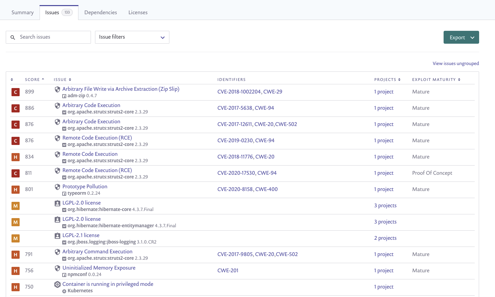
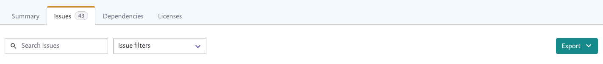
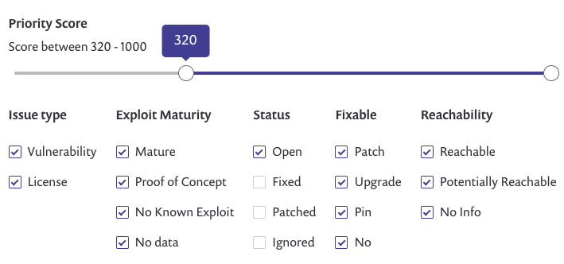

# Legacy Reports Issues 탭

### 개요

**Issues** 탭은 조직 전반에 걸쳐 알려진 취약점 및 라이선스 불일치를 표시하며 각 문제에 대한 세부 정보, 영향을 받는 프로젝트 및 각 문제를 어떻게 해결할 수 있는지를 나타냅니다.


각 탭의 데이터는 보고서 영역 상단에서 적용한 필터 및 보고서 보는 그룹 또는 조직에 따라 나타납니다.


기본적으로 문제는 [Snyk 우선 순위 점수](../../../manage-risk/prioritize-issues-for-fixing/priority-score.md)에 따라 순위가 매겨지며 열을 기준으로 필터링할 수도 있습니다. 예를 들어, 가장 높은 점수와 가장 많은 성숙도를 가진 (많은 공격을 받을 가능성이 높은) 항목을 살펴볼 수 있습니다. 또한 수정된 항목의 목록을 추적할 수도 있습니다.

결과를 내보내거나 인쇄하려면 **Export**를 클릭하십시오.

<figure><figcaption>
Issues tab results
</figcaption></figure>


사용중인 필터 및 검색에 따라 현재 보고 중인 문제 수가 Issues 탭 레이블에 표시됩니다.&#x20;


#### 그룹화 및 그룹화되지 않은 뷰

일반적인 건강 상태의 개요를 얻으려면 기본 그룹화된 뷰를 사용하여 각 문제당 영향을 받는 프로젝트 수와 프로젝트에 영향을 미치는 문제의 수를 조사하십시오.

그 외에 **View issues ungrouped**를 클릭하여 데이터를 그룹화하지 않고 프로젝트를 표시하는 개별 라인을 보거나, 동일한 문제가 여러 프로젝트에 영향을 미치는 경우 해당 문제가 여러 번 나타날 수 있습니다. 이 그룹화되지 않은 뷰는 각 영향 받는 프로젝트 및 권장 해결 방법에 대해 더 많은 세부 정보를 제공합니다.

보기를 전환하려면 **View issues ungrouped** 또는 **View issues grouped** 링크를 클릭하십시오.

### Issues 탭 요소

#### 모든 뷰

다음 필드들은 그룹화된 뷰와 그룹화되지 않은 뷰에 모두 나타납니다:

| **요소**      | **설명**                                                                                                                                                                                                                                                                                                                                                                                                                                                                                                                                                                                                                                                                                                                                                                                                                                                                                                                                                                                   |
| ---------------- | ------------------------------------------------------------------------------------------------------------------------------------------------------------------------------------------------------------------------------------------------------------------------------------------------------------------------------------------------------------------------------------------------------------------------------------------------------------------------------------------------------------------------------------------------------------------------------------------------------------------------------------------------------------------------------------------------------------------------------------------------------------------------------------------------------------------------------------------------------------------------------------------------------------------------------------------------------------------------------------------------- |
| 심각도         | 
이 문제와 관련된 <a href="../../../manage-risk/prioritize-issues-for-fixing/severity-levels.md">심각도 수준 </a>에 대한 아이콘:

중대함

높음

중간

낮음
                                                                                                                                                                                                                                                                                                                                                                                                 |
| 점수            | [Snyk 우선 순위 점수](../../../manage-risk/prioritize-issues-for-fixing/priority-score.md), 문제를 해결하는 순서를 안내하는 데 유용합니다.                                                                                                                                                                                                                                                                                                                                                                                                                                                                                                                                                                                                                                                                                                                                                                                                                                                |
| 문제            | 문제의 공식적인 이름 및 프로젝트에서 포함된 모든 영향 받는 패키지 목록. 문제는 **Package** 페이지에 연결됩니다.                                                                                                                                                                                                                                                                                                                                                                                                                                                                                                                                                                                                                                                                                                                                                                                                                                              |
| 식별자      | 모든 연관된 CVE 식별자. 각 식별자는 관련 있는 경우 개별적으로 완전한 공식 CVE 또는 CWE 취약점 세부 정보에 연결됩니다.                                                                                                                                                                                                                                                                                                                                                                                                                                                                                                                                                                                                                                                                                                                                                                                                                                                         |
| 프로젝트         | 
문제가 그룹화되지 않은 상태에서 본 경우, 이는 특정 문제에 영향을 받는 모든 프로젝트의 완전한 목록이며, 프로젝트의 소스를 나타내는 지표입니다.

문제가 그룹화된 경우, 이 열에는 문제에 영향을 받는 프로젝트 수가 표시됩니다.

프로젝트 수를 클릭하여 해당 그룹화에 속한 모든 영향을 받는 프로젝트가 표시되는 패널을 엽니다. 이 뷰에서의 세부 정보는 다음과 같습니다:
<ul><li>프로젝트</li><li>상태</li><li>프로젝트에서 문제가 감지된 도입 날짜</li><li>수정 가능 사항—업그레이드 또는 패치를 통해 문제를 제거할 수 있는지 여부</li></ul>                                                                                                                                                                                                                                                                                                                                                                                  |
| 악용 성숙도 | 취약점에 대한 악용 가능성이 얼마나 실제적인지: (참조: <a href="../../../manage-risk/prioritize-issues-for-fixing/view-exploits.md">악용 보기</a>)
<ul><li><strong>성숙함:</strong> 이 취약점에 대한 게시된 코드 악용이 쉽게 사용할 수 있습니다.</li><li><strong>컨셉 증명:</strong> 게시된 이론적인 컨셉 증명 또는 취약점을 악용하는 방법을 보여주는 자세한 설명이 있습니다.</li><li><strong>악용 알려짐:</strong> 이 취약점에 대해 프루프 오브 컨셉 코드나 악용이 발견되지 않았거나 공개적으로 제공되지 않았습니다.</li><li>
<strong>데이터 없음</strong>: 이 값은 다음 중 하나를 나타냅니다:
<ul><li>문제가 취약점이 아님(라이선스 문제일 수도 있음).</li><li>생능이 현재 Snyk에서 지원되지 않음.</li><li>이 기능의 발표 이전에 프로젝트를 가져왔음. 이 데이터를 스캔하기 위해 프로젝트를 다시 가져와야 합니다.</li></ul></li></ul> |

#### 그룹화되지 않은 뷰만

다음 필드들은 Issues 그룹화된 칼럼 뷰 비화되지 않은 뷰로 볼 때만 나타납니다:

| **요소**  | **설명**                                                                                                                                                                                                                                                                                                                                                                                                                                                                                                                                                                                                                                                           |
| ------------ | ------------------------------------------------------------------------------------------------------------------------------------------------------------------------------------------------------------------------------------------------------------------------------------------------------------------------------------------------------------------------------------------------------------------------------------------------------------------------------------------------------------------------------------------------------------------------------------------------------------------------------------------------------------------------- |
| 수정 가능      | 취약점을 수정하는 데 사용 가능한 업그레이드 또는 패치가 있습니다.

(<a href="../../../scan-with-snyk/snyk-open-source/manage-vulnerabilities/vulnerability-fix-types.md">취약점 수정 유형</a>도 참조):
<ul><li><strong>패치</strong>: Snyk 패치로 해결할 수 있는 문제.</li><li><strong>업그레이드</strong>: 영향을 받는 패키지를 업그레이드하여 해결할 수 있는 문제.</li><li><strong>핀</strong>: 간접 종속성을 직접 종속성으로 변경하여 해결할 수 있는 문제. <strong>참고:</strong> 현재 파이썬 전용입니다.</li><li><strong>없음</strong>: 현재 알려진 해결 방법이 없는 문제.</li></ul> |
| 도입된 날짜   | 해당 문제가 프로젝트에 도입된 날짜.                                                                                                                                                                                                                                                                                                                                                                                                                                                                                                                                                                                                                         |
| 상태       | 취약점의 현재 상태:
<ul><li><strong>열림</strong>: 처리되지 않은 문제</li><li><strong>수정됨</strong>: Fix PR이 제출된 문제 (자동적으로 Snyk에 의해)</li><li><strong>패치됨</strong>: Snyk 패치로 해결된 문제</li><li><strong>무시됨</strong>: 무시 정책이 적용되는 문제</li></ul>                                                                                                                                                                                                                                                                                  |
| 도달성 | 취약점이 코드에서 취약한 기능까지의 경로가 있는지 여부 (참조: <a data-mention href="../../../manage-risk/prioritize-issues-for-fixing/reachability-analysis.md">reachability-analysis.md</a>):
<ul><li><strong>도달 가능</strong>: 앱의 코드에서 취약한 기능까지 명확한 경로가 있습니다.</li><li><strong>잠재적으로 도달 가능</strong>: 취약성에 노출될 수 있는 조짐이 있습니다.</li><li><strong>경로가 찾아지지 않았음</strong>: 취약점이 도달 가능한지 여부를 결정하기에 충분한 정보가 없습니다.</li></ul>                                                                                                                                                                                  |
| Jira 문제   | 프로젝트에 Jira 통합이 구성되어 있고 Snyk에서 문제에 대한 Jira 문제가 제기된 경우,이 열에는 Jira 키가 표시되며 해당 문제를 Jira 내에서 링크합니다.                                                                                                                                                                                                                                                                                                                                                                                                                                                                              |

### Issues 탭 동작

이 컨트롤이 테이블 위에 나타납니다:

<figure><figcaption>
Issues tab actions
</figcaption></figure>

**문제 검색:** CVE, CWE 또는 식별자 이름(예: DDoS)을 기반으로 검색합니다. CVE 또는 CWE로 검색할 때는 정확한 값(예: CVE-1234)을 제공해야 하지만 식별자 이름으로 검색할 때는 단어 일부를 입력하면 결과가 표시됩니다.

**문제 필터:** 우선 순위 점수 범위, 특정 문제 유형, 악용 성숙도, 상태, 수정 가능한 값 및 도달성을 선택하여 표시할 문제를 지정합니다. **Issues 탭 요소** 섹션에 설명된대로.

<figure><figcaption>
Issue filters
</figcaption></figure>

**Export**—버튼을 클릭하여 문제 데이터를 내보낼 형식을 선택하십시오:

* CSV
* 로컬 환경의 인쇄 대화 상자에서 미리보기 생성/인쇄합니다. 이 기능은 몇 초가 소요될 수 있습니다.


한 번에 2,000개의 문제만 생성할 수 있습니다.
