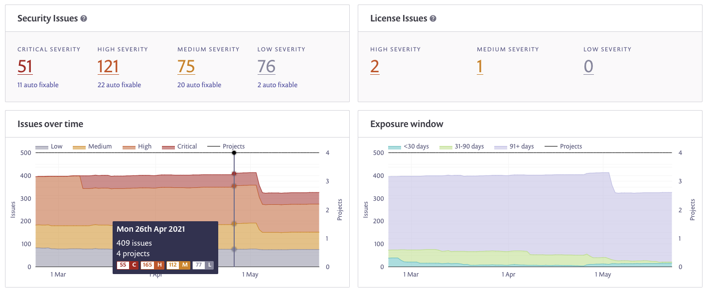

# 레거시 리포트 개요

웹 UI의 레거시 **리포트** 영역은 프로젝트, 이슈, 의존성 및 라이선스에 대한 데이터 및 분석을 제공합니다. 또한 [API](../../../snyk-api/reference/reporting-api-v1.md)를 사용하여 리포트 데이터를 생성하고 검색할 수도 있습니다.

리포트 정보는 작업 중인 조직을 기반으로 웹 UI에 나타나며, 이러한 데이터를 다양한 매개변수로 필터링할 수 있습니다.

또한 계정이 그룹으로 관리되는 경우 **그룹** 수준에서 **리포트**로 이동하면 모든 조직에 대한 집계 데이터를 볼 수 있습니다.

**그룹** 수준에서 여러 조직의 데이터를 보려면 다음 예시처럼 필터링할 수 있습니다:

<figure><figcaption>
그룹 수준 보고서
</figcaption></figure>

**조직** 수준에서는 [일반 작업](legacy-reports-general-actions.md)을 사용하여 다음과 같이 필터링할 수 있습니다:

* 프로젝트 이름
* 프로젝트 유형
* 취약점 심각도
* 특정 기간

레거시 **리포트 탭**은 다음과 같습니다:

* [요약](legacy-reports-summary-tab.md): 메인 대시보드에서 모든 프로젝트의 이슈(취약성 및 라이선스)에 대한 요약보기를 표시합니다.
* [이슈](legacy-reports-issues-tab.md): 모든 프로젝트의 이슈(취약성 및 라이센스)를 표시하며 심각성, 가능한 수정 사항 등을 포함합니다.
* [의존성](dependencies-tab.md): 프로젝트의 패키지 의존성 및 그들의 건강 상태를 보여줍니다.
* [라이선스](legacy-reports-licenses-tab.md): 모든 프로젝트의 라이선스 및 그들의 상태를 표시합니다.

프로젝트가 테스트된 시점부터 리포트 영역에 해당 데이터가 표시되기까지 지연이 발생할 수 있습니다. 9시간 이상의 지연이 있는 경우 [Snyk 지원팀에 문의하세요](https://support.snyk.io).

읽기 전용 및 비활성화된 프로젝트와 결과는 리포트 영역에 표시되지 않습니다.