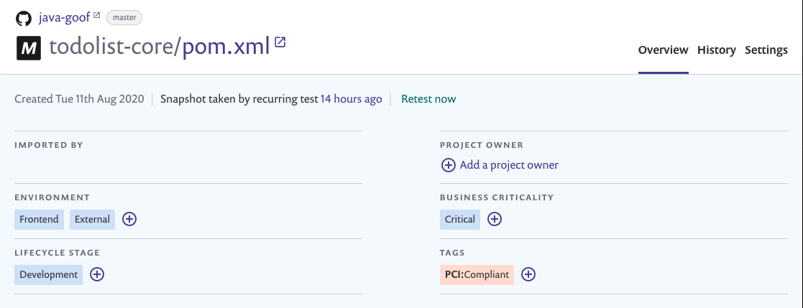
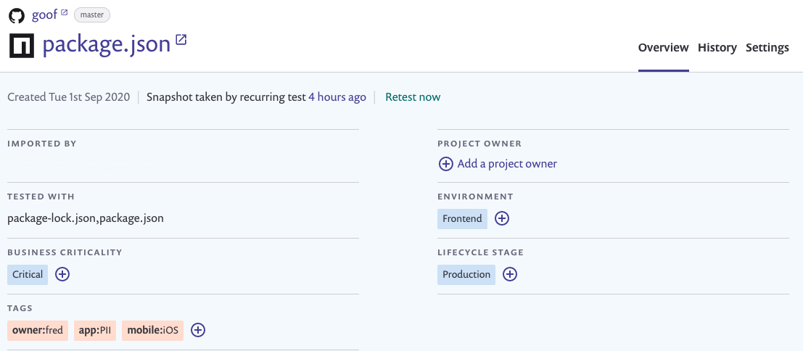
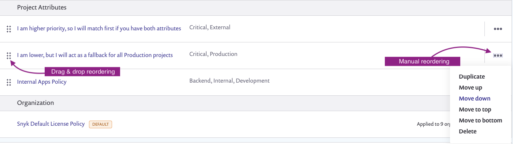

# 프로젝트에 정책 할당하기

프로젝트에 [프로젝트 속성](../../snyk-admin/snyk-projects/project-attributes.md)을 적용한 후, 해당 속성에 적용되는 정책을 만들 수 있습니다. 프로젝트와 정책은 정책이 적용된 속성을 기반으로 연결됩니다.


프로젝트 속성에 적용된 정책은 언제나 조직에 적용된 정책보다 우선합니다.


정책은 하나 이상의 프로젝트 속성에 적용될 수 있지만, 특정 속성 집합에는 하나의 정책만 적용됩니다. 예를 들어, `Critical`, `Production`, `Frontend`에 적용된 정책이 있다면, 이와 정확히 동일한 속성에 적용된 정책은 생성할 수 없습니다.


프로젝트 속성에 적용된 정책은 CLI 명령어 `snyk monitor`에 영향을 줍니다. 이는 프로젝트 속성이 할당된 CLI 프로젝트에서 실행되는 것을 가정합니다. 정책에 적용된 프로젝트 속성은 `snyk test`에 영향을 주지 않습니다.


## 프로젝트 속성에 정책 적용 및 정책 제거

특정 속성에 정책을 적용하려면, 속성 선택 패널에서 해당 속성의 상자를 선택합니다.

이미 그룹 내 프로젝트에서 생성된 태그를 검색할 수도 있습니다. 정책에 대해 두 개 이상의 태그를 선택할 수 있습니다.

<figure><figcaption>
속성 선택 패널
</figcaption></figure>

속성에서 정책을 제거하려면, 제거하려는 속성 옆의 상자를 선택 해제합니다.

태그를 제거하려면 해당 태그 옆의 **x**를 클릭합니다.


어떤 속성에도 선택되지 않은 상태에서 정책을 생성 및 저장할 수 있습니다. 이는 아직 정책을 적용할 속성을 결정하지 않은 경우에 사용됩니다. 모든 속성을 비워 둔 채로 정책을 프로젝트에 적용할 수는 없습니다.


## 프로젝트에 정책 할당

정책이 할당되려면 해당 정책이 프로젝트에 적용된 모든 속성을 가져야 합니다. 프로젝트에는 정책에 나열된 속성 외에도 다른 속성이 있을 수 있습니다.


정책이 속성에 따라 프로젝트에 적용되면 **프로젝트 속성 편집 권한을 가진 역할**이 프로젝트 속성을 편집할 수 있습니다.


정책에 여러 태그가 추가된 경우, 프로젝트는 프로젝트 태그 중 하나와 일치해야 합니다. 그러나 다른 속성도 정책에 나열되어 있다면, 프로젝트는 모든 속성과 나열된 태그 중 하나 이상을 가져야 합니다.

예를 들어, `Critical`, `External`, `Frontend`에 정책이 적용된 경우, 해당 속성을 가진 프로젝트에 할당되지만, `Critical` 및 `External` 속성만 가진 프로젝트에는 할당되지 않습니다.

아래에는 그 예시가 있습니다. 이 정책은 **중요도** 섹션에 있는 `Critical` 속성과 **환경** 섹션에 있는 `Frontend` 및 `External` 속성에 적용됩니다. 정책에는 두 개의 프로젝트 태그가 포함되어 있습니다. 첫 번째 태그는 키가 `PCI`이고 값이 `Compliant`인 태그입니다. 두 번째 태그는 키가 `owner`이고 값이 `fred`인 태그입니다.

다음 프로젝트는 `Frontend`, `External`, 그리고 `Critical` 속성을 가지고 있으며, 적어도 하나의 일치하는 태그 `PCI:Compliant`를 가지고 있습니다. 따라서 해당 프로젝트는 정책을 상속받게 되며, 즉, 이 정책이 해당 프로젝트에 할당됩니다.

<figure><figcaption>
정책 상속 프로젝트
</figcaption></figure>

다음 프로젝트는 `External` 환경 속성이 없기 때문에 해당 정책을 상속받지 않습니다.

<figure><figcaption>
정책 미상속 프로젝트
</figcaption></figure>

## 프로젝트에 여러 정책 할당

프로젝트에는 여러 정책을 할당할 수 있습니다. 예를 들어, `Critical`와 `External`에 적용된 정책과 `Critical`와 `Production`에 적용된 다른 정책이 있다면, `Critical`, `External`, 및 `Production` 속성을 가진 프로젝트에는 두 정책이 모두 할당됩니다.

프로젝트에 여러 정책이 할당된 경우, 정책 관리 페이지에서의 순서가 우선권을 결정합니다. 목록에서 맨 위에 있는 정책이 그 뒤에 할당된 다른 정책보다 우선권을 갖습니다. 정책 순서를 변경하려면, 해당 정책을 드래그하여 원하는 순서로 이동하거나, 오른쪽에 있는 세 개의 점을 사용하여 정책을 위아래로 이동시킬 수 있습니다.

<figure><figcaption>
정책 순서 변경
</figcaption></figure>
  