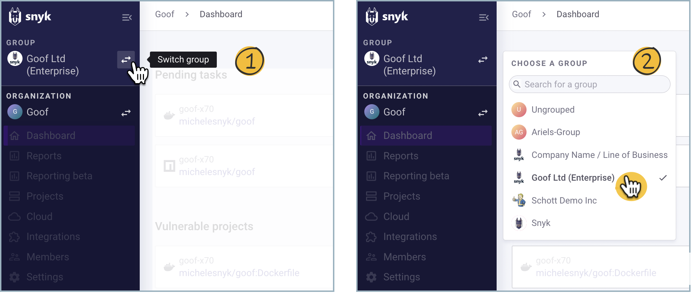
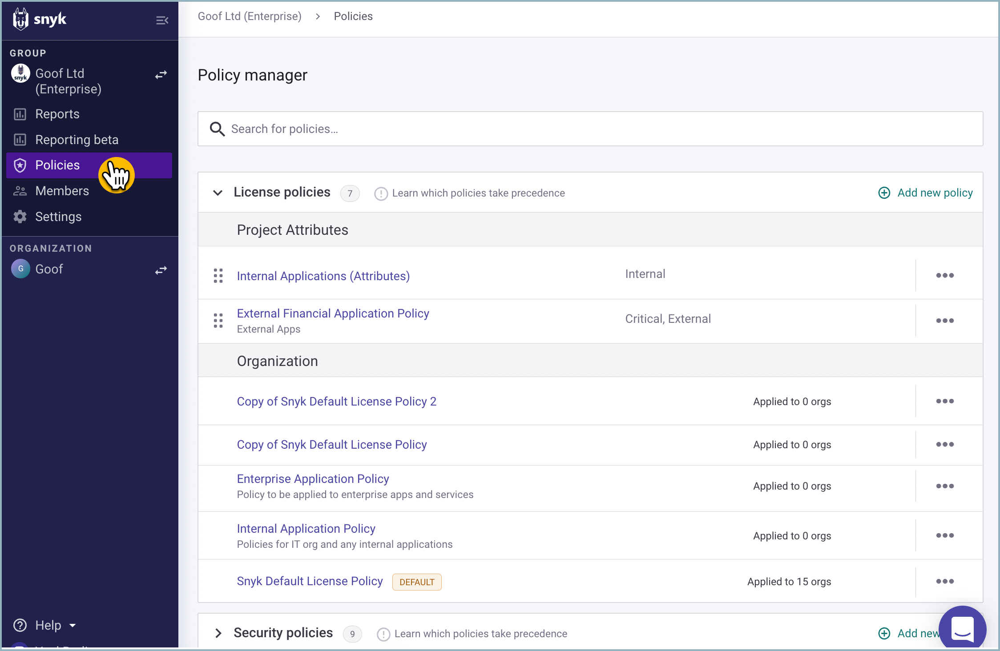
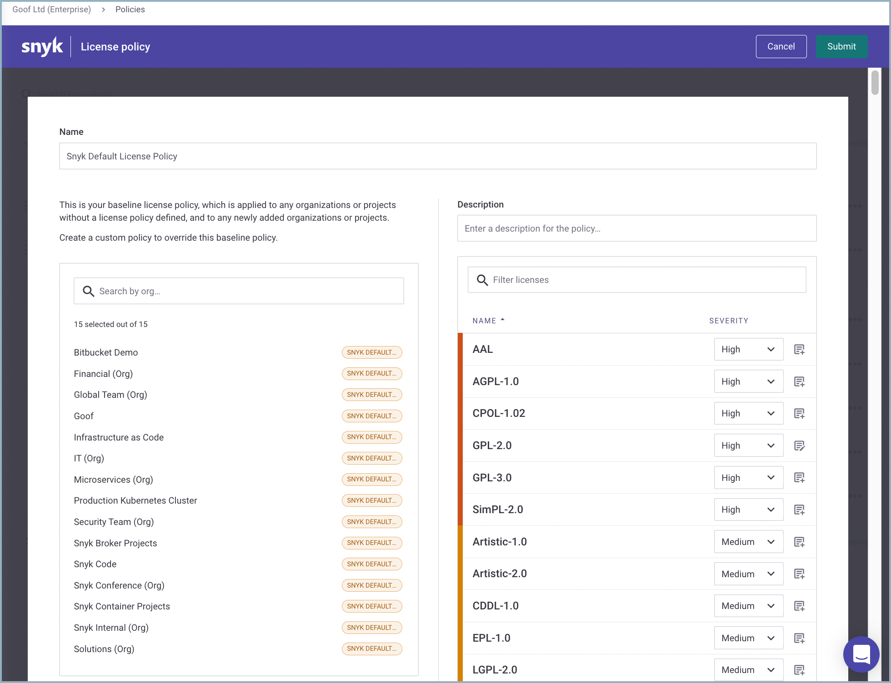
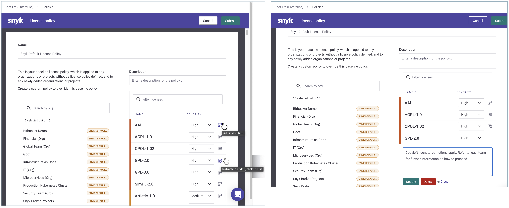

# 라이선스 정책 및 규칙 만들기


**기능 가용성**

라이선스 정책은 엔터프라이즈 플랜에서만 사용할 수 있으며 Snyk Open Source 스캔에만 적용됩니다. 자세한 정보는 [요금 및 가격](https://snyk.io/plans/)을 참조하십시오.


그룹 관리자는 각 라이선스에 대해 다음 설정을 구성할 수 있습니다:

* 심각성 수준: `None`, `Low`, `Medium`, `High`과 같은 값이 있습니다.
  * `없음`을 선택하면 `없음`으로 표시된 라이선스는 어떤 Snyk 테스트 결과에도 나타나지 않으므로 사용 방법을 삽입할 수 없습니다.
  * Snyk에 의해 추가된 새 라이선스는 `Unknown` 라이선스 유형의 심각성을 상속합니다. 이 심각성이 `None`으로 설정되지 않은 경우에는 새로 추가된 라이선스가 Snyk 테스트 결과에 나타납니다.
* 개발자들을 위한 법적 지침: 개발자들에게 필요한 모든 지침을 제공하기 위해 자유 텍스트를 입력합니다.
  * Snyk은 회사의 구체적인 정책을 설명하고, 개발자로부터 협력이 필요한 이유를 설명하며 필요한 경우 단계별 지침을 제공하는 것을 권장합니다.
  * 법적 지침은 CLI 결과, PR Checks 및 프로젝트 보기의 이슈 카드에 나타납니다.

## 라이선스 정책 보기 및 편집

회사 계정에 하나 이상의 그룹이 있는 경우 다음 단계를 따라 라이선스 정책 설정을 보고 편집할 수 있습니다:

1.  **그룹 전환** 선택기를 사용하여 그룹을 선택하고 개요를 엽니다.

    <figure><figcaption>
그룹 전환
</figcaption></figure>
2.  **정책 > 정책 관리자 > 라이선스 정책 > 조직**으로 이동하고 편집하려는 정책을 선택합니다.

    <figure><figcaption>
업데이트할 정책 선택
</figcaption></figure>

**라이선스 정책** 화면에는 정책이 적용되는 조직 목록, 정책 설명 및 정책에 포함된 라이선스가 표시됩니다.

라이선스 심각성 및 지침을 편집할 수 있습니다.

<figure><figcaption>
라이선스 정책 개요
</figcaption></figure>

## 라이선스 정책에 규칙 및 심각성 할당

1. **정책 관리자**로 이동하여 **라이선스 정책 > 조직**으로 이동하고 **라이선스 정책** 화면을 엽니다.
2. 특정 라이선스에 대해 심각성을 설정하려면 **라이선스 정책** 화면에서 **심각성** 선택기를 클릭하고, **심각성 수준**을 선택하여 Snyk 테스트가 실행될 때 식별하려는 라이선스 문제를 정의합니다.\
   **없음** 외의 심각성을 선택하고 해당 라이선스 문제가 식별되었을 때 추가적인 지침이나 수정 권장 사항이 표시되길 원하는 경우, **심각성** 드롭다운 오른쪽에 있는 지침 아이콘을 선택하여 라이선스 지침을 입력합니다.
3. 변경 사항을 확인하려면 **추가** 또는 **업데이트**를 클릭합니다.
4. 정책을 저장하려면 **제출**을 클릭합니다.

<figure><figcaption>
라이선스 정책 지침 업데이트
</figcaption></figure>

<figure><figcaption>
정책 지침 제출
</figcaption></figure>

업데이트된 심각성 또는 지침 또는 둘 다가 자동으로 Snyk 서버에 업데이트됩니다. 다음 예정된 테스트 실행 시 또는 사용자가 프로젝트를 다시 테스트할 때 이러한 변경 사항에 따라 업데이트된 결과가 제공됩니다. 자세한 내용은 [라이선스 정책 결과](license-policy-results.md)를 참조하십시오.

## `Unknown` 라이선스 유형에 대한 심각성 설정

`Unknown` 라이선스 유형은 특정 패키지 버전에 대해 Snyk이 라이선스를 인식하지 못했음을 나타냅니다. **Unknown**에 대한 심각성 레벨을 설정하여 이러한 라이선스 문제가 더욱 두드러지게 나타나도록 할 수 있습니다.

편집 중인 정책 오른쪽에 있는 라이선스 목록을 스크롤하고 **Unknown** 라이선스 유형에 대한 심각성 드롭다운을 선택합니다:

<figure><figcaption>
Unknown 라이선스 유형에 대한 심각성 설정
</figcaption></figure>


Snyk은 새 라이선스를 라이선스 정책에 추가할 때 **Unknown**에 대해 설정된 심각성 수준을 적용합니다.

