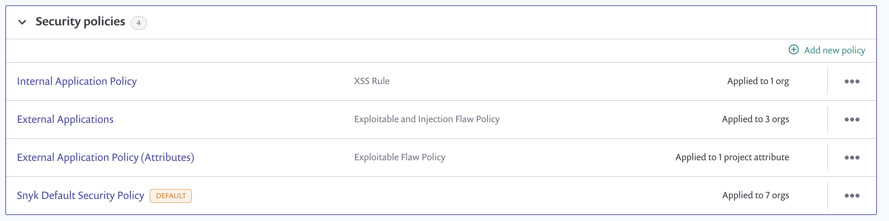
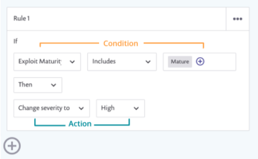

# 보안 정책 및 규칙 생성

새 보안 정책을 생성하려면, 그룹 메뉴에서 **Policies**로 이동한 후, 정책 관리자에서 **Security policies** 카테고리를 확장하고 **Add new policy**를 클릭하십시오. 자세한 내용은 [View policies](../view-create-and-modify-policies.md)를 참조하십시오.

<figure><figcaption>
보안 정책 카테고리 확장
</figcaption></figure>


**Snyk Default Security Policy**를 선택하여 그룹 내 모든 조직의 모든 프로젝트에 적용되는 보안 정책의 조건 또는 작업을 변경할 수 있습니다.

보안 정책은 {{Snyk Open Source}} 및 {{Snyk Container}} 프로젝트에 적용됩니다.


## 규칙, 조건 및 작업

보안 정책 규칙은 하나 이상의 조건과 작업이 있는 "만약, 그렇다면" 형식으로 작성됩니다. 다음은 예시입니다:

<figure><figcaption>
규칙 추가를 위한 플러스 기호 및 오른쪽 상단 세 개의 점이 있는 보안 정책 규칙 포맷
</figcaption></figure>


새 보안 정책을 생성할 때, 첫 번째 비어 있는 규칙이 자동으로 생성됩니다.


규칙을 완성하기 위해 조건 및 작업을 선택하십시오. 자세한 내용은 [보안 정책 조건](security-policies-conditions.md) 및 [보안 정책 작업](security-policy-actions.md)을 참조하십시오.

* 새로운 빈 규칙을 추가하려면, 이전 규칙 아래에 있는 플러스 기호를 클릭하십시오.
* 규칙을 삭제하거나 복제하려면, 규칙 상자 오른쪽 상단의 세 개의 점을 클릭하십시오.


작성하는 규칙의 순서가 우선 순위를 결정합니다. 충돌이 발생하는 경우, 맨 위에 있는 규칙이 이후의 모든 규칙보다 우선합니다.
