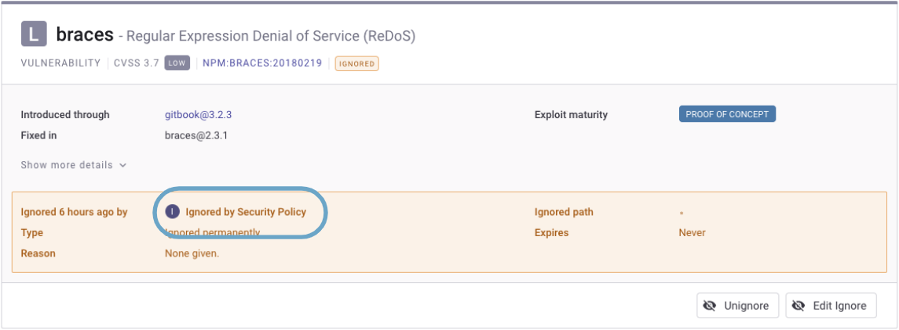
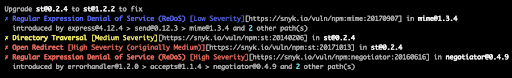
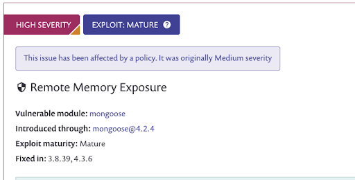
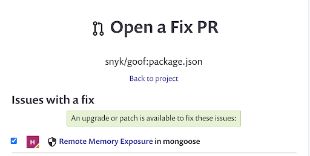
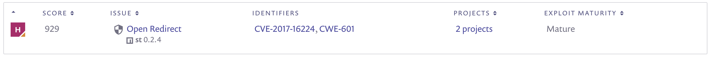

# 보안 정책 결과

프로젝트가 다시 스캔될 때 새로 지정된 정책이나 정책의 변경 사항이 적용됩니다. 이것이 취약점에 대한 조치가 적용될 때 프로젝트 협력자들이 볼 수 있는 것입니다:

|            |                         |
|------------|-------------------------|
| **조치**    | **프로젝트 협력자들이 보는 내용** |
| Severity를 변경          | 새로운 심각도 및 처음 할당된 심각도가 표시됩니다 |
| 현재 및 미래 인스턴스 무시 | 수동으로 무시된 것 같은 무시된 문제이며 **보안 정책에 의해 무시됨**이라고 레이블이 붙습니다. |

보안 정책에 의해 무시된 프로젝트 페이지의 문제에 대한 예시:

## CLI에서 사용자 지정 및 원본 심각도

## 프로젝트 페이지 UI에서 사용자 지정 및 원본 심각도

## Open Fix PR UI에서 사용자 지정 및 원본 심각도

## 보고서에서 사용자 지정 및 원본 심각도

