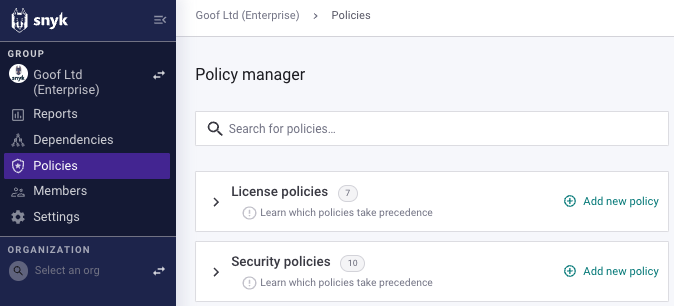
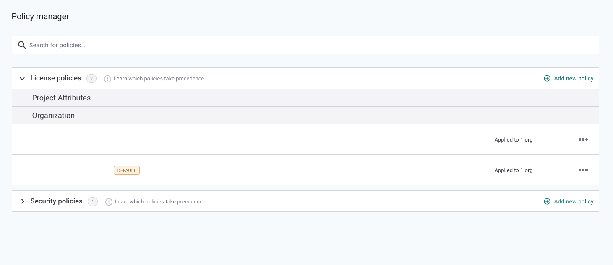
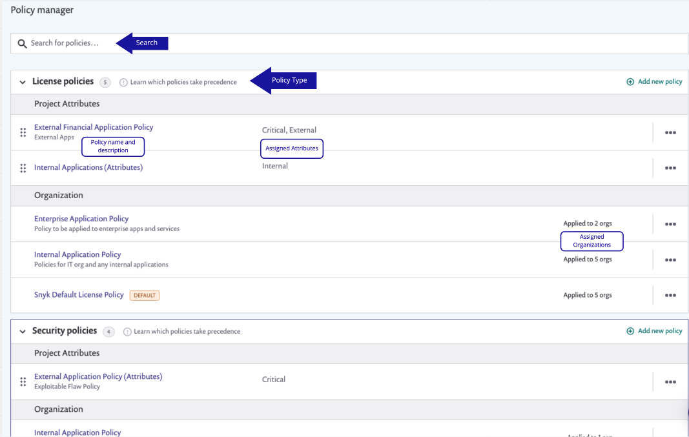
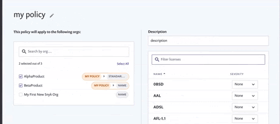

# 정책 보기, 생성 및 수정

## 정책 보기


해당 그룹의 정책을 보고 생성하고 수정하려면 그룹 관리자여야 합니다.


**정책** 메뉴 옵션을 선택하여 그룹 내에서 범주별로 정리된 정책을 볼 수 있습니다. 이것에는 [라이선스 정책](license-policies/)과 [보안 정책](security-policies/)이 포함됩니다.

<figure><figcaption>
정책 보기
</figcaption></figure>

카테고리를 확장하여 해당 카테고리에 속한 정책 목록을 볼 수 있습니다:

<figure><figcaption>
라이선스 정책 목록 확장
</figcaption></figure>


이 목록에는 해당 카테고리에 대해 자동으로 생성되는 [기본 정책](view-create-and-modify-policies.md#기본-정책)이 포함되며, 이는 새로운 그룹에 대해 각 정책 카테고리마다 자동으로 생성되며 삭제할 수 없습니다.


### 정책 세부 정보

카테고리를 확장하면 화면에 **프로젝트 속성** 및 **조직**에 적용된 정책이 표시됩니다. 각 카테고리에서 **선우위 정책이 무엇인지**를 클릭할 수 있습니다. 또한 특정 정책을 **검색**할 수도 있습니다.

<figure><figcaption>
속성 및 각 정책이 적용된 조직이 표시된 정책 매니저 화면
</figcaption></figure>

### 기본 정책

각 정책 카테고리에는 기본 정책이 있습니다. 기본 정책은 조직에만 적용될 수 있으며 프로젝트 속성에는 적용할 수 없습니다.

새로운 조직을 만들면 기본 정책에 자동으로 추가됩니다. 이전 조직의 설정을 복사하지 않은 경우에만 해당되며 원하는 경우 조직을 다른 정책에 지정할 수 있습니다.

기본 정책은 삭제할 수 없지만, 기본 정책의 이름, 설명 및 규칙을 사용자의 선호에 맞게 편집할 수 있습니다. 기본 정책에는 원하는 경우 규칙이 없을 수도 있습니다.

자세한 내용은 [조직에 정책 할당](assign-a-policy-to-an-organization.md)을 참조하십시오.

정책 관리자를 사용하여 정책을 [생성](view-create-and-modify-policies.md#정책-생성), [편집](view-create-and-modify-policies.md#정책-편집) 및 [복제 또는 삭제](view-create-and-modify-policies.md#정책-복제-또는-삭제)할 수 있습니다.

## **정책 생성**

1. 정책 관리자 화면에서 **새로운 정책 추가**를 선택하고 프롬프트에 응답하여 세부 정보를 입력합니다.
2. 정책 이름과 설명을 입력하여 정책을 신속하게 식별할 수 있도록 합니다.\
   동일한 카테고리의 정책은 같은 이름을 가질 수 없습니다. 이름 없이 정책을 저장할 수는 없습니다.
3. 조직 또는 프로젝트 속성에 정책을 적용할지 선택합니다.
4. 정책을 적용할 [조직](assign-a-policy-to-an-organization.md) 또는 [속성](assign-policies-to-projects.md)을 선택합니다.
5. 정책에 규칙을 추가합니다. [라이선스 정책 및 규칙 생성](license-policies/create-a-license-policy-and-rules.md) 또는 [보안 정책 및 규칙 생성](security-policies/create-a-security-policy-and-rules.md)을 참조하십시오.
6. 정책을 생성하고 저장하려면 **제출**을 클릭합니다.

<figure><figcaption>
정책 생성
</figcaption></figure>

## 정책 편집

1. 정책 관리자 탭에서 기존 정책의 이름을 클릭하여 변경사항을 적용합니다.
2. 원하는대로 [조직](assign-a-policy-to-an-organization.md), [속성](assign-policies-to-projects.md) 및 규칙을 변경합니다.
3. 변경사항을 저장하려면 **제출**을 클릭합니다.

## **정책 복제 또는 삭제**

정책을 복제하거나 삭제하려면 우측에 있는 세 점을 클릭합니다:

<figure><figcaption>
정책 복제 또는 삭제
</figcaption></figure>

정책을 복제하면 정책의 규칙이 복사되지만 할당된 조직이나 프로젝트는 복사되지 않습니다. 새로운 정책은 자동으로 **(정책 이름)의 복사본**이 되며, [정책 편집에서 설명된대로](view-create-and-modify-policies.md#정책-편집) 편집할 수 있습니다.


정책을 삭제하면 취소할 수 없습니다. 정책을 삭제하면 해당 정책에 할당된 조직이 기본 정책으로 돌아갑니다.
