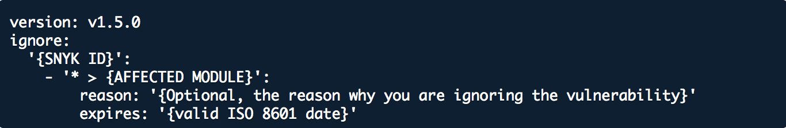

# 문제 무시

스캔 결과에서 문제를 제왕처리하고 싶을 때 취약점이나 오픈 소스 라이선스 문제를 무시할 수 있습니다. 문제가 잠시나 영구적으로 무시되며 단일 항목으로 설정되거나 액션으로 설정할 수 있습니다. Snyk 무시를 사용하면 고쳐야 할 문제만 결과를 표시할 수 있습니다.

오픈 소스 상세 정보는 [무시 설정 방법](./#how-to-set-ignores)을 참조하십시오. 이 정보는 다른 Snyk 스캔 방법과 함께 무시 사용의 유용한 배경을 제공합니다. 이 페이지의 다음 섹션에서 자세한 내용을 확인할 수 있습니다:

- [Snyk Code에서 문제 무시하기](./#ignore-issues-in-snyk-code)
- [Snyk Container에서 문제 무시하기](./#ignore-issues-in-snyk-container)
- [Snyk IaC에서 문제 무시하기](./#ignore-issues-in-snyk-iac)

## 문제 무시 결정

최적으로는 취약점을 고치거나 패치하거나 취약한 종속성을 제거할 수 있어야 합니다. 그러나 다음과 같은 이유로 문제를 억제하고 싶을 수 있습니다:

- 해결 방법이 없음.
- 문제가 프로젝트와 관련이 없음. 예를 들어 내부 서비스에 대한 분산 거부 서비스 (DDoS) 공격과 같은 경우가 있습니다.

취약점이 현재 악용될 수 없는 경로를 가지고 있다 하더라도 문제를 최적화하는 것이 최선입니다. 악용할 수 없는 취약점도 미래에 악용될 수 있습니다.

## 무시 설정 방법

여러 방법으로 문제를 확인하고 무시할 수 있습니다:

- [Snyk Web UI에서 문제 무시](./#ignore-issues-in-the-snyk-web-ui)
- CLI에서 문제 무시하기](./#ignore-issues-in-the-cli)
- [CLI 또는 CI/CD에서 스캔하여 Web UI에서 무시](./#scan-from-the-cli-or-ci-cd-ignore-in-the-web-ui)
- [.snyk 파일을 사용하여 문제 무시](./#use-the-.snyk-file-to-ignore-issues)
- [정책 액션을 사용하여 문제 무시](./#use-policy-actions-to-ignore-issues)

### Snyk Web UI에서 문제 무시

각 문제 카드에는 '무시' 버튼이 있어 문제를 무시하거나 무시한 사유와 무시 기간을 선택할 수 있는 대화 상자가 열립니다.

<figure><figcaption><p>문제 카드에서 무시 대화상자</p></figcaption></figure>

생성 시점에 악용할 수 없다고 판단하는 문제에 대해서는 '취약하지 않음'을 선택할 수 있습니다.

'임시로 무시'를 선택한 경우, '수정 가능해질 때까지' 확인란을 선택할 수 있습니다.

<figure><figcaption><p>임시로 무시</p></figcaption></figure>

해당 문제에 대해 해결책이 없는 경우 기본적으로 선택됩니다. Snyk이 문제를 패치할 때마다 취약성이 다시 나타나며 선택적으로 문제를 무시하는 이유에 대한 추가 세부 정보를 제공할 수 있습니다.


문제는 무시 기간이 만료되거나 취약성이 해결 가능해질 때까지 무시됩니다.

Snyk 웹 UI의 오픈 소스 또는 코드 프로젝트에서 무시된 문제는 프로젝트의 모든 브랜치에서 재차 변경 사항 조사 중에 표시되지 않고 플래그 지정되지 않습니다. [PR checks](../../../scan-with-snyk/pull-requests/pull-request-checks/)를 거치고 나면 검출된 문제가되어야 합니다.


Snyk 웹 UI에서 문제를 무시하면 해당 문제를 무시한 사용자를 표시하고 무시한 문제의 편집 또는 무시를 해제할 수 있습니다.

<figure><figcaption><p>Snyk Web UI에서 설정한 무시</p></figcaption></figure>

자세한 정보는 [문제 무시](https://learn.snyk.io/lesson/ignoring-issues/) 교육을 참조하십시오.

### CLI에서 문제 무시

예를 들어 다음과 같이 CLI를 통해 `snyk ignore` 명령을 사용하여 문제를 억제할 수 있습니다:

`snyk ignore --id='npm:braces:20180219' --expiry='2018-04-01' --reason='testing'`

더 자세한 정보는 [`ignore`](../../../snyk-cli/commands/ignore.md) 명령 도움말 및 [Snyk CLI를 사용하여 취약점 무시](../../../snyk-cli/scan-and-maintain-projects-using-the-cli/ignore-vulnerabilities-using-the-snyk-cli.md)을 참조하십시오.

오픈 소스를 위해 `snyk ignore`를 사용할 때 `.snyk` 정책 파일이 주어진 경로 및 이유로 업데이트됩니다. 다음은 예시입니다:

```
'npm:moment:20170905':
- moment:
reason: 제공된 이유
expires: '2017-12-29T16:10:16.946Z'
```

자세한 정보는 [.snyk 파일을 사용하여 문제를 무시](./#use-the-.snyk-file-to-ignore-issues)를 참조하십시오.

### CLI 또는 CI/CD에서 스캔하고 Web UI에서 무시

CLI 또는 CI/CD 실행을 통해 찾아진 오픈 소스 문제를 무시하는 경우 다음과 같이 Web UI와 동기화됩니다:

1. 프로젝트를 스캔하고 결과를 Web UI에 `snyk monitor`를 사용하여 푸시합니다.
2. Web UI에서 스캔 결과를 확인하고 문제를 무시하는 옵션을 선택합니다.
3. CI/CD 또는 CLI에서 `snyk test` 또는 `snyk monitor`를 실행할 때 문제가 무시됩니다.

다음 예시를 참조하십시오. 문제는 **CI/CLI**로 식별되며 프로젝트가 `snyk monitor`에서 가져왔음을 나타냅니다. 문제는 **`npmconf`**입니다. **취약하지 않음**이고 사용자는 **무시**를 선택할 수 있습니다.

<figure><figcaption><p>snyk monitor에 의해 가져온 프로젝트, Web UI에서 설정된 무시</p></figcaption></figure>

다음은 Web UI에서 무시가 설정되기 전에 `snyk test` 결과를 보여줍니다:

<figure><figcaption><p>Snyk test 결과 무시 전 Web UI</p></figcaption></figure>

다음은 Web UI에서 무시가 설정된 후 `snyk test` 결과를 보여줍니다:

<figure><figcaption><p>Snyk test 결과 무시 후 Web UI</p></figcaption></figure>

같은 SCM에서 가져온 저장소는 다른 프로젝트로 간주되며 SCM 프로젝트를 위해 설정된 무시가 CLI나 CI/CD에서 실행되는 `snyk test` 결과에 영향을 주지 않습니다. SCM 및 CI 프로젝트는 두 독립된 프로젝트로 작동합니다.

### .snyk 파일을 사용하여 문제 무시

오픈 소스 프로젝트의 경우 취약점을 무시하려면 `.snyk` YAML 파일을 만들거나 기존 `.snyk` 파일을 수정할 수 있습니다. 

<figure><figcaption><p>.snyk 파일</p></figcaption></figure>

예를 들어 SNYK ID [SNYK-RUBY-FASTREADER-20085](https://snyk.io/vuln/SNYK-RUBY-FASTREADER-20085)를 `fastreader`에서 2024년 1월 1일까지 "No fix available"이라는 이유로 무시하려면 다음과 같이 작성합니다:

```
version: v1.5.0
ignore:
    'SNYK-RUBY-FASTREADER-20085':
     - '* > fastreader':
        reason: 'No fix available'
        expires: '2024-01-01T00:00:00.000Z'
```


더 자세한 정보는 [.snyk 파일](../../policies/the-.snyk-file.md)을 참조하십시오. 특히 [.snyk 파일에서 모노리포에서](../../policies/the-.snyk-file.md#monorepos-and-complex-project-considerations) 및 [.snyk 파일에서 다른 디렉토리의 .snyk 파일에서 명시](../../../snyk-cli/scan-and-maintain-projects-using-the-cli/a-.snyk-policy-file-in-a-different-directory-from-the-manifest-file.md)같은 섹션을 확인하십시오.


### 정책 액션을 사용하여 문제 무시

정책 규칙에서 지정된 조건과 일치하는 모든 취약점을 무시하려면 [보안 정책 액션](../../policies/security-policies/security-policy-actions.md)을 설정할 수 있습니다.

더 자세한 정보는 [보안 정책](../../policies/security-policies/)을 참조하십시오.

## {{Snyk Code에서 문제 무시

[{{Snyk Code}}](../../../scan-with-snyk/snyk-code/)를 위해 무시 기능은 다른 제품보다 다양한 문제를 포함할 수 있습니다.

{{Snyk Code}}는 입력 코드를 중간 표현으로 변환하여 코드 흐름을 캡처하지만 세부 사항은 추상화합니다.

{{Snyk Code}}는 이 중간 표현을 사용하여 코드를 리팩토링하거나 변수의 이름을 변경해도 동일한 문제를 인식할 수 있습니다.

따라서 문제를 무시할 때 Snyk Code는 동일한 무시된 문제가 코드의 여러 위치에서 발생해도 해당 문제를 무시할 수 있습니다. 이는 동일한 무시된 문제가 있는 코드 조각에 대해 여러 중복 보고서를 생성하지 않도록 합니다.

예를 들어 다음 두 코드 조각은 개발자가 변수 이름만 바꾼 것이므로 동일한 문제를 나타냅니다:

```
var fs = require('fs');
var logFileName = req.query.file || 'standard_log.log';
var logfile = fs.readFile(logFileName, "utf8", function(err, data) {...
```

```
var filesystem = require('fs');
var generalLogFileName = req.query.file || 'standard_log.log'; 
var handleLogFile = filesystem.readFile(generalLogFileName, "utf8", function(err, data) {...
```

## {{Snyk Container에서 문제 무시

`snyk container test`를 사용하여 컨테이너 이미지를 스캔할 때 [The .snyk file](../../policies/the-.snyk-file.md)에서 무시할 문제를 설정하여 중요하지 않은 문제를 무시할 수 있습니다.

Snyk은 작업 디렉토리의 루트에 `.snyk` 파일을 저장 및 버전 관리하는 것을 권장합니다.

무시를 설정한 후에 `snyk container test` 또는 `snyk container monitor` 명령을 사용할 때는 `--policy-path=` 옵션을 사용해야 합니다. 아래는 예시입니다:

`snyk container test node --policy-path=.snyk.`

## {{Snyk IaC에서 문제 무시

`snyk iac test`를 사용하여 IaC 구성 파일을 스캔할 때 [The .snyk file](../../policies/the-.snyk-file.md)을 사용하여 중요하지 않은 문제를 무시할 수 있습니다.

Snyk은 작업 디렉토리의 루트에 `.snyk` 파일을 저장 및 버전 관리하는 것을 권장합니다. 여기에는 IaC 구성 파일이 저장됩니다.

더 자세한 정보는 [IaC 구성 파일을 사용한 .snyk 정책 파일에 대한 IaC 무시](../../../snyk-cli/scan-and-maintain-projects-using-the-cli/snyk-cli-for-iac/iac-ignores-using-the-.snyk-policy-file.md)를 참조하십시오.

## 무시 설정 구성

취약점을 억제하는 것은 일정 수준의 위험을 수반하므로 이 기능을 관리자만 사용할 수 있도록 설정할 수 있습니다:

1. 귀속도를 이동하여 조직 **설정**, 그런 다음 **일반**으로 이동한 후 **무시** 섹션으로 이동합니다.
2. **문제를 무시하거나 문제의 무시 설정을 편집하는 능력** 아래에서 **관리자 사용자 전용**을 선택합니다.\
   이는 CLI를 통해 문제를 무시할 수 없도록 막습니다.
3. **각 무시에 대한 이유를 요구**를 선택하면 문제를 무시할 때마다 **자세한 내용** 필드가 필수로 입력되어 사용자가 각 무시에 대한 이유를 입력해야 합니다.
4. 변경 사항을 적용하려면 **업데이트**를 선택합니다.

<figure><figcaption><p>무시