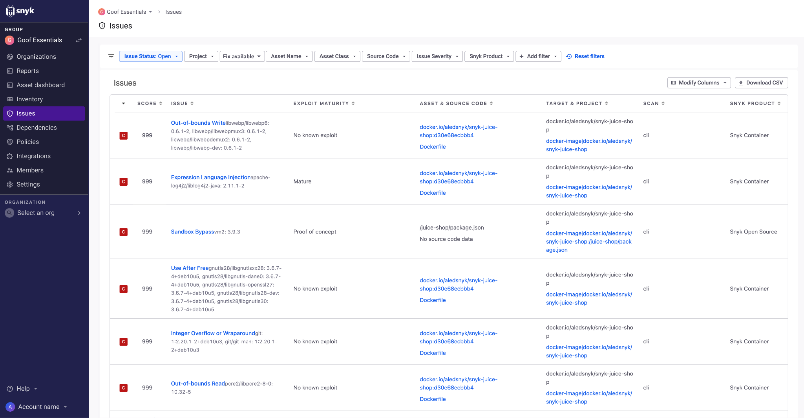

# Snyk AppRisk의 우선순위 지정

Snyk AppRisk은 통합적인 응용 프로그램 지능을 사용하여 컨테이너, 코드 및 오픈 소스 문제를 식별하고 애플리케이션에 대한 위험을 기반으로하는 우선 순위를 더 잘 식별하고 설정하는 데 도움을 줍니다. 사용자는 또한 Snyk AppRisk 정책에 정의된 자산 분류에 따라 우선 순위를 정할 수 있습니다.

Snyk AppRisk를 사용하는 경우 [Snyk 웹 UI](../../getting-started/snyk-web-ui.md#view-and-prioritize-issues)에서 문제 페이지에 액세스할 수 있습니다.

## Snyk AppRisk을 위한 통찰

Snyk은 추가 자산 컨텍스트와 함께 식별된 모든 문제를 중앙 집중형으로 제공하는 새로운 문제 페이지를 소개하여 AppSec 팀이 Snyk에서 문제를 더 잘 분류하고 개선할 수 있도록 돕는다.

**문제**는 그룹 레벨이나 조직 레벨에서 사용할 수 있습니다. [증거 그래프](using-the-issues-ui-with-snyk-apprisk/evidence-graph.md)는 Snyk AppRisk Pro 사용자 및 그룹 레벨에서만 사용할 수 있습니다.

Snyk 접근 방식은 다음을 이해하기 위해 애플리케이션을 전체적으로 검토합니다.

* 컨테이너 이미지에 빌드된 소스 코드 및 종속성
* 실행 중인 운영 체제
* 이미지가 배포된 위치
* 지원하는 Kubernetes 및 클라우드 인프라의 구성

다음 비디오는 Snyk AppRisk를 위한 문제를 설정하는 초기 단계를 설명합니다:


비디오를 좋아하셨나요? [Snyk Learn](https://learn.snyk.io/catalog/?type=product-training\&topics=AppRisk)에서 나머지 강의를 확인해보세요!


## 문제 페이지: Snyk AppRisk Essentials 대 Snyk AppRisk Pro

문제는 주 메뉴의 하위 항목이며 식별된 문제에 대한 정보를 제공합니다. 사용 가능한 필터를 사용하여 문제 목록을 사용자 정의하고 우선 순위를 매길 수 있습니다.


위험 요인 열 및 필터 및 이에 따른 증거 그래프 정보는 Snyk AppRisk Pro 사용자에게만 제공됩니다.


**문제 - Snyk AppRisk Essentials**

<figure><figcaption>
문제 페이지 - Snyk AppRisk Essentials
</figcaption></figure>

**문제 - Snyk AppRisk Pro**

<figure><figcaption>
문제 페이지 - Snyk AppRisk Pro
</figcaption></figure>

Snyk AppRisk Pro의 문제 메뉴 아래 제공된 통찰은 다음 예제와 같이 작동합니다. 동일한 원칙이 위험 요소나 증거 그래프 정보를 사용할 수 없는 Snyk AppRisk Essentials에도 적용됩니다.

* Snyk Open Source가 고 심각도의 원격 코드 실행 (RCE)를 식별했습니다.
* 해당 RCE가 컨테이너 이미지에 빌드되어 있으며, 이 이미지는 프로덕션 Kubernetes 클러스터에 배포되었으며 실행 중인 컨테이너는 인터넷에 액세스 할 수 있도록 구성되어 있습니다.
* 실행 이미지 내의 RCE와 인터넷 액세스의 조합으로 인해 Snyk은 해당 취약성이 배포되지 않은 RCE보다 애플리케이션에 더 많은 위험을 초래한다고 결정합니다.

다음 비디오는 Snyk AppRisk Pro를 위한 문제 통찰을 통해 우선 순위를 설정하는 초기 단계를 설명합니다:


비디오를 좋아하셨나요? [Snyk Learn](https://learn.snyk.io/catalog/?type=product-training\&topics=AppRisk)에서 나머지 강의를 확인해보세요!

