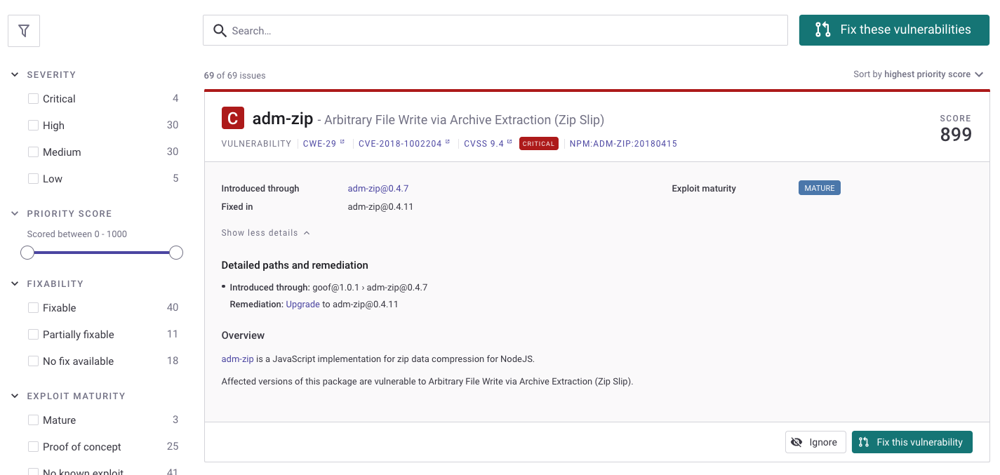

# 우선순위 점수

Snyk 우선순위 점수는 문제에 할당된 단일 값으로, 어떤 문제를 빨리 쉽게 해결해야 하는지 결정하는 데 도움을 줍니다. 점수는 0에서 1,000까지이며, 점수가 높을수록 그 문제를 해결하는 것이 더 중요합니다.

Snyk 우선순위 점수는 CVSS 점수, 트렌딩 취약점, 접근성, 악용 가능성 및 기타 요인을 포함한 여러 업계 표준 기준을 기반으로 결정됩니다. 이러한 요소는 높은 세분성의 점수를 만들어냅니다. 이 세분성을 통해 동일한 점수를 가진 많은 문제가 발생하지 않아 빠르고 정확하게 문제의 중요성을 판단할 수 있습니다.


Snyk는 우선순위를 결정할 때 CVSS 점수만 사용하지 않으며, 다른 요인도 고려합니다.


우선순위 점수의 계산 방법에 대한 자세한 정보는 [우선순위 점수 계산](priority-score.md#calculation-of-priority-score)를 참조하십시오.

프로젝트 뷰, 보고서 및 API에서 우선순위 점수를 확인할 수 있습니다.

우선순위 점수와 관련된 설정은 없으며, 읽기 전용이므로 숨길 수 없습니다. 아래에는 프로젝트 뷰에 표시된 우선순위 점수의 예가 나와 있습니다.

<figure><figcaption>
Snyk 프로젝트 뷰의 우선순위 점수
</figcaption></figure>

## 문제의 우선순위 점수 보기

우선순위 점수는 각 문제 카드에 표시되며, 모든 문제가 점수순으로 정렬되어 가장 시급한 문제를 먼저 표시합니다.

왼쪽 사이드바에서 우선순위 점수 범위별로 문제를 필터링할 수 있습니다.

<figure><figcaption>
문제 필터링
</figcaption></figure>

## 우선순위 점수별 문제 보기

프로젝트 세부 정보의 **문제** 탭을 사용하면 우선순위 점수별로 문제를 필터링할 수 있습니다. 문제를 필터링하는 방법에 대한 자세한 내용은 [우선순위 방식에 따른 수정](../../implement-snyk/enterprise-implementation-guide/phase-4-create-a-fix-strategy.md#fix-based-on-prioritization-methods) 페이지에서 확인할 수 있습니다.

<figure><figcaption>
점수별 문제 필터링
</figcaption></figure>

## Snyk API에서 우선순위 점수 보기

API 엔드포인트 [최신 문제 목록 가져오기](../../snyk-api/reference/reporting-api-v1.md#reporting-issues-latest)는 응답에 우선순위 점수를 포함하고 해당 점수로 필터링하는 기능을 지원합니다.

## 우선순위 점수의 계산

각 문제에 대해 Snyk는 해당 문제의 점수를 생성하기 위해 프로세스를 거치고 여러 요인을 고려한 알고리즘을 사용합니다. 이러한 요소는 다음과 같습니다:

* [심각도 수준](severity-levels.md): 문제의 CVSS 프레임워크 v3.1 점수를 사용하여 계산됩니다.
* [악용 성숙도](https://snyk.io/blog/whats-so-wild-about-exploits-in-the-wild-and-how-can-we-prioritize-accordingly/): Snyk 보안팀이 수동 및 자동 방법을 사용하여 취약점이 악용 가능하며 어느 정도까지 악용 가능한지 추적하는 데 사용하는 요인입니다. 이 요인은 Snyk Open Source에 적용됩니다.
* [접근성](reachability-analysis.md) (코드에서 접근 가능한 취약점 정도): 프로젝트 내부에서 호출된 코드 경로를 살펴보고 결정됩니다. 이 요인은 Snyk Open Source에 적용됩니다.
* [수정 가능성](../../scan-with-snyk/snyk-open-source/manage-vulnerabilities/vulnerability-fix-types.md) (수정 가능한 버전의 가용성): 업그레이드할 안전한 버전이 있는지 또는 Snyk 패치가 있는지를 정의합니다. 둘 다 없는 취약점의 경우 개발자들은 코드를 직접 수정하거나 대체 패키지를 사용해야 합니다. 따라서 수정 가능한 취약점에는 더 높은 우선순위 점수가 부여됩니다. 이 요인은 Snyk Open Source에 적용됩니다.
* 시간: 취약점이 새로운 정도를 기반으로 고려됩니다. 새로운 취약점은 증가된 위험으로 간주되며, 그에 따라 우선순위 점수가 증가합니다.
* [사회적 트렌드](vulnerabilities-with-social-trends.md): 알려진 취약점에 대한 언급을 기반으로 하여 X(이전 이름은 Twitter)에서 트윗 및 반응의 추세를 나타냅니다.
* 악성 패키지: 취약점이 악성 패키지에서 발생했는지 여부를 평가합니다. 악성 패키지에서 기인한 취약점은 더 높은 우선순위 점수를 가집니다.


Snyk는 지속적으로 새로운 요소를 포함하도록 우선순위 알고리즘을 개선하고, 최신 정보를 고려하여 가장 정확하고 최신의 우선 순위 표현을 제공하기 위해 요소의 가중치를 업데이트합니다.


### Kubernetes의 우선 순위 계산

Kubernetes 통합에서 가져온 Kubernetes 컨테이너 이미지에는 우선 순위 점수 계산에 추가적으로 기여하는 여러 요인이 있습니다.

자세한 내용은 [Snyk 우선순위 점수 및 Kubernetes](../../scan-with-snyk/snyk-container/kubernetes-integration/kubernetes-integration-ui-explained/kubernetes-and-the-snyk-priority-score.md)를 참조하십시오.

### {{Snyk Code}}의 우선 순위 계산

{Snyk Code}}의 우선 순위 계산에는 다음과 같은 특정 요소들이 기여합니다:

* 심각도 수준
* 수정 가능성: 이 문제에 대한 Snyk에서 사용 가능한 수정 예제가 있는지 여부
* 취약점 발생 횟수
* 공개 커뮤니티 프로젝트: 이 취약점이 광범위하게 수정되었는지 여부
* 규칙 태그: beta 태그가 발견되면 우선 순위가 감소합니다
* 핫 파일: 취약점이 소스 파일 내에 있거나 코드 흐름 내부에 있는지

자세한 내용은 [우선순위 점수 요소](../../scan-with-snyk/snyk-code/manage-code-vulnerabilities/breakdown-of-code-analysis.md#priority-score-factors)를 참조하십시오.