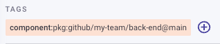

# Set up Insights: Associating Snyk Open Source, Code, and Container Projects


Insights 기능은 Snyk AppRisk Pro와 함께만 사용할 수 있습니다.


Insights를 설정한 후 Snyk은 선택한 애플리케이션에 대한 필요한 링킹을 설정할 수 있습니다.

Snyk은 Snyk 프로젝트와 컨테이너 프로젝트 간의 관계를 이해해야 Snyk 코드와 Snyk 오픈 소스 취약점을 우선 순위로 설정할 수 있습니다. Snyk은 이러한 프로젝트 간의 관계를 사용하여 컨테이너 이미지의 구성을 이해하기 위한 프록시로 활용합니다.

Insights UI에서는 다음과 같은 각종 자산 유형이 표시됩니다:

* 저장소 자산
* 패키지
* 컨테이너 이미지
* 스캔된 아티팩트

이러한 자산들은 [Snyk AppRisk 인벤토리](../../../manage-assets/assets-inventory-components.md) 뷰에 표시된 자산과 직접 연결됩니다.


지원되는 자산에 대한 자세한 내용은 [자산](../../../manage-assets/assets-inventory-components.md#asset) 및 [이슈](../../../manage-assets/assets-inventory-components.md#issues) 페이지로 이동할 수 있습니다.


컨테이너 이미지는 쿠버네티스 클러스터에 배포되어 실행되는 빌드 아티팩트이므로 Snyk은 다음을 이해함으로써 소스 코드에서 배포 상태까지의 애플리케이션을 매핑할 수 있습니다:

* 소스 코드 및 오픈 소스 종속성과 이미지 사이의 연결
* 쿠버네티스에 배포된 이미지 및 구성

<figure><figcaption>
애플리케이션 매핑하기
</figcaption></figure>

## 프로젝트 태그를 사용하여 프로젝트 연결

애플리케이션에서 사용하는 모든 프로젝트에 Snyk [프로젝트 태그](../../../snyk-admin/introduction-to-snyk-projects/project-tags.md)를 추가하여 이러한 프로젝트를 연결하고 Snyk이 테스트하는 전체 애플리케이션을 나타낼 수 있도록 합니다.

두 프로젝트를 연결하려면 두 프로젝트에 정확히 같은 태그를 추가하면 됩니다. 예를 들어, 서로 관련이 있는 Snyk 오픈 소스 프로젝트와 Snyk 컨테이너 프로젝트에 동일한 태그를 추가하세요.

이 섹션의 끝에 있는 예제를 참조하세요.

## 프로젝트 태그 요구 사항

* 컨테이너 이미지 및 코드 또는 오픈 소스 프로젝트에 동일한 태그가 적용되어야 합니다.
* 태그는 지정된 형식을 따라야 합니다.
* 프로젝트가 동일한 Snyk 조직에 있어야 하지만 동일한 Snyk 그룹에 있을 필요는 없습니다.

<figure><figcaption></figcaption></figure>

## 프로젝트 태그 예제

### 단일 레포지토리에서 단일 이미지로

이 예에서는 package.json을 포함하는 단일 리포지토리가 있으며, 이것이 이미지-A라는 이미지로 빌드됩니다.

\

<figure><figcaption>
예: 단일 리포지토리를 단일 이미지로
</figcaption></figure>

이러한 연결을 매핑하려면 다음과 같은 태그가 설정되어 있어야 합니다:

| 위치                           | 자산             | Snyk 프로젝트 위치                                             | 태그                                          | 참고                                            |
| ---------------------------- | -------------- | -------------------------------------------------------- | ------------------------------------------- | --------------------------------------------- |
| github.com/my-team/front-end | `package.json` | 
Snyk 조직: my-team 프로젝트 이름: package.json
         | component=pkg:github/my-team/front-end@main | `component=pkg:github/my-team/front-end@main` |
|                              | image-A        | 
Snyk 조직: my-team 프로젝트 이름: <code>image-A</code>
 | component=pkg:github/my-team/front-end@main | `component=pkg:github/my-team/front-end@main` |

### 여러 레포지토리에서 단일 이미지로

<figure><figcaption>
예: 단일 리포지토리를 단일 이미지로
</figcaption></figure>

이 시나리오에서는 두 개의 기여 레포지토리가 있습니다.

package.json을 스캔하는 프론트엔드 레포지토리와 Snyk 코드가 스캔하는 고 코드를 포함하는 백엔드 레포지토리가 있습니다.

이러한 연결을 매핑하려면 다음과 같은 태그가 설정되어 있어야 합니다:

<table><thead><tr><th>위치</th><th width="124">자산</th><th>Snyk 프로젝트 위치</th><th>태그</th><th>참고</th></tr></thead><tbody><tr><td>github.com/my-team/front-end</td><td><code>package.json</code></td><td>Snyk 조직: my-team 프로젝트 이름: package.json</td><td><code>component=pkg:github/my-team/front-end@main</code></td><td></td></tr><tr><td>github.com/my-team/back-end</td><td><code>Go source code</code></td><td>Snyk 조직: my-team 프로젝트 이름: 코드</td><td><code>component=pkg:github/my-team/back-end@main</code></td><td></td></tr><tr><td></td><td><code>image-A</code>라는 컨테이너 이미지 빌드</td><td>Snyk 조직: my-team 프로젝트 이름: image-A</td><td><code>component=pkg:github/my-team/front-end@main</code> <code>component=pkg:github/my-team/back-end@main</code></td><td>이미지에는 두 가지 태그가 적용되어 다른 태그가 있는 두 업스트림 종속성이 있습니다. 이미지에 여러 태그를 적용할 수 있습니다.</td></tr></tbody></table>

### 단일 모놀리포에서 다수 이미지로

이 예제에서는 애플리케이션 팀이 모놀리포 접근법을 사용하고 있습니다. 리포지토리의 내용은 개별적으로 실행될 수 있도록 다른 컨테이너 이미지로 빌드됩니다.

여기서 태그를 보다 정확하게 지정하여 더 추가로 구별해야 하는 경우가 있습니다.

<figure><figcaption>
프로젝트 태그를 위한 UI 예제
</figcaption></figure>

### CLI 예제

`snyk monitor --project-tags=component=pkg:github/my-team/back-end@main`

### API 예제

[프로젝트 업데이트 문서](https://snyk.docs.apiary.io/#reference/integrations/integration-settings/update-a-project) 참조


쿠버네티스 커넥터를 올바르게 설정했는지 확인하려면 **Insights** 페이지의 **Insights** 탭에서 **이미지 구성** 섹션을 확인하여 Insights가 액세스할 수 있는 데이터를 확인하십시오.

