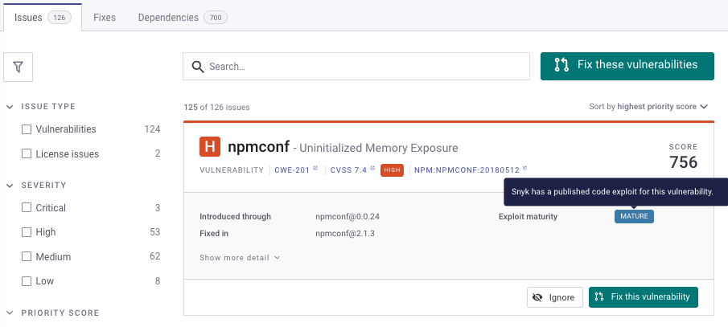
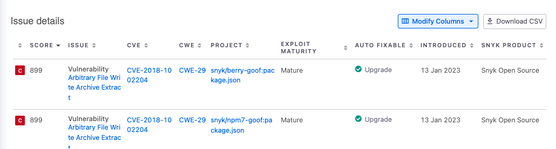

# exploits 보기

Exploit(익스플로잇)은 취약점이 어떻게 악용될 수 있는지를 보여주는 것입니다. Exploit이 널리 공개되면 일반적으로 "야생에서 발생한(Exploit in the wild)" exploit이라고도 합니다.

이 페이지에서는 [프로젝트 내에서 Exploit 보기](view-exploits.md#프로젝트-내에서-Exploit-보기)와 [보고서 내에서 Exploit 보기](view-exploits.md#보고서-내에서-Exploit-보기) 그리고 [Exploit이 어떻게 결정되는지](view-exploits.md#작동방식-Exploit-결정방식)에 대해 설명합니다.

## **프로젝트 내에서 Exploit 보기**

Snyk 웹 UI에서, 프로젝트의 상세 페이지로 이동합니다. 해당 프로젝트에서 발견된 각 이슈에 대한 Exploit 정보가 표시됩니다:

<figure><figcaption>
프로젝트 내에서 Exploit 정보보기
</figcaption></figure>

Exploit 성숙도로 프로젝트에서 검출된 이슈를 필터링하여 특정 취약점에 대한 야생의 Exploit이 있는지, 있다면 그 Exploit이 얼마나 성숙한지를 확인할 수 있습니다. 이를 통해 가장 중요하고 위험한 취약점을 우선적으로 처리하고 신속히 대응할 수 있습니다.

필터에는 다음 옵션이 있습니다:

<figure><figcaption>
Exploit 성숙도 필터 내 옵션
</figcaption></figure>

* **Mature:** Snyk이 이 취약점에 대한 게시된 코드 Exploit을 가지고 있습니다.
* **Proof of concept:** Snyk이 Proof of concept 또는 이 취약점을 악용하는 방법에 대한 자세한 설명을 가지고 있습니다.\
  Proof of concept 취약점 패치는 비활성화할 수 없으며, 해당 패치는 발견된 곳에서 수리 PR에 나타납니다.
* **알려진 Exploit 없음:** Snyk이 이 취약점에 대한 Proof of concept 또는 게시된 Exploit을 찾지 못했습니다.
* **데이터 없음:** 이 문제는 취약점이 아니라 라이선스 문제이거나 취약점 고지입니다.

## 보고서 내에서 Exploit 가용성 보기

보고서 섹션에서 Exploit 정보의 가용성을 확인할 수 있습니다.

<figure><figcaption>
보고서 내에서 Exploit 보기
</figcaption></figure>

## **Exploit이 어떻게 결정됩니까**

Exploit의 존재와 상태에 대한 정보는 여러 소스에서 수집됩니다.

Snyk의 보안 분석가들은 새로운 exploits에 대한 정보를 정리하며, 자동화된 프로세스는 다중 exploit 소스에서 구조화된 및 비구조화된 데이터를 탐색합니다.

구조화된 데이터의 예는 [알려진 Exploit 취약점 카탈로그](https://www.cisa.gov/known-exploited-vulnerabilities-catalog) (사이버보안 및 인프라 보안국)나 [Exploit DB](https://www.exploit-db.com/)입니다. 비구조화된 데이터의 예는 블로그, 포럼, X(이전에는 Twitter로 알려진 사이트)와 같은 소셜 미디어 사이트 등이 포함됩니다.
