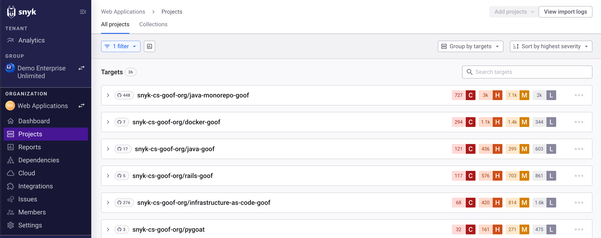

# 프로젝트 저장소 가져오기

## 저장소 가져오기 작업 방식

Snyk 웹 UI에서 저장소를 선택하고 **선택한 저장소 추가** 버튼을 클릭하면 가져오기가 시작되고 **프로젝트** 페이지에 진행률 표시줄이 나타납니다.

가져오기가 완료되면 프로젝트 페이지에 확인 메시지가 나타납니다. 가져온 저장소는 프로젝트 페이지의 별도의 대상 폴더로 표시됩니다. 각 대상 폴더에는 Git 저장소 계정명과 가져온 저장소의 이름이 포함되며 해당 저장소를 위해 생성된 Snyk 프로젝트가 포함됩니다.

<figure><figcaption>
프로젝트 페이지의 대상 폴더
</figcaption></figure>

선택한 저장소의 일부 파일이 가져오기 되지 않은 경우 해당 프로젝트에 대한 알림을 받습니다.

## 다음 단계?

* [프로젝트 가져오기에서 디렉터리 및 파일 제외](exclude-directories-and-files-from-project-import.md)
* [프로젝트에서 가져온 저장소 제거](remove-imported-repository-from-a-project.md)
