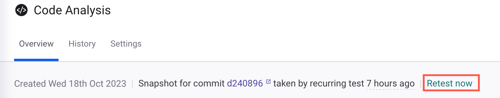

# 프로젝트 가져오기에서 디렉터리 및 파일 제외

파일은 재테스트에서 제외되므로 Snyk Code에서 테스트되지 않으며 코드 분석 결과에 나타나지 않습니다. 프로젝트를 SCM 통합을 통해 가져오는 경우, 가져오기 창의 하단에 제외할 폴더만 추가하십시오.

<figure><figcaption><p>폴더 제외하기</p></figcaption></figure>

Snyk Code에서 저장소를 가져올 때, `.snyk` 파일을 사용하여 가져오기에서 특정 디렉토리 및 파일을 제외할 수 있습니다. `.snyk` 파일은 쉘 매칭 패턴(정규 표현식)을 포함할 수 있는 YAML 정책 파일이며, 가져오기 프로세스에서 제외할 디렉토리 및 파일을 지정할 수 있게 합니다. `.snyk` 파일은 가져올 저장소에 생성되어야 합니다.


* Synk 코드에서 `.snyk` 파일은 가져오기에서 디렉토리 및 파일을 제외하는 데만 사용됩니다. 다른 Snyk 제품처럼 취약점을 무시하거나 다른 작업에는 사용할 수 없습니다.
* 현재 `.snyk` 파일의 `exclude` 옵션은 Snyk 웹 UI 및 CLI 환경에서만 적용됩니다. `exclude` 옵션은 IDE 환경에서 로 작업할 때 사용할 수 없습니다.
* 일부 상황에서 `.snyk` 파일이 잘못된 경우 제외된 파일이 제외되지 않을 수 있습니다. 이러한 상황에서는 `.snyk` 파일 없이 스캔이 계속됩니다.



생산 환경으로 배포 또는 컴파일하지 않는 경우에만 디렉토리 및 파일을 제외하는 것을 고려하세요. 제외된 파일 또는 디렉토리를 통해 존재하는 취약점이 전달되는 경우, Snyk은 잠재적인 문제를 감지하지 못할 수 있습니다.


또한 이 섹션의 지침을 사용하여 [CLI 테스트](../../snyk-cli/scan-and-maintain-projects-using-the-cli/snyk-cli-for-snyk-code/scan-source-code-with-snyk-code-using-the-cli.md)에서 디렉토리 및 파일을 제외할 수 있습니다. 이는 테스트 중인 저장소에 `.snyk` 파일을 만들어 실행합니다.

## **.snyk 파일의 제외 구문**

### 테스트에서 파일 및 디렉토리를 제외하는 데 사용할 구문

`.snyk` 파일을 사용하여 다음 구문을 사용하여 파일 및 디렉토리를 제외하십시오:

<pre class="language-yaml"><code class="lang-yaml"># Snyk (https://snyk.io) 정책 파일
---
exclude:
    global:
<strong>        # 단일 파일 제외. 예를 들어, - test.spec.js
</strong>        - file_name.ext
<strong>        # 단일 디렉토리 제외. 예를 들어, - src/lib
</strong>        - source/directory_name
        # 특정 디렉토리의 특정 확장자가 있는 파일 제외. 예를 들어, - tests/.js
<strong>        - directory_name/.ext
</strong>        # 특정 엔딩을 가진 파일 제외. 예를 들어, - “*.spec.js”
        - "*.ending.ext"
        # 다른 엔딩으로 동일한 이름을 가진 디렉토리의 파일 제외, 예를 들어, - tests?/
        - directory_name?/
        # 프로젝트 내의 지정된 폴더 내에 있는 모든 파일 및 디렉토리 제외. 예를 들어, directory_name/**는 directory_name이라는 이름의 모든 디렉토리에 있는 모든 콘텐츠를 일치시키고 제외합니다. 루트 수준이나 .snyk 파일의 위치에 제한되지 않습니다.
<strong>        - directory_name/**
</strong></code></pre>


`global` 또는 `code`를 사용하여 Snyk 코드 테스트에서 지정된 디렉토리 및 파일을 제외할 수 있습니다. `code`는 분석에만 적용되며, `global`은 현재 Snyk Code를 사용하는 분석에만 적용되지만 나중에 다른 제품에서도 적용될 수 있습니다.


### **`.snyk` 파일 생성 시 고려해야 할 사항**

* 규칙 안의 경로는 `.snyk` 파일 위치를 기준으로 상대적이어야 합니다.
* 모든 규칙은 유효한 경우 앞에 대시가 있어야 합니다: `- <exclusion_rule>`
* 별표 문자 `*`와 같은 특수 문자 및 패턴으로 시작하는 규칙의 경우, 이를 이중 인용부호(`" "`)로 감싸야 합니다. 이렇게 하면 잘못된 해석이나 의도하지 않은 동작을 방지하여 단일 entity로 취급됩니다. 예를 들어, `"*/src"`
* 들여쓰기 사용에 대한 고려 사항은 다음과 같습니다:
  * `.snyk` YAML 파일의 구문을 사용할 때, 새 줄 및 들여쓰기에 주의해야 합니다. 잘못된 들여쓰기는 제외 사양을 방해할 수 있습니다.
  * 들여쓰기에 탭을 사용하지 마십시오. 들여쓰기에는 공백만 사용하십시오.
  * 구문을 올바르게 사용하는지 확인하려면 [YAML Lint](http://www.yamllint.com/)와 같은 YAML 검증기를 사용할 수 있습니다. 일부 YAML 검증기에서는 들여쓰기에 탭과 공백을 구별하지 않을 수 있습니다. 탭을 사용하면 검증기가 구문을 승인할 수 있지만 제외 명세가 실행되지 않을 수 있습니다.
* 쉘 매칭 패턴 구문에 대한 자세한 내용은 다음을 참조하십시오:
  * GNU Org - [Shell 패턴 매칭](https://www.gnu.org/software/findutils/manual/html_node/find_html/Shell-Pattern-Matching.html)
  * Docstore - [예제를 통한 패턴 매칭 퀵 레퍼런스](https://docstore.mik.ua/orelly/unix/upt/ch26_10.htm)&#x20;

## **`.snyk` 파일을 사용하여 가져오기에서 디렉토리 및 파일 제외하기**

아래 단계를 따라 `.snyk` 파일을 사용하여 가져오기 프로세스에서 디렉토리 및 파일을 제외합니다:

1\. 가져오기를 원하는 저장소에서 `.snyk`라는 YAML 파일을 만듭니다. 예:

<figure><figcaption><p><code>.snyk</code> 파일이 있는 저장소</p></figcaption></figure>

2\. `.snyk` 파일에서 다음 구문에 따라 가져오기에서 제외할 디렉토리 또는 파일 또는 둘 다를 지정합니다:

```yaml
# Snyk (https://snyk.io) 정책 파일
exclude:
 global:
   - <제외규칙>
   - <제외규칙>
```

예:

```yaml
# Snyk (https://snyk.io) 정책 파일
exclude:
 global:
   - todolist-goof/** 
```

3\. Snyk 웹 UI에서 다음 중 하나의 방법으로 저장소를 가져옵니다:

*   이미 Snyk로 가져온 경우, 다음과 같이 저장소를 재테스트합니다:

    **프로젝트** 페이지에서 리포지토리의 **코드 분석** 프로젝트를 클릭합니다. 그런 다음 **코드 분석** 페이지에서 **Restart now**를 클릭합니다.

<figure><figcaption><p>지금 다시 테스트 옵션</p></figcaption></figure>

* 아직 Snyk로 가져오지 않은 경우, [저장소를 가져옵니다](../snyk-code/import-project-with-snyk-code.md#snyk로-저장소-가져오기).

리포지토리는 제외하도록 선택한 디렉터리 및/또는 파일 없이 Snyk로 가져옵니다.

## **예시**: **Snyk Code 분석에서 두 파일 제외하기**

`Snyk Code`를 사용하여 취약점을 테스트하고 싶어하는 `snyk-goof`라는 리포지토리가 있습니다. 이 리포지토리를 Snyk로 가져온 후, 발견된 10개의 취약성 문제 목록을 받았습니다. 이 문제들은 세 파일에서 발견되었습니다:

<figure><figcaption><p>세 파일에서 발견된 취약성 문제</p></figcaption></figure>

이제 `app.js` 및 `db.js` 파일을 분석에서 제외하려고 합니다. 이를 위해 다음과 같이 진행합니다:

1\. GitHub의 **snyk-goof** 리포지토리에 `.snyk` 파일을 만듭니다:

<figure><figcaption><p>snyk-goof 리포지토리에 있는 <code>.snyk</code> 파일</p></figcaption></figure>

2\. `.snyk` 파일에서 `app.js`와 `db.js` 파일을 가져오기에서 제외하기 위해 다음 명령어를 입력합니다:

<figure><figcaption><p><code>.snyk</code> 파일 명령어</p></figcaption></figure>

3\. **snyk-goof** 리포지토리에서 **코드 분석** 페이지에서 **Restart now** 옵션을 클릭하여 재테스트합니다.

`app.js`와 `db.js` 파일은 재테스트에서 제외되었으므로 Snyk 코드에서 테스트하지 않았으며 코드 분석 결과에도 나타나지 않습니다. 이제 오직 다섯 개의 취약성 문제만 발견됩니다:

<figure><figcaption><p>제외된 후 발견된 문제</p></figcaption></figure>
