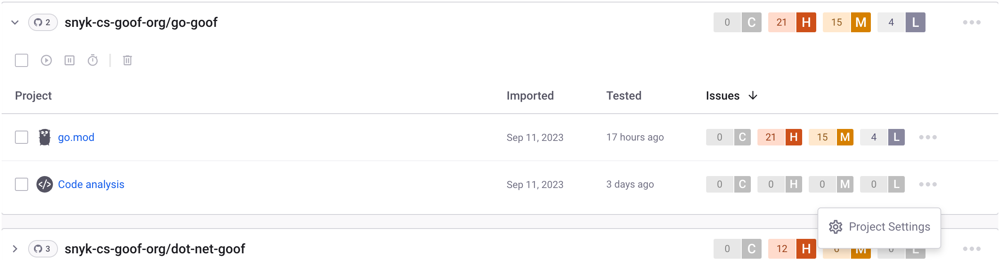
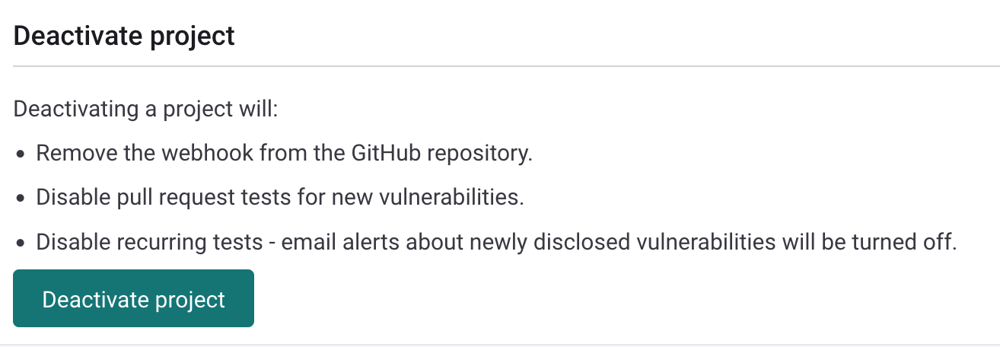
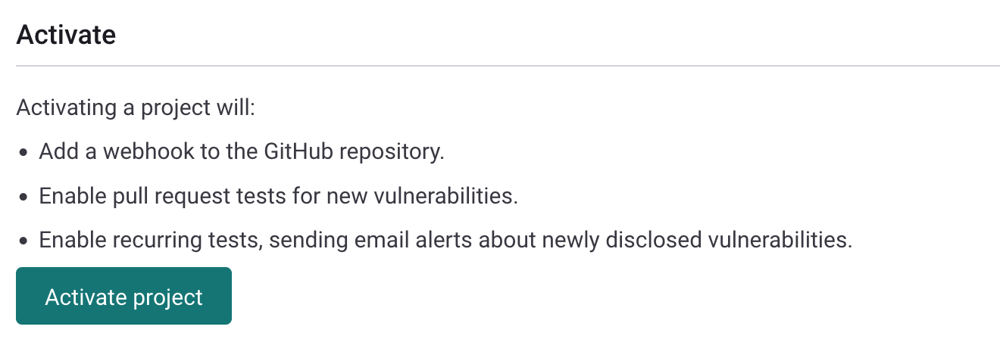

# 프로젝트에서 가져온 저장소 삭제

Snyk가 가져온 저장소 중 하나 이상의 테스팅을 계속하지 않기를 원한다면 다음 중 하나를 수행할 수 있습니다:

* 다음 중 하나의 방법으로 Snyk 계정에서 전체 저장소를 제거합니다:
  * 저장소 비활성화.
  * Snyk 계정에서 저장소 삭제.


계정에서 전체 저장소를 제거하면 해당 저장소가 Snyk 제품 중 어느 것도 더 분석하지 않게됩니다.


* Snyk 계정에서 **코드 분석** 프로젝트만 제거하는 방법:
  * 프로젝트 비활성화.
  * Snyk 계정에서 프로젝트 삭제.


**코드 분석** 프로젝트만 제거하면 계정에서 사용 중인 다른 Snyk 제품들은 가져온 저장소를 계속 분석합니다.


## **가져온 저장소 제거 방법**

Snyk 테스팅에서 저장소를 제거하는 올바른 방법을 선택하려면 다음 조치로 각각 어떤 일이 발생하는지 고려하십시오:

* 가져온 저장소를 비활성화하면:
  * Snyk가 SCM 저장소로부터 웹훅을 제거합니다.
  * 새 취약점에 대한 풀 리퀘스트 테스트를 비활성화합니다.
  * 새로 발견된 취약점에 대한 Fix Pull Requests 옵션을 오픈하는 것을 비활성화합니다.
  * 반복 테스트를 비활성화하며 새로 발견된 취약점에 대한 이메일 알림이 꺼집니다.
* Snyk 프로젝트나 가져온 저장소를 삭제하면:
  * Snyk에서 전체 프로젝트 또는 저장소 및 모든 기록된 스냅샷 데이터를 삭제합니다.
  * SCM 저장소에서 웹훅을 제거합니다.


Snyk 프로젝트나 가져온 저장소를 삭제해도 여전히 소스 코드에는 영향을 주지 않습니다.

{Snyk Code}} 테스트에서 특정 디렉토리나 파일을 제거하려면 [.snyk 파일에서 exclude 옵션을 사용하십시오](exclude-directories-and-files-from-project-import.md).


## **가져온 저장소를 비활성화하고 삭제**

저장소를 삭제하는 방법에 대한 지침은 프로젝트 조치 [삭제, 활성화 또는 비활성화](../../snyk-admin/snyk-projects/#delete-activate-or-deactivate)를 참조하십시오. 더 자세한 내용은 [여러 프로젝트를 삭제하는 방법](https://support.snyk.io/s/article/How-can-I-delete-multiple-projects)을 참조하십시오.

## **{Snyk Code}} 프로젝트를 비활성화하고 삭제**

가져온 저장소에서 {Snyk Code}}가 테스트를 중지하도록 하려면 해당 저장소에서 **코드 분석** 프로젝트를 비활성화하거나 삭제할 수 있습니다. **코드 분석** 프로젝트는 더 이상 해당 저장소에서 활성 상태가 아니며 {Snyk Code}}는 해당 저장소에서의 테스트를 중단하지만 다른 Snyk 제품은 저장소 파일을 계속 스캔할 것입니다.

다음 단계를 따라 **코드 분석** 프로젝트를 비활성화하거나 삭제하십시오:

1\. **프로젝트** 페이지에서 {Snyk Code}} 중지하려는 저장소를 찾으십시오. 해당 대상 폴더에서 **코드 분석** 프로젝트를 찾아 세 점을 클릭한 다음 **프로젝트 설정**을 클릭하십시오:

<figure><figcaption>
코드 분석 프로젝트용 프로젝트 설정 버튼
</figcaption></figure>

2\. **코드 분석** 프로젝트의 **설정** 페이지에서 **프로젝트 비활성화** 또는 **프로젝트 삭제** 버튼 중 필요한 작업을 클릭하십시오:

<figure><figcaption>
코드 분석 프로젝트 설정 페이지에서 프로젝트 비활성화
</figcaption></figure>

선택한 **코드 분석** 프로젝트가 비활성화되거나 삭제되어 해당 저장소가 더 이상 {Snyk Code}}에 의해 테스트되지 않게됩니다.

**코드 분석** 프로젝트를 삭제하고 나서 {Snyk Code}}가 테스트를 계속하도록 하려면 다음을 수행하십시오:

* 코드 분석 프로젝트를 삭제한 후 Snyk에 저장소를 다시 가져와서 **프로젝트** 페이지를 새로 고쳐서 재가져온 결과를 확인하십시오.
* **코드 분석 프로젝트를 비활성화**한 후, 프로젝트의 **설정** 페이지에서 **코드 분석** 프로젝트를 다시 활성화하십시오. 프로젝트를 비활성화한 후 **프로젝트 비활성화** 버튼이 **프로젝트 활성화**로 변경되며 페이지 상단에 새 **활성화** 버튼이 나타납니다. 이 버튼 중 하나를 클릭하여 프로젝트를 다시 활성화하십시오:

<figure><figcaption>
코드 분석 프로젝트 설정 페이지에 있는 프로젝트 활성화 버튼
</figcaption></figure>