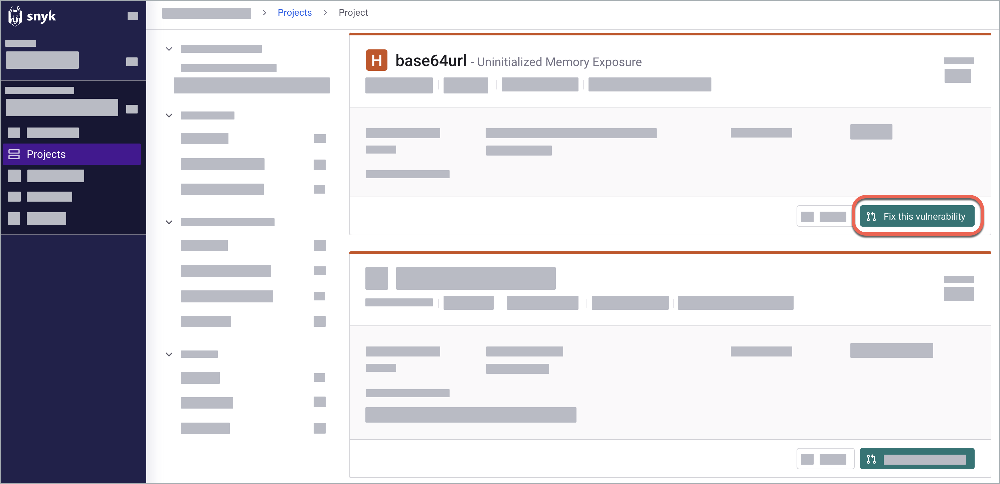
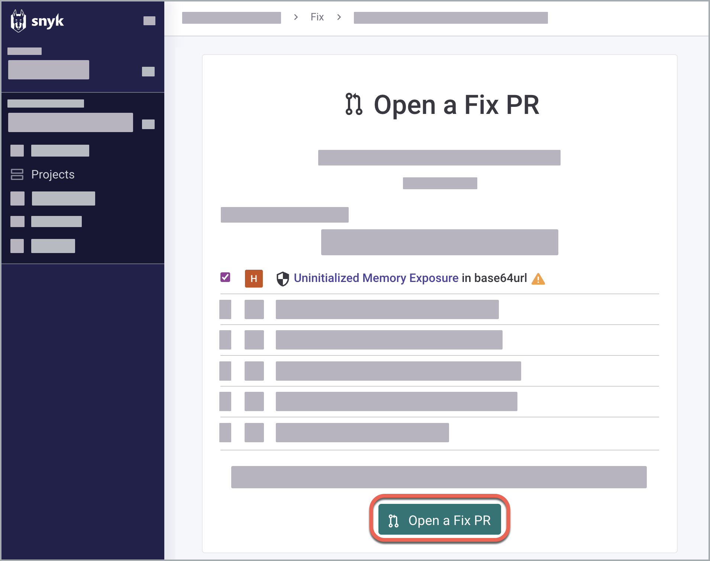
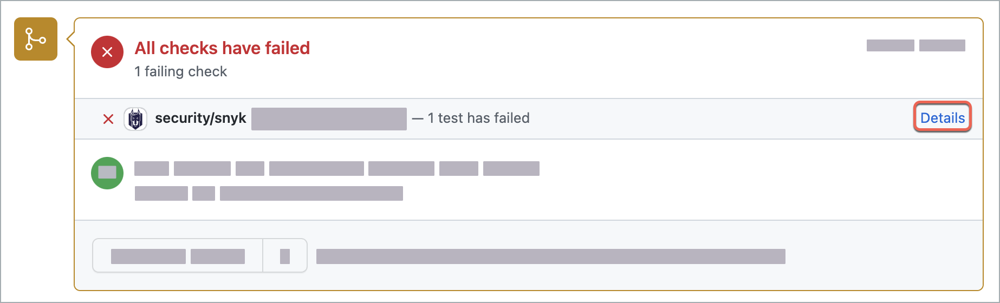
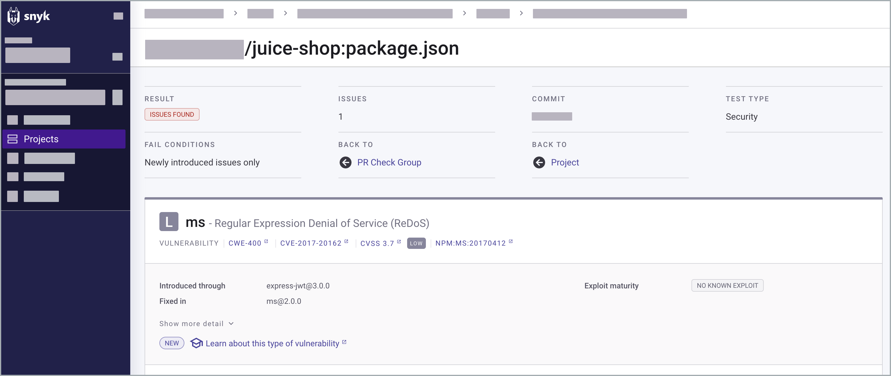
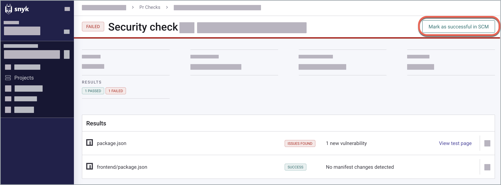
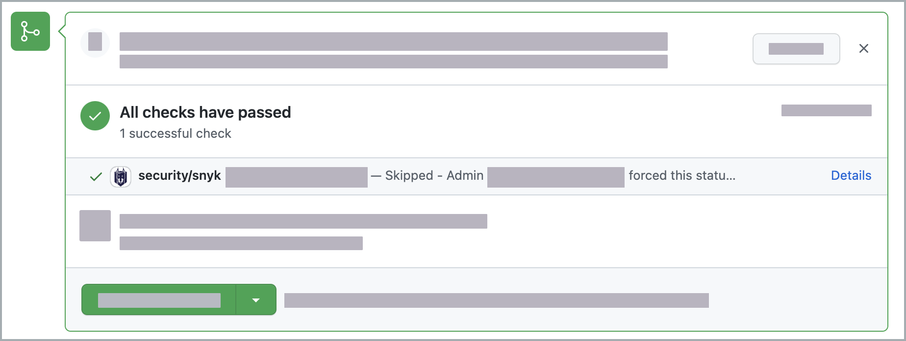

# PR 체크 결과 분석

## PR 체크 결과

취약성을 수정하기 위해 [풀 리퀘스트를 제출한 후](../../snyk-open-source/manage-vulnerabilities/fix-your-vulnerabilities.md), PR Checks는 구성된 임계값을 충족하거나 초과하는 심각성 수준의 문제를 감지하고 보고서를 제공합니다. 풀 리퀘스트를 병합할지 결정하는데 보고서 상태와 결과를 살펴보세요.

[통합 수준](configure-pull-request-checks.md#configure-pr-checks-at-the-integration-level)이나 [프로젝트 수준](configure-pull-request-checks.md#configure-pr-checks-at-the-project-level)에서 기본 심각성 임계값을 변경할 수 있습니다.

## 결과 상태

보안 문제를 해결해야 하는지를 식별하기 위해 통합된 SCM에서 PR 체크 결과 상태를 확인하여 풀 리퀘스트 병합 전에 확인하세요.

다음 상태 지시기호는 통합된 SCM에서 Snyk PR 체크에 나타날 수 있습니다:

| 결과 상태          | 설명                                                                                                       | 
|-------------------|------------------------------------------------------------------------------------------------------------|
| **성공/통과**        | 문제가 발견되지 않았으며 매니페스트 파일이 변경되지 않았습니다.                                                | 
| **대기 중**        | PR 체크가 여전히 진행 중입니다.                                                               |
| **실패/이슈 발견** | 풀 리퀘스트에서 보안 이슈가 식별되었습니다. 이 경우, 결과 상태를 수동으로 **통과**로 설정해야 합니다.            | 
| **에러**          | 동기화되지 않은 package.json 및 package.lock 파일, 매니페스트 파일을 찾지 못하거나 읽지 못한 실패.  |
| **취소됨**         | 테스트 한도에 도달했습니다.                                                                     |


거짓 양성 또는 거짓 음성 결과의 경우 [PR 체크 문제 해결](troubleshoot-pr-checks.md)을 참조하십시오.


## **예시: PR 체크를 통한 의존성 문제 해결**

병합 요청을 시작하고 결과를 **통과**로 설정하는 등 특정 작업을 수행하는 다음의 종단 간 시나리오를 고려해 보세요. 이러한 작업은 PR 체크에 제공된 정보에 관련하여 수행할 수 있습니다. 이 예제는 [GitHub 통합](../../../scm-ide-and-ci-cd-integrations/snyk-scm-integrations/github.md)에 대한 단계를 보여줍니다:

1. [개별 종속성 문제를 해결하도록 트리거](analyze-pr-checks-results.md#trigger-a-fix-for-an-individual-dependency-issue)하여 취약점을 검색하고 해결합니다.
2. GitHub에서 [Fix PR 열기](analyze-pr-checks-results.md#open-a-fix-pr)를 클릭하여 풀 리퀘스트를 엽니다.
3. PR 체크 결과를 분석하고 상태를 설정하여 풀 리퀘스트를 병합합니다.


시작하기 전에 [자동 PR 체크를 위한 전제 조건](configure-pull-request-checks.md#prerequisites-for-automated-pr-checks)을 확인하여 Snyk가 구성되어 있고 역할이 정의되었는지 확인하십시오.


### 개별 종속성 문제를 해결하도록 트리거

1. Snyk 웹 UI에 로그인합니다.
2. **프로젝트**로 이동합니다.
3. 프로젝트를 포함하는 대상을 확장합니다.
4. 프로젝트 이름을 클릭하여 열고 오픈 소스와 라이선스 문제를 확인하려면 **package.json**을 선택하세요.
5. **이슈** 탭에서 개별 이슈 카드를 찾아 **이 취약점 수정**을 선택합니다. 이 예에서는 초기화되지 않은 메모리 노출이 선택됩니다.

<figure><figcaption>
의존성 프로젝트에서 개별 문제 수정 중
</figcaption></figure>

6. 한 페이지 상단의 **이 취약점 수정**을 선택하여 하나의 풀 리퀘스트로 모든 종속성 취약점을 수정할 수 있습니다.

### Fix PR 열기

선택한 문제를 확인하고 GitHub 통합에서 **Fix PR 열기**를 클릭하여 풀 리퀘스트를 엽니다.

<figure><figcaption>
의존성 프로젝트의 개별 문제용 Fix PR 트리거링
</figcaption></figure>

### PR 체크 결과를 분석하고 상태 설정

1. GitHub의 Conversation 탭에서 생성된 풀 리퀘스트를 [Snyk 봇](../../../scm-ide-and-ci-cd-integrations/snyk-scm-integrations/github.md#commit-signing)이 보여주는 것을 확인하세요.
2. PR 체크 결과를 보여주는 대화 카드를 찾습니다. 이 예에서 결과는 **실패**로 설정되어 있으며 수동으로 **통과**로 변경됩니다.


Snyk 웹 UI에서 이미 무시된 문제는 관련 오픈 소스 또는 코드 분석 프로젝트에서 이러한 체크에 표시되지 않습니다. 이는 피처 브랜치 PR 간에 반영되는 [무시된 문제](../../../manage-risk/prioritize-issues-for-fixing/ignore-issues/)을 반영합니다.


<figure><figcaption>
GitHub의 대화 탭에 있는 PR 체크 카드
</figcaption></figure>

3. 해당 문제를 체크한 파일 목록을 열기 위해 **세부 정보**를 클릭합니다.
4. (선택 사항) 문제 세부 사항을 확인하려면 **테스트 페이지 보기**를 클릭하세요.\
   \
   기술적 보안 정보 및 복구 옵션을 포함한 문제의 완전한 그림을 얻으려면 **자세히 표시**를 클릭하세요.\
   \
   기본 문제 페이지로 돌아가려면 **프로젝트**를 클릭하세요.

<figure><figcaption>
PR 체크 결과 개요
</figcaption></figure>

5. **SCM에서 성공으로 표시**하여 결과 상태를 변경하고 보안 문제가 있는 상태에서 풀 리퀘스트를 병합합니다.

<figure><figcaption>
PR 체크 결과를 성공으로 표시
</figcaption></figure>


보안 문제를 성공으로 표시하는 것은 문제를 무시하는 것이 아니라 현재 브랜치에서 보안 체크를 통과하도록만 허용하는 것입니다. 문제가 수정되지 않으면 목표 브랜치와 병합한 후 미래 커밋 및 PR 체크에서 나타납니다.


이 문제는 **통과**로 표시되고 GitHub의 PR 체크 카드에서 **건너뛰기**로 표시됩니다.

<figure><figcaption>
GitHub에서 이슈가 건너뛰기로 표시된 PR 체크 정보
</figcaption></figure>

## PR 체크 문제 해결

[PR 체크 문제 해결](troubleshoot-pr-checks.md)에는 PR 체크 문제를 해결하거나 다시 시작하는 방법에 대한 자세한 정보가 포함되어 있습니다.

## 다음 단계

Bitbucket의 종단 간 예제에서 학습하려면 다음 Snyk Learn 코스를 참조하십시오: [Bitbucket에서 빌드 차단에 Snyk 사용하기](https://learn.snyk.io/lesson/snyk-with-bitbucket/).