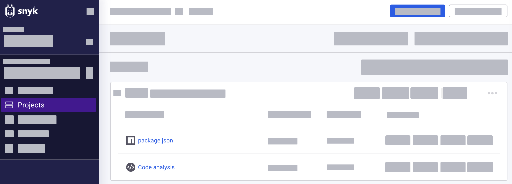

# Pull Request Checks 구성


**릴리스 상태**&#x20;

{Snyk Code의 PR Checks는 Closed Beta로 제공되며 엔터프라이즈 요금제에서만 이용할 수 있습니다. 귀하의 조직에서 설정을 원하시는 경우, Snyk 계정팀에 문의하십시오.&#x20;


## 자동 PR Checks를 위한 전제 조건

오픈 소스 및 라이선스 문제 및 코드 보안을 확인하려면 다음을 설정해야 합니다:

- 모든 통합 설정에 액세스할 수 있는 그룹 관리자 역할이 있어야 합니다. [멤버 역할](../../../snyk-admin/user-roles/user-role-management.md)을 확인하십시오.
- [Git 저장소 통합을 설정해야 합니다](../../../scm-ide-and-ci-cd-integrations/snyk-scm-integrations/). 도움이 필요한 경우, Snyk Learn 코스 [소스 코드 관리자 구성](https://learn.snyk.io/lesson/configure-snyk-scm/)를 참조하십시오.
- 작동하는 Git 저장소를 가져오려면 프로젝트를 가져와야 합니다.
- 코드 보안 (Snyk Code)의 경우, 위의 모든 조건을 충족하고 나서 Snyk 대표에게 문의하여 해당 기능을 활성화해야 합니다.


PR Checks는 SCM에서 웹훅에 의존합니다. 통합 범위에 웹훅 생성 기능을 포함해야 합니다.

PR Check는 조직의 테스트 횟수로 카운트됩니다. 새로운 커밋의 자동 검사를 포함하여 PR에 대해 테스트 시 열린 풀 요청합니다. [테스트로 인정되는 것](../../../working-with-snyk/what-counts-as-a-test.md)을 참조하십시오. 제공되는 테스트 수는 [가격 정책](../../../implement-snyk/enterprise-implementation-guide/trial-limitations.md)에 의해 결정됩니다.


## 지원되는 Snyk 스캔 유형

PR Checks에서 변경된 코드를 다음과 같이 분석할 수 있습니다:

- ([Closed Beta](../../../getting-started/snyk-release-process.md#closed-beta)) Snyk Code: 소스 코드 변경으로 특정 임계값을 초과하는 취약점이 발생합니다. 새로운 취약점이 있는지 확인하기 위해 저장소의 전체 스캔을 수행합니다.
- Snyk Open Source: Snyk가 지정된 심각성을 초과하는 알려진 보안 취약점을 가진 종속성 매니페스트나 지원되는 파일을 분석합니다.
- 오픈 소스 라이선스 확인: Snyk가 라이선스 정책 위반에 대한 구성된 정책을 기준으로 패키지 라이선스를 유효성 검사합니다.

PR Checks는 또한 Snyk Code와 Open Source 엔진에서 지원하는 모든 프로그래밍 언어 및 프레임워크를 지원합니다. 자세한 내용은 [Snyk Code를 위한 프로그래밍 언어 지원](../../../supported-languages-package-managers-and-frameworks/#code-analysis-snyk-code) 및 [Open Source](../../../supported-languages-package-managers-and-frameworks/#open-source-and-licensing-snyk-open-source)을 참조하십시오.

## PR Checks 구성 방법

[통합 수준](configure-pull-request-checks.md#configure-pr-checks-at-the-integration-level)이나 특정 Snyk 프로젝트에서 PR Checks를 구성할 수 있습니다.

* 조직에서 여러 리포지토리 통합을 가질 수 있지만, 해당 통합에서 PR Checks가 구성된 경우에만 기능이 작동합니다.
* 프로젝트 수준에서 설정은 기본적으로 통합에서 상속되지만 사용자 지정 설정을 구성할 수 있습니다.

## 통합 수준에서 PR Checks 구성

Snyk와 이미 통합된 GitHub 저장소와 같은 특정 Git 저장소에 대해 PR Checks를 구성합니다.

이 구성 설정은 해당 조직에 있는 모든 프로젝트에 적용됩니다. 또한 현재 구성을 사용자 지정 설정이 있는 프로젝트로 확장할 수 있습니다.

1. Snyk 웹 UI에서 **설정 > 통합**으로 이동하여 연결된 소스 코드 관리자를 선택하여 설정 구성을 엽니다.
2. 코드 문제를 확인하려면 다음 변경 사항을 구성하고 저장하십시오:

- [ ] **코드 분석**: Git 저장소에서 새로 발견된 취약점으로 PR 실패 설정. 심각성이 설정 임계값보다 높으면 PR이 주 브랜치로 병합되지 않습니다.
- [ ] **실패 조건**: PR이 실패할 심각성 임계값 선택. 예를 들어 **Medium**을 선택하면 이 수준 이상의 문제가 발견되면 PR이 실패하고 **Low** 심각도 문제에 대해서만 병합됩니다.

<figure><figcaption>
코드 문제 분석용 PR check 설정
</figcaption></figure>


**코드 분석** 섹션을 볼 수 없는 경우, 사용자가 그룹 관리자 역할을 할당받고 Snyk Code의 기능이 활성화된지 확인하십시오. [전제 조건](configure-pull-request-checks.md#prerequisites)을 참조하십시오.


3. 오픈 소스 및 라이선싱 문제를 확인하려면 다음 변경 사항을 구성하고 저장하십시오:

- [ ] **오픈 소스 보안 및 라이선스**: 제안된 변경 사항에서 발견된 오픈 소스 및 라이선스 문제가 설정된 심각성 임계값을 초과하면 PR이 실패하도록 설정합니다. 심각성이 임계값보다 높으면 PR은 주 브랜치로 병합되지 않습니다.
- [ ] **실패 조건**: 다음 중 하나의 PR 실패 조건을 선택하여 설정합니다.
  - [ ] **의존성에 문제가 있는 경우에만 PR 실패**: 보안 문제가 있는 의존성이 적어도 하나 있으면 PR이 실패합니다.
  - [ ] **저장소에 문제가 있는 경우에 실패**: Git 저장소에서 발견된 모든 보안 문제에 대해 PR이 실패합니다.
- [ ] **고 또는 심각한 심각성 문제로만 실패**: 심각성 임계값을 기준으로 추가 실패 조건을 선택합니다.
- [ ] **문제가 해결 가능한 경우에만 실패**: PR이 Snyk에서 해결 가능한 새 취약점을 도입할 때 PR 확인에 실패하도록 설정합니다. Snyk에서 해결할 수 없는 새로운 취약점을 소개하면 PR 확인을 실패시키지 않습니다.

이 설정을 켬으로 설정하면 PR 확인이 Snyk에 의해 해결 가능한 새 취약성을 도입할 때 PR 확인을 실패시킵니다. Snyk가 해당 취약성을 해결할 수 없는 경우 PR 확인은 실패하지 않습니다.

<figure><figcaption>
오픈 소스 및 라이선싱 문제를 분석하는 풀 요청 확인 설정
</figcaption></figure>

4. 변경 사항을 저장하려면 **저장**을 클릭하거나 현재 구성을 사용자 지정 설정이 있는 프로젝트로 확장하려면 **저장** 드롭다운을 선택하고 **모든 덮어쓰기된 프로젝트에 변경 사항 적용**을 클릭하십시오. 자세한 내용은 [프로젝트 수준에서 PR Checks 구성](configure-pull-request-checks.md#configure-pr-checks-at-the-project-level)을 참조하십시오.

## 프로젝트 수준에서 PR Checks 구성

특정 프로젝트에서만 PR Checks를 작동하도록 구성할 수 있습니다:

1. **프로젝트**로 이동하여 프로젝트가 있는 [대상](../../../snyk-admin/snyk-projects/#target)을 확장합니다.
2. 프로젝트 이름을 클릭하여 엽니다. 프로젝트 유형에 따라 다음을 선택할 수 있습니다:

- 오픈 소스 및 라이선스 문제를 확인하려면 **package.json**을 선택합니다.
- 코드 분석을 위한 **Code Analysis**를 선택합니다.

<figure><figcaption>
프로젝트 개요
</figcaption></figure>

6. **설정**으로 이동합니다.
7. 왼쪽에서 통합을 선택합니다. 이 예제에서 GitHub가 Snyk와 통합되었습니다.
8. 프로젝트 유형에 따라 프로젝트 설정을 구성합니다:

오픈 소스 및 라이선싱 문제에 대한 구성 (확장하려면 클릭)

1. **풀 요청을 위한 Snyk 테스트**에서 **사용자 지정**을 선택하여 설정을 구성합니다.
2. 제안된 변경 사항에서 발견된 오픈 소스 및 라이선스 문제가 설정된 심각성 임계값을 초과할 때 PR을 실패시키도록 옵션을 활성화합니다.
3. 다음 설정을 구성합니다:

- [ ] **실패 조건**: 보안 문제 분포를 기반으로 다음 중 하나의 PR 실패 조건을 선택합니다.
  - [ ] **의존성에 문제가 있는 경우에만 PR 실패**: 보안 문제가 있는 의존성이 하나 이상 있을 때 PR이 실패합니다.
  - [ ] **저장소에 문제가 있는 경우에 실패**: Git 저장소에서 발견된 모든 보안 문제를 위해 PR이 실패합니다.
- [ ] **고 또는 심각한 심각성 문제로만 실패**: 심각성 임계값을 기준으로 추가 실패 조건을 선택합니다.
- [ ] **문제가 해결 가능한 경우에만 실패**: PR이 Snyk에 의해 해결 가능한 새 취약점을 도입할 때 PR 확인에 실패하도록 설정합니다.

4. 변경 사항을 저장하려면 **Snyk 풀 요청 설정 업데이트**를 클릭하십시오.

코드 분석에 대한 구성 (확장하려면 클릭)

1. **풀 요청을 위한 Snyk Code**에서 **사용자 지정**을 선택하여 설정을 구성합니다.
2. 제안된 변경 사항에서 발견된 보안 문제가 설정된 심각성 임계값을 초과할 때 PR을 실패시키도록 옵션을 활성화합니다.
3. 다음 설정을 구성합니다:

- [ ] **PR 확인 실패를 위한 최소 심각성**: PR이 실패하는 심각성 임계값을 선택합니다. 예를 들어 **Medium**을 선택하면 해당 수준 이상의 문제가 발견되었을 때 PR이 실패하고 **Low** 심각도 문제에 대해서만 병합됩니다.

4. 변경 사항을 저장하려면 **Snyk 풀 요청 설정 업데이트**를 클릭하십시오.

