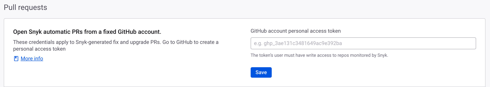

# 풀 리퀘스트 경험


**기능 가용성**

풀 리퀘스트 경험은 다음 SCM 통합을 지원합니다: GitHub, GitHub Enterprise, GitHub Cloud App, GitHub Server App, Bitbucket Cloud, and Bitbucket Cloud App.


Snyk 풀 리퀘스트 경험은 풀 리퀘스트에서 PR Check 스캔 결과에 대한 추가 정보를 표시함으로써 컨텍스트 전환을 줄입니다.

다음 기능들이 풀 리퀘스트 경험의 일부입니다:

* [이슈 요약 댓글](pull-request-experience.md#이슈-요약-댓글)
* [인라인 댓글](pull-request-experience.md#인라인-코멘트)

## Snyk 풀 리퀘스트 경험을 위한 전제 조건

* **Snyk PR Checks** 가 활성화되어 있어야 합니다. 자세한 내용은 [풀 리퀘스트 체크 구성](configure-pull-request-checks.md)를 참조하십시오.
* **GitHub 통합**의 경우, 특정 **GitHub 계정**이 수정 및 업그레이드 PR을 오픈하기 위해 설정되어 있어야 합니다. 이렇게 구성된 개인 액세스 토큰(PAT)은 풀 리퀘스트 경험에서 일관된 댓글 경험을 제공하는 데 필요합니다. 자세한 내용은[특정 GitHub 계정에서 수정 및 업그레이드 풀 리퀘스트 열기](../snyk-pull-or-merge-requests/opening-fix-and-upgrade-pull-requests-from-a-fixed-github-account.md)를 참조하십시오.
* 인라인 코멘트의 경우, **코드 분석 PR 체크** 설정은 [통합 수준](https://docs.snyk.io/scan-with-snyk/pull-requests/pull-request-checks/pull-request-experience#configure-pull-request-experience-at-the-integration-level)에서 활성화되어 있어야 합니다. Snyk 웹 UI에서 설정 > 통합 > 설정 편집 에서 **Pull request status checks > Code analysis** 아래에서 해당 옵션이 활성화되어 있는지 확인하십시오. "Code analysis"가 표시되지 않는 경우, Snyk 계정 팀에 문의하여 계정에 대해 Snyk 코드를 활성화하도록 요청하십시오. 이미 활성화되어 있는 경우, **설정** > **Snyk 코드**에서 켜져 있는지 확인하십시오.

<figure><figcaption>
풀 리퀘스트 상태 체크를 위한 코드 분석 기능
</figcaption></figure>

## 이슈 요약 댓글


**릴리스 상태**

Snyk PR Checks의 이슈 요약 댓글은 [일찍 접근](../../../getting-started/snyk-release-process.md#early-access) 상태에 있습니다.


이슈 요약 댓글 기능은 각 풀 리퀘스트에 댓글을 추가하여 최신 PR Check 결과를 요약합니다. 요약에는 수행된 체크 유형 및 심각성에 따른 발견 항목의 분해가 포함됩니다. **세부 정보 보기**를 선택하여 Snyk 웹 UI에서 PR Check 세부 정보에 액세스할 수 있습니다.

<figure><figcaption>
풀 리퀘스트 경험을 위한 이슈 요약 댓글 기능
</figcaption></figure>

## 인라인 댓글


**릴리스 상태**

Snyk PR Checks의 인라인 댓글은 [일찍 접근](../../../getting-started/snyk-release-process.md#early-access) 상태에 있으며 **Snyk Code PR Checks**에만 사용할 수 있습니다.


인라인 댓글 기능은 **Snyk Code** Pull Request Check에서 식별된 각 이슈에 대해 자세한 댓글을 추가합니다. 각 댓글에는 심각성 수준, 이슈의 이름 및 간단한 설명, 추가 정보를 위한 유용한 링크, 그리고 경우에 따라 데이터 흐름이 포함됩니다.

<figure><figcaption>
풀 리퀘스트 경험을 위한 인라인 댓글 기능
</figcaption></figure>

### 인라인 댓글 생성: 지원 행렬

인라인 댓글은 이슈가 발견된 특정 파일과 코드 라인에 직접 추가됩니다. 이슈의 코드 내 위치 및 SCM 플랫폼의 기능에 따라 인라인 댓글을 작성할 수 있는 능력이 제한될 수 있습니다. 다음 표는 다른 SCM 및 이슈 위치에 대한 이러한 제한 사항을 안내합니다:

<table data-full-width="false"><thead><tr><th width="458">이슈 위치</th><th width="143">GitHub</th><th>Bitbucket</th></tr></thead><tbody><tr><td><strong>풀 리퀘스트 차이 내에서:</strong> 변경된 특정 코드 라인에서 발견된 이슈에 대한 인라인 댓글 추가</td><td>지원 ✅</td><td>지원 ✅</td></tr><tr><td>
<strong>수정된 파일 내지만 풀 리퀘스트 차이 밖에서:</strong>

하이라이트된 변경 부분에 속하지 않은 수정 파일 일부에서 발견된 이슈에 대한 인라인 댓글 추가
</td><td>지원 안됨 ❌</td><td>지원 ✅</td></tr><tr><td>
<strong>수정된 파일 외부에서 풀 리퀘스트 차이:</strong>

풀 리퀘스트에서 수정되지 않은 파일에 발견된 이슈에 대한 인라인 댓글 추가
</td><td>지원 안됨 ❌</td><td>지원 안됨 ❌</td></tr></tbody></table>

## 풀 리퀘스트 경험 구성

Snyk 조직의 [통합 수준](pull-request-experience.md#configure-pr-checks-at-the-integration-level)에서 풀 리퀘스트 경험을 구성할 수 있습니다.


풀 리퀘스트 경험은 각 통합에 대해 개별적으로 설정됩니다. 여러 통합이 있는 경우 각각에 대해 풀 리퀘스트 경험을 별도로 구성해야 합니다.


### 통합 수준에서 풀 리퀘스트 경험 구성

Snyk 조직에서 PR Checks도 활성화되어 있는 하나 이상의 통합에 대해 풀 리퀘스트 경험을 구성할 수 있습니다.

1. 풀 리퀘스트 경험을 활성화하고 구성하려는 Snyk 조직에서 **설정,** **통합**으로 이동하여 **연결된 소스 코드 관리자의 설정 구성**을 선택합니다.
2. 다음 변경 사항을 구성하고 저장하십시오:
   1. **이슈 요약 댓글 활성화**: 이 옵션을 활성화하여 각 풀 리퀘스트에 이슈 요약 코멘트를 생성합니다. 이를 비활성화하면 전체 풀 리퀘스트 경험이 비활성화됩니다.
   2. **성공 케이스에 대한 코멘트 생성**: 기본적으로 PR Check에서 취약젬이 감지되지 않은 경우도 이슈 요약 댓글이 생성됩니다. 비실패하는 PR Check에 대한 이슈 요약 댌벌을 생성하지 않으려면 이 옵션을 비활성화합니다.
   3. **인라인 댓글 활성화**: 인라인 코멘트를 활성화하여 각 이슈에 대한 코멘트를 추가할 수 있도록 합니다.Snyk Code PR Check.

<figure><figcaption>
GitHub 통합을 위한 구성 세부 정보
</figcaption></figure>

**GitHub 통합**의 경우, Snyk가 모니터하는 리포지토리에 `write` 권한 이상을 가진 특정 **GitHub 계정**에서 수정 및 업그레이드 풀 리퀘스트를 열도록 구성하여 개인 액세스 토큰(PAT)을 제공하십시오. 자세한 내용은 [특정 GitHub 계정에서 수정 및 업그레이드 풀 리퀘스트 열기](../snyk-pull-or-merge-requests/opening-fix-and-upgrade-pull-requests-from-a-fixed-github-account.md)를 참조하십시오.

<figure><figcaption>
GitHub 통합을 위한 구성 세부 정보
</figcaption></figure>
