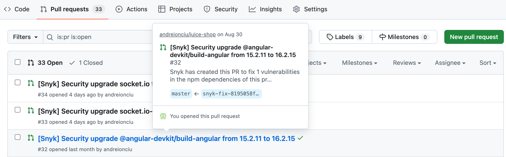
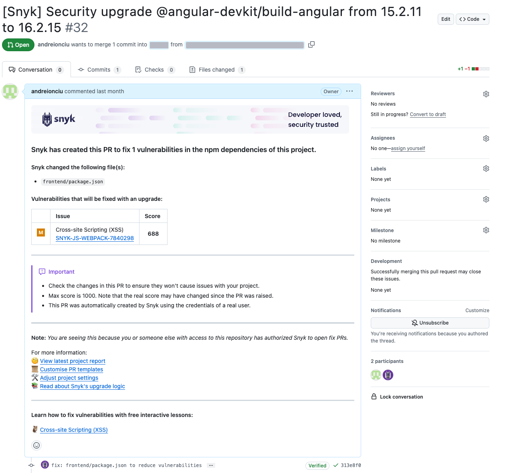

# Snyk 풀 또는 머지 요청

Snyk는 고칠 조언 외에도 스캔 결과에 기반하여 종속성을 업그레이드하는 대신 자동으로 풀 요청(PR)를 작성할 수 있습니다. Snyk Broker를 사용하여 구현에 자동으로 PR을 생성하려면 관리자가 먼저 v4.55.0 이상으로 업그레이드해야 합니다.


취약점을 고치는 기본 단계에 대한 자세한 내용은 [취약점 해결](../../snyk-open-source/manage-vulnerabilities/fix-your-vulnerabilities.md)을 참조하십시오. 언어가 지원되는지 확인하려면 [Fix Pull Requests 또는 Merge Requests를 지원하는 언어](../../snyk-open-source/manage-vulnerabilities/troubleshoot-fixing-vulnerabilities-with-snyk-open-source.md#languages-supporting-fix-pull-requests-or-merge-requests) 및 [지원되는 브라우저](../../../getting-started/#supported-browsers) 페이지를 참조하십시오.



관리자 및 계정 소유자는 Snyk 업그레이드 풀 요청의 설정을 Snyk 웹 UI에서 조직 및 프로젝트 수준에서 관리할 수 있습니다. 기능이 활성화되어 있는지(기본값) 여부를 구성하고, 언제 Snyk가 업그레이드 풀 요청을 제출해야 하는지 또는 아예하지 말아야 하는지를 지정할 수 있습니다.


Snyk는 다음을 통해 오픈 소스 라이브러리의 취약점에 대한 실질적인 고치기 조언을 제공합니다:

- [#automated-snyk-prs](./#automated-snyk-prs "mention"): 자동 풀 요청 및 머지 요청
- [#manual-snyk-prs](./#manual-snyk-prs "mention"): 수동 풀 요청 및 머지 요청

## **자동 Snyk PR**

SCM 통합을 통해 가져온 프로젝트에 대해, Snyk는 다음 유형의 자동 풀 및 머지 요청을 제공합니다:

- [새로운 취약점을 수정하는 풀 요청 생성](create-automatic-prs-for-new-fixes-fix-prs.md) (고치기 PR)
- [우선순위 순서로 취약점 백로그를 해결하기 위한 풀 요청 생성](create-automatic-prs-for-backlog-issues-and-known-vulnerabilities-backlog-prs.md) (백로그 PR)
- [의존성 업그레이드 풀 요청](upgrade-dependencies-with-automatic-prs-upgrade-prs/) (업그레이드 PR)

## 수동 Snyk PR

Snyk 웹 UI에서 프로젝트에서 직접 PR 또는 MR을 생성하려면 다음 단계를 따르세요:

1. 프로젝트 목록에서 프로젝트로 이동
2. 프로젝트를 선택합니다.
3. **고침 PR/MR 열기** 또는 **이 취약점을 고치기**를 선택합니다. 미리보기 화면이 표시되어 적용될 수정 사항을 보여줍니다.
4. 이 화면에서 **고치기 PR 열기**를 클릭하여 풀 리퀘스트를 생성합니다.


PR은 고쳐지는 문제를 기반으로 브랜치 네이밍 규칙을 사용합니다. 특정 변경에 대한 PR이 이미 존재하는 경우, Snyk는 원래 PR이 닫혔더라도 새로 만들지 않습니다. 존재하는 고침 PR을 중복하여 만들려고 하면 오류가 표시될 수 있습니다. 이런 경우 브랜치가 이미 있는지 확인하고 다시 열어보십시오.


## Snyk PR 검토

Snyk가 대신하여 풀 요청을 제출한 후에는 해당 리포지토리에서 풀 요청과 모든 관련 세부 정보를 직접 확인할 수 있습니다.

풀 요청을 빠르게 검토하려면 호버하십시오. 추천 업그레이드 및 기타 풀 요청 요약 세부 정보를 볼 수 있습니다:

<figure><figcaption>
추천 업그레이드
</figcaption></figure>

풀 요청을 열어 패키지 릴리스 노트 및 추천 업그레이드에 포함된 취약점을 포함한 깊은 세부 사항을 볼 수 있습니다.

<figure><figcaption>
풀 요청 세부 정보
</figcaption></figure>

표에서 문제 링크를 클릭하여 지정된 취약점에 대한 모든 세부 사항을 Snyk 데이터베이스에서 직접 확인할 수 있습니다.

풀 요청을 검토한 후 합병을 승인할 수 있습니다.

## Snyk SCM 웹훅

풀 요청 이벤트를 추적하기 위해 Snyk은 가져온 리포지토리에 웹훅을 추가합니다. 자세한 내용은 [GitHub 및 Git 리포지토리 통합](../../../scm-ide-and-ci-cd-integrations/snyk-scm-integrations/)을 참조하십시오.

Snyk는 이 웹훅을 사용하여 다음을 실행합니다:

- Snyk 풀 요청의 상태를 추적합니다: 트리거된, 생성된, 업데이트된, 병합된 PR 등.
- 푸시 이벤트를 보내어 PR 확인을 트리거합니다.