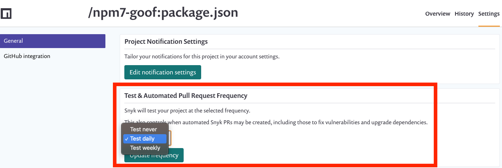
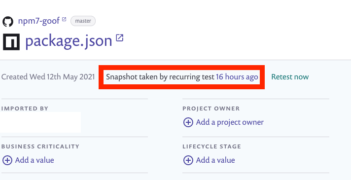
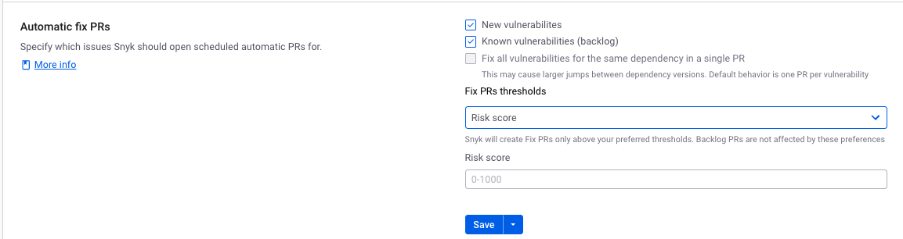
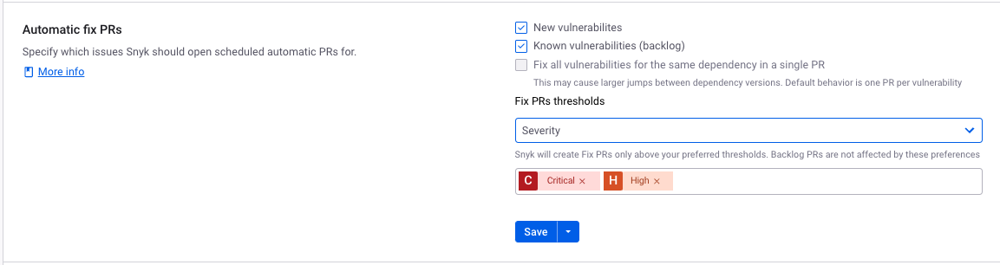
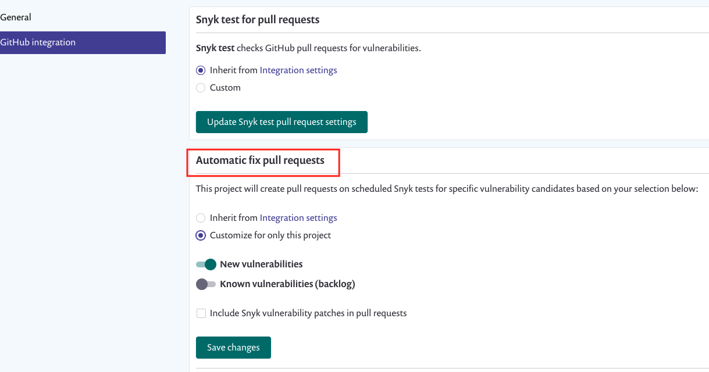

# 새로운 수정 사항에 대한 자동 PR 생성 (수정 PRs)


**기능 가용성**

* **자동 수정 PRs** 기능은 다음 SCM 통합에 지원됩니다: GitHub, GitHub Enterprise, GitHub Cloud App, Bitbucket Server, Bitbucket Cloud, Bitbucket Connect, GitLab 및 Azure Repos.
* 통합에 따라 **자동 수정 PR** 설정이 다를 수 있습니다.


다음 규칙이 적용되어 취약점에 대한 자동 PR 생성이 이루어집니다:

- PR은 **테스트 및 자동화된 PR 주기** 알림 설정을 기반으로 생성됩니다.
- 프로젝트에서 **지금 다시 테스트**를 선택하면 스캔이 수동으로 실행됩니다. 24시간 윈도우에는 이미 스캔이 실행되었다고 표시되며 다음 자동 스캔이 실행될 때까지 자동 PR이 생성되지 않습니다.
- 하나의 프로젝트당 하나의 PR이 생성됩니다.
- 새로운 취약점이 발견되었고 수정이 가능하거나 수정이 새로운 경우이고 무시되지 않은 경우, 수정 PR이 생성될 수 있습니다.
- 알려진 취약점의 경우, [자동 업무 PRs 구성](create-automatic-prs-for-backlog-issues-and-known-vulnerabilities-backlog-prs.md)를 참조하십시오.

<figure><figcaption>
테스트 및 자동화된 PR 주기 설정
</figcaption></figure>

지난 24시간 윈도우가 언제 시작되었는지 확인하려면 프로젝트 이슈 카드에서 **주기적 테스트에 의한 스냅샷**을 확인하고 특정 스캔 결과에 대한 **\[snyk] 취약점 알림** 이메일을 확인하십시오:

<figure><figcaption>
16시간 전 주기적 테스트에 의한 스냅샷
</figcaption></figure>

새로운 취약점에 대한 PR은 기본적으로 새로운 통합에 대해 활성화되어 있습니다.

지원되는 통합에 대한 자세한 내용은 [Git 리포지토리 SCM 통합 페이지](../../../scm-ide-and-ci-cd-integrations/snyk-scm-integrations/)를 참조하십시오.

## 통합 사용 또는 사용 중지

다음 단계를 따라 전역 통합 수준에서 PR을 활성화하십시오:

1. **설정** > **통합** 으로 이동합니다.
2. 예를 들어 GitHub와 같은 SCM 통합을 선택합니다.
3. **새로운 취약점**과 **저장**을 선택하여 활성화합니다.

**모든 무시된 프로젝트에 적용**를 클릭하면 **자동 수정 PRs**를위한 모든 개별 프로젝트 설정이 업데이트됩니다. 이전에 프로젝트가 자체적으로 자동 수정 PR 설정을 가지고 있었던 경우, 이 버튼을 클릭하면 프로젝트 설정이 전역 설정으로 덮어씌워집니다.

<figure><figcaption>
자동 수정 PR 구성
</figcaption></figure>

## 점수 및 심각도에 대한 생성 임계값 설정

모든 주기적 테스트에서 발견된 모든 대응 가능한 취약점에 대해 Snyk은 수정 PR을 생성합니다. 이는 귀하의 조직에서 원하는 속도에 따라 이상적이지 않을 수 있으므로 귀하의 필요에 맞는 특정 기준을 설정하여 조치할 수 있습니다.

당신에게 보이는 자동 수정 PR을 결정하기 위해 **점수** 또는 **심각도**에 대한 사용자 지정 임계값을 설정할 수 있습니다. 귀하의 조직에서 구성된 지표에 따라 드롭다운에서 위험 또는 우선 순위 점수를 사용할 수 있습니다.

### 점수 임계값

<figure><figcaption>
점수에 따른 수정 PR 임계값
</figcaption></figure>

Snyk은 설정한 **점수** 필드의 임계값을 초과하는 경우에만 수정 PR을 생성합니다. 사용하는 점수 유형이 드롭다운의 옵션으로 표시됩니다. 이 임계값은 0-1000까지 범위가 있습니다.

점수의 기본 설정은 다음과 같습니다:

- 2024년 12월 5일 이전에 만들어진 조직은 기본 점수가 0입니다.
- 2024년 12월 5일 이후에 만들어진 조직은 기본 점수가 700입니다.
- 2025년 6월 5일 이후에는 모든 조직에 대해 기본 점수가 700이 됩니다(설정에서 점수를 구성하지 않은 경우).

### 심각도 임계값

<figure><figcaption>
심각도에 따른 수정 PR 임계값
</figcaption></figure>

Snyk은 선택한 심각도 수준에 대해 수정 PR을 생성합니다. 예를 들어, Critical 및 High와 같은 심각도 수준을 선택할 수 있습니다.

## 단일 프로젝트에 대한 pull 요청 활성화 또는 비활성화

프로젝트 수준에서 활성화 또는 비활성화하면이 단일 프로젝트에 대한 pull 요청 설정이 덮어써져 전역 통합 설정에서 상속되지 않습니다.

1. **프로젝트** 하위에서 프로젝트를 선택하고 **설정**을 선택합니다.
2. 예를 들어 GitHub와 같은 SCM 통합을 선택합니다.
3. **자동 수정 pull 요청** 섹션에서:
   - **이 프로젝트에만 사용자 지정 설정**을 선택합니다.
   - **새로운 취약성**을 활성화하고 **변경 사항 저장**을 선택합니다.

<figure><figcaption>
프로젝트 수준에서 자동 수정 pull 요청 설정
</figcaption></figure>