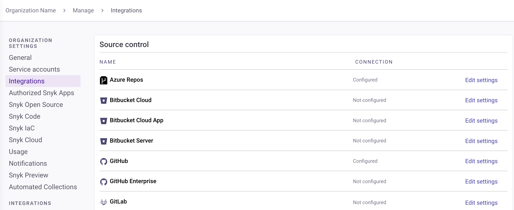

# Snyk 코드 구성

## 조건

[IDE](../../scm-ide-and-ci-cd-integrations/snyk-ide-plugins-and-extensions/), [Snyk CLI](../../snyk-cli/scan-and-maintain-projects-using-the-cli/snyk-cli-for-snyk-code/), 및 [Snyk API](../../snyk-api/)에서 Snyk 코드를 사용하려면 다음 조치를 수행해야 합니다:

1. [Snyk 웹 UI에서 Snyk 코드 활성화](configure-snyk-code.md#enable-snyk-code-in-snyk-web-ui)
2. [Git 저장소를 Snyk에 통합](configure-snyk-code.md#integrate-git-repository-with-snyk)
3. [Snyk 코드로 스캔할 저장소 가져오기](configure-snyk-code.md#import-repositories-to-scan-with-snyk-code)

Snyk 코드는 이미 가져온 저장소에는 적용되지 않고 새 저장소만 스캔하고 테스트합니다. 이미 가져온 저장소를 분석하려면 [다시 가져와야](import-project-with-snyk-code.md#re-import-repository-to-snyk) 합니다.

## Snyk 웹 UI에서 Snyk 코드 사용을 위한 전제 조건

Snyk 코드로 코드를 스캔하기 전에 다음 사항을 확인하세요:

- [시작하기](../../getting-started/) 단계를 완료했는지 확인하세요.
- 귀하의 저장소에는 [지원되는 언어 및 플랫폼의 코드가 포함되어 있는지](../../supported-languages-package-managers-and-frameworks/) 확인하세요.

## Snyk 웹 UI에서 Snyk 코드 활성화

### 전제 조건

조직에서 Snyk 코드를 활성화하려면 [Org Admin](../../snyk-admin/user-roles/pre-defined-roles.md)이어야 합니다.

### Snyk 코드 활성화

최초로 통합을 설정하고 Snyk 코드를 활성화한 경우, 저장소를 가져오기 전에 설정이 여전히 유효한지 확인할 수 있습니다.

1. Snyk 웹 UI에 로그인하고 [그룹 및 조직](../../snyk-admin/groups-and-organizations/)을 선택하세요.
2. **설정** > **Snyk 코드**로 이동합니다.
3. **Snyk 코드 활성화** 섹션에서 설정을 **Enabled**로 변경합니다.
4. **변경 사항 저장**을 클릭하세요.

다음 단계는 [Git 저장소를 Snyk와 통합](configure-snyk-code.md#integrate-git-repository-with-snyk)하는 것입니다.

## Git 저장소를 Snyk와 통합

Snyk 코드를 활성화하고 Snyk에 테스트할 저장소를 가져온 후, 취약점 및 수정 사항을 포함하는 Snyk 코드 테스트 결과를 보고 작업할 수 있습니다. [코드 취약점 관리](manage-code-vulnerabilities/) 참조.


SCM이 이미 Snyk 계정과 통합되어 있고 추가적인 SCM을 추가하고 싶지 않은 경우, 이 단계를 건너뛰고 [Snyk에 저장소 가져오기](import-project-with-snyk-code.md)로 이동할 수 있습니다.

만일 API를 사용하여 Snyk 코드를 사용하지만 CLI를 사용하지 않는 경우, 이 단계는 필수적입니다.


Snyk 코드를 Snyk 조직 설정에서 활성화하면 웹 UI나 API에서 작동하지만 CLI를 사용하지 않는 경우, 테스트할 Git 저장소를 계정과 통합해야 합니다.

그런 다음, 필요한 저장소를 Snyk 계정에 가져올 수 있고 Snyk 코드가 자동으로 분석하고 분석 결과를 표시합니다.


Snyk 코드는 코드 분석을 위해 임시적으로 저장소를 복제합니다. 이는 적절한 권한 및 SCM에 대한 HTTPS 액세스가 필요합니다.

Snyk에서 데이터가 어떻게 저장되는지에 대한 자세한 정보는 [Snyk가 데이터를 처리하는 방법](../../working-with-snyk/how-snyk-handles-your-data.md)을 참조하세요. 통합에 대한 자세한 내용은 [Snyk 통합](../../integrate-with-snyk/)을 참조하세요.


SCM을 Snyk 계정과 통합하려면:

1\. Snyk 웹 UI에서 **설정** > **통합** > **소스 제어**로 이동합니다.


이미 통합된 SCM이 있으면 **구성됨**으로 표시됩니다. 구성된 SCM을 사용하려면 [Snyk에 저장소 가져오기](import-project-with-snyk-code.md)를 계속하십시오.


2\. 사용 가능한 옵션에서 **편집 설정**을 클릭하여 통합하려는 SCM 시스템을 선택합니다.

**소스 제어** 통합은 Snyk 코드에서 지원되는 SCM만 표시합니다.

<figure><figcaption>
Snyk 코드의 소스 제어 옵션
</figcaption></figure>

3\. 통합 페이지에서 계정 자격 증명을 입력하고 세부 정보를 저장합니다.

이를 통해 Snyk가 통합된 SCM에 대한 액세스 권한을 부여합니다.

사용 가능한 각 SCM과의 통합에 대한 자세한 내용은 [Git 저장소 (SCM)](../../scm-ide-and-ci-cd-integrations/snyk-scm-integrations/)을 참조하세요.

SCM을 Snyk 계정과 통합한 후에는 Snyk 코드를 사용하여 스캔하려는 저장소를 가져올 수 있습니다.

## Snyk 코드로 스캔할 저장소 가져오기

Snyk 코드를 활성화하고 Git 저장소를 Snyk와 통합한 후, 취약점을 스캔할 저장소를 Snyk에 가져와야 합니다.

현재 Snyk 계정 상태 및 수행하려는 작업에 따라 다음을 수행해야 합니다:

- Snyk 계정에 저장소가 없는 경우, 처음 저장소를 Snyk에 가져와야 합니다.
- 이미 Snyk 계정에 저장소가 있는 경우 추가적인 저장소를 가져오지 않고 기존 저장소를 Snyk 코드로 스캔하려면 [이러한 저장소를 다시 가져와야](import-project-with-snyk-code.md#re-import-repository-to-snyk) 합니다.
- 이미 Snyk 계정에 저장소가 있는 경우, Snyk 코드로 스캔할 추가 저장소를 가져오려면 [Snyk에 추가 저장소를 가져와야](import-project-with-snyk-code.md) 합니다.

Snyk 코드로 스캔하기 위해 저장소를 가져오거나 다시 가져오기 전에 .snyk 파일을 사용하여 가져오기를 제외할 특정 디렉터리 및 파일을 [제외할 수 있습니다](../import-project-repository/exclude-directories-and-files-from-project-import.md).

## 다음 단계

- [코드 취약점 관리](manage-code-vulnerabilities/)
- [코드 취약점 자동으로 수정](manage-code-vulnerabilities/fix-code-vulnerabilities-automatically.md)
- [Snyk 코드 보안 규칙 보기](snyk-code-security-rules/)