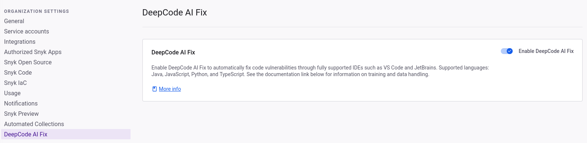

# 코드 취약점 자동 수정

소스 코드의 보안 문제 및 품질 결함을 자동 흐름을 통해 해결합니다. DeepCode AI Fix는 여러분의 문제에 가장 적합한 해결책을 계산하고 자동으로 적용합니다.

## DeepCode AI Fix를 사용하는 이유는?

DeepCode AI Fix는 철저한 프로그램 분석 엔진의 능력과 인공지능을 기반으로 한 대형 언어 모델의 능력을 결합합니다. 이 조합은 공개 소스 코드에서 대량의 비구조화된 언어 정보를 컴파일할 수 있게 해줍니다. [DeepCode AI Fix 제안이 수집하는 데이터는 무엇인가요](fix-code-vulnerabilities-automatically.md#what-data-does-deepcode-ai-fix-suggestions-collect) 확인하세요.

DeepCode AI Fix의 주요 기능 세트는 이를 독특하게 만듭니다. 수백만 줄의 코드로 훈련된 신경망을 보유하여 더 큰 다양성과 창의성이 가능합니다. [Snyk Code 엔진](../snyk-code-local-engine.md)은 신경망에서의 제안을 엄격하게 확인하여 모든 자동 수정이 각 취약점 또는 코드 문제에 작고 특정하게 적용되도록 보장합니다.

## 어떤 문제를 자동으로 해결할 수 있나요?

Snyk Code 엔진에서 감지된 품질, 최상의 코드 관행 촉진, 보안 취약성과 관련된 다양한 문제를 해결할 수 있습니다. DeepCode AI Fix는 현재 파일 간 수정을 지원하지 않습니다.

## DeepCode AI Fix 언어 지원

| 지원         | 제한 지원 |
| ---------- | ----- |
| Java       | APEX  |
| JavaScript | C/C++ |
| Python     | C#    |
| TypeScript | Go    |

지원과 제한 지원 사이에 어떤 차이가 있나요?

* 지원: AI Fix는 대부분의 Snyk Code 규칙에 대해 일관된 수정을 생성합니다.
* 제한 지원: AI Fix는 수정을 일관되게 생성하지 않을 수 있으며, 더 적은 Snyk Code 규칙을 적용합니다.

## DeepCode AI Fix가 수집하는 데이터는 무엇인가요?

### 고객 데이터

DeepCode AI Fix는 고객 데이터를 훈련 목적으로 수집하지 않고 고객 데이터를 제3자에게 전송하지 않습니다.

### 훈련 데이터

대형 언어 모델 (LLM)은 오로지 허용된 라이선스가 있는 공개 저장소에서 훈련됩니다. 저장소의 라이선스가 초기 스크래핑 이후 변경되면 즉시 훈련 데이터에서 제외됩니다. DeepCode AI Fix는 고객 데이터를 훈련 목적으로 사용하지 않습니다.

데이터 수집 과정은 다음을 포함합니다:

* 허용된 공개 저장소의 정적 분석
* 제안된 수정 품질의 자동 평가
* 일부 내부 레이블링(인간에 의한)

훈련 데이터의 품질이 최적화되도록 최선을 다하며 성능을 향상시킵니다.

더 많은 정보는 Snyk이 데이터를 처리하는 방법에 관한 [Snyk이 데이터를 처리하는 방법](../../../working-with-snyk/how-snyk-handles-your-data.md)을 참조하세요.

## DeepCode AI Fix 작동 방식

하나의 문제를 수정하는 데 관련된 정보 흐름을 나타낸 표가 다음과 같이 제시됩니다.

| 단계                                          | 서브시스템           | 세부사항                                                                     |
| ------------------------------------------- | --------------- | ------------------------------------------------------------------------ |
| 코드 검사 및 문제 발견                               | 정적 코드 분석 엔진     | IDE에서 코드를 스캔하는 일반적 흐름에 해당합니다.                                            |
| 문제에 대한 데이터 흐름에 대한 코드 전처리 및 최소화              | 정적 코드 분석 엔진     | $$\mathcal{I}$$의 데이터 흐름을 분석하고 해당되는 문맥만 유지한 상태로 코드를 최소화합니다.               |
| 주어진 문제 $$\mathcal{I}$$에 대한 $$k$$개의 후보 수정 생성 | 신경망 (생성 모델 LLM) | 여기서 $$k$$는 구현 매개변수입니다.                                                   |
| 후보 수정 순위화 및 자가 평가                           | 정적 코드 분석 엔진     | 각각의 $$k$$개의 수정에 대해 코드 엔진에 의해 평가되어 무효인 코드를 필터링하거나 문제를 해결하지 못하는 수정이 제거됩니다. |
| 최적 후보 수정 반환                                 |                 | 시스템이 완료되었습니다.                                                            |

## DeepCode AI Fix 요구 사항

* [Snyk Code](../../../implement-snyk/enterprise-implementation-guide/trial-limitations.md)가 활성화되어 있어야 합니다.
* [VS Code](https://marketplace.visualstudio.com/items?itemName=snyk-security.snyk-vulnerability-scanner-preview), [Eclipse](https://marketplace.eclipse.org/content/snyk-security-code%E2%80%8B-open-source%E2%80%8B-iac-configurations) 또는 IntelliJ를 포함한 JetBrains IDE용 Snyk IDE 플러그인

## DeepCode AI Fix 활성화

Snyk 웹 UI에서 **그룹/조직** > **설정** > **DeepCode AI Fix**로 이동하여 그룹이나 조직에 대해 DeepCode AI Fix를 활성화하세요.

<figure><figcaption>
Snyk 미리보기에서 DeepCodeAI Fix 제안 설정
</figcaption></figure>

## 코드 문제 자동으로 해결하기


**시작하기 전에**

* Snyk 미리보기에서 자동 수정이 활성화되어 있는지 확인하여 [Snyk IDE 플러그인 또는 확장 프로그램](../../../scm-ide-and-ci-cd-integrations/snyk-ide-plugins-and-extensions/)과 작업하세요.
* 파일을 저장하고 [코드를 스캔](../../../snyk-cli/scan-and-maintain-projects-using-the-cli/snyk-cli-for-snyk-code/scan-source-code-with-snyk-code-using-the-cli.md)하여 새로운 결과를 생성하세요.
* 자동으로 수정할 수 있는 모든 Snyk Code 문제 옆에 번개 아이콘이 표시되어야 합니다.


1. 코드베이스를 엽니다.
2. **패널을 통해** 문제를 찾고 수정 또는 Code Lens에서 **이 문제 수정**을 클릭합니다.
3. 수정이 적용된 후 저장하고 다시 스캔합니다.

## 예시: 코드 문제 자동으로 수정하기

DeepCode AI Fix는 자동으로 수정 가능한 모든 식별된 취약점을 강조합니다. 이러한 취약점은 번개 아이콘으로 표시됩니다. 예를 들어, 우리는 이 시나리오에서 CSRF(Cross-Site Request Forgery)를 식별했습니다.

취약점을 열면 문제의 위치에 대한 세부 정보를 확인할 수 있으며 DeepCode AI Fix를 사용하여 수정을 생성할 수 있습니다.

<figure><figcaption>
Snyk Code 취약점 패널 열기
</figcaption></figure>

Snyk DeepCode AI를 사용하여 수정 생성을 클릭하면 머신이 실행되고 최대 5개의 수정이 생성됩니다. 취약점을 해결하고 DeepCode AI가 새로운 취약점을 추가하지 않았는지 확인하기 위해 모든 수정을 자동으로 Snyk Code 엔진으로 다시 테스트합니다.

이 경우 5개의 수정이 생성되었으며 각 수정을 탐색하여 가장 적합한 것을 결정할 수 있습니다. 첫 번째는 `csrf`를 가져와 사용하는 것으로 이 문제를 해결할 수 있습니다.

<figure><figcaption>
5개의 수정이 생성되었습니다
</figcaption></figure>

수정을 적용하면 새 코드가 추가된 위치로 이동합니다. 저장하고 다시 스캔한 후 취약점이 사라집니다.

<figure><figcaption>
취약점이 해결되었습니다
</figcaption></figure>

## 제한사항

DeepCode AI Fix는 AI의 최전선에 있지만 AI 엔진을 기반으로 하는 한계가 여전히 있습니다. 사용자는 언제나 AI Fix 제안을 검토하여 수정이 진행되는 과정에서 어플리케이션이 망가지지 않는지 확인해야 합니다.

* DeepCode AI Fix 제안은 때로 어플리케이션이 제대로 작동하지 않는 코드를 생성할 수 있습니다.
* DeepCode AI Fix 제안은 문법적으로 올바르지 않은 코드를 생성할 수 있습니다.
* DeepCode AI Fix는 취약점이 해결되고 새 취약점이 추가되지 않도록 확인합니다. 때때로 AI 엔진이 충분히 좋은 결과를 생성하지 않았기 때문에 유효한 제안이 생성되지 않을 수도 있습니다.
