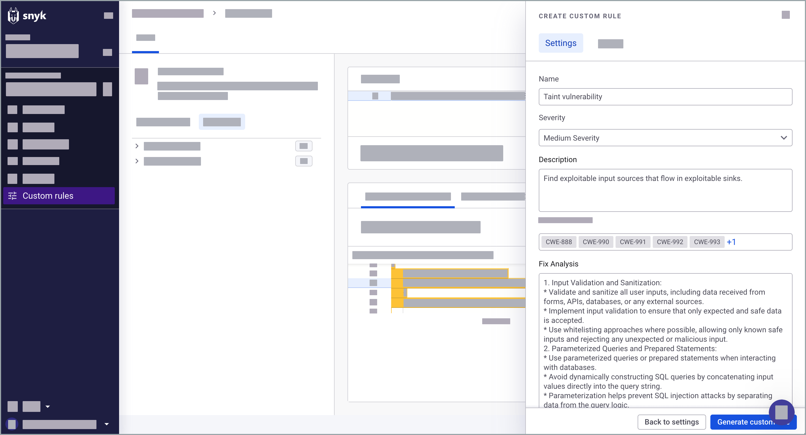
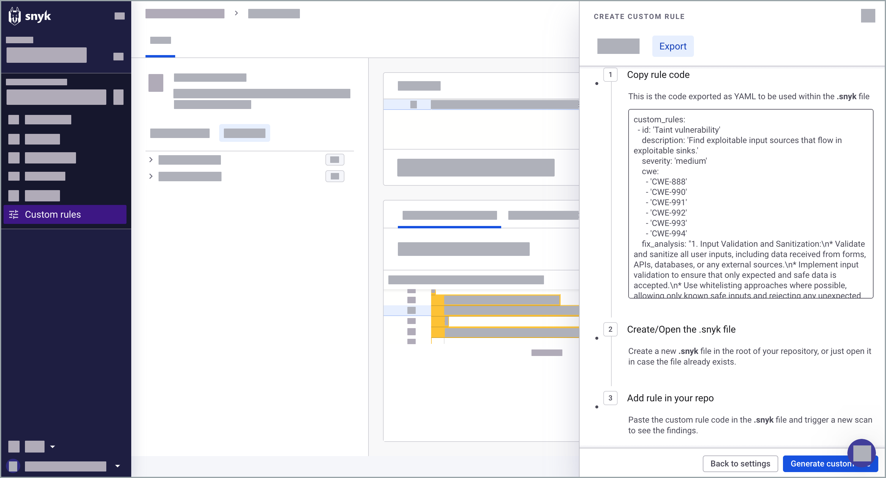

# 사용자 정의 규칙 생성

## 사용자 정의 규칙 생성에 필요한 요구 사항

* 기능을 사용하기 전에 [Snyk 코드]((../../../snyk-admin/snyk-preview.md#enable-or-disable-a-feature)) 사용자 정의 규칙을 Snyk 미리보기에서 활성화해야 합니다.
* 프로젝트에 대한 사용자 정의 규칙을 실행하려면 해당 리포지토리 내에 프로젝트가 호스팅되어 있어야 합니다. 이는 1:1 관계를 갖습니다. 즉, 모든 관련 리포지토리에 `.snyk` 파일이 있어야 합니다.&#x20;
* `.snyk` 파일이 없는 경우, 사용자 정의 규칙 YAML 형식으로 코드를 포함하는 확장자가 `.snyk`인 파일을 만들 수 있습니다. 규칙이 작동하려면 [`.snyk` 파일](../../../manage-risk/policies/the-.snyk-file.md)에 해당 파일을 추가하십시오.

## 사용자 정의 규칙 생성하기

유용한 쿼리를 사용자 정의 규칙으로 저장하고 메타데이터를 추가할 수 있습니다. 메타데이터는 YAML 형식의 코드를 생성하기 위해 사용됩니다. YAML 콘텐츠를 [.snyk 파일](../../../manage-risk/policies/the-.snyk-file.md)에 규칙으로 내보내어 향후 스캔에서 Snyk의 내부 규칙과 함께 실행할 수 있습니다.

1. Snyk 웹 UI에 로그인하고 그룹 및 조직으로 이동합니다.
2. **사용자 정의 규칙**으로 이동합니다.
3. **코드 쿼리** 패널에 쿼리를 작성합니다.
4. (선택 사항) [리포지토리에서 쿼리 실행](run-query.md#run-query-on-a-repository) 또는 [코드 스니펫](run-query.md#run-query-on-a-code-snippet)에서 쿼리 실행합니다.
5. 메타데이터 구성:
   - **이름**: 쿼리가 결과를 찾을 때 표시됩니다.
   - **심각도**: [Snyk 보안 레벨](../../../manage-risk/prioritize-issues-for-fixing/severity-levels.md#introduction-to-snyk-severity-levels)에 기반하여 결과의 심각도를 설정합니다. Snyk 코드는 `Low`, `Medium`, `High` 세 가지 심각도 수준만 사용합니다.
   - **설명**: 결과의 내용과 그 원인을 설명합니다.
   - **CWE**: 관련 있는 CWE에 연결합니다.
   - **Fix Analysis**: 개발자가 취약성에 대해 어떻게 대처해야 하는지 설명합니다. 수정은 일반 가이드 라인 또는 귀하의 조직의 모범 사례에 기반하여 구조화할 수 있습니다.

<figure><figcaption>
저장된 사용자 정의 규칙에 메타데이터 추가
</figcaption></figure>

6. YAML 형식의 코드를 생성하려면 **사용자 정의 규칙 생성**을 클릭하십시오.&#x20;
7. YAML 콘텐츠를 복사하여 해당 리포지토리의 [.snyk 파일](../../../manage-risk/policies/the-.snyk-file.md)에 규칙으로 내보내십시오.&#x20;

<figure><figcaption>
.snyk 파일에 규칙으로 쿼리 내보내기
</figcaption></figure>